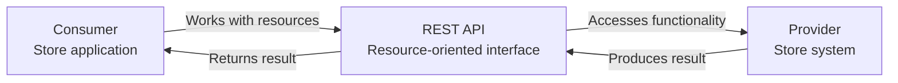
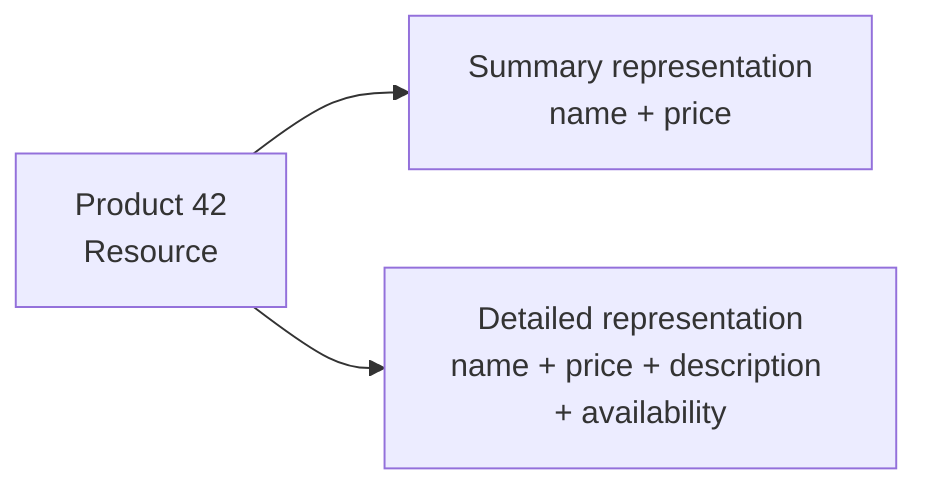
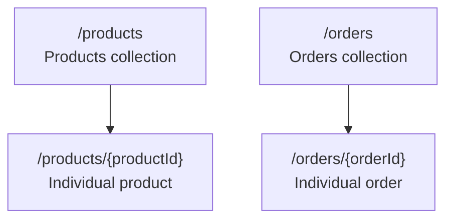
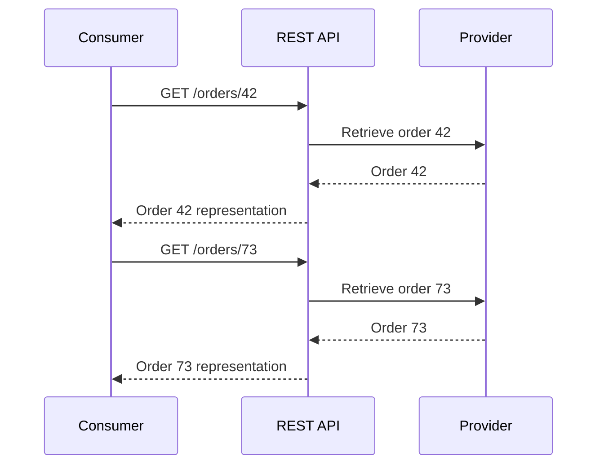
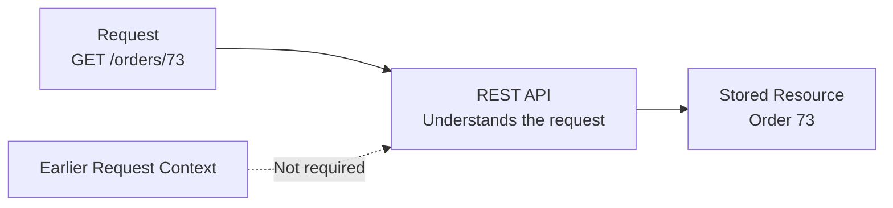

# Level 1

## Table of Contents: REST

- [Understanding REST](#understanding-rest)
- [Resources and Representations](#resources-and-representations)
- [Designing Resource Boundaries](#designing-resource-boundaries)
- [Designing Resource Identifiers](#designing-resource-identifiers)
- [Designing Resource Operations](#designing-resource-operations)
- [Stateless Communication](#stateless-communication)

**REST Level 1** introduces REST as a resource-oriented approach to API design. Building on API Fundamentals and existing HTTP knowledge from Web Development, this level focuses on how REST models the things consumers work with and how those resources are addressed through a consistent interface. An online store provides the running example, using products, orders, customers, users, and profiles to connect these concepts within one familiar system.

## Understanding REST

**REST (Representational State Transfer)** is an architectural style that organizes an API around **resources**. A resource represents something that consumers need to work with, such as a product, an order, or a customer.



The consumer still uses an API to access functionality provided by another system, as introduced in **API Fundamentals Level 1**. REST adds a particular structure to that relationship by making resources the main concepts through which the interface is organized.

!!! info "Connection to Web Development"

    REST commonly uses **HTTP** for communication. Requests, responses, methods, and URLs introduced in Web Development provide the mechanisms used by the REST examples in this module. Here, the focus is on how REST uses those mechanisms to work with resources.

To understand this resource-oriented structure, the first distinction to make is between a resource itself and the information exchanged to represent it.

## Resources and Representations

A **resource** is something the API makes available for consumers to work with. In the online store, a product, order, customer, or user can be a resource. A **representation** is the information exchanged through the API to describe a resource.

The same resource can be represented with different amounts of information depending on what the consumer needs. Product 42, for example, remains the same product whether the API provides only its name and price or also includes its description and availability.

!!! info "Representation formats"

    Representations need a format for encoding their information. **JSON** is commonly used in REST APIs, while **XML** and **binary formats** can also be used depending on the API and the type of data being exchanged. The formats themselves are covered in **API Fundamentals Level 2**.



A representation therefore describes a resource without becoming the resource itself. Its content and format determine how information about that resource is exchanged, while the resource remains the underlying concept the consumer works with.

Once the resources themselves are understood, the next design decision is **which concepts should exist as separate resources**. This decision defines the resource boundaries of the API.

## Designing Resource Boundaries

A **resource boundary** defines what the API treats as one resource and what it exposes separately. The decision should follow how consumers understand and use the system rather than copy its database structure. For example, an online store might store account information in a `users` table and personal information in a `profiles` table. If consumers normally work with both as one user, the API can expose a single user resource that combines information from both tables. If a profile needs to be retrieved or changed independently, it can instead be exposed as a separate resource.

The same reasoning applies to other store concepts. Order items can remain part of an order when they are mainly used within that order, while categories can be separate resources when consumers need to browse or manage them directly. The important question is not how many tables exist, but **which concepts consumers need to work with independently**.

| Internal structure                 | Possible API design             | Reason                                                 |
| ---------------------------------- | ------------------------------- | ------------------------------------------------------ |
| `users` and `profiles` tables      | One user resource               | Profile data is part of the user concept for consumers |
| `users` and `profiles` tables      | User and profile resources      | Consumers work with profiles independently             |
| `orders` and `order_items` tables  | Order resource containing items | Items are primarily meaningful as part of an order     |
| `products` and `categories` tables | Product and category resources  | Consumers work with both concepts independently        |

A database structure therefore does not determine the API structure. Several tables can provide information for one resource, while information stored together can still be exposed as separate resources when consumers need to work with it independently.

Once the resource boundaries are established, consumers need a consistent way to refer to those resources. This is the role of **resource identifiers**.

## Designing Resource Identifiers

A REST API uses **resource identifiers** to identify the resources consumers can work with. In HTTP-based REST APIs, these commonly appear as paths. A path can identify a **collection**, which represents a group of related resources, or an **individual resource**, which represents one specific member of that collection. For example, `/products` identifies the products collection, while `/products/{productId}` identifies an individual product within that collection.

Resource identifiers should use **nouns** that describe the resources being addressed, with collection names written consistently in plural form. This gives paths a predictable structure such as `/products`, `/orders`, and `/customers`, while the operation remains separate from the resource name.

Resources can also be nested when one resource belongs to or is addressed through another resource. A nested path places the child resource after its parent, such as `/users/{userId}/orders/{orderId}`. This identifies a specific order belonging to a specific user. Deeper nesting is possible but should be used sparingly because long paths become harder to read and change.

This keeps the identifier stable while different operations are applied to the same resource.

!!! example "Resource identifiers describe things"

    Prefer identifiers that name the resource being addressed.

    ```text
    /orders/{orderId} Good
    /products/{productId} Good
    /user-orders Good

    /getOrder Avoid
    /createProduct Avoid
    /user_orders Avoid
    /productCategories Avoid
    /users/{userId}.json Avoid
    /orders/{orderId}.xml Avoid
    ```

    `/orders/{orderId}` identifies an individual order and can be used with different operations. `/getOrder` describes an action instead, which mixes the identity of the resource with what the consumer wants to do. `/user_orders` and `/productCategories` use inconsistent naming styles, while `/user-orders` keeps multi-word resource identifiers consistent with the hyphenated style used throughout the API.

    Suffixes such as `.json` or `.xml` tie the identifier to one format. Since the same resource can have different representations, the format belongs to the representation, not the path.

The relationship between a collection and its individual resources can be seen directly in the path structure.



A collection path refers to the group as a whole, while adding an identifier such as `{productId}` selects one member of that group. This distinction also affects which operations make sense. A consumer can retrieve a collection or create a new member within it, while an individual resource can be retrieved, changed, or removed. The path therefore establishes **what the consumer is addressing**, but not **what the consumer wants to do with it**. That responsibility belongs to the resource operation.

## Designing Resource Operations

Once a resource has been identified, the consumer needs to express what should happen to it. REST commonly works with operations such as **retrieve**, **create**, **update**, and **delete**. In HTTP-based REST APIs, the HTTP method expresses the operation while the path identifies the resource being addressed.

| Consumer intention                   | HTTP method      | Example                         |
|--------------------------------------|------------------|---------------------------------|
| Retrieve a collection                | `GET`            | `GET /products`                 |
| Retrieve an individual resource      | `GET`            | `GET /products/{productId}`     |
| Create a resource in a collection    | `POST`           | `POST /products`                |
| Update an individual resource        | `PUT` or `PATCH` | `PUT /products/{productId}`     |
| Delete an individual resource        | `DELETE`         | `DELETE /products/{productId}`  |

For example, `/products/{productId}` identifies the same product in both `GET /products/{productId}` and `DELETE /products/{productId}`, while the HTTP method determines the operation performed on it. This keeps the resource identifier stable and avoids action-oriented paths such as `/getProduct` or `/deleteProduct`. `PUT` and `PATCH` can both be used for updates depending on how the API defines its update behavior.

With the resource and operation expressed in the request, another REST principle determines how the request can be processed independently. Each request should provide the information the provider needs to understand and handle it.

## Stateless Communication

**Stateless communication** means that each request contains the information needed to understand and process it. The provider does not need to remember request context from an earlier interaction to understand the next one. For example, if a consumer first requests order `42` and later requests order `73`, each request identifies the resource it needs. The request for order `73` can therefore be understood without remembering the earlier request for order `42`.



The second request does not mean "give me another order after the one I requested earlier." It explicitly identifies `/orders/73`, giving the provider the context needed for that interaction. The same principle applies to other required information, such as authentication information, query parameters, or request data. Each request must supply the information needed to process it rather than depend on context remembered from an earlier interaction.

Statelessness does **not** mean that the provider cannot store application data. Orders, users, products, profiles, and other resources can still persist normally. An order stored in a database represents **resource state**, while information remembered only so that a later request can be understood is **request context**. REST statelessness concerns the request context between interactions.



!!! info "Why Statelessness Helps"

    When each request carries the context needed to process it, different provider instances can handle requests without first recovering consumer-specific context from earlier interactions. This makes requests easier to distribute across provider instances and supports scaling.

Together, these concepts establish the resource model used throughout REST. Resources define what consumers work with, representations describe those resources, resource boundaries shape the consumer-facing model, identifiers distinguish collections and individual resources, HTTP methods express operations, and stateless communication keeps each request understandable without depending on remembered request context.

**REST Level 2** builds on this foundation by examining response and error design, collection operations such as pagination, filtering, and sorting, safe and idempotent operations, and approaches for versioning and evolving an API.
