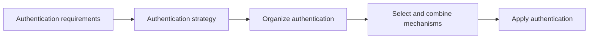
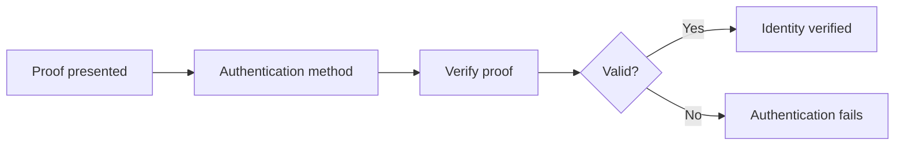
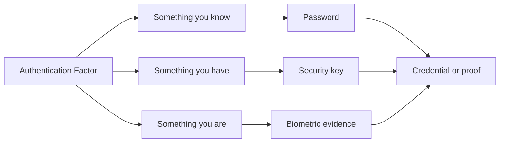
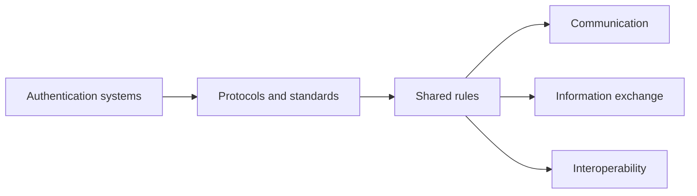
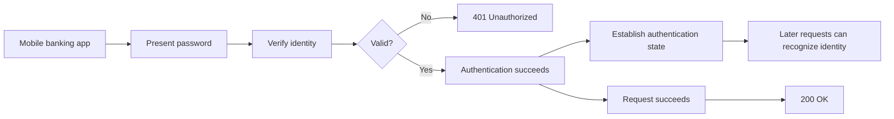

# Level 1

## Table of Contents: Fundamentals

- [Authentication](#authentication)
- [Authentication Strategies](#authentication-strategies)
- [Authentication Methods](#authentication-methods)
- [Authentication Factors and Credentials](#authentication-factors-and-credentials)
- [Authentication Protocols and Standards](#authentication-protocols-and-standards)
- [Authentication State and Flow](#authentication-state-and-flow)

**Authentication Fundamentals Level 1** introduces the foundational concepts needed to understand how systems verify identity. The material moves from broad authentication decisions toward the individual parts that make verification possible, then brings those parts together in an authentication flow.

## Authentication

**Authentication** is the process of verifying a claimed identity. A user, application, device, or other entity can claim an identity, but the claim alone does not establish that the identity is genuine. The system needs acceptable evidence that supports the claim before it can recognize the entity as authenticated.

A useful analogy is entering a secured building. Telling a guard your name establishes who you claim to be, but the guard still needs acceptable evidence before accepting that claim. Authentication serves the same purpose in software by establishing whether a claimed identity can be trusted. Just as a building can define different requirements for proving identity, authentication can be designed differently depending on the requirements of a system. These broader design decisions form an **authentication strategy**.

## Authentication Strategies

An **authentication strategy** describes the broader approach a system uses to organize and apply authentication. It determines how authentication should be arranged to meet the requirements of the system. A strategy can determine whether one form of verification is sufficient, whether additional evidence should be required, or whether multiple authentication mechanisms should be coordinated. For example, a banking API might accept one form of verification when a user reads an account balance but require additional evidence before a money transfer is approved. Requiring stronger authentication for the more sensitive action is a strategy decision.

Broader strategies include approaches such as **multi-factor authentication**, which requires evidence from more than one authentication factor, **federated authentication**, where identity can be established through another trusted identity system, and **single sign-on**, commonly called **SSO**, where one authentication process allows a user to access multiple related applications or services without signing in separately to each one. The [NIST Authentication and Authenticator Management guidelines](https://csrc.nist.gov/pubs/sp/800/63/B/4/final) provide further guidance on authentication assurance and the use of multiple authentication factors.

A strategy describes the overall approach, but it does not define how an individual identity claim is verified. Verification is performed through one or more **authentication methods**.

## Authentication Methods

An **authentication method** is the approach a system uses to verify a claimed identity. It defines how the system receives authentication proof, checks that proof, and determines whether the identity should be accepted. Different methods can use different kinds of proof and verification mechanisms, but they all serve the same fundamental purpose of determining whether the presented proof supports the claimed identity.

Common methods include **password authentication**, where a secret known by the user is verified, **certificate based authentication**, where cryptographic certificates and keys provide proof, and **passkey authentication**, where public key credentials are used to verify the user. **API key authentication** can similarly verify an application or client through a previously issued key. Other approaches, such as **session based** and **token based authentication**, determine how an authenticated identity can be represented or recognized across requests.

!!! info "Strategies and Methods"

    An **authentication strategy** defines the broader approach for organizing and applying authentication. An **authentication method** defines how identity is verified.

The defining characteristic of an authentication method is **how verification is performed**. To perform that verification, a method needs evidence associated with the claimed identity. Authentication factors classify that evidence, while credentials or proofs provide something the method can verify.

## Authentication Factors and Credentials

Authentication factors and credentials are closely related, but they describe different parts of the evidence used to verify identity. An **authentication factor** classifies the kind of evidence involved. The three fundamental categories are **something you know**, **something you have**, and **something you are**. A **credential** is the actual information, object, or cryptographic proof associated with that evidence. The [NIST Digital Identity Model](https://pages.nist.gov/800-63-4/sp800-63/model/) provides a formal model of authentication factors, authenticators, and their roles in digital identity.

For example, a **password** is a credential associated with something you know. A **security key** can provide cryptographic proof associated with something you have, while a fingerprint provides biometric evidence associated with something you are. The factor identifies the category of evidence, while the credential or proof is what participates in authentication. Each factor category also has different strengths and limitations, which become important when selecting and protecting authentication mechanisms.

!!! info "Factor and Credential"

    A **factor** classifies the kind of evidence used to establish identity. A **credential** is the information, object, or cryptographic proof associated with that evidence.

Strategies, methods, factors, and credentials describe important parts of authentication, but systems may also need shared technical rules for exchanging authentication information and interacting consistently. These rules are defined through **authentication protocols and standards**.

## Authentication Protocols and Standards

Authentication systems often involve multiple applications, services, or identity systems that need to work together. **Authentication protocols and standards** provide shared rules that define how authentication information is exchanged and how participating systems interact. These rules can define communication patterns, message formats, and verification procedures so that independently implemented systems can support compatible authentication processes.

One example is **Web Authentication**, commonly called **WebAuthn**, which defines standardized interactions that allow applications and authenticators to participate in public key authentication. The [W3C Web Authentication Level 3 specification](https://www.w3.org/TR/webauthn-3/) provides the formal definition of these interactions. Protocols and standards operate at a different level from strategies, methods, factors, and credentials. They do not determine the overall authentication strategy or represent the evidence itself. Instead, they provide the shared rules that authentication technologies can follow when communication or interoperability is required.

!!! info "Protocols and Standards"

    **Authentication protocols and standards** define shared rules that allow authentication technologies and systems to communicate and operate consistently.

With the major parts established, they can be viewed together as an authentication process. This process shows how proof reaches the system, how identity is verified, and how a successful result can be recognized during later interactions.

## Authentication State and Flow

The concepts introduced so far come together during an **authentication flow**. A client presents a credential or proof, the appropriate authentication method verifies it, and the system determines whether the claimed identity can be accepted. The authentication strategy influences how this process is organized, while applicable protocols or standards can define how participating technologies interact.

When authentication succeeds, many systems need to recognize the authenticated identity during later requests without repeating the complete authentication process. **Authentication state** provides this continuity and remains valid for a defined period or until the system invalidates it.

For example, a mobile banking app can present a password when a user signs in. The server verifies the password and either rejects the authentication attempt or accepts the claimed identity. After successful authentication, the system can establish authentication state so later requests from the app remain associated with the authenticated identity.

!!! info "Authentication Failure"

    In an HTTP API, failed authentication commonly results in **`401 Unauthorized`** when the request lacks valid authentication credentials. The [MDN HTTP authentication guide](https://developer.mozilla.org/en-US/docs/Web/HTTP/Guides/Authentication) explains the HTTP challenge and response framework associated with this status.

The complete model brings the fundamental authentication concepts together. A strategy organizes authentication, methods perform verification, factors classify the evidence, credentials or proofs participate in verification, protocols and standards provide shared rules when systems interact, and authentication state preserves recognition after successful authentication. With this foundation established, the next material examines the individual authentication approaches and how they are implemented in an API.
