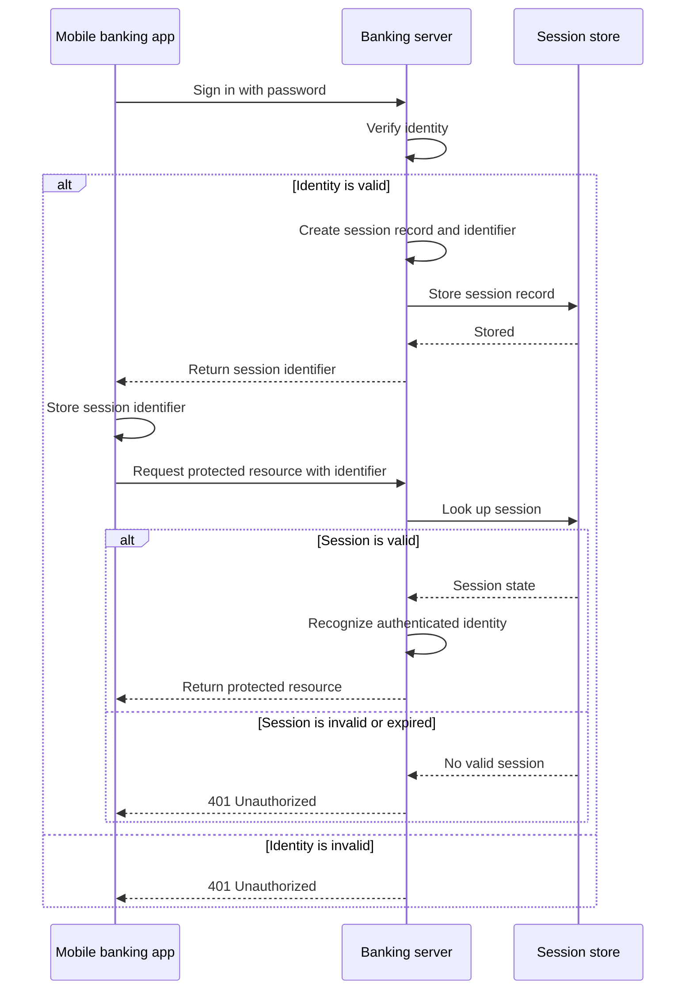

# Session-Based Authentication

## Table of Contents: Session-Based Authentication

- [How Session-Based Authentication Works](#how-session-based-authentication-works)
- [Strengths and Limitations](#strengths-and-limitations)

**Session-based authentication** is a common approach for preserving authentication state across multiple requests. HTTP is stateless, which means each request is independent and does not inherently remember authentication from an earlier request. In the fundamentals, we saw that **authentication state** allows a system to preserve recognition after successful authentication. Session-based authentication provides a direct implementation of that concept by maintaining authentication state on the server and allowing a client to reference that state during later requests. This approach is commonly used in traditional web applications where the server needs to recognize the same authenticated identity across multiple interactions. To understand how that recognition is maintained, the first step is to examine how a session is created and used during authentication.

## How Session-Based Authentication Works

After an identity has been successfully verified, the server creates a **session record** associated with that identity and assigns it a unique **session identifier**. In the banking example, the user first signs in by presenting a password. If the password is valid, the server creates the session record and returns its identifier to the mobile banking app. The app stores the identifier and presents it when making later requests to protected endpoints. The server uses the presented identifier to locate the corresponding session and recognize the authenticated identity, so the user does not need to submit the password with every request.

The session identifier needs to travel between the client and server, but session-based authentication does not require one specific transport mechanism. Browser-based applications commonly use cookies to transport session identifiers. How authentication information is transported as part of an HTTP request is covered separately in **HTTP Level 2** of the **Web Fundamentals** module. The important distinction is that the client presents the **session identifier**, while the authentication state associated with it remains on the server.

Because authentication state remains on the server, the session record needs somewhere to be stored. It can be kept in **memory**, which is simple and fast but loses sessions when the server restarts and does not naturally support multiple server instances. A **database** can preserve sessions across restarts and share them between servers, although retrieving a session adds database work to authenticated requests. An **external session store** such as Redis can provide fast shared storage when an application runs across multiple servers. The storage choice does not change the basic interaction from the client's perspective.

When a later request arrives, the server extracts the session identifier and looks up the corresponding session record. If the session exists and remains valid, the server recognizes the authenticated identity. If the identifier is unknown, invalid, or expired, a protected endpoint commonly rejects the request with `401 Unauthorized`. Sessions also have a defined lifetime and can expire automatically or be invalidated earlier by the server. During logout, the server invalidates or deletes the session record so the identifier can no longer be used to recover the authenticated state.

!!! info "Session Identifier"

    A session identifier references authentication state maintained by the server. How that identifier is transported and stored on the client is a separate API design decision.

This server-side state gives sessions several useful properties, but it also introduces trade-offs that should be considered when choosing an authentication approach.

## Strengths and Limitations

Session-based authentication is straightforward and widely supported by web frameworks. Because authentication state remains on the server, the server retains direct control over sessions and can invalidate them immediately when a user logs out or when access needs to be revoked. These properties make sessions a strong fit for traditional server-rendered web applications and browser-based APIs where maintaining authentication state on the server is desirable.

The main limitation is that sessions are **stateful**. Authenticated requests normally require the server to retrieve session state, and applications running across multiple server instances need a way to share that state. This can introduce additional complexity as an application scales, making session-based authentication less suitable for stateless APIs, mobile applications, service-to-service communication, and highly distributed systems where maintaining shared server-side state may be undesirable. Session identifiers must also be protected because obtaining a valid identifier can allow another party to access the associated session. Browser applications commonly use cookies to transport session identifiers, which introduces security considerations such as **cross-site request forgery**, commonly called **CSRF**, and **session fixation**. These threats and their protections are explored further in the **Application Security** module. Additional guidance on secure session management is available in the [OWASP Session Management Cheat Sheet](https://cheatsheetseries.owasp.org/cheatsheets/Session_Management_Cheat_Sheet.html).

Where maintaining a server-side session is not a good fit, another approach is to issue a token that the client presents with later requests. The next method examines **token-based authentication** and how tokens differ from session identifiers.
