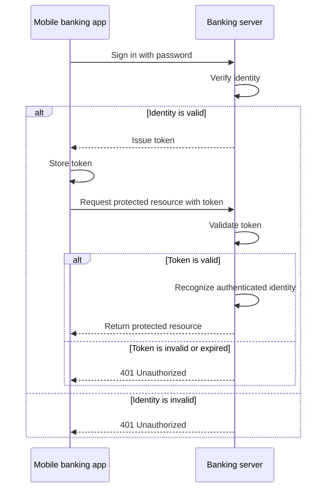

# Token-Based Authentication

## Table of Contents: Token-Based Authentication

- [How Token-Based Authentication Works](#how-token-based-authentication-works)
- [Strengths and Limitations](#strengths-and-limitations)

**Token-based authentication** uses a token that the client presents with later requests after successful authentication. Unlike session-based authentication, where the client presents a session identifier that refers to server-side session state, a token acts as the credential used to recognize the authenticated identity on later requests. Tokens can be self-contained or opaque. A self-contained token carries verifiable information needed to recognize the authenticated identity, while an opaque token references information that must be validated on the server. This makes token-based authentication flexible enough to support different API architectures. To see how the approach works, the banking example continues with a token issued after successful authentication.

## How Token-Based Authentication Works

After the user's identity has been successfully verified, the server can issue a **token** that the client presents with later requests. In the banking example, the user first signs in by presenting a password. If the password is valid, the server creates a token and returns it to the mobile banking app. The app stores the token and presents it when making later requests to protected endpoints. The server validates the presented token before using it to recognize the authenticated identity, so the user does not need to submit the password with every request.

How the server validates the token depends on the type of token being used. A **self-contained token** carries verifiable information that allows the server to recognize the authenticated identity without looking up a server-side session. **JSON Web Token**, commonly called **JWT**, is one widely used format for representing claims in a token and is defined by [RFC 7519](https://www.rfc-editor.org/rfc/rfc7519.html). An **opaque token** instead acts as a reference and normally requires server-side validation or lookup. Token-based authentication is therefore not inherently stateless. The formats and security mechanisms used to construct and protect tokens are explored further in the **Application Security** module and implementation-specific topics.

The client presents the token with later requests to protected endpoints. How authentication information is transported as part of an HTTP request is covered separately in **HTTP Level 2** of the **Web Fundamentals** module. Regardless of the transport mechanism, the server validates the presented token. If the token is valid, the server recognizes the authenticated identity. If the token is invalid or expired, a protected endpoint commonly rejects the request with `401 Unauthorized`. Systems can also use **refresh tokens** to obtain new access tokens without requiring the user to authenticate again. Their mechanics depend on the authentication protocol or implementation and are covered in the relevant implementation-specific topics.

!!! info "Token"

    A token is presented by the client as an authentication credential. Self-contained tokens can carry verifiable authentication information, while opaque tokens can reference server-side state. How a token is transported and stored is a separate API design decision.

The important distinction is that token-based authentication describes the use of a token as the credential presented with later requests. Whether validation requires server-side state depends on the token design.

## Strengths and Limitations

Token-based authentication works well across different types of clients and API architectures. Self-contained tokens can support **stateless** validation because the server does not need to maintain a session record or consult a shared session store for each request. This can be useful for stateless APIs, mobile applications, service-to-service communication, and distributed systems. Opaque tokens can provide different trade-offs by keeping associated information on the server while still using a token as the credential presented by the client.

The limitations depend partly on the token design. Self-contained tokens can be harder to revoke immediately because a valid token may continue to be accepted until it expires unless the system introduces additional revocation controls. Opaque tokens can make centralized control easier but require server-side validation or lookup. Regardless of format, tokens must be protected on the client because stealing a usable token can allow another party to present it. **Cross-site scripting**, commonly called **XSS**, is one relevant threat in browser environments. This threat and its protections are explored further in the **Application Security** module. Additional guidance on preventing XSS is available in the [OWASP Cross Site Scripting Prevention Cheat Sheet](https://cheatsheetseries.owasp.org/cheatsheets/Cross_Site_Scripting_Prevention_Cheat_Sheet.html).

With server-side sessions, the client presents an identifier for authentication state maintained by the server. With token-based authentication, the client presents a token as the credential, while the way that token represents or references authentication information depends on its design. When the caller is an application rather than a user, a simpler approach is possible through **API key authentication**, covered next.
