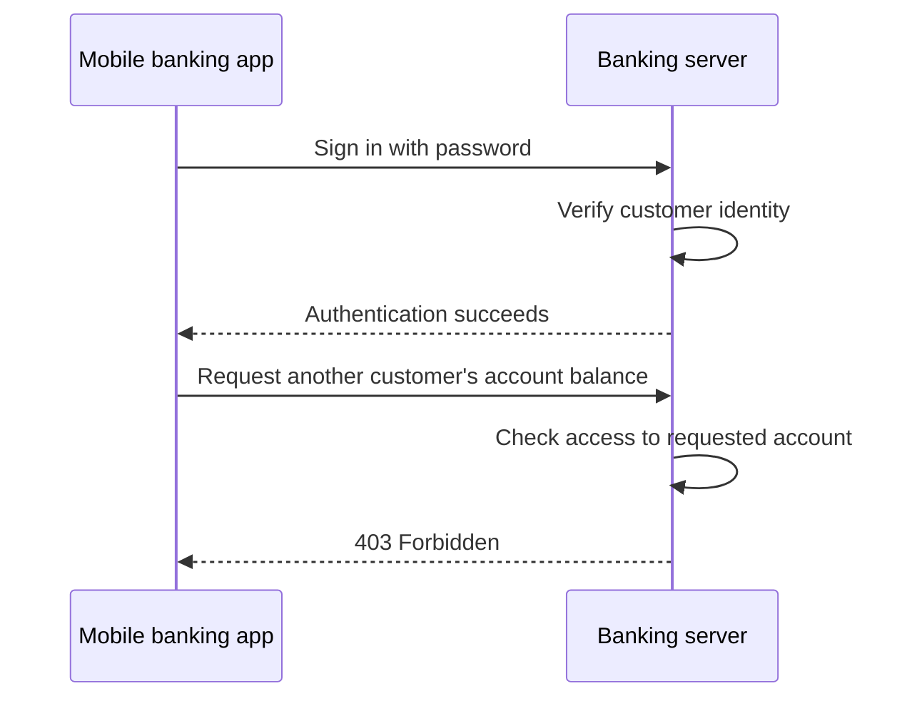
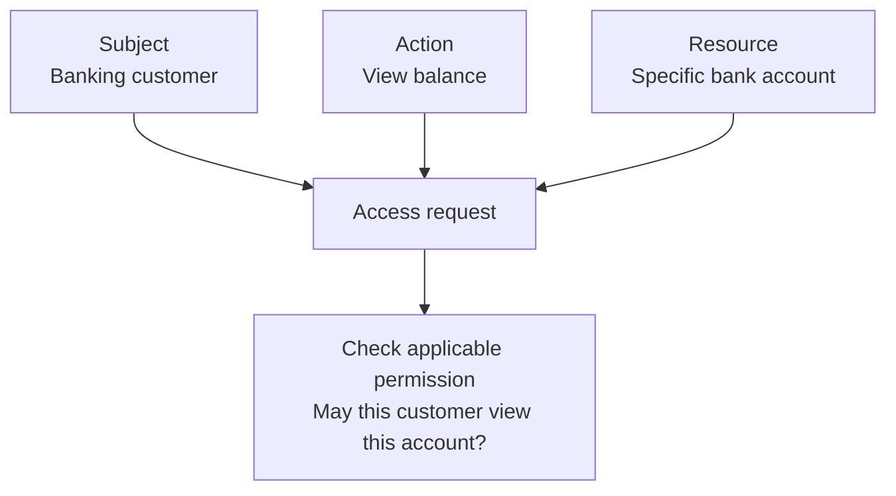
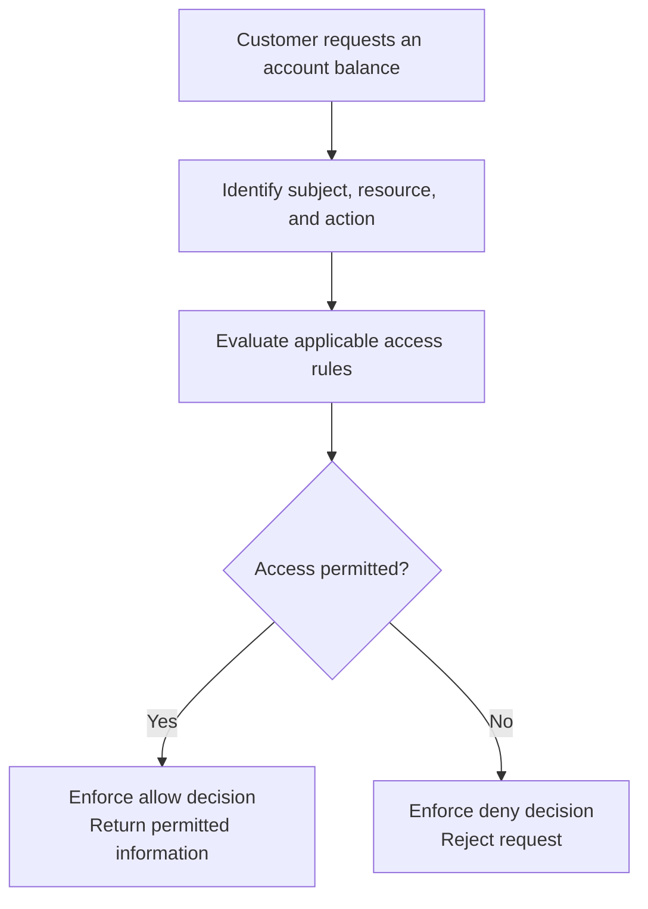

# Level 1

## Table of Contents: Authorization Fundamentals

- [Authorization](#authorization)
- [Authentication and Authorization](#authentication-and-authorization)
- [Subjects, Resources, Actions, and Permissions](#subjects-resources-actions-and-permissions)
- [Authorization Decisions and Enforcement](#authorization-decisions-and-enforcement)

**Authorization** establishes which resources and operations a caller may access. In a banking application, signing in allows a customer to be recognized, but it does not grant access to every account or transaction. This **Authorization Lvel 1** introduces the purpose of authorization, the concepts used to describe access, and how applications make and enforce access decisions.

## Authorization

Authorization controls access to protected information and operations according to a system's rules. A banking customer might be allowed to view their own account balance, while an employee might be allowed to perform particular administrative tasks. Neither identity should automatically receive access to unrelated accounts or operations. Authorization also applies when the caller is an application or service rather than a person.

The essential purpose is to establish boundaries around what a caller may do. Those boundaries become easier to understand when authorization is distinguished from **authentication**, which answers a different question.

## Authentication and Authorization

**Authentication** verifies who a caller is. **Authorization** determines what that caller is permitted to do. The processes are related, but a successful authentication does not imply permission to access every resource. For example, a customer may sign in successfully and still be denied access to another customer's bank account.

!!! note "Authentication Does Not Imply Permission"

    A verified identity can still lack permission for a particular operation or resource.

The example shows why recognizing the caller is only one part of protecting an API. To describe the access being requested, authorization uses the concepts of subjects, resources, actions, and permissions.

## Subjects, Resources, Actions, and Permissions

A **subject** is the user, application, or service requesting access. A **resource** is the information or capability being protected, such as a bank account. An **action** is the operation being requested, such as viewing a balance or initiating a transfer. Together, these three concepts describe an **access request**. A **permission** expresses an allowed operation or capability, potentially limited to particular resources. For example, a customer may be permitted to view one account without being permitted to transfer money from it or view another account.

Permissions can be assigned directly or determined through **access control rules**, which define when access is allowed. An **access control model** describes how these rules are organized and evaluated. For example, **Role-Based Access Control (RBAC)** grants permissions through assigned roles, **Attribute-Based Access Control (ABAC)** determines access using attributes and conditions, and **Access Control Lists (ACLs)** specify which users or groups may access particular resources. These approaches are explored in their own topics, while the next section focuses on how an application evaluates and enforces an authorization decision.

## Authorization Decisions and Enforcement

An **authorization decision** is the result of evaluating an access request against the applicable rules, commonly **allow** or **deny**. **Authorization enforcement** applies that result before the protected operation occurs or information is returned. For example, when a customer requests an account balance, the banking server evaluates whether the customer may view that account and returns the balance only if access is allowed. The decision and its enforcement are distinct steps within one process.

Enforcement must happen on the server, even if the client interface hides unavailable actions. Hiding a transfer button, for example, does not prevent a client from sending a transfer request directly. Authorization should follow **least privilege**, granting only the access needed for intended tasks, and should generally deny requests when the required permission cannot be established. Checks must be applied consistently to protected operations and resources.

An authenticated caller who lacks permission commonly receives `403 Forbidden`. An API may instead return `404 Not Found` when it needs to avoid disclosing the existence of a protected resource. A missing or invalid authentication credential commonly results in `401 Unauthorized`. Broken access control and its protections are covered further in the **Application Security** module, with additional guidance in the [OWASP Authorization Cheat Sheet](https://cheatsheetseries.owasp.org/cheatsheets/Authorization_Cheat_Sheet.html).

With these fundamentals established, the next topics examine how authorization rules can be organized using **Role-Based Access Control (RBAC)**, **Attribute-Based Access Control (ABAC)**, and **Access Control Lists (ACLs)**.
