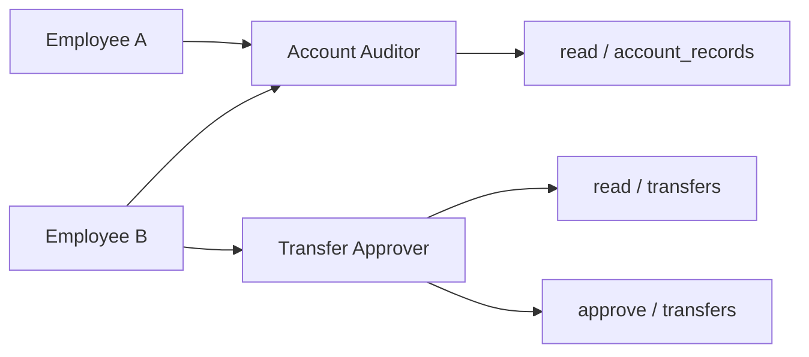
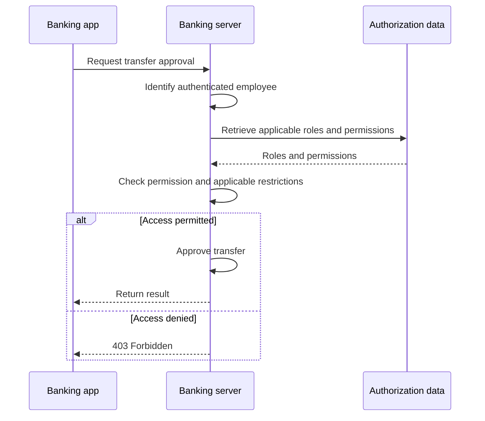
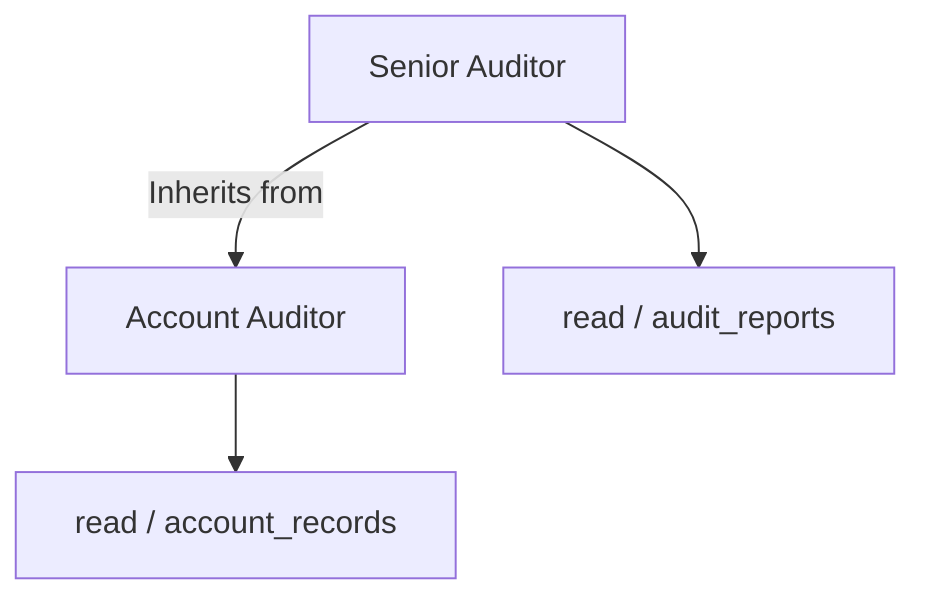

# Role-Based Access Control

## Table of Contents: RBAC

- [Understanding Role-Based Access Control](#understanding-role-based-access-control)
- [Roles, Permissions, and User Assignments](#roles-permissions-and-user-assignments)
- [Evaluating Access Through Roles](#evaluating-access-through-roles)
- [Role Hierarchies](#role-hierarchies)
- [RBAC Design Considerations](#rbac-design-considerations)

**Role-Based Access Control (RBAC)** organizes authorization around responsibilities represented by roles. Rather than assigning every permission to each user individually, an application associates permissions with roles and assigns those roles to users. In the banking example, account auditors and transfer approvers need different capabilities even though they work for the same organization. RBAC provides a way to manage those capabilities consistently.

## Understanding Role-Based Access Control

RBAC is an **access control model** in which users receive access through their assigned roles. A role represents a responsibility within an application, such as **Account Auditor** or **Transfer Approver**. The role does not authenticate the user, and its name does not grant access by itself. Access depends on the permissions associated with that role. If a bank changes what auditors may view, it can update the auditor role rather than modify each auditor's permissions individually.

This separation between users, roles, and permissions is the foundation of RBAC. The next section shows how the relationships fit together and how permissions can represent specific operations on resources.

## Roles, Permissions, and User Assignments

A **permission** identifies an operation that may be performed on a resource. One common representation is an **action and resource pair**, such as `read` on `account_records` or `approve` on `transfers`. A **role** groups permissions for a responsibility, while a **role assignment** associates a user with one or more roles. For example, an **Account Auditor** role might include `read` on `account_records`, while a **Transfer Approver** role might include `read` and `approve` on `transfers`. These are illustrative application permissions, not universal banking rules.

The diagram shows that several users can share a role and that one user can hold multiple roles. In a common RBAC design, a user's available permissions are the combined permissions of their **applicable roles**, often called **permission aggregation**. Employee B, for example, receives both the auditor's record-reading permission and the approver's transfer permissions. Some implementations restrict which roles can be assigned together or activated at the same time, so aggregation is not necessarily unrestricted.

A permission such as `approve` on `transfers` describes a capability, but it does not necessarily establish whether an employee may approve a particular transfer. Additional rules may still apply. With the relationships between users, roles, and permissions established, the next section examines how the server evaluates them when handling a protected request.

## Evaluating Access Through Roles

When a user requests a protected operation, the server identifies the authenticated user, determines which roles apply, and checks whether their permissions cover the requested action and resource. In the banking example, an employee requests approval of a transfer. The server checks whether the employee has an applicable role granting `approve` on `transfers`, then evaluates any additional restrictions relevant to that transfer. The operation proceeds only when the authorization requirements are satisfied.

The server must enforce the decision even if the interface hides unavailable actions. A role assignment is therefore not a substitute for checking each protected request. Some RBAC systems also support role inheritance, which changes how permissions are obtained without changing the need for enforcement.

## Role Hierarchies

A **role hierarchy** allows one role to inherit permissions from another. For example, a **Senior Auditor** role might inherit the permissions of an **Account Auditor** role and also have permission to review additional reports. Inheritance reduces duplication when roles share a common set of capabilities.

Role hierarchies are optional, and seniority alone should not imply unrestricted access. Inheritance should reflect actual responsibilities. This matters especially when roles grow in number or overlap, which leads to broader design considerations.

## RBAC Design Considerations

RBAC is effective when responsibilities are relatively stable and several users need similar permissions. However, overly broad roles can grant unnecessary access, while creating a separate role for every minor variation can lead to **role explosion**. Assignments should reflect current responsibilities, and roles should be reviewed when duties change. **Least privilege** remains important, as does **separation of duties**. For example, a bank may prevent one employee from both initiating and approving the same transfer, even if that employee holds multiple roles.

RBAC alone may not express every rule about a specific resource or request. A permission such as `read` on `account_records` does not necessarily authorize reading every customer's account, and a permission such as `approve` on `transfers` may still be subject to transaction-specific restrictions. These limitations help explain why RBAC is sometimes combined with other authorization rules. The broader security consequences of incorrect access control and their protections are covered in the **Application Security** module. Further background on RBAC is available from the [NIST Role-Based Access Control project](https://csrc.nist.gov/projects/role-based-access-control).

The next topic, **Attribute-Based Access Control (ABAC)**, examines authorization decisions based on attributes and conditions rather than relying primarily on role membership.