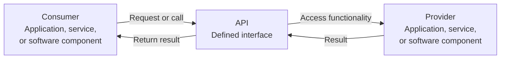
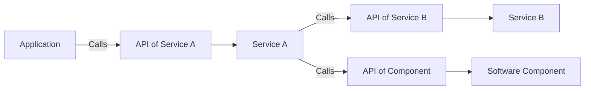

# Level 1

## Table of Contents: API Fundamentals

- [What APIs are and how they work](#what-apis-are-and-how-they-work)
- [How APIs fit into system communication](#how-apis-fit-into-system-communication)
- [API styles](#api-styles)

**API Fundamentals Level 1** introduces the basic ideas behind APIs and the role they play in communication between software components and systems. You will learn what an API is, how one part of a system uses an API to access functionality provided by another part, and how different API approaches organize interactions. At this level, the focus is on understanding these concepts rather than building an API. These foundations will later connect to more specific API technologies and design practices.

To begin, it is important to understand what an API is and what happens when one software component uses an API provided by another.

## What APIs are and how they work

An **API (Application Programming Interface)** is a defined interface that allows one software component or system to interact with another. It describes what functionality is available and how other software can use it without needing to understand the provider's internal implementation.

A useful analogy is a **restaurant**. A customer does not enter the kitchen and prepare a meal directly. Instead, the customer uses the menu and ordering process to choose what is available, provide the required information, and receive the finished meal. In a similar way, software uses an API to access functionality provided by another system without needing to know how that system performs the work internally.

In this analogy, the software using the API is the **consumer**, the API acts like the menu and ordering process, and the software supplying the functionality is the **provider**. The consumer makes a request or call through the API, the provider performs the required work, and a result can be returned to the consumer.

Because the consumer depends on the API rather than the provider's internal implementation, the provider can change how its internal work is performed while keeping the same interface available to consumers.

An API exposes **operations** that describe the actions a consumer can use. For example, one operation might retrieve information, while another might create something, update data, or perform a calculation. When a consumer uses an operation, the provider performs the required work and may return data, confirmation of success, or information about an error.

!!! example "A simple API interaction"

    Imagine an application that needs weather information. Instead of collecting and processing weather data itself, it can use an API provided by a weather service. The application asks for the required information through the API, and the service returns the available result. Like choosing an item from a restaurant menu, the application uses functionality that the provider has made available without needing to know how the work is performed internally.

You can therefore think of an API as a **contract between software components or systems**. Like a menu that defines what can be ordered, the API defines what functionality is available, how it can be used, what information may need to be supplied, and what results can be expected.

!!! info "API interactions can take different forms"

    The restaurant analogy explains the basic relationship between a consumer, an API, and a provider, but real APIs can interact in different ways. Some use requests and responses, some allow ongoing communication, and others notify software when an event occurs. At this level, the important idea is that the API defines the permitted interaction between the consumer and the provider.

Understanding this basic relationship explains how an API supports one interaction. The next step is to see how APIs connect different parts of larger software systems.

## How APIs fit into system communication

Modern software often consists of multiple components, applications, or services that need to work together. One application may use functionality provided by another service, several services may communicate with each other, or components within the same system may expose interfaces for other components to use. APIs provide defined boundaries for these interactions, allowing each part to focus on its own responsibilities while exposing only the functionality that other parts need.

The API nodes in the diagram represent the defined boundaries through which one part of the system accesses another. This separation reduces unnecessary dependence on internal implementation details and gives software a structured way to interact. APIs can also connect software built with different technologies. As long as both sides understand and follow the API's rules, the consumer does not need to be implemented in the same way as the provider.

!!! info "APIs exist at different boundaries"

    APIs are not limited to communication between separate applications or services over a network. Libraries, operating systems, databases, frameworks, and other software can also provide APIs that allow programs or components to use their functionality.

How these boundaries are organized depends on the technology involved. For communication between applications and services, several common approaches have emerged.

## API styles

APIs can organize communication in different ways depending on the systems involved and the problem being solved. For APIs used between applications and services, common approaches include **REST**, **GraphQL**, **SOAP**, and **gRPC**. Imagine an online store containing products, customers, and orders. Each approach can organize the operations that applications and services use to interact with that store in a different way.

!!! example "Different approaches to the same system"

    A **REST** API might organize operations around resources such as products and orders, allowing an application to retrieve or change them through defined operations. **GraphQL** might let an application request only the product information it currently needs, such as a product's name and price. **SOAP** might perform operations by exchanging order information in messages that follow a required structure, similar to completing a standardized form. **gRPC** might define operations that one service can ask another service to perform, such as an order service asking a payment service to process a payment.

At this **API Fundamentals Level 1**, you do not need to understand how these approaches work internally or decide which one to use. The important idea is that **there is no single way to design an API**. Different approaches organize API operations and software interactions in different ways, and later material can explore how they work and where they are used in more detail.
