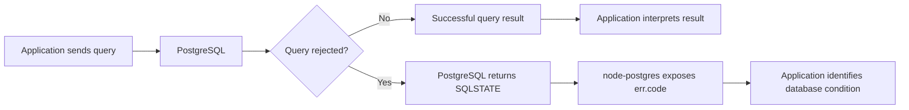
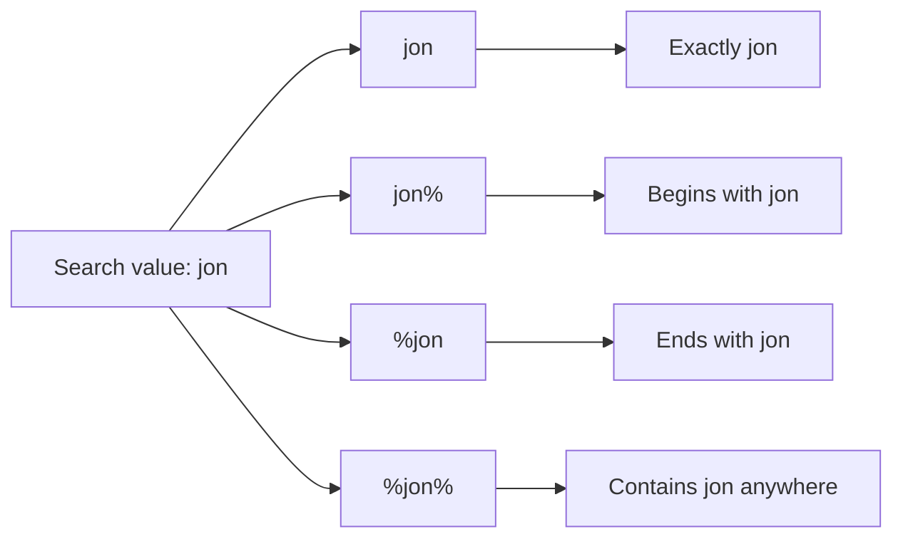

# Level 2

## Table of Contents: Database Integration

- [Handling Database Errors](#handling-database-errors)
- [Building Advanced Collection Queries](#building-advanced-collection-queries)
<!-- - [Working with Transactions](#working-with-transactions)
- [Structuring Database Access](#structuring-database-access) -->

**Database Integration Level 2** builds on the PostgreSQL connection, shared connection pool, CRUD queries, parameterized queries, query results, and joins introduced in **Database Integration Level 1**. It extends that foundation by handling database failures deliberately, building more capable collection queries, coordinating related database operations, and organizing database access as the application grows.

## Handling Database Errors

PostgreSQL protects the integrity of stored data, while application code executes database operations and interprets their results. HTTP validation, client-facing responses, and centralized Express error handling are developed separately in **Express Error Handling Levels 1, 2, and 3**. This section focuses on the boundary between PostgreSQL and the application.

A database operation does not have to fail for its result to require interpretation. After a successful query, node-postgres provides a result object containing information about what the query returned or affected. One common pattern is checking whether `result.rows` contains any rows. An empty `rows` array does not represent a PostgreSQL error and does not have one universal application meaning. With `UPDATE ... RETURNING` or `DELETE ... RETURNING`, it can indicate that no row matched the condition, while a `SELECT` can legitimately return an empty collection when nothing matches. The application interprets the result according to the operation being performed.

```js
if (result.rows.length === 0) {
    // Handle the successful query that returned no rows
}
```

For example, when an update is expected to target one specific profile, an empty result means no profile matched the supplied identifier.

```js
const result = await pool.query(
    `
        UPDATE profiles
        SET phone = $1
        WHERE id = $2
        RETURNING id, user_id, name, phone, address
    `,
    [phone, profileId],
);

if (result.rows.length === 0) {
    return res.status(404).json({
        error: "Profile not found",
    });
}

return res.json(result.rows[0]);
```

The `404` is this route's interpretation of the empty result rather than a meaning built into `result.rows.length === 0`. A collection query with no matches could instead return an empty array. This is **result handling**, not PostgreSQL error handling, because PostgreSQL successfully executed the query.

Database error handling begins when PostgreSQL rejects an operation. Consider a requirement that stored phone numbers use Lithuania's international `+370` prefix. Without a database constraint, the application can validate the value before sending the update.

```js
app.patch("/profiles/:profileId", async (req, res) => {
    const { profileId } = req.params;
    const { phone } = req.body;

    if (phone !== null && !phone.startsWith("+370")) {
        return res.status(400).json({
            error: "Phone number must use the +370 international prefix",
        });
    }

    const result = await pool.query(
        `
            UPDATE profiles
            SET phone = $1
            WHERE id = $2
            RETURNING id, user_id, name, phone, address
        `,
        [phone, profileId],
    );

    if (result.rows.length === 0) {
        return res.status(404).json({
            error: "Profile not found",
        });
    }

    return res.json(result.rows[0]);
});
```

This protects requests passing through this route, but PostgreSQL itself does not know the phone rule. Another route, service, script, or direct database operation can bypass it, and changing the rule means maintaining every duplicated implementation. If a rule must always remain true in stored data, PostgreSQL should enforce it directly.

When PostgreSQL rejects an operation, it reports the condition with a standardized five-character **SQLSTATE** code. Different database conditions have different codes, which gives application code a stable way to identify why an operation was rejected without depending on PostgreSQL's human-readable error message.

| SQLSTATE | PostgreSQL condition  | Example database cause                                    |
|----------|-----------------------|-----------------------------------------------------------|
| `23505`  | Unique violation      | Duplicate email or another value governed by `UNIQUE`     |
| `23503`  | Foreign key violation | A foreign key references data that does not exist         |
| `23502`  | Not-null violation    | A required database value is `NULL`                       |
| `23514`  | Check violation       | A value violates a rule represented by `CHECK`            |

The complete list is available in the [PostgreSQL SQLSTATE error-code documentation](https://www.postgresql.org/docs/current/errcodes-appendix.html). For now, the important point is that PostgreSQL performs the database checks and reports the condition with a SQLSTATE code. The next route shows how node-postgres makes that returned code available to the application.

The phone requirements can now be enforced on the existing `profiles.phone` column. If phone numbers must use the `+370` prefix, that rule can be represented with `CHECK`. If the data rules also forbid two profiles from sharing a phone number, that separate requirement can be represented with `UNIQUE`.

```sql
ALTER TABLE profiles
ADD CONSTRAINT profiles_phone_format_check
CHECK (phone IS NULL OR phone LIKE '+370%'),
ADD CONSTRAINT profiles_phone_unique
UNIQUE (phone);
```

The `UNIQUE` constraint should be included only if shared phone numbers are actually forbidden. Once these rules are constraints, every write to `profiles.phone` is checked by PostgreSQL, so the route no longer needs to repeat the `phone.startsWith("+370")` check merely to protect database integrity. It can attempt the update and identify any constraint violation from the SQLSTATE PostgreSQL returns.

```js
app.patch("/profiles/:profileId", async (req, res) => {
    const { profileId } = req.params;
    const { phone } = req.body;

    try {
        const result = await pool.query(
            `
                UPDATE profiles
                SET phone = $1
                WHERE id = $2
                RETURNING id, user_id, name, phone, address
            `,
            [phone, profileId],
        );

        if (result.rows.length === 0) {
            return res.status(404).json({
                error: "Profile not found",
            });
        }

        return res.json(result.rows[0]);
    } catch (err) {
        if (err.code === "23514") {
            return res.status(400).json({
                error: "Phone number must use the +370 international prefix",
            });
        }

        if (err.code === "23505") {
            return res.status(409).json({
                error: "This phone number is already in use",
            });
        }

        return res.status(500).json({
            error: "Database operation failed",
        });
    }
});
```

The route now shows how SQLSTATE is used in application code. When PostgreSQL rejects `pool.query()`, node-postgres provides the error received by `catch (err)` and exposes PostgreSQL's SQLSTATE value as `err.code`. The condition `err.code === "23514"` asks whether PostgreSQL rejected the update because the `CHECK` constraint was violated, while `err.code === "23505"` asks whether it was rejected because the `UNIQUE` constraint was violated. These comparisons do not perform the database checks themselves. PostgreSQL has already performed the checks and rejected the query. The application is only identifying which reported database condition occurred so it can handle that condition appropriately.

A successful query remains in `try`, where the application interprets the returned result, while a rejected query enters `catch`, where `err.code` can be inspected. The HTTP responses keep the route complete, while broader response design belongs to the Express error-handling module.



The same SQLSTATE mechanism applies to constraints already defined in **Database Integration Level 1**. `users.email` is already `NOT NULL UNIQUE`, so user creation can rely on PostgreSQL to enforce those rules rather than adding the constraints again.

```js
app.post("/users", async (req, res) => {
    const { email } = req.body;

    try {
        const result = await pool.query(
            `
                INSERT INTO users (email)
                VALUES ($1)
                RETURNING id, email, created_at
            `,
            [email],
        );

        return res.status(201).json(result.rows[0]);
    } catch (err) {
        if (err.code === "23505") {
            return res.status(409).json({
                error: "A user with this email already exists",
            });
        }

        if (err.code === "23502") {
            return res.status(400).json({
                error: "Email is required",
            });
        }

        return res.status(500).json({
            error: "Database operation failed",
        });
    }
});
```

A duplicate email produces `23505`, while a null email produces `23502`. In both cases PostgreSQL enforces the existing schema first and the application uses `err.code` only to identify which database condition occurred.

!!! tip "Keep Database Responsibilities Separate"

    Successful queries can require result handling even when no database error occurred. Rejected queries provide PostgreSQL conditions that node-postgres exposes through `err.code`. PostgreSQL constraints protect stored data, while the application's HTTP interpretation of either outcome is a separate concern.

Application validation can still provide earlier feedback when useful, but it should not be the only protection for rules that must always remain true in stored data. PostgreSQL remains the final authority for database integrity.

With database operations now able to distinguish successful results from rejected queries and preserve data integrity through constraints, the next step is retrieving collections more effectively. As collections grow, applications often need more than a basic `SELECT` query. They need to filter, sort, search, and limit the rows PostgreSQL returns.

## Building Advanced Collection Queries

A collection query can combine data from `users` and `profiles`, then add filtering, search, sorting, and pagination so PostgreSQL returns only the users that match the requested collection options.

```js
app.get("/users", async (req, res) => {
    const {
        name,
        search,
        sort = "created_at",
        order = "desc",
        offset = 0,
        limit = 10,
    } = req.query;

    const conditions = [];
    const values = [];

    // Filtering by an exact profile name
    if (name) {
        values.push(name);
        conditions.push(`profiles.name = $${values.length}`);
    }

    // Searching for text inside an email or profile name
    if (search) {
        values.push(`%${search}%`);
        conditions.push(`
            (
                users.email ILIKE $${values.length}
                OR profiles.name ILIKE $${values.length}
            )
        `);
    }

    const whereClause =
        conditions.length > 0
            ? `WHERE ${conditions.join(" AND ")}`
            : "";

    // Sorting can use only fields supported by this route
    const sortFields = {
        email: "users.email",
        name: "profiles.name",
        created_at: "users.created_at",
    };

    const sortColumn = sortFields[sort] || "users.created_at";
    const sortDirection = order === "asc" ? "ASC" : "DESC";

    // Add pagination values after the optional filter and search values
    values.push(limit);
    const limitParameter = `$${values.length}`;

    values.push(offset);
    const offsetParameter = `$${values.length}`;

    try {
        const result = await pool.query(
            `
                SELECT
                    users.id,
                    users.email,
                    users.created_at,
                    users.updated_at,
                    profiles.name,
                    profiles.phone,
                    profiles.address
                FROM users
                LEFT JOIN profiles
                    ON profiles.user_id = users.id
                ${whereClause}
                ORDER BY ${sortColumn} ${sortDirection}
                LIMIT ${limitParameter}
                OFFSET ${offsetParameter}
            `,
            values,
        );

        return res.json(result.rows);
    } catch (err) {
        return res.status(500).json({
            error: "Database operation failed",
        });
    }
});
```

Filtering and search both narrow the collection, but they do so differently. The `name` filter uses `profiles.name = ...` to look for an exact profile name, while search uses `ILIKE` for case-insensitive pattern matching across `users.email` and `profiles.name`. The search value is written as `%${search}%`, where `%` represents any sequence of characters. Placing `%` on both sides means the entered text can appear anywhere in the stored value.



If the consumer searches for `jon`, `%${search}%` becomes `%jon%`, so PostgreSQL can match values such as `Jonas`, `JONAS`, or an email containing `jon`. The search value still uses a PostgreSQL placeholder rather than being inserted directly into the SQL.

Sorting is controlled by `sort` and `order`. Because placeholders such as `$1` represent values rather than SQL column names, the requested sort field is mapped to one of the supported columns in `sortFields`, while the direction is limited to `ASC` or `DESC`. Pagination then uses `LIMIT` to control the maximum number of matching rows returned and `OFFSET` to control how many matching rows PostgreSQL skips first. For example, `GET /users?name=Jonas&search=jon&sort=name&order=asc&offset=20&limit=10` applies the filter and search, sorts the matching users by profile name, skips the first 20 matches, and returns up to the next 10.

`LEFT JOIN` keeps users available to the collection even when they do not have a matching profile. PostgreSQL can therefore perform the join, filtering, search, sorting, and pagination as part of one collection query instead of returning every row for the application to process afterward. As database operations become more complex, some workflows require several related queries to succeed or fail together, which leads to working with transactions.