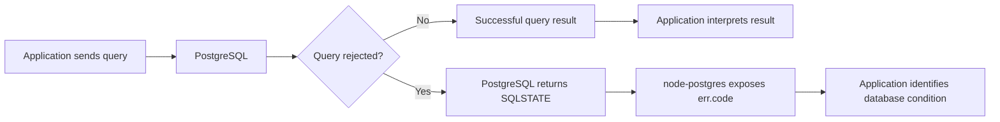
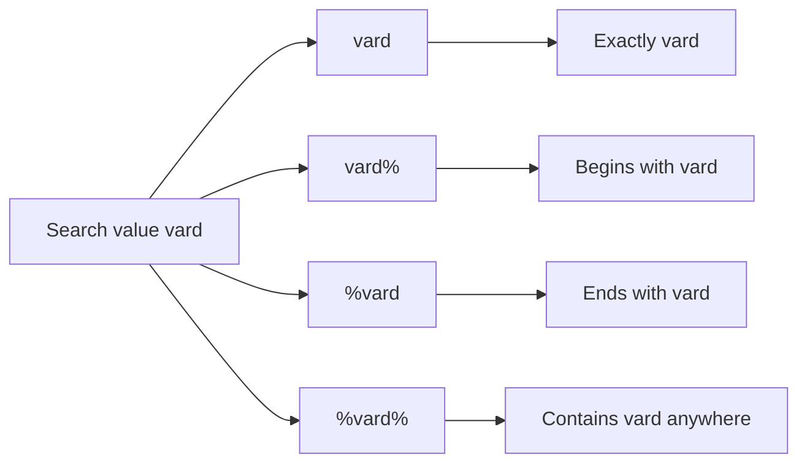

# Level 2

## Table of Contents: Database Integration

- [Handling Database Errors](#handling-database-errors)
- [Building Advanced Collection Queries](#building-advanced-collection-queries)
<!-- - [Working with Transactions](#working-with-transactions)
- [Structuring Database Access](#structuring-database-access) -->

**Database Integration Level 2** builds on the PostgreSQL connection, shared connection pool, CRUD queries, parameterized queries, query results, and joins introduced in **Database Integration Level 1**. It extends that foundation by handling database failures deliberately, building more capable collection queries, coordinating related database operations, and organizing database access as the application grows.

## Handling Database Errors

PostgreSQL protects the integrity of stored data, while application code executes database operations and interprets their results. HTTP validation, client-facing responses, and centralized Express error handling are developed separately in **Express Error Handling Levels 1, 2, and 3**. This section focuses on the boundary between PostgreSQL and the application.

A database operation does not have to fail for its result to require interpretation. After a successful query, node-postgres provides a result object containing information about what the query returned or affected. One common pattern is checking whether `result.rows` contains any rows. An empty `rows` array does not represent a PostgreSQL error and does not have one universal application meaning. With `UPDATE ... RETURNING` or `DELETE ... RETURNING`, it can indicate that no row matched the condition, while a `SELECT` can legitimately return an empty collection when nothing matches. The application interprets the result according to the operation being performed.

```js
if (result.rows.length === 0) {
    // Handle the successful query that returned no rows
}
```

For example, when an update is expected to target one specific profile, an empty result means no profile matched the supplied identifier.

```js
const result = await pool.query(
    `
        UPDATE profiles
        SET phone = $1
        WHERE id = $2
        RETURNING id, user_id, name, phone, address
    `,
    [phone, profileId],
);

if (result.rows.length === 0) {
    return res.status(404).json({
        error: "Profile not found",
    });
}

return res.json(result.rows[0]);
```

The `404` is this route's interpretation of the empty result rather than a meaning built into `result.rows.length === 0`. A collection query with no matches could instead return an empty array. This is **result handling**, not PostgreSQL error handling, because PostgreSQL successfully executed the query.

Database error handling begins when PostgreSQL rejects an operation. Consider a requirement that stored phone numbers use Lithuania's international `+370` prefix. Without a database constraint, the application can validate the value before sending the update.

```js
app.patch("/profiles/:profileId", async (req, res) => {
    const { profileId } = req.params;
    const { phone } = req.body;

    if (phone !== null && !phone.startsWith("+370")) {
        return res.status(400).json({
            error: "Phone number must use the +370 international prefix",
        });
    }

    const result = await pool.query(
        `
            UPDATE profiles
            SET phone = $1
            WHERE id = $2
            RETURNING id, user_id, name, phone, address
        `,
        [phone, profileId],
    );

    if (result.rows.length === 0) {
        return res.status(404).json({
            error: "Profile not found",
        });
    }

    return res.json(result.rows[0]);
});
```

This protects requests passing through this route, but PostgreSQL itself does not know the phone rule. Another route, service, script, or direct database operation can bypass it, and changing the rule means maintaining every duplicated implementation. If a rule must always remain true in stored data, PostgreSQL should enforce it directly.

When PostgreSQL rejects an operation, it reports the condition with a standardized five-character **SQLSTATE** code. Different database conditions have different codes, which gives application code a stable way to identify why an operation was rejected without depending on PostgreSQL's human-readable error message.

| SQLSTATE | PostgreSQL condition  | Example database cause                                    |
|----------|-----------------------|-----------------------------------------------------------|
| `23505`  | Unique violation      | Duplicate email or another value governed by `UNIQUE`     |
| `23503`  | Foreign key violation | A foreign key references data that does not exist         |
| `23502`  | Not-null violation    | A required database value is `NULL`                       |
| `23514`  | Check violation       | A value violates a rule represented by `CHECK`            |

The complete list is available in the [PostgreSQL SQLSTATE error-code documentation](https://www.postgresql.org/docs/current/errcodes-appendix.html). For now, the important point is that PostgreSQL performs the database checks and reports the condition with a SQLSTATE code. The next route shows how node-postgres makes that returned code available to the application.

The phone requirements can now be enforced on the existing `profiles.phone` column. If phone numbers must use the `+370` prefix, that rule can be represented with `CHECK`. If the data rules also forbid two profiles from sharing a phone number, that separate requirement can be represented with `UNIQUE`.

```sql
ALTER TABLE profiles
ADD CONSTRAINT profiles_phone_format_check
CHECK (phone IS NULL OR phone LIKE '+370%'),
ADD CONSTRAINT profiles_phone_unique
UNIQUE (phone);
```

The `UNIQUE` constraint should be included only if shared phone numbers are actually forbidden. Once these rules are constraints, every write to `profiles.phone` is checked by PostgreSQL, so the route no longer needs to repeat the `phone.startsWith("+370")` check merely to protect database integrity. It can attempt the update and identify any constraint violation from the SQLSTATE PostgreSQL returns.

```js
app.patch("/profiles/:profileId", async (req, res) => {
    const { profileId } = req.params;
    const { phone } = req.body;

    try {
        const result = await pool.query(
            `
                UPDATE profiles
                SET phone = $1
                WHERE id = $2
                RETURNING id, user_id, name, phone, address
            `,
            [phone, profileId],
        );

        if (result.rows.length === 0) {
            return res.status(404).json({
                error: "Profile not found",
            });
        }

        return res.json(result.rows[0]);
    } catch (err) {
        if (err.code === "23514") {
            return res.status(400).json({
                error: "Phone number must use the +370 international prefix",
            });
        }

        if (err.code === "23505") {
            return res.status(409).json({
                error: "This phone number is already in use",
            });
        }

        return res.status(500).json({
            error: "Database operation failed",
        });
    }
});
```

The route now shows how SQLSTATE is used in application code. When PostgreSQL rejects `pool.query()`, node-postgres provides the error received by `catch (err)` and exposes PostgreSQL's SQLSTATE value as `err.code`. The condition `err.code === "23514"` asks whether PostgreSQL rejected the update because the `CHECK` constraint was violated, while `err.code === "23505"` asks whether it was rejected because the `UNIQUE` constraint was violated. These comparisons do not perform the database checks themselves. PostgreSQL has already performed the checks and rejected the query. The application is only identifying which reported database condition occurred so it can handle that condition appropriately.

A successful query remains in `try`, where the application interprets the returned result, while a rejected query enters `catch`, where `err.code` can be inspected. The HTTP responses keep the route complete, while broader response design belongs to the Express error-handling module.



The same SQLSTATE mechanism applies to constraints already defined in **Database Integration Level 1**. `users.email` is already `NOT NULL UNIQUE`, so user creation can rely on PostgreSQL to enforce those rules rather than adding the constraints again.

```js
app.post("/users", async (req, res) => {
    const { email } = req.body;

    try {
        const result = await pool.query(
            `
                INSERT INTO users (email)
                VALUES ($1)
                RETURNING id, email, created_at
            `,
            [email],
        );

        return res.status(201).json(result.rows[0]);
    } catch (err) {
        if (err.code === "23505") {
            return res.status(409).json({
                error: "A user with this email already exists",
            });
        }

        if (err.code === "23502") {
            return res.status(400).json({
                error: "Email is required",
            });
        }

        return res.status(500).json({
            error: "Database operation failed",
        });
    }
});
```

A duplicate email produces `23505`, while a null email produces `23502`. In both cases PostgreSQL enforces the existing schema first and the application uses `err.code` only to identify which database condition occurred.

!!! tip "Keep Database Responsibilities Separate"

    Successful queries can require result handling even when no database error occurred. Rejected queries provide PostgreSQL conditions that node-postgres exposes through `err.code`. PostgreSQL constraints protect stored data, while the application's HTTP interpretation of either outcome is a separate concern.

Application validation can still provide earlier feedback when useful, but it should not be the only protection for rules that must always remain true in stored data. PostgreSQL remains the final authority for database integrity.

With database operations now able to distinguish successful results from rejected queries and preserve data integrity through constraints, the next step is retrieving collections more effectively. As collections grow, applications often need more than a basic `SELECT` query. They need to filter, sort, search, and limit the rows PostgreSQL returns.

## Building Advanced Collection Queries

A collection query often needs more control than simply returning every row from a table. As the amount of stored data grows, the application may need to filter rows by a specific value, search across text fields, control the order of results, and return the collection in smaller portions. This section builds these operations gradually, introducing each responsibility before combining them into a complete `findAll()` function. Begin with a basic collection query that retrieves users together with their profile information using the `LEFT JOIN` introduced in **Database Integration Level 1**.

```js
export async function findAll() {
    const query = `
        SELECT
            users.id,
            users.email,
            users.role,
            users.created_at,
            users.updated_at,
            profiles.name,
            profiles.phone,
            profiles.address
        FROM users
        LEFT JOIN profiles
            ON profiles.user_id = users.id
        ORDER BY users.created_at DESC;
    `;

    const { rows } = await pool.query(query);

    return rows;
}
```

This provides the starting point for the collection. The query returns every user, keeps users that do not yet have a profile because it uses `LEFT JOIN`, and orders the result by creation date.

The first collection control to add is **filtering**. Filtering narrows the collection by requiring a supported field to contain a particular value. In this example, the collection can be filtered by the user's role using the `filterBy` and `filterValue` function parameters.

```js
export async function findAllRole({
    filterBy,
    filterValue,
} = {})
```

The function receives its collection options as a single object. The `{ filterBy, filterValue }` syntax destructures that object so the properties can be used directly as `filterBy` and `filterValue` inside the function. This approach is useful because more collection options, such as search, sorting, and pagination, can be added to the same object without relying on the position of function arguments. The `= {}` provides an empty object when no argument is passed, allowing `findAllRole()` to be called without causing an error during destructuring.

The SQL can then use `$1` for the requested filter field and `$2` for its value. The `::text` syntax casts a parameter to PostgreSQL's `text` type. This gives PostgreSQL an explicit type when it evaluates conditions such as `$1::text IS NULL`.

```sql
WHERE
    (
        $1::text IS NULL
        OR $2::text IS NULL
        OR ($1 = 'role' AND users.role = $2)
    )
```

If no filter is supplied, `filterBy` or `filterValue` becomes `null` and the condition does not restrict the collection. When `filterBy` contains `"role"` and `filterValue` contains `"admin"`, PostgreSQL compares `users.role` with `"admin"`. Both values are passed separately from the SQL.

```js
const values = [
    filterBy || null,
    filterValue || null,
];

const { rows } = await pool.query(query, values);
```

At this stage, the function can retrieve all users or restrict the collection to a selected role without inserting the filter value directly into the SQL. The same collection can be implemented in different ways depending on what the application needs. The current approach keeps the supported role filter directly in the SQL, which works well when the available conditions are small and known in advance. When a collection supports several independent optional conditions, the application can instead build the `WHERE` clause gradually.

```js
const conditions = [];
const values = [];

if (filterBy === "role" && filterValue) {
    values.push(filterValue);
    conditions.push(`users.role = $${values.length}`);
}

const whereClause =
    conditions.length > 0 ? `WHERE ${conditions.join(" AND ")}` : "";
```

The filter condition is added only when the required role value is provided. If no filter is provided, `conditions` remains empty and no `WHERE` clause is added. When conditions are added, `conditions.length > 0` checks that the array is not empty and `conditions.join(" AND ")` combines them into the `WHERE` clause. `AND` is used so that when several optional conditions are introduced, every included condition must be satisfied.

!!! info "Different Ways to Build Collection Queries"

    A collection query can be constructed in different ways depending on its requirements. A small, known set of optional conditions can remain directly in the SQL, as in the main example. Optional conditions can also be collected dynamically and added to the `WHERE` clause only when they are needed. In both approaches, request values remain separate from the SQL by using parameterized values.

The next control is **search**. Unlike filtering, which compares a supported field with a specific value, search looks for text inside one or more searchable fields. Add `search` to the function parameters.

```js
export async function findAll({
    filterBy,
    filterValue,
    search,
} = {})
```

Search and filtering both restrict which rows are returned, so both are implemented through the SQL `WHERE` clause. Filtering usually compares a field with a specific value, while search usually performs pattern matching across one or more text fields. Because the filter condition is already present, the search condition is added with `AND`.

```sql
AND
(
    $3::text IS NULL
    OR users.email ILIKE '%' || $3 || '%'
    OR profiles.name ILIKE '%' || $3 || '%'
)
```

The expression `$3::text` casts the third parameter to PostgreSQL's `text` type, which gives PostgreSQL an explicit type when evaluating `$3::text IS NULL`. `ILIKE` performs case-insensitive pattern matching, while `%` represents any sequence of characters and `||` concatenates text. The expression `'%' || $3 || '%'` therefore creates a pattern with the search value between two wildcards. If `$3` contains `vard`, PostgreSQL builds `%vard%`, allowing any characters to appear before or after `vard`. For example, the pattern `%vard%` can match both `Vardenis` and `vard@example.com`.

The position of `%` determines where additional characters are allowed around the search value.



When `search` is not supplied, `$3::text IS NULL` allows the query to continue without restricting the collection by search. When it is supplied, PostgreSQL checks both the user's email and profile name. The parameter values follow the same order as the placeholders used in the SQL.

```js
const values = [
    filterBy || null, // $1
    filterValue || null, // $2
    search || null, // $3
];
```

Filtering and search can therefore work independently or together. The filter narrows the collection by role, while search can further narrow those results by email or profile name. The dynamic approach introduced for filtering can also be extended to search by adding it as another optional condition in the same `conditions` array.

```js
if (search) {
    values.push(`%${search}%`);

    conditions.push(`
        (
            users.email ILIKE $${values.length}
            OR profiles.name ILIKE $${values.length}
        )
    `);
}
```

The search condition is added only when a search value is provided. It uses the same `values` and `conditions` arrays introduced for filtering, allowing both optional operations to become part of the same dynamically constructed `WHERE` clause.

The next control is **sorting**. Sorting changes the order of matching rows. Add `sort` and `order` with default values.

``` js
export async function findAll({
    filterBy,
    filterValue,
    search,
    sort = "created_at",
    order = "desc",
} = {})
```

The application supports only predefined sort fields.

```js
const sortFields = {
    email: "users.email",
    name: "profiles.name",
    created_at: "users.created_at",
};

const sortColumn = sortFields[sort] || "users.created_at";
const sortDirection = order === "asc" ? "ASC" : "DESC";
```

SQL placeholders such as `$1` represent values, not column names or SQL keywords. For this reason, the application maps the requested `sort` value to a known database column instead of placing an unrestricted value into `ORDER BY`. The direction is similarly restricted to `ASC` or `DESC`. The controlled values can then be used in the query.

```sql
ORDER BY ${sortColumn} ${sortDirection}
```

!!! warning "Control Dynamic SQL Identifiers"

    Values such as filter values and search text should use PostgreSQL placeholders. SQL identifiers such as column names cannot use the same placeholder mechanism, so dynamic sort fields should be mapped to predefined database columns.

The next control is **pagination**. Pagination returns only part of the matching collection. This application uses **offset and limit pagination**. Other pagination strategies exist, but offset and limit fit the current collection because they are straightforward to implement with PostgreSQL and work naturally with the page metadata used by this API. Add `offset` and `limit` to the function parameters.

``` js
export async function findAll({
    filterBy,
    filterValue,
    search,
    sort = "created_at",
    order = "desc",
    offset = 0,
    limit = 10,
} = {})
```

`LIMIT` controls the maximum number of rows returned, while `OFFSET` controls how many matching rows PostgreSQL skips first.

```sql
LIMIT $4
OFFSET $5
```

Both are data values, so they can use parameterized placeholders. Add them after the existing filter and search values.

```js
const values = [
    filterBy || null, // $1
    filterValue || null, // $2
    search || null, // $3
    limit, // $4
    offset, // $5
];
```

For example, `limit = 10` and `offset = 20` skip the first 20 matching rows and return up to the next 10. With a limit of 10, this corresponds to the third page of results.

Pagination determines which rows are returned, but the consumer may also need to know how many matching rows exist in total. This requires a second query that applies the same filtering and search conditions without `LIMIT` and `OFFSET`.

``` js
const countQuery = `
    SELECT COUNT(*) AS total
    FROM users
    LEFT JOIN profiles
        ON profiles.user_id = users.id
    WHERE
        (
            $1::text IS NULL
            OR $2::text IS NULL
            OR ($1 = 'role' AND users.role = $2)
        )
        AND
        (
            $3::text IS NULL
            OR users.email ILIKE '%' || $3 || '%'
            OR profiles.name ILIKE '%' || $3 || '%'
        );
`;

const countValues = [
    filterBy || null,
    filterValue || null,
    search || null,
];

const countResult = await pool.query(countQuery, countValues);
```

`COUNT(*)` returns the number of rows that satisfy the filter and search conditions before pagination is applied. node-postgres returns this PostgreSQL count as a string, so convert it to a number before calculating pagination metadata.

```js
const total = Number(countResult.rows[0].total);
const totalPage = Math.ceil(total / limit);
const page = Math.floor(offset / limit) + 1;
```

The function can then return the selected rows together with information about the complete matching collection.

``` js
return {
    data: rows,
    meta: {
        page,
        limit,
        total,
        totalPage,
    },
};
```

After each collection operation has been introduced separately, the complete function combines them into one database workflow.

``` js
export async function findAllRole({
    filterBy,
    filterValue,
    search,
    sort = "created_at",
    order = "desc",
    offset = 0,
    limit = 10,
} = {}) {
    const sortFields = {
        email: "users.email",
        name: "profiles.name",
        created_at: "users.created_at",
    };

    const sortColumn = sortFields[sort] || "users.created_at";
    const sortDirection = order === "asc" ? "ASC" : "DESC";

    const countQuery = `
        SELECT COUNT(*) AS total
        FROM users
        LEFT JOIN profiles
            ON profiles.user_id = users.id
        WHERE
            (
                $1::text IS NULL
                OR $2::text IS NULL
                OR ($1 = 'role' AND users.role = $2)
            )
            AND
            (
                $3::text IS NULL
                OR users.email ILIKE '%' || $3 || '%'
                OR profiles.name ILIKE '%' || $3 || '%'
            );
    `;

    const countValues = [
        filterBy || null,
        filterValue || null,
        search || null,
    ];

    const countResult = await pool.query(countQuery, countValues);

    const total = Number(countResult.rows[0].total);
    const totalPage = Math.ceil(total / limit);
    const page = Math.floor(offset / limit) + 1;

    const query = `
        SELECT
            users.id,
            users.email,
            users.role,
            users.created_at,
            users.updated_at,
            profiles.name,
            profiles.phone,
            profiles.address
        FROM users
        LEFT JOIN profiles
            ON profiles.user_id = users.id
        WHERE
            (
                $1::text IS NULL
                OR $2::text IS NULL
                OR ($1 = 'role' AND users.role = $2)
            )
            AND
            (
                $3::text IS NULL
                OR users.email ILIKE '%' || $3 || '%'
                OR profiles.name ILIKE '%' || $3 || '%'
            )
        ORDER BY ${sortColumn} ${sortDirection}
        LIMIT $4
        OFFSET $5;
    `;

    const values = [
        filterBy || null,
        filterValue || null,
        search || null,
        limit,
        offset,
    ];

    const { rows } = await pool.query(query, values);

    return {
        data: rows,
        meta: {
            page,
            limit,
            total,
            totalPage,
        },
    };
}
```

The completed collection query now performs filtering, search, sorting, and pagination in PostgreSQL while also returning pagination metadata. Building the function gradually makes each responsibility clear before the individual operations are combined. The next section introduces transactions for workflows in which several related database operations must succeed or fail together.
