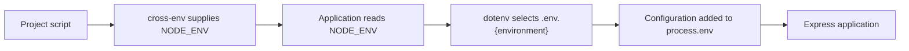
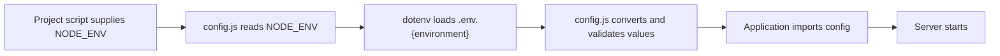

# Level 1

## Table of Contents: Environment and Configuration

- [Runtime Environments and Environment-Specific Configuration](#runtime-environments-and-environment-specific-configuration)(#loading-environment-specific-files-with-dotenv)
- [A Central Configuration Module](#a-central-configuration-module)
- [Validating Configuration and Protecting Secrets](#validating-configuration-and-protecting-secrets)

**Environment and Configuration Level 1** builds on **Node.js Environment Level 2**, where `process.env`, `.env` files, and Node's `--env-file` option were introduced, and **Express Fundamentals Level 1**, where environment variables were used for configurable server startup. This level extends those foundations by introducing environment-specific configuration, centralized configuration access, and startup validation.

## Runtime Environments and Environment-Specific Configuration

Applications commonly run in different environments such as `development`, `test`, `staging`, and `production`. This project uses `NODE_ENV` to identify the current environment and keeps a separate configuration file for each one.

```text
project/
├── app/
│   └── app.js
├── .env.development
├── .env.test
├── .env.staging
├── .env.production
├── .env.example
├── .gitignore
└── package.json
```

Each environment file contains the configuration required for that environment. `NODE_ENV` is not stored in these files because its value is needed first to determine which file dotenv should load.

```env
# .env.development
PORT=3000
BASE_URL=http://localhost:3000

# .env.test
PORT=4000
BASE_URL=http://localhost:4000

# .env.staging
PORT=3000
BASE_URL=https://staging.example.com

# .env.production
PORT=3000
BASE_URL=https://example.com
```

Node's `--env-file` option can load an environment file directly, which makes the startup command responsible for choosing the file. This project instead uses dotenv so the application can select the file from `NODE_ENV`. Refer to the [dotenv documentation](https://github.com/motdotla/dotenv) for the current package instructions and documentation.

```js
import dotenv from "dotenv";
import express from "express";

const environment = process.env.NODE_ENV || "development";

dotenv.config({
  path: `.env.${environment}`,
});

const app = express();

const port = Number(process.env.PORT);
const baseUrl = process.env.BASE_URL;

app.listen(port, () => {
  console.log(`Server is running on port ${port}`);
  console.log(`Environment: ${environment}`);
  console.log(`Base URL: ${baseUrl}`);
});
```

For this design, `NODE_ENV` must be supplied before `app/app.js` starts. Direct assignments such as `NODE_ENV=development node app/app.js` use shell syntax that differs across operating systems, so `cross-env` provides a portable way for project scripts to supply the environment. Refer to the [cross-env documentation](https://github.com/kentcdodds/cross-env) for the current package instructions and supported behavior.

```json
{
  "scripts": {
    "dev": "cross-env NODE_ENV=development node --watch app/app.js",
    "test": "cross-env NODE_ENV=test node app/app.js",
    "staging": "cross-env NODE_ENV=staging node app/app.js",
    "start": "cross-env NODE_ENV=production node app/app.js"
  }
}
```

When a project script runs, `cross-env` supplies the appropriate `NODE_ENV` value before the application starts. The application uses that value to construct the matching filename, and dotenv loads the file before `PORT` and `BASE_URL` are read. The same application code therefore works across all four environments without repeating file-selection logic in each script.



!!! note "Could --env-file Be Used Instead?"

    Yes. A script such as `"dev": "node --watch --env-file=.env.development app/app.js"` can select and load the file directly. That is a different design because the project script chooses the configuration file instead of the application. This project keeps file selection in the application by supplying only `NODE_ENV` and letting dotenv load the matching file.

!!! note "Express Also Uses NODE_ENV"

    Express also checks `NODE_ENV` when determining some framework behavior. In production, `NODE_ENV=production` enables production oriented defaults, including reduced error details from the default error handler.

Environment selection and file loading are now consistent, but application modules would still need to read values from `process.env` directly. The next section moves that responsibility into one configuration module.

## A Central Configuration Module

As an application grows, reading `process.env` throughout different modules can lead to repeated conversions, defaults, and configuration logic. A central configuration module creates one boundary for loading and organizing configuration and exports ordinary application values for the rest of the project.

Add `config.js` beside the main application file.

```text
project/
├── app/
│   ├── app.js
│   └── config.js
├── .env.development
├── .env.test
├── .env.staging
├── .env.production
├── .env.example
├── .gitignore
└── package.json
```

Move the dotenv initialization and environment-variable access into `config.js`.

```js
import dotenv from "dotenv";

const environment = process.env.NODE_ENV || "development";

dotenv.config({
  path: `.env.${environment}`,
});

const config = {
  environment,
  port: Number(process.env.PORT) || 3000,
  baseUrl: process.env.BASE_URL,
};

export default config;
```

The module determines the current environment, loads its matching file, converts `PORT` from a string to a number, applies the port fallback, and exports the resulting values through one `config` object. The rest of the application can now use those properties without knowing how the values were loaded or represented in `process.env`.

```js
import express from "express";
import config from "./config.js";

const app = express();

app.listen(config.port, () => {
  console.log(`Server is running on port ${config.port}`);
  console.log(`Environment: ${config.environment}`);
  console.log(`Base URL: ${config.baseUrl}`);
});
```

!!! tip "Read process.env in One Place"

    Keep direct `process.env` access inside the configuration module. Other application modules should use the exported configuration object so loading, conversion, and defaults remain consistent.

Centralizing configuration removes repeated environment access from the rest of the application, but it does not guarantee that required values are present or valid. The next section adds validation at the same configuration boundary so problems are detected before the server starts.

## Validating Configuration and Protecting Secrets

Configuration should be validated as it is loaded so the application does not start with missing or unusable values. Some settings can have safe defaults, while others must be supplied explicitly. In this project, `PORT` can fall back to `3000`, while `BASE_URL` is required.



The configuration module can perform loading, conversion, defaults, and validation together.

```js
import dotenv from "dotenv";

const environment = process.env.NODE_ENV || "development";

dotenv.config({
  path: `.env.${environment}`,
});

function required(name) {
  const value = process.env[name];

  if (!value) {
    throw new Error(`Missing required environment variable: ${name}`);
  }

  return value;
}

const port = Number(process.env.PORT || 3000);

if (Number.isNaN(port)) {
  throw new Error("PORT must be a number");
}

const config = {
  environment,
  port,
  baseUrl: required("BASE_URL"),
};

export default config;
```

Because this code runs when `config.js` is loaded, a missing `BASE_URL` or invalid `PORT` stops startup immediately with a clear message instead of allowing the server to begin accepting requests with invalid configuration.

!!! danger "Validate Early and Protect Secrets"

    Validate required configuration before the server starts. This is especially important for secrets such as database passwords, API keys, signing secrets, and service credentials. Required secrets should be supplied through the runtime environment and validated like other required values rather than receiving hardcoded fallback credentials.

    ```js
    // Avoid this
    const password = process.env.DB_PASSWORD || "default-password";
    ```

    A fallback such as `"default-password"` can allow the application to start with an unintended credential and places a credential directly in source code. Keep real secret values outside the repository. Use `.env.example` to document variable names and nonsecret example values, and keep private environment files excluded according to the repository practices introduced in **Node.js Environment Level 2**.

At this point, the application has a consistent configuration path from runtime environment selection through loading, centralized access, conversion, and validation. **Environment and Configuration Level 2** can build on this foundation with more advanced configuration patterns and production-oriented concerns without requiring application modules to manage environment variables directly.
