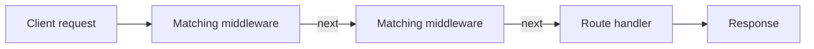

# Level 1

## Table of Contents: Middleware

- [How Middleware Works](#how-middleware-works)
- [Application-Level Middleware](#application-level-middleware)
- [Built-in Middleware](#built-in-middleware)

**Middleware Level 1** begins with the request processing flow and then focuses on application-level and built-in middleware. The examples build on the Express fundamentals introduced earlier in the course.

This course targets **Express 5.x**. For additional reference, see the [official Express middleware guide](https://expressjs.com/en/guide/using-middleware.html) and the [official guide to writing middleware](https://expressjs.com/en/guide/writing-middleware.html). With that context established, the first section explains how middleware moves a request through an Express application.

## How Middleware Works

Middleware participates in Express request processing between the arrival of a request and the completion of a response. This level concentrates on the regular middleware flow, where a middleware function receives `req`, `res`, and `next`. The `req` object represents the incoming request, `res` represents the response being prepared, and `next` is a function supplied by Express that passes control forward. A separate error-handling flow also exists and is introduced in **Middleware Level 2** after **Routing Level 1**.

```js
function middleware(req, res, next) {
  // Perform middleware work

  next();
}
```

Express processes matching middleware and handlers in **registration order**. A middleware function can perform its work and call `next()` to continue to the next matching function, or it can complete the request by sending a response instead of passing control forward.



The diagram represents the general flow of regular middleware rather than one specific middleware category. The following example uses application-level middleware only to demonstrate that flow. Application-level middleware is examined specifically in the next section.

```js
import express from "express";

const app = express();

app.use((req, res, next) => {
  console.log("First");
  next();
});

app.use((req, res, next) => {
  console.log("Second");
  next();
});

app.get("/", (req, res) => {
  console.log("Handler");
  res.send("Done");
});

app.listen(3000);
```

For a request to `/`, Express runs the first matching middleware, then the second, and finally the route handler. The console therefore logs `First`, then `Second`, and then `Handler`. Each call to `next()` moves processing forward through the registered chain until another function completes the request. Registration order therefore matters throughout the middleware system. For example, `express.json()` should be registered before routes that need `req.body` because those routes can only use the parsed body after that middleware has run.

Middleware does not always need to call `next()`. A middleware function can complete the request itself when processing should stop, as shown in the following example.

```js
app.use("/maintenance", (req, res) => {
  res.status(503).send("Service temporarily unavailable");
});
```

Because the middleware is mounted at `/maintenance`, matching requests are completed there without continuing to later middleware or route handlers. Other requests do not match this middleware and continue through the application.

!!! warning "Continue or Complete the Request"

    Regular middleware must eventually continue normal processing with `next()` or complete the request and response cycle. If it does neither, the client can remain waiting because no response has been sent and Express has not been told to continue.

    Express also supports other forms of `next`, including `next("route")` for skipping to the next matching route and `next(err)` for passing an error into the error-handling flow. These forms are introduced with the routing and error-handling concepts that depend on them.

With the regular request flow established, the next section focuses on middleware attached directly to the Express application.

## Application-Level Middleware

**Application-level middleware** is middleware attached directly to the Express application through methods such as `app.use()` and `app.METHOD()`. The examples in this section use `app`, so they remain application-level middleware even when they are limited to a path or a specific route.

A middleware function can be written separately and then registered with `app.use()`. Because no path is supplied in the following example, `requestLogger` can run for requests that reach this point in the application.

```js
function requestLogger(req, res, next) {
  console.log(`${req.method} ${req.path}`);
  next();
}

app.use(requestLogger);
```

Middleware can also prepare information that later code needs because the same `req` object continues through the request processing chain. In the following example, `addRequestTime` adds information to `req` and calls `next()`, allowing the route handler to read that information when it creates the response.

```js
function addRequestTime(req, res, next) {
  req.requestTime = new Date();
  next();
}

app.use(addRequestTime);

app.get("/request-time", (req, res) => {
  res.send(`Request received at ${req.requestTime.toISOString()}`);
});
```

Application-level middleware can be limited to part of the application by supplying a path to `app.use()`. The following middleware can run for `/admin` and paths beneath it such as `/admin/users`. Since `app.use()` is not limited to one HTTP method, matching requests can reach it whether they use `GET`, `POST`, or another method.

```js
app.use("/admin", (req, res, next) => {
  console.log("Admin request");
  next();
});
```

This is still application-level middleware because it is attached to `app`; the path only limits where the middleware can run. Application-level middleware can also be registered for a specific route through methods such as `app.get()`. In the following example, `logUserRequest` runs before the final route callback only when `GET /users` matches.

```js
function logUserRequest(req, res, next) {
  console.log("Users route requested");
  next();
}

app.get("/users", logUserRequest, (req, res) => {
  res.json([]);
});
```

This is route-specific application-level middleware because it is registered through `app`. Middleware registered through an `express.Router()` instance is router-level middleware, which is introduced after routers have been covered in **Routing Level 1**.

!!! tip "Keep Middleware Focused"

    Middleware is easier to understand and reuse when each function has one clear responsibility. Logging, preparing request data, and other concerns are usually clearer as separate middleware functions.

Application-level middleware demonstrates how custom middleware is attached directly to the application. The next section introduces middleware supplied by Express for common request processing tasks.

## Built-in Middleware

Express includes **built-in middleware** for common request processing tasks. One example is `express.json()`, which parses incoming JSON request bodies so their data is available through `req.body`. Like custom middleware, it must run before code that depends on the work it performs.

The other built-in middleware and their individual behavior and configuration are not required for this level. The [built-in middleware section of the official Express documentation](https://expressjs.com/en/guide/using-middleware.html#middleware.built-in) provides the complete list and configuration options when they are needed.

This completes **Middleware Level 1**. The next topic is **Routing Level 1**, which introduces `express.Router()` and the organization of related routes. That routing foundation prepares for the router-level middleware introduced in **Middleware Level 2**.
