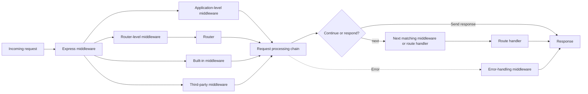

# Overview

**Middleware** provides a way to process requests as they move through an Express application. A middleware function can inspect the incoming request, prepare information for later processing, modify `req` or `res`, pass control forward, or complete the request by sending a response. Express supports several middleware categories that apply this processing at different levels of an application. The following diagram shows the main middleware categories and how they relate to the Express request processing flow.

The solid paths show the regular request processing flow. Router-level middleware operates within an `express.Router()` instance before control continues through the rest of the processing chain. Errors can originate from any middleware during request processing; the dotted **Error** path represents control being passed to error-handling middleware when an error occurs.

The **Middleware** module develops the Express middleware model across two levels. **Level 1** establishes the regular middleware flow by explaining how middleware functions use `req`, `res`, and `next`, how matching middleware and route handlers run in registration order, and how middleware either passes control forward or completes a request. It then focuses on **application-level middleware**, including application-wide, path-limited, and route-specific middleware, and introduces **built-in middleware**.

**Level 2** expands this foundation with **router-level middleware**, **third-party middleware**, and **error-handling middleware**. Router-level middleware builds on the router organization introduced in the routing topic, while error-handling middleware connects to the more detailed behavior covered in the **Error Handling** module. Third-party middleware is introduced and developed within **Middleware Level 2**. Together, the two levels establish how Express processes requests through an ordered chain of middleware and route handlers.

Continue to **Middleware Level 1** to begin with **How Middleware Works**.
