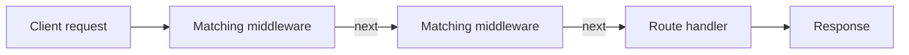

# Summary

This summary brings together the most important concepts from the **Middleware** module. It is designed as a quick reference for reviewing what should be understood from Level 1, including the regular middleware flow, application-level middleware, registration order, request processing, and built-in middleware.

## Table of Contents: Middleware

- [Level 1](#level-1)

## Level 1

Level 1 establishes the foundations of **middleware, request processing, `req`, `res`, `next`, registration order, application-level middleware, and built-in middleware**. The main idea to understand is that middleware participates in request processing between the arrival of a request and the completion of a response. A regular middleware function receives `req`, `res`, and `next`. The `req` object represents the incoming request, `res` represents the response being prepared, and `next` allows processing to continue to the next matching middleware or handler.

A basic middleware function has the following structure.

```js
function middleware(req, res, next) {
  // Perform middleware work

  next();
}
```

Express processes matching middleware and handlers in **registration order**. When middleware calls `next()`, Express continues to the next matching function in the registered chain. Middleware can instead complete the request by sending a response, in which case processing does not continue to later middleware or route handlers.



The important distinction is that **regular middleware must either continue request processing or complete the request and response cycle**. If middleware does neither, the client can remain waiting because no response has been sent and Express has not been told to continue. Express also supports other forms of `next`, including `next("route")` and `next(err)`, which connect to routing and error-handling behavior covered after the regular middleware foundation.

Registration order matters because middleware can prepare information or perform work that later middleware and route handlers depend on. For example, `express.json()` must run before routes that need the parsed request body through `req.body`.

**Application-level middleware** is middleware attached directly to the Express application through methods such as `app.use()` and `app.METHOD()`. When no path is supplied to `app.use()`, the middleware can run for requests that reach that point in the application.

```js
function requestLogger(req, res, next) {
  console.log(`${req.method} ${req.path}`);
  next();
}

app.use(requestLogger);
```

Application-level middleware can prepare information for later processing because the same `req` object continues through the request processing chain. A middleware function can add information to `req`, call `next()`, and allow a later route handler to use that information.

```js
function addRequestTime(req, res, next) {
  req.requestTime = new Date();
  next();
}

app.use(addRequestTime);

app.get("/request-time", (req, res) => {
  res.send(`Request received at ${req.requestTime.toISOString()}`);
});
```

Application-level middleware can also be limited to part of the application by supplying a path to `app.use()`. A path such as `/admin` allows the middleware to run for matching requests to `/admin` and paths beneath it, such as `/admin/users`. Because `app.use()` is not limited to one HTTP method, matching requests can reach the middleware regardless of whether they use `GET`, `POST`, or another method.

```js
app.use("/admin", (req, res, next) => {
  console.log("Admin request");
  next();
});
```

Middleware can complete matching requests instead of calling `next()`. Path scoping with `app.use()` can be used when that behavior applies to a particular part of the application.

```js
app.use("/maintenance", (req, res) => {
  res.status(503).send("Service temporarily unavailable");
});
```

Application-level middleware can also be registered for a specific route through methods such as `app.get()`. In this form, middleware runs before the final route callback when the route matches.

```js
function logUserRequest(req, res, next) {
  console.log("Users route requested");
  next();
}

app.get("/users", logUserRequest, (req, res) => {
  res.json([]);
});
```

Middleware attached through `app` remains **application-level middleware** whether it is application-wide, limited by a path, or registered for a specific route. Middleware attached to an `express.Router()` instance is **router-level middleware**, which builds on the router concepts introduced in Routing Level 1.

Express also provides **built-in middleware** for common request processing tasks. `express.json()` is one example. It parses incoming JSON request bodies so their data becomes available through `req.body`. Like custom middleware, built-in middleware must run before code that depends on the work it performs.

After reviewing Level 1, the main concepts to know are **how regular middleware participates in request processing**, **the roles of `req`, `res`, and `next`**, **how `next()` passes control forward**, **how middleware can complete a request instead of continuing**, **why registration order matters**, **how application-level middleware is attached through `app`**, **how `app.use()` can apply middleware broadly or limit it by path**, **how middleware can prepare request data for later handlers**, **how route-specific application-level middleware works**, **the distinction between application-level and router-level middleware**, and **the role of built-in middleware such as `express.json()`**.
