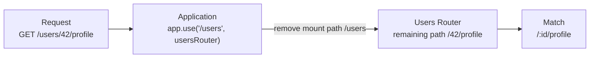

# Level 1

## Table of Contents: Router

- [Why Routers Exist](#why-routers-exist)
- [Creating, Mounting, and Router Paths](#creating-mounting-and-router-paths)
- [Route Ordering](#route-ordering)

**Router Level 1** builds on **Fundamentals Level 1**, where Express application routing, handlers, request and response objects, and route parameters were already introduced. This level focuses on what `express.Router()` adds to that foundation. Related routes can be separated into modules, mounted under a shared path, and ordered so that overlapping route patterns are matched intentionally.

## Why Routers Exist

In **Fundamentals Level 1**, routes were registered directly on the Express application. That works well for a small application, but a growing `app.js` can quickly contain routes for many unrelated parts of the application. Express routers provide a way to separate those groups while keeping them connected to the same application.

For example, user routes can live in `routes/users.js`, while `app.js` remains responsible for creating the application, mounting routers, and starting the server. A router does not create another server. It groups routing behavior for one area of the application so that the whole group can be mounted together.

```text
users_management/
├── app/
│   ├── routes/
│   │   └── users.js
│   └── app.js
├── package.json
└── node_modules/
```

The `routes` directory is used here because this level focuses on Express routing. It is one straightforward organization for a small application, not a required project structure. **API Design** later covers how API styles and resource design influence endpoint organization and naming, while **Software Architecture** covers broader ways to organize application responsibilities into modules, layers, features, or other boundaries.

For now, `routes/users.js` owns the user related routing structure, while `app.js` decides where that router belongs in the application. Express connects the two by creating a router object and mounting it at an application path.

## Creating, Mounting, and Router Paths

Create a router with `express.Router()`. The router is defined in its own module and exported so that the main application can mount the group of related routes.

```js
// app/routes/users.js
import express from "express";

const router = express.Router();

router.get("/", (req, res) => {
  res.json([{ id: 1, name: "Mantas" }]);
});

router.post("/", (req, res) => {
  res.status(201).send("Create user");
});

router.get("/:id", (req, res) => {
  res.send(`User ${req.params.id}`);
});

router.patch("/:id", (req, res) => {
  res.send(`Update user ${req.params.id}`);
});

router.get("/:id/profile", (req, res) => {
  res.send(`Profile for user ${req.params.id}`);
});

export default router;
```

The application imports the router and mounts it with `app.use()`.

```js
// app/app.js
import express from "express";
import usersRouter from "./routes/users.js";

const app = express();

app.use("/users", usersRouter);

app.listen(3000, () => {
  console.log("Server is running on http://localhost:3000");
});
```

In `app.use("/users", usersRouter)`, `/users` is the router's **mount path**. Paths defined inside the router are relative to that mount path. Therefore, `/` corresponds to `/users`, `/:id` corresponds to `/users/:id`, and `/:id/profile` corresponds to `/users/:id/profile`. Route parameters and `req.params` were already introduced in **Fundamentals Level 1**. The Router specific idea is that the application owns the shared `/users` prefix while the router owns the paths beneath it.



When the application matches `/users`, control passes to `usersRouter`, where route matching continues against the remaining relative path. In this example, `/42/profile` matches `/:id/profile`.

!!! tip "Keep Router Paths Relative"

    Keep the shared prefix at the mount point instead of repeating it inside every router route. A router mounted at `/users` should define paths such as `/`, `/:id`, and `/:id/profile`, not `/users`, `/users/:id`, and `/users/:id/profile`.

Because fixed and parameter paths can exist inside the same router, some route patterns can overlap. Their registration order determines which matching route is reached first.

## Route Ordering

Express checks routes in the order they are registered. A parameter route such as `/:id` can match an identifier such as `42`, but it can also match a fixed word such as `new` or `search`. Fixed paths that could be captured this way should therefore be registered before the broader parameter path.

The routes below remain relative to the `/users` mount path. The comments show the complete endpoints produced after mounting.

```js
router.get("/", getUsers); // GET /users
router.post("/", createUser); // POST /users

router.get("/new", showNewUserForm); // GET /users/new
router.get("/search", searchUsers); // GET /users/search

router.get("/:id", getUser); // GET /users/:id
router.patch("/:id", updateUser); // PATCH /users/:id
router.delete("/:id", deleteUser); // DELETE /users/:id

router.get("/:id/profile", getUserProfile); // GET /users/:id/profile
router.get("/:id/posts", getUserPosts); // GET /users/:id/posts
```

With this order, `/users/new` and `/users/search` reach their fixed routes instead of being interpreted as `id` values. Requests such as `/users/42` reach `/:id`, while `/users/42/profile` and `/users/42/posts` match their longer relative paths. The same path can also be registered for different HTTP methods, as shown by `GET`, `PATCH`, and `DELETE` on `/:id`.

!!! warning "Order Overlapping Routes Carefully"

    When a fixed path and a parameter path can match the same request segment, register the fixed path first.

At this **Router Level 1**, the core pattern is to create a router for one related area, keep its paths relative to a shared mount path, export it, and mount it in the application while ordering overlapping routes intentionally. This structure also provides places where middleware can participate in request handling. **Middleware Level 2** builds on that connection by introducing how middleware is applied at different parts of an Express application.
