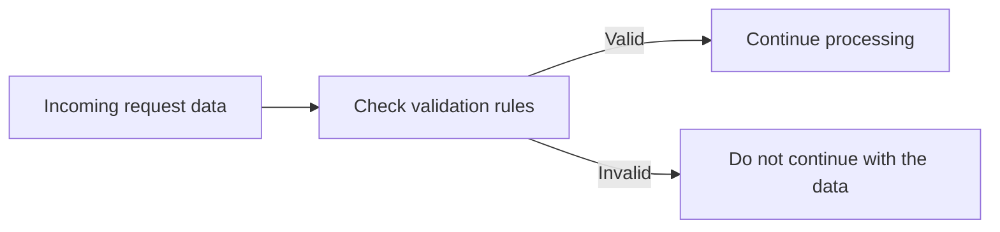
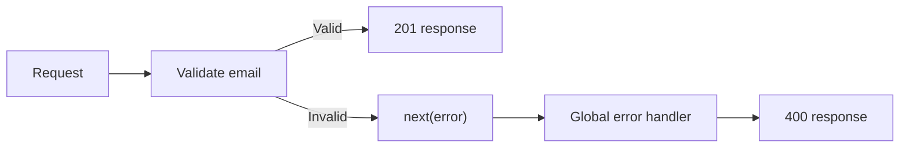

# Level 1

## Table of Contents: Validation and Error Handling

- [Understanding Validation](#understanding-validation)
- [Validating Request Data](#validating-request-data)

**Validation and Error Handling Level 1** introduces request validation and the basic path from invalid request data to an HTTP error response. It focuses on validating an `email` value, creating a validation error, passing it into the existing Express error handling flow, and returning a clear response to the client.

!!! info "Prerequisites"

    Before starting, you should be familiar with creating an Express application, defining routes, working with `req` and `res`, using middleware, and reading JSON request bodies with `express.json()`. Error handling middleware was introduced in **Middleware Level 2**. This module uses **Express 5**.

Validation starts with understanding what makes incoming request data acceptable or invalid. The first section establishes this foundation before applying validation to an Express route.

## Understanding Validation

An Express application receives data from clients through request bodies, route parameters, and query strings. The application should check this data before relying on it because required values can be missing or have an unexpected type. **Validation** is the process of checking whether incoming data satisfies the requirements of the operation being performed.

For example, a route that creates a user may require an `email`. A request containing `{"email": "vardenis@example.com"}` provides a string value, while `{}` does not provide the required value and `{"email": 42}` provides a value of the wrong type.



The validation check creates a decision point before the application uses the submitted data. Valid data can continue to the operation, while invalid data must leave the normal processing path.

!!! note "Validation Rules Come from Application Requirements"

    Validation rules depend on what an operation expects. A value can be required in one route and optional in another, so the application should validate according to the requirements of that operation.

When request data does not satisfy a validation rule, the application can create an error instead of continuing with invalid data. The next step is to apply this process to request data in an Express route.

## Validating Request Data

After `express.json()` parses a JSON request body, its values are available through `req.body`. The existing `POST /users` route can validate `email` before continuing.

```js
app.post("/users", (req, res, next) => {
    const { email } = req.body;

    if (typeof email !== "string" || email.trim() === "") {
        const error = new Error("Email is required");
        error.status = 400;

        return next(error);
    }

    return res.status(201).json({
        email,
    });
});
```

The route reads `email` from `req.body` and checks that it is a string containing at least one nonwhitespace character. The type check appears first so `trim()` is called only when `email` is a string. The call to `trim()` is used for the validation check and does not change the value stored in `email`.

When validation fails, the route creates an `Error` with the message `"Email is required"` and assigns the HTTP status `400`, which represents **Bad Request**. Calling `next(error)` passes the error into the Express error handling flow instead of continuing through the normal route path. As covered in **Middleware Level 2**, the global error handler is registered after the application's routes and other normal middleware so errors passed from those earlier parts of the application can reach it.

```js
app.use((err, req, res, _) => {
    return res.status(err.status || 500).json({
        error: err.message,
    });
});
```

Express recognizes error handling middleware by its four parameters. This final handler does not pass the error anywhere else because it finishes the request by sending a response. The fourth parameter is still required for the error handling middleware signature, so `_` is used to show that the parameter is intentionally unused.

For example, sending `{"email": ""}` causes the validation check to fail. The route creates the error and passes it with `next(error)`. The global error handler receives it and returns HTTP `400` **Bad Request** with `{"error": "Email is required"}`. The `500` value is a fallback for errors that do not provide their own status.



!!! tip "Validate Before Using the Data"

    Perform validation before saving request data or passing it to other application logic. Invalid data should enter the error handling flow before the route performs its main operation.

**Validation and Error Handling Level 1** establishes the basic validation path from incoming request data to a client-facing error response. With this foundation in place, **Validation and Error Handling Level 2** introduces libraries that simplify the creation and handling of HTTP errors in Express applications.
