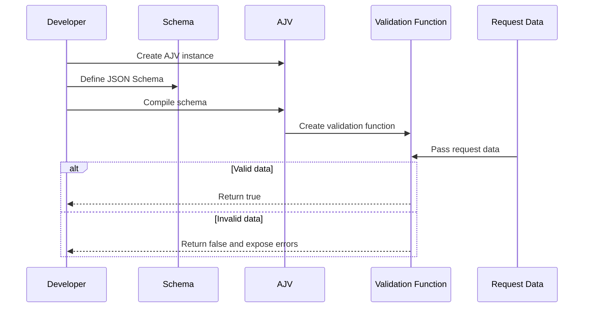
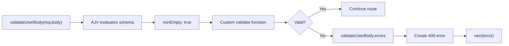

# Level 2

## Table of Contents: Validation and Error Handling

- [Introducing AJV](#introducing-ajv)
- [Schema-Based Request Validation](#schema-based-request-validation)
- [Creating Custom AJV Validators](#creating-custom-ajv-validators)
- [Customizing AJV Validation Errors](#customizing-ajv-validation-errors)

**Validation and Error Handling Level 2** builds on manual request validation by introducing **AJV**, a JSON Schema validator for JavaScript. It develops schema-based validation for request bodies, route parameters, and query parameters, extends AJV with a reusable custom validator, and then customizes validation messages with `ajv-errors`. Together, these techniques move validation rules out of individual conditional checks and into reusable schemas.

The first step is to understand how AJV performs schema-based validation, why it is used in this module, and how it fits into the existing Express validation flow.

## Introducing AJV

AJV validates JavaScript data against a schema. A schema describes the structure and requirements that data must satisfy, while AJV compiles that schema into a reusable validation function. Incoming data is then passed to the compiled function, which reports whether the data satisfies the schema and provides validation errors when it does not.



The diagram separates AJV's two main stages. During setup, the application creates an AJV instance, defines a schema, and compiles that schema into a validation function. During request processing, incoming data is passed directly to the compiled function. The schema therefore does not need to be recreated or compiled for every request.

AJV is one of several validation libraries available in the JavaScript ecosystem. [express-validator](https://express-validator.github.io/docs/) provides validation and sanitization middleware for Express, [Joi](https://joi.dev/api/) defines schemas through its own JavaScript API, and [Zod](https://zod.dev/) provides schema validation with a TypeScript-oriented API and static type inference. AJV is used in this module because it validates data with JSON Schema, keeps schemas independent of Express routes, and compiles schemas into reusable validation functions. The [AJV Why use AJV](https://ajv.js.org/guide/why-ajv.html) documentation provides more information about its standards support and compiled validation model.

Before using AJV, add it to the project using the installation method appropriate for the project's package manager. The [AJV Getting Started](https://ajv.js.org/guide/getting-started.html) documentation provides the current installation instructions and introductory examples. AJV can then be initialized in a dedicated file so the configured instance has one shared location and can be imported wherever schemas need to be compiled.

```text
src/
├── config/
│   └── ajv.js
├── routes/
└── schemas/
```

The `config/ajv.js` file creates and exports the AJV instance.

```js
import Ajv from "ajv";

const ajv = new Ajv();

export default ajv;
```

Keeping AJV initialization in one file provides a shared location for configuration and later extensions while allowing schema modules to reuse the same instance. The AJV instance is now ready to compile application schemas, so the next section applies this process to request validation.

## Schema-Based Request Validation

A JSON Schema describes the requirements that data must satisfy. Because `req.body`, `req.params`, and `req.query` all follow the same AJV validation process, their schemas can be kept together in the `schemas` folder so validation rules remain separate from routes and AJV configuration.

```text
src/
├── config/
│   └── ajv.js
├── routes/
└── schemas/
    └── user.js
```

JSON Schema provides standard keywords for describing valid data, including `type`, `properties`, `required`, `pattern`, and `additionalProperties`. The [AJV JSON Schema Reference](https://ajv.js.org/json-schema.html) explains these keywords and provides a useful reference when defining schemas. In this project, `user.js` uses them to define the request body, route parameter, and query parameter schemas required by the user routes, then compiles each schema with the shared AJV instance and exports the resulting validation functions.

```js
import ajv from "../config/ajv.js";

const userBodySchema = {
    type: "object",
    properties: {
        email: {
            type: "string",
            minLength: 1,
        },
    },
    required: ["email"],
    additionalProperties: false,
};

const userParamsSchema = {
    type: "object",
    properties: {
        id: {
            type: "string",
            pattern: "^[0-9]+$",
        },
    },
    required: ["id"],
    additionalProperties: false,
};

const usersQuerySchema = {
    type: "object",
    properties: {
        limit: {
            type: "string",
            pattern: "^[0-9]+$",
        },
    },
    additionalProperties: false,
};

export const validateUserBody = ajv.compile(userBodySchema);
export const validateUserParams = ajv.compile(userParamsSchema);
export const validateUsersQuery = ajv.compile(usersQuerySchema);
```

The three schemas apply the same JSON Schema structure to different request sources. `userBodySchema` requires an `email` string containing at least one character, `userParamsSchema` requires an `id` containing digits, and `usersQuerySchema` allows an optional `limit` that must contain digits when provided. Compiling them with `ajv.compile()` produces reusable validation functions that can be imported by the routes instead of recreating or compiling validation rules for every request.

!!! note "Compile Schemas Once"

    Define and compile schemas outside request handlers so the same validation functions can be reused for incoming requests.

The routes import the compiled functions and apply each one to its corresponding request data.

```js
import {
    validateUserBody,
    validateUserParams,
    validateUsersQuery,
} from "../schemas/user.js";

app.post("/users", (req, res, next) => {
    if (!validateUserBody(req.body)) {
        const error = new Error("Invalid user data");
        error.status = 400;
        error.details = validateUserBody.errors;

        return next(error);
    }

    return res.status(201).json(req.body);
});

app.get("/users/:id", (req, res, next) => {
    if (!validateUserParams(req.params)) {
        const error = new Error("Invalid user ID");
        error.status = 400;
        error.details = validateUserParams.errors;

        return next(error);
    }

    return res.status(200).json({
        id: req.params.id,
    });
});

app.get("/users", (req, res, next) => {
    if (!validateUsersQuery(req.query)) {
        const error = new Error("Invalid query parameters");
        error.status = 400;
        error.details = validateUsersQuery.errors;

        return next(error);
    }

    return res.status(200).json({
        limit: req.query.limit,
    });
});
```

The same pattern is used in all three routes. Each request object is passed to its compiled validation function, valid data continues through the route, and invalid data creates a `400` error containing the AJV validation details. For example, `{"email": "vardenis@example.com"}`, `GET /users/42`, and `GET /users?limit=10` satisfy their corresponding schemas, while values that violate those rules fail validation. The schemas therefore define the rules while the routes only apply them. When the built-in JSON Schema keywords are not enough to express an application-specific rule, AJV can extend this validation model with custom validators.

## Creating Custom AJV Validators

JSON Schema provides many built-in validation keywords, but an application can define a custom rule when its requirements are not expressed by the built-in keywords used by the project. AJV supports reusable custom keywords through `ajv.addKeyword()`. The [AJV User-Defined Keywords](https://ajv.js.org/guide/user-keywords.html) documentation provides a broader reference for extending AJV. In this example, the shared AJV instance registers a `nonEmpty` keyword before schemas using it are compiled.

```js
import Ajv from "ajv";

const ajv = new Ajv();

ajv.addKeyword({
    keyword: "nonEmpty",
    schemaType: "boolean",
    validate: function (schema, data) {
        if (schema) {
            return typeof data === "string" && data.trim().length > 0;
        }

        return true;
    },
});

export default ajv;
```

The `keyword` property defines the name available to schemas, while `schemaType: "boolean"` means the keyword accepts a Boolean value such as `true`. When AJV encounters `nonEmpty: true`, it passes that schema value and the submitted field value to `validate`. Returning `true` means the value satisfies the rule, while returning `false` causes validation to fail.

Once the keyword is registered, `schemas/user.js` can use it alongside built-in JSON Schema keywords. The schema is compiled normally, so the resulting `validateUserBody` function includes the custom rule automatically.

```js
import ajv from "../config/ajv.js";

const userBodySchema = {
    type: "object",
    properties: {
        email: {
            type: "string",
            nonEmpty: true,
        },
    },
    required: ["email"],
    additionalProperties: false,
};

export const validateUserBody = ajv.compile(userBodySchema);
```

The route does not call the custom `validate` function directly. It continues to call `validateUserBody(req.body)`. A value such as `{"email": "vardenis@example.com"}` passes, while `{"email": "   "}` causes the `nonEmpty` validator to return `false`. AJV then places information about the failed rule in `validateUserBody.errors`, and the route follows the same `400` error path already established for schema validation.



!!! note "Custom Keywords Extend AJV"

    Register reusable custom keywords on the shared AJV instance before compiling schemas that use them. Routes continue to call the compiled schema validator rather than the custom keyword function directly.

The custom validator now determines whether the submitted value satisfies the application-specific rule, but AJV still provides a generated validation message when the rule fails. The next section customizes these messages with `ajv-errors`.

## Customizing AJV Validation Errors

When a compiled AJV validation function returns `false`, its `errors` property describes the failed rules. AJV provides generated messages by default, while the `ajv-errors` package allows schemas to define clearer application-specific messages. The [ajv-errors documentation](https://ajv.js.org/packages/ajv-errors.html) provides installation instructions and the supported message customization patterns. After the package has been added, enable it on the same shared AJV instance that contains the `nonEmpty` custom keyword.

```js
import Ajv from "ajv";
import ajvErrors from "ajv-errors";

const ajv = new Ajv({
    allErrors: true,
});

ajv.addKeyword({
    keyword: "nonEmpty",
    schemaType: "boolean",
    validate: function (schema, data) {
        if (schema) {
            return typeof data === "string" && data.trim().length > 0;
        }

        return true;
    },
});

ajvErrors(ajv);

export default ajv;
```

The `allErrors: true` option is required by `ajv-errors`. The body schema can now keep the custom `nonEmpty` rule and add `errorMessage` entries for the validation failures that should be presented more clearly.

```js
import ajv from "../config/ajv.js";

const userBodySchema = {
    type: "object",
    properties: {
        email: {
            type: "string",
            nonEmpty: true,
            errorMessage: {
                type: "Email must be a string",
                nonEmpty: "Email must not be empty",
            },
        },
    },
    required: ["email"],
    additionalProperties: false,
    errorMessage: {
        required: {
            email: "Email is required",
        },
        additionalProperties: "Unexpected property",
    },
};

export const validateUserBody = ajv.compile(userBodySchema);
```

The responsibilities are now separate. `nonEmpty` determines whether the value satisfies the custom rule, while `errorMessage` determines how a failure is described. A missing `email` produces `"Email is required"`, an empty or whitespace-only value produces `"Email must not be empty"`, and an unexpected property produces `"Unexpected property"`.

The route still uses the same compiled validator. The only change is that it can now use the first customized AJV message when creating the error passed to Express.

```js
import express from "express";
import { validateUserBody } from "../schemas/user.js";

const router = express.Router();

router.post("/users", (req, res, next) => {
    if (!validateUserBody(req.body)) {
        const error = new Error(validateUserBody.errors[0].message);
        error.status = 400;
        error.details = validateUserBody.errors;

        return next(error);
    }

    return res.status(201).json(req.body);
});

export default router;
```

For invalid data, AJV applies the built-in and custom schema rules, stores the resulting details in `validateUserBody.errors`, and the route transfers the customized message into the `Error` object before calling `next(error)`. This preserves the existing Express error flow without duplicating validation logic in the route.

!!! tip "Keep Rules and Messages Together"

    When custom validation messages are part of the application's validation requirements, defining them with the schema keeps the rules and their corresponding messages in the same place.

**Validation and Error Handling Level 2** establishes reusable schema-based validation, custom validation rules, and customized validation messages while preserving the existing Express error flow. With validation organized around reusable schemas, **Validation and Error Handling Level 3** develops centralized error handling so validation, application, and database errors can be processed consistently in one place.
