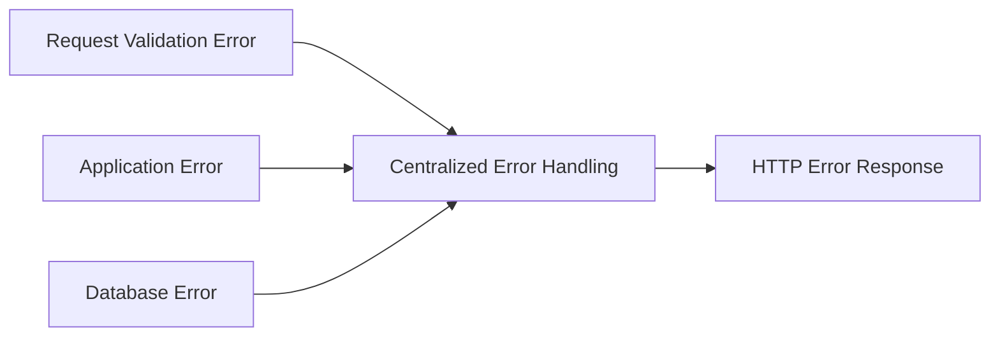

# Overview

Validation and error handling help an Express application determine whether incoming data is acceptable, respond when an operation fails, and communicate failures to clients through appropriate HTTP responses. Validation checks request data before the application relies on it, while error handling provides a consistent path for failures that occur during request processing.

Errors in an Express application can originate at different stages of request processing. **Request validation errors** occur when incoming data does not satisfy the requirements of an operation. **Application errors** occur while the application executes its own logic. **Database errors** originate from database operations, such as when the database rejects an operation because a constraint is violated. Although these errors originate from different parts of the application, they can be directed into a centralized error handling flow, where they are translated into appropriate HTTP error responses for the client.

The following diagram shows three common sources of errors and how they can converge on a centralized error handling flow.

The **Validation and Error Handling** module progresses from basic request validation and error propagation to structured HTTP errors and centralized error handling. Each level builds on the same error handling flow while introducing techniques that make validation and error responses easier to manage as an Express application grows.

**Level 1** introduces request validation and the basic path from invalid request data to an HTTP error response. It covers checking incoming request values, creating an `Error` when validation fails, assigning an HTTP status, passing the error with `next(error)`, and allowing the global error handler to return the response to the client.

**Level 2** builds on the basic error handling flow by introducing libraries that simplify creating and handling HTTP errors in Express applications.

**Level 3** develops centralized error handling so errors from different parts of the application can be handled consistently in one place. It focuses on organizing the error handling flow and producing consistent HTTP error responses across the application.

Together, these concepts help Express applications reject invalid request data, handle failures from different parts of the application, and return consistent HTTP error responses to clients.
