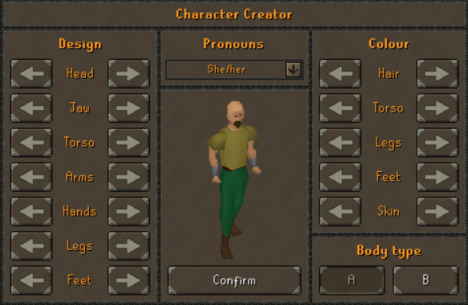
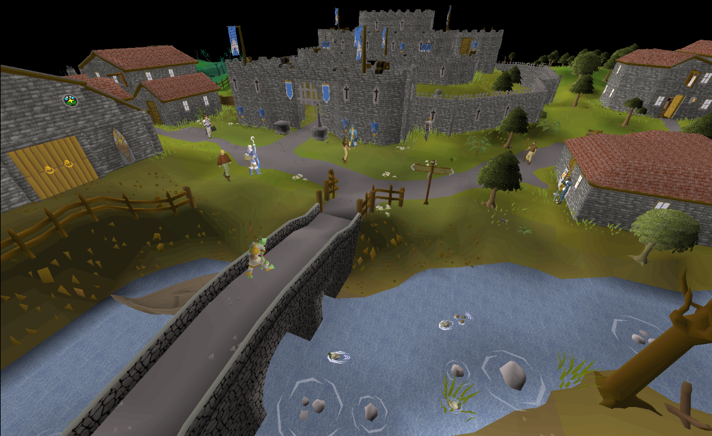
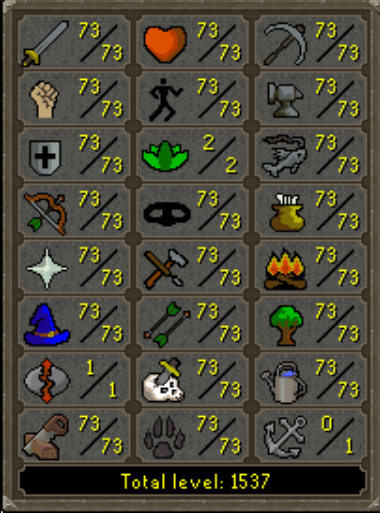
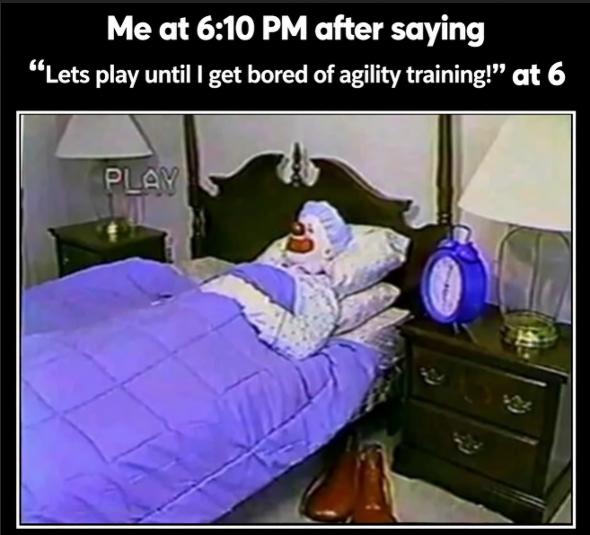
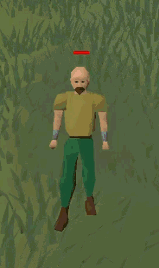
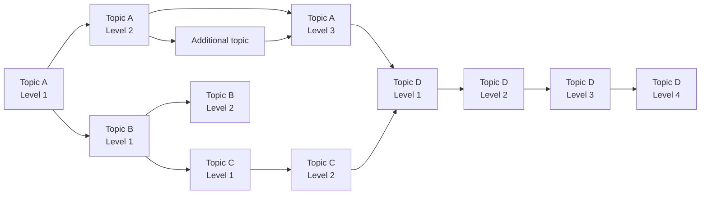

# Idea

Before explaining the idea behind this learning material, I want to start with a short backstory about “Old School RuneScape” – a game where you explore the world, complete different tasks, and gradually improve your character’s skills. When you first log in, you begin your journey on Tutorial Island, where you do not yet really know what awaits you or what you will be able to do. The game gradually introduces you to the basics. You learn how to control your character, interact with other characters, and perform your first actions. You catch your first fish and cook it, cut down a tree, light a fire, mine your first ore, try smithing, and finally learn the basics of combat. At each step, you are shown only what you need at that moment, and then it is your turn to try it yourself.

After finishing Tutorial Island, you arrive in Lumbridge. This is the first place where your independent journey through the game world begins. Here, you decide for yourself what to do and where to go next. Although you will later visit many other places, you will return to Lumbridge more than once, so this place will stay with you throughout the rest of your journey.

If you want to become stronger in combat, you need to train your combat skills and gain experience points. However, you soon realize that fighting alone is not enough. You need better weapons, armor, food, and other resources. You can start mining ore, smelt it, and improve your Mining and Smithing skills. If you want to prepare your own food, you need to fish and cook. Every activity gives you experience, and the experience you gain allows you to reach higher levels in a particular skill.

As you play, you increasingly encounter terms used by the game’s community. At first, words such as NPC, *mob*, *drop*, *loot*, XP, or *quest* may sound completely unfamiliar. However, you quickly begin to understand their meaning through the game itself. An NPC (*Non-Player Character*) is a character controlled by the game that you can talk to, receive quests from, or interact with in other ways. You encounter a *mob* – a creature or enemy controlled by the game. After defeating it, you may receive a *drop*, in other words, an item or another resource it leaves behind. When you pick up what you find, it becomes your *loot*. By performing different activities, you gain XP, or experience points, while completing *quests* involves carrying out tasks that can reward you or unlock new possibilities in the game.

After some time, you notice something else – different skills and activities begin to connect with one another. You want to reach a new area, but discover that you first need to complete a certain *quest*. You start it, but soon find out that your Agility level is too low. It seemed that you were ready to move forward, but suddenly you have to stop and do something completely different. This is where a classic “RuneScape” moment begins. You wanted to continue the quest you had started, but now you have to leave it for a while and go train Agility. Once you reach the required level, you return and can finally continue what you started. What prevented you from moving forward before is no longer an obstacle.

However, training skills is not always as interesting as it may seem at first. Some of them require a lot of time and patience. If you want to improve your Magic, you need runes, and if you decide to obtain them yourself, you encounter the Runecraft skill. Then begins a long process in which you have to repeat the same actions many times. You run forward, return, and repeat the same thing again. After a while, it can become boring, and you start asking yourself how many more times you will have to do it. It may seem as though you are barely making any progress, but every action gives you a little experience. Gradually, your skill level rises until you finally reach the goal that made you start in the first place. Then all that repetition begins to make sense, because something you could not do before becomes possible.

<video
  class="content-video"
  src="./assets/griding_meme.mp4"
  controls>
</video>

It is similar with other skills. For example, if you want to start Farming, you first need to obtain seeds. They can be acquired in different ways. Some are dropped by defeated enemies, while others can be found in bird nests that sometimes fall while cutting trees. Once you have seeds, you can plant them, but that is not the end of the process. A plant needs time to grow, and some plants need to be cared for so that they do not become diseased. If you do not treat a diseased plant in time, it may die. Then, instead of the harvest you were expecting, you find something very different. This can be disappointing, especially after spending time looking for seeds and waiting for the plant to grow. But next time, you already have a better idea of what is needed and what you should pay attention to.

Failures happen elsewhere too. In combat, you may misjudge an opponent and die. Perhaps you were convinced that you were ready, but the opponent turned out to be stronger than expected, you ran out of food, or you chose the wrong way to fight. And once again, you find yourself in a familiar place – Lumbridge. This time, however, you have not returned to begin your journey, but because it briefly ended in a way you did not plan. At a moment like this, you can get seriously frustrated, especially if it took you a long time to reach that place and now you still have to go back to recover what you lost. Sometimes you just want to *rage quit* and close the game. Then you feel like throwing something at the wall and stepping away from the game for a while.

But there is one important thing. **The skills you have already gained and the experience you have accumulated do not disappear.** You do not return to Tutorial Island and start everything from zero. When you come back, you already know what to expect. You can prepare better, take more food, change your weapons or armor, or choose a different way to fight. Even if your first attempt failed, you now know more than you did before it.

This is how one goal leads to another. Sometimes a simple desire to achieve something turns into a whole chain of other tasks. You need another skill, improving it requires practice, and along the way you may discover that something else is missing. Sometimes progress is fast and the result is visible almost immediately. At other times, you have to repeat the same action many times without seeing much change for a while. Sometimes you make a mistake and have to retrace part of your path. Even then, however, you are not repeating everything as the same person you were the first time. You already have more experience and a better understanding of what you are doing.

After some time, you can look back and see how much has changed since your first steps on Tutorial Island. Things that seemed difficult or even incomprehensible at the beginning may now seem simple. Actions that once required thought become routine, while terms that initially meant nothing to you now seem self-explanatory. This is not because the game itself became easier, but because throughout the journey you accumulated experience, improved your skill levels, and unlocked new possibilities. Not every step was interesting and not every attempt succeeded, but all of it became part of your progress. This is exactly why progression in “Old School RuneScape” is a good analogy for learning. In the game, you gradually gain experience, improve different skills, and use what you have already learned to overcome new challenges. Our learning journey will follow a similar principle.

## What does this have to do with learning?

We will learn in much the same way, except that instead of improving Mining, Smithing, Magic, or combat skills, we will develop our IT knowledge and skills. Each new topic will be like a new skill. In one area, we will learn programming; in others, we will explore operating systems, networks, infrastructure, databases, testing, or security. Each of these areas will give us new knowledge and abilities that we can later use to solve increasingly complex problems.

Just as NPC, *mob*, *drop*, or *quest* may sound unfamiliar when you first start playing, learning IT will introduce us to many new terms and technologies. At first, their names may mean nothing to us, but over time we will begin to understand not only what they mean, but also when and why they are used. The more often we encounter them in practice, the more natural they will become.

We will not always be able to choose one topic and follow it all the way to the end. While solving a problem, we may discover that we first need knowledge from a completely different area. Just as starting a *quest* may require you to stop and improve another skill, here too we may sometimes have to leave the main task for a while. Once we have learned what was missing, we can return to it and continue our work.

Not every part of learning will be equally interesting. Some things will require more practice to understand, so we may have to perform similar actions or tasks more than once. Just as when training a skill in the game, an individual attempt may feel like a very small step, but over time real progress is built from those small steps. Something that required a lot of attention at first may become routine after enough practice.

There will also be failures. A task may fail, a program may not work as we expected, or the solution we chose may take us in the wrong direction. Sometimes this may make us want to step away from the problem and return to it later. However, just as after a failure in the game, we do not start everything from zero. We already know what went wrong, so next time we can prepare better, change our approach, and try again.

Therefore, our learning journey, like a journey through “Old School RuneScape”, will not always follow a straight path. Sometimes we will move forward, sometimes we will branch into another topic, and sometimes we will have to stop and try again. The important thing is that with each such step, we will become able to do something we could not do before.

To keep this learning journey from becoming chaotic, we need a clear structure that helps us understand where to start and how to move forward. Next, let us look at the principles that will guide our learning.

## Learning as progression

In this learning material, I will draw on several closely related learning principles. One of them is the Zone of Proximal Development (ZPD). I will choose tasks that encourage you to learn new things while still being achievable with the support I provide at that point. This means that you will not be expected to know how to do everything independently from the start. New challenges will gradually move you forward from what you can already do.

Closely related to this principle is *instructional scaffolding*. When you are introduced to something new, I will provide more support, examples, and clear steps that you can follow. As you gain experience, this support will gradually decrease, allowing you to make more and more decisions independently.

These principles will be reflected in a four-level learning structure. Each level will represent a different depth of knowledge and level of task complexity. The diagram below shows how different topics and their levels can connect with one another during the learning process.

It is important to understand that these levels are not four stages that the entire group or every topic must complete in order from Level 1 to Level 4. As the diagram shows, different topics can be at different levels at the same time. You may have reached Level 1 in one topic, already be working at Level 3 in another, and be ready for a Level 4 challenge in yet another. Knowledge gained in one topic may also open the way to another. This structure also makes it possible to learn independently by choosing the appropriate level of a topic. If something remains unclear, the levels make it easier to identify which part of the topic needs to be reviewed.

At Level 1, our goal is to become familiar with the topic and understand its foundations. Here, we will learn the main concepts, operating principles, tools, or syntax if the particular topic requires it. I will demonstrate many things step by step, so at this stage the most important thing will not be to do everything independently, but to understand what we are doing and why we are doing it.

At Level 2, we will begin to explore more deeply how and why the things we are studying work. You will use the knowledge gained at Level 1, connect it with other ideas, and solve small problems. I will still provide support, but I will not give you every step in advance. Increasingly, you will need to explain your choices and show how you arrived at a solution.

At Level 3, we will move on to practical application. Tasks will become larger and more open-ended, and solving a single problem may require several things you learned earlier. There will not always be one prescribed path to the result. You will need to decide where to start, which knowledge and skills you already have to use, and how to check your solution. At this stage, I will provide less support.

At Level 4, the main goal will be to solve problems independently. You will face larger challenges, but you will no longer receive detailed instructions on how to overcome them. You will need to decide where to start, which of your existing knowledge to apply, and which tools to choose. You may need to look for additional information, try several approaches, encounter errors, and determine their causes. At this stage, my support will be minimal. The final result will matter, but so will how you reached it and what you relied on when making your decisions.

During the learning process, smaller additional topics may also appear. They are needed when, while working on the main task, we discover that some knowledge or skills that have not yet been covered are missing. These topics do not necessarily have to be divided into four levels. Sometimes it is enough to learn only what is needed at that moment to continue with the main challenge. If this knowledge becomes more important, we can return to the topic and explore it in greater depth. For the same reason, Level 4 is not a required ending for every topic. We may cover one topic only up to Level 1 or Level 2 if that is enough at the time, while another may continue to Level 3 or Level 4. The most important thing is not to reach the highest level in every topic as quickly as possible, but to have enough knowledge and skills for the next learning challenge.

Next, we will look at how we will learn, what activities we will do, and how we will check what we already understand.

## How will we learn?

We will begin each topic with a short overview. We will discuss what we are going to explore, why it matters, where you will be able to apply this knowledge, and what you should be able to do. We will explore new concepts and operating principles through examples, demonstrations, and practical activities. Practice will make up a large part of the learning process, but we will not be able to move directly into practice in every topic. Some topics will first be explored theoretically so that we can understand how they work and how their different parts relate to one another. Once we have the necessary foundations, we will apply the knowledge in practice. We will use various tools and interactive platforms, and in some topics we will also learn through games or challenges built around game-like principles.

When you need help, I will not always give you the answer immediately. Sometimes, instead of an answer, you will receive a hint, a question, or a resource that will help you find the solution yourself. You will not face every challenge alone. Some tasks will be completed in pairs or teams, where you will plan the work together, divide tasks and responsibilities, share what you know, express your ideas, and listen to other people’s suggestions. When you encounter a problem, you will look for a solution together and help one another. In these tasks, not only the final result will matter, but also how you work together to achieve it.

Throughout the learning process, we will discuss what went well and what difficulties you encountered. I will provide additional explanations when something is unclear, and we will spend more time on anything that needs to be reviewed or understood better. Mistakes are part of learning, so we will examine them and try to understand their causes rather than simply look for the correct answer. We will regularly complete short tests and other interactive activities that will help you check what you already understand and what still needs to be reviewed. At the end of each topic, we will review the most important concepts and what we have learned. This will help you assess your progress and see what still needs more attention.
