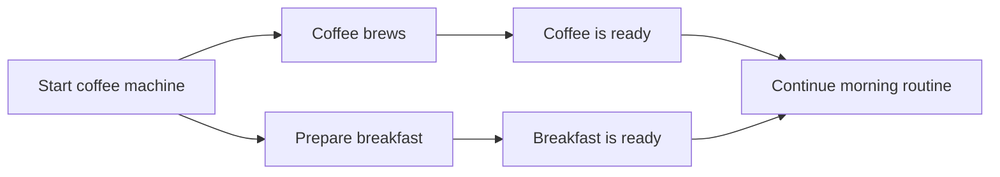
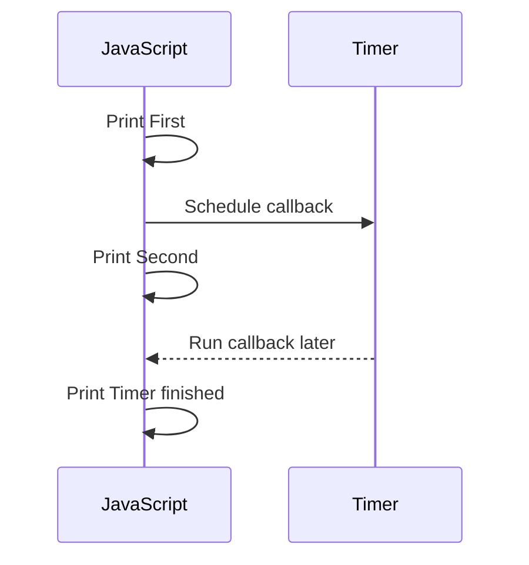
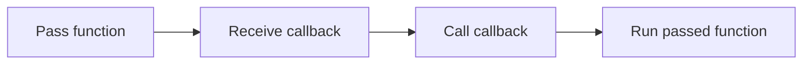
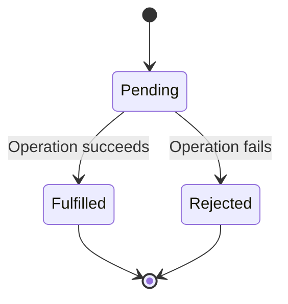
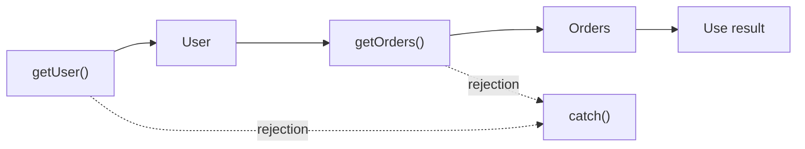
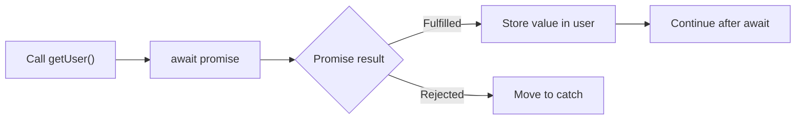
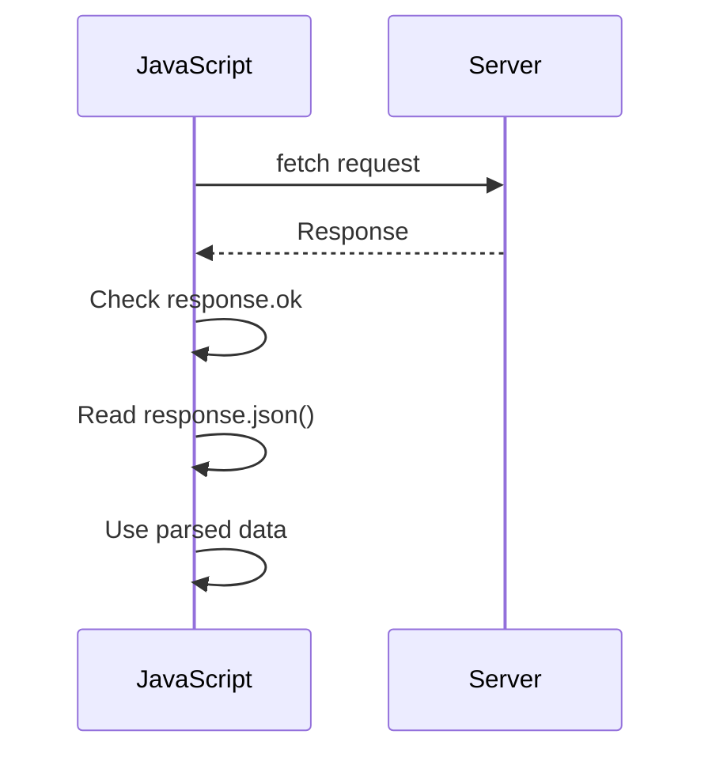

# Level 1

## Table of Contents: Asynchronous JavaScript

- [Synchronous and Asynchronous Execution](#synchronous-and-asynchronous-execution)
- [Scheduling Work with setTimeout](#scheduling-work-with-settimeout)
- [Callbacks](#callbacks)
- [Promises](#promises)
- [async/await](#asyncawait)
- [Making a Request with fetch](#making-a-request-with-fetch)

**Asynchronous JavaScript Level 1** introduces the core ideas needed to understand code that starts work now and receives a result later. It begins by comparing synchronous and asynchronous execution, then uses `setTimeout()` to make scheduling visible. Callbacks lead into promises and `async`/`await`, and the final section applies these concepts to a network request with `fetch()`.

## Synchronous and Asynchronous Execution

JavaScript often needs to work with operations that take time, such as timers and network requests. The [MDN introduction to asynchronous JavaScript](https://developer.mozilla.org/en-US/docs/Learn_web_development/Extensions/Async_JS/Introducing) provides additional background on these concepts. To understand why asynchronous programming is useful, consider a morning routine. If you start a coffee machine and stand beside it doing nothing until the coffee is ready, the rest of your routine has to wait. A more efficient approach is to start the coffee machine, prepare breakfast while the coffee brews, and return to the coffee when it is ready. **Synchronous execution** is similar to waiting for one task to finish before continuing, while **asynchronous execution** allows other work to continue while a time consuming operation is in progress.



JavaScript normally executes ordinary code **synchronously**, which means statements run in sequence and each statement completes before execution continues to the next one. This behavior becomes important when an operation takes a long time because later JavaScript cannot run until that operation finishes. In a browser, sufficiently heavy synchronous work can also prevent the page from responding during that time.

```js
console.log("Starting work"); // Starting work

let total = 0;

for (let i = 0; i < 1_000_000_000; i += 1) {
  total += i;
}

console.log("Work finished"); // Runs only after the loop finishes
```

The loop is synchronous, so `console.log("Work finished")` cannot run until the calculation finishes. **Asynchronous execution**, by contrast, allows certain operations to start while JavaScript continues with other work and handles their result later when it becomes available. The focus here is on recognizing that behavior rather than the runtime mechanisms behind it. Concepts such as the **event loop** are explored separately in **JavaScript Runtime Level 1**. The next section makes asynchronous scheduling visible with `setTimeout()`.

## Scheduling Work with `setTimeout()`

A timer is a simple way to observe asynchronous execution. The [MDN `setTimeout()` reference](https://developer.mozilla.org/en-US/docs/Web/API/Window/setTimeout) provides additional details about timer behavior. The `setTimeout()` function schedules a callback to run after a specified delay while JavaScript continues executing the code that follows it. The delay is measured in milliseconds, so `1000` represents approximately one second.

```js
console.log("First"); // 1. First

setTimeout(() => {
  console.log("Timer finished"); // 3. Timer finished
}, 1000);
console.log("Second"); // 2. Second
```

JavaScript prints `First`, schedules the timer callback, and then continues immediately to `console.log("Second")`. After the requested delay has passed and the current JavaScript has finished running, the scheduled callback can execute and print `Timer finished`. The resulting order is `First`, `Second`, and then `Timer finished`, which can also be represented as a sequence.



The requested delay is the minimum amount of time before the callback can be considered for execution, not a guarantee that it will run at that exact moment. Even a delay of `0` does not interrupt JavaScript that is already running.

```js
setTimeout(() => {
  console.log("A"); // 2. A
}, 0);

console.log("B"); // 1. B
```

Here, `B` appears before `A` because the timer schedules its callback for later. That scheduled function is a **callback**, which leads directly into the next section: how callbacks are passed to other functions and invoked when needed.

## Callbacks

A **callback** is a function given to another function so that the other function can call it. The following example starts with two simple functions.

```js
function showMessage() {
  console.log("Learning callbacks"); // Learning callbacks
}

function runFunction(callback) {
  callback();
}

runFunction(showMessage);
```

Here, `showMessage` is passed to `runFunction()` without parentheses, so the function itself is provided rather than called immediately. Inside `runFunction()`, the `callback` parameter refers to that function, and calling `callback()` runs `showMessage()` and displays `Learning callbacks`.

!!! warning "Passing and Calling a Function"

    Writing `showMessage` passes the function itself.

    ```js
    runFunction(showMessage);
    ```

    Writing `showMessage()` calls the function immediately.

    ```js
    showMessage();
    ```

    Callbacks usually require passing the function so that another function can decide when to call it.

Callbacks can also receive values when they are called, allowing the function that invokes the callback to pass data into it.

```js
function processMessage(callback) {
  const message = "Learning callbacks";
  callback(message);
}

function showMessage(message) {
  console.log(message);
}

processMessage(showMessage);
```

In this example, `processMessage()` passes `message` to the callback, so the value `"Learning callbacks"` becomes the `message` parameter of `showMessage`. When a callback is short and needed only once, it can instead be written directly where it is passed.

```js
processMessage((message) => {
  console.log(message);
});
```

The arrow function performs the same callback role without creating a separate named function, which is useful when the callback is short and needed only once. A callback is not inherently asynchronous: it simply describes a function passed to another function to be called later in that function's workflow. Some APIs invoke callbacks asynchronously, while others invoke them synchronously.



When asynchronous steps depend on results from earlier steps, callbacks can become nested. The following complete example shows how that structure develops.

```js
function getUser(userId, callback) {
  callback({ id: userId, name: "Vardenis" });
}

function getOrders(userId, callback) {
  callback([{ id: 101, userId, product: "Notebook" }]);
}

function getOrderDetails(orderId, callback) {
  callback({ id: orderId, status: "Shipped" });
}

getUser(1, (user) => {
  getOrders(user.id, (orders) => {
    getOrderDetails(orders[0].id, (details) => {
      console.log(details.status); // Shipped
    });
  });
});
```

Each step depends on data produced by the previous step, which causes the callbacks to become increasingly nested. When this structure grows large enough to make code difficult to read and maintain, it is commonly called **callback hell**. The next section introduces **promises**, which provide a more structured way to represent operations that complete or fail later.

## Promises

A **promise** represents the eventual result of an asynchronous operation: work that may later succeed with a value or fail with a reason. The [MDN `Promise` reference](https://developer.mozilla.org/en-US/docs/Web/JavaScript/Reference/Global_Objects/Promise) provides the language reference, while the [MDN guide to using promises](https://developer.mozilla.org/en-US/docs/Web/JavaScript/Guide/Using_promises) provides additional practical guidance.

Every promise begins in the **pending** state. If the operation succeeds, the promise becomes **fulfilled** and provides a value. If the operation fails, the promise becomes **rejected** and provides a reason for the failure. A fulfilled or rejected promise is described as **settled**, and once a promise is settled, its outcome cannot change.



The `Promise` constructor creates a new promise and receives a function called the ****executor****, which JavaScript runs immediately. JavaScript provides the executor with two functions, commonly named `resolve` and `reject`: `resolve(value)` fulfills the promise with a value, while `reject(reason)` rejects it with a reason. The following example uses `setTimeout()` to simulate asynchronous work. Calling `waitForMessage()` immediately returns a pending promise, and after approximately one second the timer callback calls `resolve()`, fulfilling the promise with `"Finished waiting"`.

```js
function waitForMessage() {
  return new Promise((resolve) => {
    setTimeout(() => {
      resolve("Finished waiting");
    }, 1000);
  });
}

waitForMessage()
  .then((message) => {
    console.log(message); // "Finished waiting"
  })
  .catch((error) => {
    console.error("Could not finish waiting", error);
  });
```

In `new Promise(...)`, the `new` keyword creates a `Promise` object by calling the `Promise` constructor. The executor does not need to use both functions it receives. This example only needs `resolve()` because the simulated operation succeeds, while an operation that can fail could use `reject()`.

The fulfilled value is handled with `.then()`, while a rejection can be handled with `.catch()`. Because these methods return promises, they can be connected into a **promise chain**, which is especially useful when asynchronous operations depend on one another. A `.then()` handler can return another promise, and the next `.then()` waits for that promise before receiving its value.

In real application code, you will usually **consume promises returned by existing APIs** with `.then()` or `await` and only occasionally create a promise yourself with `new Promise()`. The next example creates small promise based functions so that both successful and rejected results can be demonstrated clearly.

```js
const users = [{ id: 1, name: "Vardenis" }];
const orders = [{ id: 101, userId: 1, product: "Notebook" }];

function getUser(userId) {
  const user = users.find((item) => item.id === userId);

  if (user) {
    return Promise.resolve(user);
  }

  return Promise.reject(new Error("User not found"));
}

function getOrders(userId) {
  return Promise.resolve(
    orders.filter((order) => order.userId === userId),
  );
}

getUser(1)
  .then((user) => getOrders(user.id))
  .then((userOrders) => {
    console.log(userOrders[0].product); // "Notebook"
  })
  .catch((error) => {
    console.error("Could not load the order", error.message);
  });
```

`getUser()` fulfills the promise with the matching user when one exists and rejects it with an error when no match is found. The first `.then()` receives the fulfilled user and returns the promise from `getOrders()`. The next `.then()` waits for that returned promise before receiving the matching orders. If `getUser()` rejects, the chain skips the fulfillment handlers and continues to `.catch()`.

For example, changing the call to `getUser(99)` follows the rejected path because the dataset contains no user with that ID. The rejection is then handled by the existing `.catch()` at the end of the chain.



!!! tip "Avoid Unnecessary Promise Wrapping"

    The functions in this example already return promises, so code that calls them can return those promises directly.

    ```js
    // Prefer this
    function loadUser(userId) {
      return getUser(userId);
    }
    ```

    There is no need to create another promise that only forwards the same result.

    ```js
    // Unnecessary wrapping
    function loadUser(userId) {
      return new Promise((resolve, reject) => {
        getUser(userId)
          .then(resolve)
          .catch(reject);
      });
    }
    ```

!!! warning "Return Dependent Promises"

    When a `.then()` handler starts another promise based operation whose result is needed by the next step, return that promise.

    ```js
    getUser(1)
      .then((user) => {
        return getOrders(user.id);
      })
      .then((userOrders) => {
        console.log(userOrders); // Matching orders
      });
    ```

    Without `return`, the next `.then()` does not wait for `getOrders()` through the promise chain.

    ```js
    getUser(1)
      .then((user) => {
        getOrders(user.id); // Promise is not returned
      })
      .then((userOrders) => {
        console.log(userOrders); // userOrders is undefined
      });
    ```

!!! warning "Do Not Ignore Rejections"

    A rejected promise should have an appropriate error handling path. Without one, the rejection can become unhandled and make failures harder to diagnose.

    ```js
    getUser(1)
      .then((user) => {
        return getOrders(user.id);
      })
      .then((userOrders) => {
        console.log(userOrders); // Matching orders
      })
      .catch((error) => {
        console.error("Could not load the orders", error);
      });
    ```

    The `.catch()` handles a rejection from an earlier operation in the promise chain.

With promise creation, states, chaining, and error handling established, the next section introduces `async` and `await` as another way to work with promise based operations.

## `async`/`await`

The `async` and `await` keywords provide a clearer way to work with promises when asynchronous steps need to happen in sequence. The [MDN `async function` reference](https://developer.mozilla.org/en-US/docs/Web/JavaScript/Reference/Statements/async_function) and [MDN `await` reference](https://developer.mozilla.org/en-US/docs/Web/JavaScript/Reference/Operators/await) provide additional details about both keywords. An **async function** always returns a promise and allows `await` to be used inside it. The `await` keyword waits for a promise to settle before the async function continues. If the promise is fulfilled, `await` provides its value. If it is rejected, the error can be handled with `try...catch`. The following example demonstrates this flow with a small user dataset, where `getUser()` returns a promise and `showUser()` waits for its result before using it.

```js
const users = [
  { id: 1, name: "Vardenis", role: "Student" },
  { id: 2, name: "Pavardenis", role: "Teacher" },
];

function getUser(userId) {
  return new Promise((resolve, reject) => {
    setTimeout(() => {
      const user = users.find((item) => item.id === userId);

      if (user) {
        resolve(user);
      } else {
        reject(new Error("User not found"));
      }
    }, 1000);
  });
}

async function showUser(userId) {
  try {
    console.log("Loading user..."); // Loading user...

    const user = await getUser(userId);

    console.log(`${user.name} is a ${user.role}`);
  } catch (error) {
    console.error("Could not load the user", error.message);
  }
}

showUser(1);  // Success: "Vardenis is a Student"
showUser(99); // Error: "Could not load the user User not found"

console.log("Other work can continue"); // Other work can continue
```

The key line is `const user = await getUser(userId)`. Because `getUser()` returns a promise, `await` waits for that promise before `showUser()` continues. If the promise is fulfilled, its value is stored in `user` and execution continues with the next statement. If the promise is rejected, execution moves to the `catch` block. The two calls demonstrate both outcomes directly. `showUser(1)` follows the fulfilled path and prints the matching user, while `showUser(99)` follows the rejected path and is handled by `catch` because no matching user exists. The fulfilled and rejected paths can be represented as a simple flow.



!!! warning "Use `await` Inside an Async Function"

    Write `await` inside a function declared with `async`. Using `await` in an ordinary function causes a syntax error.

    ```js
    async function loadUser() {
      const user = await getUser(1);
      console.log(user.name);
    }
    ```

!!! info "What `await` Pauses"

    `await` pauses only the async function in which it is used. It does not block the entire JavaScript program, so other code can continue running while that function waits for the promise.

    ```js
    showUser(1);

    console.log("Other work can continue");
    ```

    While `showUser()` waits for `getUser()` to settle, the next statement can continue running.

!!! warning "Do Not Forget `await`"

    When you need the fulfilled value of a promise, use `await` before the promise based operation.

    ```js
    const user = await getUser(1);
    console.log(user.name); // "Vardenis"
    ```

    Without `await`, `user` contains the promise itself rather than the user value.

    ```js
    const user = getUser(1);
    console.log(user); // Promise
    ```

The example above uses `setTimeout()` to represent an operation whose result arrives later. The next section applies the same `async` and `await` pattern to `fetch()` and a real network request.

## Making a Request with `fetch()`

The **Fetch API** provides a practical example of asynchronous JavaScript. Calling `fetch()` starts an HTTP request and returns a promise that provides a `Response` object when the response becomes available. The [MDN guide to using the Fetch API](https://developer.mozilla.org/en-US/docs/Web/API/Fetch_API/Using_Fetch) provides additional information about requests and responses. The returned promise can be handled using the techniques introduced earlier, with `.then()` handling successful steps in the promise chain and `.catch()` handling errors. Before looking at the code, the complete request and response flow can be represented as a sequence.



The first example handles the request with a promise chain.

```js
function loadUser() {
  fetch("https://jsonplaceholder.typicode.com/users/1")
    .then((response) => {
      if (!response.ok) {
        throw new Error(`HTTP error ${response.status}`);
      }

      return response.json();
    })
    .then((user) => {
      console.log(user.name); // Leanne Graham
    })
    .catch((error) => {
      console.error("Request failed", error);
    });
}

loadUser();
```

The first `.then()` receives the `Response` object and checks `response.ok` to determine whether the HTTP response indicates success. It then returns `response.json()`, which produces another promise containing the parsed JSON data, allowing the next `.then()` to receive the user object.

!!! info "Checking the Response"

    `fetch()` does not automatically reject its promise when the server returns an HTTP error such as `404`. The request still received a response, so the code checks `response.ok`. If `response.ok` is `false`, the code throws an error that can be handled by `.catch()` or `try...catch`.

Because `fetch()` and `response.json()` both return promises, the same request can also be written with `async` and `await`.

```js
async function loadUser() {
  try {
    const response = await fetch(
      "https://jsonplaceholder.typicode.com/users/1",
    );

    if (!response.ok) {
      throw new Error(`HTTP error ${response.status}`);
    }

    const user = await response.json();

    console.log(user.name); // Leanne Graham
  } catch (error) {
    console.error("Request failed", error);
  }
}

loadUser();
```

The first `await` waits for the promise returned by `fetch()`. After the response becomes available, the code checks `response.ok`. The second `await` then waits for `response.json()` and stores the parsed data in `user`. If an error is thrown, the `catch` block handles it.

With a complete request demonstrated using both a promise chain and `async`/`await`, **Asynchronous JavaScript Level 2** continues with more advanced asynchronous patterns, including combining and coordinating multiple promises.
