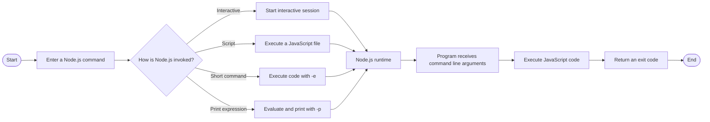

# Overview

The command line provides a way to start Node.js and control how JavaScript programs are executed from a terminal or Command Prompt. It allows you to start an interactive session, run JavaScript files, execute short pieces of code directly, inspect the installed Node.js version, and display built in command line help. As programs become more capable, the command line also provides information to running programs and communicates whether execution completed successfully.

Imagine a small project containing a JavaScript file that processes information supplied when the program starts. You might run the file normally, provide values as command line arguments, or use a short command to test a JavaScript expression without creating a file. The following diagram illustrates the main ways Node.js can be invoked and how a program interacts with its command line environment.

The different invocation methods show how Node.js can execute JavaScript interactively, from a file, or directly from the command line. **Command line arguments** provide information to a program when it starts, while an **exit code** communicates the result of execution back to the environment that started it. Together, these concepts explain how the command line connects Node.js programs with the terminal, supplied input, and surrounding tools.

The **Command Line** module develops from foundational Node.js commands and script execution to a deeper understanding of command line arguments, exit codes, and module types. Each level builds on the previous one while introducing tools for running and controlling increasingly capable Node.js programs.

**Level 1** introduces the foundations of the Node.js command line. It covers starting the **Node.js runtime** with `node`, running **JavaScript scripts**, executing short commands with **`-e`**, evaluating and displaying expressions with **`-p`**, checking the installed Node.js version, and displaying built in command line help. The focus is on understanding the basic ways Node.js can be started and used.

**Level 2** builds on these foundations by examining how programs receive **command line arguments** through `process.argv`, how **exit codes** communicate successful or unsuccessful completion, and how the **module type** affects the way JavaScript files are executed. The focus moves from simply starting Node.js to understanding how a command line program receives information, reports its result, and runs within the appropriate module system.

Together, these concepts provide a foundation for running Node.js programs with greater confidence and understanding. They help you choose an appropriate way to execute JavaScript, supply information when a program starts, understand how execution settings affect a file, and communicate program results clearly.
