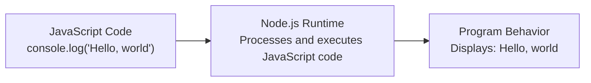
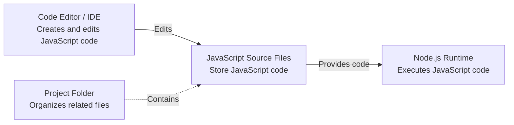
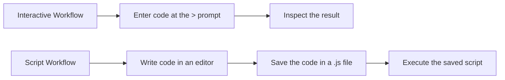

# Level 1

## Table of Contents: Environment

- [Installing Node.js](#installing-nodejs)
- [Understanding the Node.js Development Environment](#understanding-the-nodejs-development-environment)
- [Text Editors, Code Editors, and IDEs](#text-editors-code-editors-and-ides)
- [Interactive and Script Workflows](#interactive-and-script-workflows)
- [Basic Project Organization](#basic-project-organization)
- [JavaScript Source Files](#javascript-source-files)

**Environment Level 1** introduces the components that form a basic Node.js development environment and explains how they work together when creating and running JavaScript programs. It begins with installing the **Node.js runtime** and understanding its role within the development environment, then examines text editors, code editors, and IDEs together with interactive and script workflows. The level concludes with basic project organization and JavaScript source files, establishing how projects are structured and how Node.js code is stored within them.

## Installing Node.js

**Node.js** is the program responsible for executing JavaScript code outside the web browser and must be installed before Node.js programs can be executed. It processes the code and carries out operations such as displaying text, performing calculations, or working with files and the network. A useful analogy is a cook following a recipe. The recipe contains instructions, while the cook follows them to prepare a dish. Similarly, JavaScript source code contains instructions, while the Node.js runtime processes them to produce the program's behavior.



!!! info "Runtime Role"

    This explanation focuses on **what the Node.js runtime does** rather than exactly how it works internally. The internal execution process, including the V8 JavaScript engine, is examined separately in **Node.js Under the Hood Level 2**.

Node.js is available for Windows, macOS, Linux, and other operating systems. For general development, install a current **Long-Term Support (LTS)** release, which receives maintenance updates for an extended period. Official downloads are available from [nodejs.org](https://nodejs.org/). Windows and macOS installers are available directly from the Node.js website, while Linux distributions and macOS commonly provide Node.js through their package management systems.

During installation, Node.js may be configured so that its executable can be found through the system `PATH`. The **PATH** is an operating system setting that contains directories in which the system searches for executable programs. When the Node.js executable is available through `PATH`, Node.js can be started from a command line without specifying the executable's complete file path.

The installed version can be checked from the system command line.

```bash
node --version
node -v
```

A working command displays the installed Node.js version, such as `v22.14.0`. If the command is not recognized or cannot be found, Node.js may not be available through the current `PATH`, or it may not be installed.

!!! tip "Checking the Executable Location"

    If Node.js is installed but its command is not working as expected, the executable location can help identify which installation is being found.

    ```bash
    # Windows Command Prompt
    where node

    # macOS and Linux
    which node
    ```

    These commands show matching executables found through the current `PATH`. The exact location depends on the operating system and installation method, so a fixed installation path should not be assumed.

Node.js installations also include **npm**, the package manager used to install libraries and tools. The `npm` and `npx` commands become available alongside `node`. Working with packages is covered in **Package Management Level 2**. Detailed command-line usage, including running scripts and working with Node.js commands, is covered in **Command Line Level 1**. Once Node.js is installed and accessible on the system, the runtime becomes the central component of the Node.js development environment.

## Understanding the Node.js Development Environment

A **Node.js development environment** is the collection of tools and files used to create and run JavaScript programs on a computer. The runtime executes JavaScript code, development tools provide a workspace for creating and editing it, source files preserve it, and project folders keep related files together. Unlike an editor or IDE, which provides tools for working with code, the Node.js runtime is responsible for executing it. It can receive code directly or from a saved source file, and these approaches are examined in **Interactive and Script Workflows**.



The runtime also provides the foundation from which different execution environments can be created. The distinction between shared and isolated Node.js environments is covered in **Environment Level 2**. Development tools provide the workspace in which the code executed by the runtime is created and managed.

## Text Editors, Code Editors, and IDEs

A **text editor** provides basic tools for creating and editing plain text files. A **code editor** is designed specifically for source code and commonly provides features such as syntax highlighting, automatic indentation, file navigation, and code search.

**Visual Studio Code** is a graphical code editor available for Windows, macOS, and Linux. It provides project navigation, extensions, and an integrated terminal. It includes built-in support for JavaScript and Node.js debugging. The Node.js runtime must be installed separately so that JavaScript programs can be executed. Visual Studio Code can be downloaded from the [official Visual Studio Code website](https://code.visualstudio.com/).

**Neovim** is a terminal-based code editor available for Windows, macOS, and Linux. It provides a keyboard-driven editing interface and can be configured with plugins and language-support tools. Neovim can be downloaded from the [official Neovim website](https://neovim.io/).

An **integrated development environment**, or **IDE**, combines a source code editor with additional development tools in one application. **WebStorm** is an IDE designed for JavaScript and Node.js development and provides integrated debugging, project management, and runtime configuration. It is available from the [official WebStorm website](https://www.jetbrains.com/webstorm/).

The choice of editor or IDE depends on the features and workflow appropriate for a particular project.

!!! warning "Word Processors"

    Word processors such as Microsoft Word are designed for formatted documents rather than plain source code and are not appropriate for writing Node.js programs.

These development tools support both direct experimentation with JavaScript and work with code saved for repeated execution.

## Interactive and Script Workflows

Node.js supports two basic workflows for providing code to the runtime. Code can be entered directly during an interactive session or saved in a source file as a script for later execution.



An **interactive session** is started with the `node` command without arguments. It displays the `>` prompt and waits for JavaScript code to be entered. The following example shows code entered directly and the output produced by the runtime.

```js
> console.log("Hello, world")
Hello, world
```

This interactive process is commonly called a **REPL**, which stands for **Read, Eval, Print, Loop**. Node.js reads the entered code, evaluates or executes it, displays a result when appropriate, and then waits for more input. Interactive execution is convenient for experimenting with expressions and small pieces of code because results can be inspected immediately.

!!! tip "Exiting an Interactive Session"

    An interactive session continues until it is exited. Enter `.exit` at the `>` prompt to leave the session, or press `Ctrl+C` twice. A keyboard shortcut can also signal the end of input. On macOS and Linux, press `Ctrl+D`. On Windows, press `Ctrl+Z` followed by `Enter`.

A **script** is JavaScript code stored in a source file. Saving code allows it to be edited, preserved, and executed repeatedly. The following statement can be saved in a `.js` file.

```js
console.log("Hello, world");
```

The distinction is that interactive execution receives code directly, while script execution receives code from a saved file. Both use the Node.js runtime to execute JavaScript code. The commands used to start interactive sessions and run scripts are covered in **Command Line Level 1**. Scripts depend on saved source files, which makes the format and organization of JavaScript source code an important part of the development environment.

## Basic Project Organization

A **project folder** is a directory that provides a single location for the files belonging to a program. A small project may contain only a few files, while a larger project can use **subfolders** to keep related files organized.

```text
weather-app/
├── app.js
├── weather-data/
│   ├── cities.js
│   └── archived-data/
│       └── oldCities.js
└── utility-tools/
    └── converter.js
```

Here, `weather-app` is the project folder, while `weather-data` and `utility-tools` are subfolders. A subfolder can also contain another subfolder. In this example, `archived-data` is a subfolder inside `weather-data`. Folders can therefore be nested when additional organization is useful.

Folder naming conventions can vary between Node.js projects. In this course, folder names use lowercase letters, with **kebab-case** for names containing multiple words, such as `weather-data` and `utility-tools`. This convention is used to keep project paths clear and consistent. Node.js does not require this naming style.

!!! tip "Folder Names"

    Use clear folder names that describe their purpose and follow the naming convention used by the project. Avoid names containing spaces or inconsistent capitalization, such as `my project`, `Sample Data`, and `New Folder`, because they can make project paths less convenient to work with. More detailed naming conventions are introduced in **Documentation and Code Style Level 1**.

A project folder establishes where the program and its related files are organized. The JavaScript source files stored within this structure have their own format and purpose. A special folder named `node_modules`, used for locally installed packages and their dependencies, is introduced in **Package Management Level 2**.

## JavaScript Source Files

JavaScript source code is normally stored in plain text files with the `.js` filename extension. This extension identifies a file as **JavaScript source code** and helps development tools recognize the language. To create a source file, write JavaScript code in a text editor, code editor, or IDE and save the file with a `.js` extension.

```text
hello.js
calculator.js
weatherData.js
```

A source filename should indicate what the file contains. For example, `calculator.js` suggests code related to a calculator, while `databaseConnection.js` suggests code related to a database connection. JavaScript projects use different filename conventions. In this course, JavaScript source filenames use lowercase letters for single-word names and **camelCase** for names containing multiple words, such as `weatherData.js`, `numberConverter.js`, and `oldCities.js`. Node.js does not require this naming style.

In a program containing multiple source files, one file may serve as the **starting file**, or entry point, from which the application is launched. Filenames such as `app.js`, `index.js`, and `main.js` are commonly used for this purpose, while other source files normally have names that describe the code they contain. Node.js does not give these filenames special meaning merely because of their names, so another `.js` file can also serve as the starting file.

!!! warning "Source File Names"

    Save a JavaScript source file with one `.js` extension and follow the filename convention used by the project. In this course, a multiword source filename uses **camelCase**, such as `numberConverter.js`. Avoid spaces in filenames, such as `number converter.js`, and avoid unintended duplicate extensions, such as `numberConverter.js.js`. More detailed naming and formatting conventions are introduced in **Documentation and Code Style Level 1**.

A source file can contain one statement or multiple statements that form a program. For example, the following file contains three statements that display text and a blank line.

```js
console.log("Hello, world");
console.log();
console.log("JavaScript source files contain executable code");
```

JavaScript source files normally use **UTF-8** as their **text encoding**. A text encoding is a system that represents characters as data that a computer can store and process. **UTF-8** is a widely used text encoding that supports characters from many writing systems, including letters, numbers, symbols, and other characters used in source code. The same `.js` file can be opened and edited with different text editors, code editors, and IDEs.

A Node.js program can consist of a single `.js` file or multiple source files organized within a project folder. With the runtime installed, a development tool available, a project folder organized, and JavaScript source files understood, the basic development environment is in place. **Command Line Level 1** builds on this foundation by explaining the commands used to start Node.js and execute saved programs.
