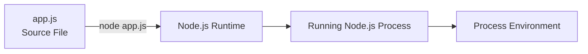
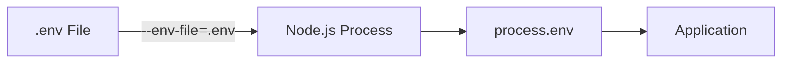

# Level 2

## Table of Contents: Environment

- [Understanding the Node.js Process](#understanding-the-nodejs-process)
- [Working with the Process Environment](#working-with-the-process-environment)
- [Understanding Environment Variables](#understanding-environment-variables)
- [Setting Environment Variables](#setting-environment-variables)
- [Reading Environment Variables](#reading-environment-variables)
- [Using `.env` Files](#using-env-files)

Environment Level 2 follows one configuration flow: understand the running Node.js process and its environment, understand what environment variables are, supply an environment variable before starting the process, read that value inside the program, and then use a `.env` file to supply multiple variables together.

## Understanding the Node.js Process

When Node.js starts a JavaScript program, the operating system creates a process for the running program. The source file contains the program instructions, the Node.js runtime executes those instructions, and the process is the running instance created for that execution.



Starting the same program again can create another process because each execution is a separate running instance. The runtime and the process are therefore related but different: Node.js is the software that executes JavaScript, while a Node.js process is one running instance of that software executing a program.

!!! abstract "Runtime and Process"

    The Node.js runtime executes JavaScript code. A Node.js process is a running instance of that runtime executing a program.

A running process operates within an environment that includes information such as its current working directory, operating system platform, Node.js version, and environment variables. Node.js exposes this information through the global `process` object.

[Node.js Process Documentation](https://nodejs.org/api/process.html)

## Working with the Process Environment

The global `process` object provides information about the currently running Node.js process and requires no import. For this environment topic, the relevant members are `process.cwd()`, `process.platform`, `process.version`, and `process.env`.

```js
console.log(process.cwd());
console.log(process.platform);
console.log(process.version);
console.log(process.env);
```

`process.cwd()`, `process.platform`, and `process.version` describe the environment in which the process is running. `process.env` provides access to environment variables supplied to the process. Before using `process.env`, it is important to understand what an environment variable represents and how a value reaches the process.

[Node.js Process Environment Documentation](https://nodejs.org/api/process.html#processenv)

## Understanding Environment Variables

An environment variable is a named configuration value supplied to a program through its environment rather than written directly into its source code. A program might need a value such as a port number, application mode, or service address, and that value can be supplied when the program is started.

This separates configuration from source code. The source code defines what the program does, while the environment supplies values that may change depending on where or how the program runs.

!!! abstract "Code and Configuration"

    Environment variables allow configuration values to be supplied from outside the program's source code.

The basic workflow starts by supplying a variable to the environment before the Node.js process starts.

[Node.js Environment Variables Documentation](https://nodejs.org/api/environment_variables.html)

## Setting Environment Variables

Environment variables can be supplied from the command-line environment when starting a Node.js program. For example, the program may need a `PORT` value without defining that value inside `app.js`.

On Linux and macOS shells:

```bash
PORT=3000 node app.js
```

The command supplies `PORT` with the value `3000` and then starts `app.js`. The new Node.js process receives that environment variable.

A variable can also be exported into the current shell environment before the program is started.

```bash
export PORT=3000
node app.js
```

Windows Command Prompt uses different syntax:

```bat
set PORT=3000
node app.js
```

Windows PowerShell also uses its own syntax:

```powershell
$env:PORT="3000"
node app.js
```

Although the commands differ, the sequence is the same: first the environment variable is supplied, and then the Node.js process starts with that value available. The program can now read the value through `process.env`.

## Reading Environment Variables

Once an environment variable has been supplied to the process, Node.js makes it available through `process.env`. The `PORT` value supplied in the previous section can therefore be read inside `app.js`.

```js
const port = process.env.PORT;

console.log(port);
```

If the program was started with `PORT=3000`, `process.env.PORT` contains `"3000"`. Environment-variable values are strings when defined, and a variable that was not supplied has the value `undefined`.

```js
const port = Number(process.env.PORT);
const host = process.env.HOST || "localhost";
const missing = process.env.DOES_NOT_EXIST;

console.log(port);
console.log(host);
console.log(missing);
```

The example converts `PORT` when a number is required, provides a fallback for `HOST`, and shows what happens when a variable does not exist.

!!! warning "Environment Variable Types"

    Environment variables do not automatically become JavaScript numbers, booleans, or other data types. Values read through `process.env` are strings when defined, so convert them when the program requires another data type.

The basic environment-variable flow is now complete: set a value before starting the process, then read that value inside the program through `process.env`. Setting several variables individually can become inconvenient, which is where a `.env` file becomes useful.

## Using `.env` Files

A `.env` file groups multiple environment-variable assignments in one plain text file.

```env
PORT=3000
NODE_ENV=development
API_URL=https://example.com
```

These are the same kind of environment-variable assignments introduced earlier. The difference is that the values are stored together in a file instead of being entered individually in the shell.

Modern Node.js versions can load the file when starting the program:

```bash
node --env-file=.env app.js
```

Node.js loads the assignments from `.env` into the process environment before `app.js` runs. The program then reads them through the same `process.env` interface already introduced in the previous section.



The `.env` filename itself does not cause Node.js to load the file automatically. It must be loaded explicitly, such as with the `--env-file` option.

Existing projects may also use the `dotenv` package to load `.env` files from application code.

```js
import "dotenv/config";
```

After `dotenv` loads the file, its values are available through `process.env` in the same way. The `dotenv` package is an external dependency rather than part of Node.js itself. Installing and managing packages is covered in Package Management Level 1.

[Node.js `.env` Files Documentation](https://nodejs.org/api/environment_variables.html#env-files)

[dotenv npm Registry](https://www.npmjs.com/package/dotenv)

!!! info "Node.js Version Support"

    The `--env-file` option was introduced in Node.js 20.6.0. Older Node.js versions and existing projects may instead use a package such as `dotenv`.

!!! abstract "Environment Configuration Flow"

    First, environment variables are supplied to the Node.js process. The program reads them through `process.env`. A `.env` file provides a convenient way to supply multiple environment variables together.

After completing Level 2, you should be able to distinguish the Node.js runtime from a running Node.js process, identify environment-related information exposed through the global `process` object, explain environment variables as external configuration, set environment variables before starting a Node.js process, read their values through `process.env`, and use a `.env` file to supply multiple configuration values together.
