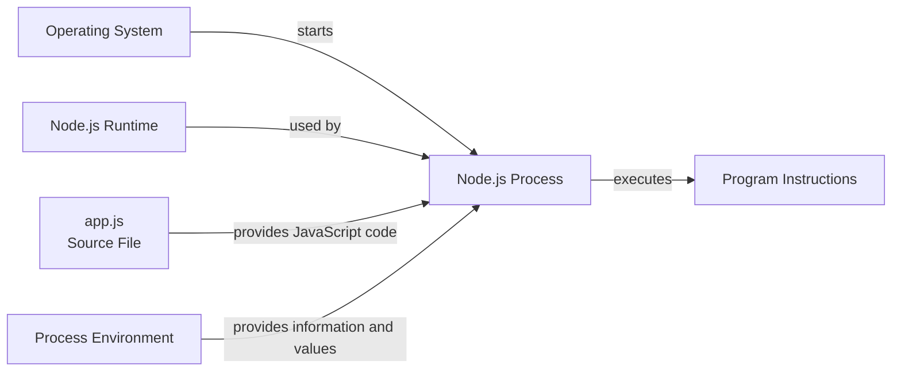
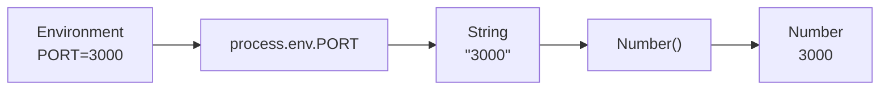
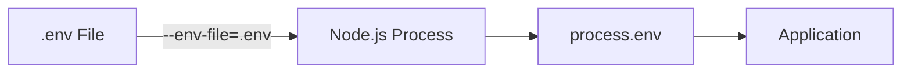

# Level 2

## Table of Contents: Environment

- [Understanding the Node.js Process](#understanding-the-nodejs-process)
- [Working with the Process Environment](#working-with-the-process-environment)
- [Understanding Environment Variables](#understanding-environment-variables)
- [Setting Environment Variables](#setting-environment-variables)
- [Reading Environment Variables](#reading-environment-variables)
- [Using `.env` Files](#using-env-files)

**Environment Level 2** extends the basic development environment from Level 1 into the environment of a running program. It begins with the Node.js process and its environment, then introduces environment variables as external configuration. From there, it shows how values are supplied before a process starts, how those values are accessed and converted through `process.env`, and how a `.env` file can supply multiple environment variables together.

## Understanding the Node.js Process

When Node.js starts a JavaScript program, the operating system creates a **process** in which the program runs. The JavaScript source file contains the program instructions, Node.js executes those instructions, and the process represents that running instance of the program. Starting the same program again can create another process because each execution is a separate running instance.

Node.js provides the global `process` object for interacting with and obtaining information about the current Node.js process. The `process` object is available without an import and provides information and controls related to the running process, as described in the [Node.js process documentation](https://nodejs.org/api/process.html).



The operating system starts the **Node.js process** when the program is launched. The process uses the Node.js runtime to execute the JavaScript instructions stored in `app.js`. At the same time, the process operates within a **process environment** that provides information and configuration values available during execution.

The source file, runtime, process, and process environment have different responsibilities. The source file stores the JavaScript instructions, the Node.js runtime provides the software needed to execute those instructions, the process represents the running instance, and the process environment provides information and values available to that instance.

A running process has access to information about itself and the environment in which it operates. Node.js makes this information available through the global `process` object. The next section examines several parts of this object that describe the process environment.

## Working with the Process Environment

The global `process` object provides information about the currently running Node.js process and does not require an import. The [Node.js process documentation](https://nodejs.org/api/process.html) describes the information and controls available through this object. For this environment topic, useful members include `process.cwd()`, `process.platform`, `process.version`, and `process.env`.

```js
console.log(process.cwd()); // Example output: /home/user/weather-app
console.log(process.platform); // Example output: linux
console.log(process.version); // Example output: v22.14.0
```

`process.cwd()` returns the **current working directory**, `process.platform` identifies the operating system platform on which the process is running, and `process.version` identifies the Node.js version used by the current process. The exact values depend on where and with which Node.js installation the program is running.

The `process.env` property provides the **environment variables** available to the process. These variables come from the environment in which the process was started and are represented as properties of the `process.env` object. Each property name is an environment variable name, while its property value is the value supplied for that variable.

```js
console.log(process.env); // Example output includes HOME, PATH, USER, and other variables.
```

In this example, `HOME`, `PATH`, and `USER` are environment variable names. Their values provide information from the surrounding environment. For example, `HOME` may identify the user's home directory, while `PATH` contains directories used when searching for executable programs. The variables available to a process depend on the operating system, command-line environment, system configuration, and values supplied when the process starts.

!!! note "Inspecting the Process Environment"

    You do not need to memorize or understand every variable displayed by `process.env`. Printing the complete object is mainly useful when learning what the process receives or when inspecting the environment during development and troubleshooting. In application code, programs normally read only the specific environment variables they need.

The process environment can therefore contain many variables, while a program usually works with only a small number of relevant values. The next section explains environment variables in more detail before showing how a specific variable can be supplied to a Node.js process and read by the program.

## Understanding Environment Variables

The [Node.js environment variables documentation](https://nodejs.org/api/environment_variables.html) describes environment variables as values associated with the environment in which a Node.js process runs. In an application, they are commonly used for configuration that may need to change without changing the JavaScript source code itself.

When beginning a web application or API, a small set of variables can represent settings that commonly differ between environments.

```env
NODE_ENV=development
PORT=3000
BASE_URL=https://example.com
```

Each assignment consists of a **name** and a **value**. `ENVIRONMENT`, `PORT`, and `BASE_URL` are the variable names, while `development`, `3000`, and `https://example.com` are their corresponding values. Environment variable names are commonly written with uppercase letters and underscores, which makes them easy to distinguish from ordinary JavaScript variables.

These variables represent different parts of the application's configuration. `ENVIRONMENT` identifies the environment in which the application is intended to run, such as `development`, `testing`, or `production`. This can be useful when the application needs different behavior or configuration for local development and deployment. `PORT` identifies the network port on which a web application or API should listen. `BASE_URL` can provide a base address used when the application needs to construct URLs.

!!! note "Choose Variables the Application Needs"

    A web application or API does not require `ENVIRONMENT`, `PORT`, or `BASE_URL` simply because it uses Node.js. Environment variables should be added when the application has configuration that needs to vary between environments or executions. Other projects may need variables for database connections, external services, or other application-specific settings.

This approach keeps configuration separate from the program instructions. For example, the same source code could use `ENVIRONMENT=development` and `PORT=3000` during development, then receive different values when deployed. The source code remains the same while the environment supplies the configuration appropriate for that execution.

The previous section showed that environment variables available to a Node.js process can be inspected through `process.env`. The next step is to supply a specific variable before starting the process so that the program can use it.

## Setting Environment Variables

An environment variable must be supplied to the environment before a Node.js process can read it. During development, one way to do this is through the command-line environment used to start the program. The exact command depends on the operating system and shell.

On common Linux and macOS shells, a variable can be supplied only to the command being started.

```bash
PORT=3000 node app.js
```

This starts `app.js` with `PORT` available to that Node.js process. After the command finishes, this particular assignment does not remain as a shell variable for later commands.

A variable can also be exported into the current shell environment.

```bash
export PORT=3000
node app.js
```

After `PORT` is exported, programs started from that shell can inherit the value. The exported variable remains available in that shell session until it is changed, removed, or the shell session ends.

Windows command-line environments use different syntax. In Command Prompt, a variable can be set for the current session before starting the program.

```bat
set PORT=3000
node app.js
```

In PowerShell, the environment variable is assigned through the `Env` drive.

```powershell
$env:PORT="3000"
node app.js
```

!!! note "Shell-Specific Syntax"

    These commands belong to the command-line environment rather than to JavaScript or Node.js. Their syntax differs because Bash-like shells, Command Prompt, and PowerShell provide different ways to set environment variables. Node.js receives the resulting value when the process starts.

The Node.js process receives its environment when it starts. Changing a variable in the shell afterward does not update a process that is already running. To use a new value, start the Node.js process again with the updated environment.

For a web application or API, the same approach can be used with other configuration values when needed.

```bash
NODE_ENV=development PORT=3000 BASE_URL=https://example.com node app.js
```

This example supplies three variables to a single Node.js process. In practice, entering several values manually can become inconvenient, which is one reason environment files are useful later in the configuration workflow.

Once an environment variable has been supplied, the Node.js program needs a way to access its value. The next section shows how individual environment variables are read through `process.env`.

## Reading Environment Variables

Node.js makes environment variables available through `process.env`. If the program is started with a `PORT` environment variable, `app.js` can read that value directly.

```js
const port = process.env.PORT;

console.log(port); // Display the value received from the environment
```

If `PORT` was supplied with the value `3000`, `process.env.PORT` contains the string `"3000"`. Environment variable values are strings when defined, while a variable that was not supplied has the value `undefined`.

This distinction matters when the program expects another JavaScript data type. For example, an application commonly uses `PORT` as a number when configuring the server, but `process.env.PORT` still provides the value as a string. `Number()` can convert that value before it is used.

```js
const port = Number(process.env.PORT);

console.log(port); // Convert the PORT value from a string to a number
```

If `PORT` contains `"3000"`, `Number(process.env.PORT)` produces the number `3000`. The application can then use `port` wherever a numeric port value is required.



Conversion can fail when the supplied value does not represent a valid number. If `PORT` contains a value such as `"abc"`, `Number()` produces `NaN`, so the application can validate the converted value before using it.

```js
const port = Number(process.env.PORT);

if (Number.isNaN(port)) {
    console.log("PORT must contain a valid number"); // Report an invalid numeric value
}
```

A fallback can also be used when an environment variable is not supplied. For example, the application can use port `3000` by default.

```js
const port = Number(process.env.PORT) || 3000;

console.log(port); // Use PORT when available or fall back to 3000
```

!!! warning "Environment Variable Types"

    Environment variables do not automatically become JavaScript numbers, booleans, or other data types. Values read through `process.env` are strings when defined. Convert a value when the application requires another data type and validate the result when invalid input is possible.

The basic environment-variable flow is now complete. A value is supplied before the process starts and then read inside the program through `process.env`. Supplying several variables individually can become inconvenient, so Node.js also provides a way to load multiple environment-variable assignments from a file.

## Using `.env` Files

A **`.env` file** is a plain text file that groups environment-variable assignments together. Instead of supplying several values separately when starting a process, the assignments can be stored in one file. Node.js provides built-in support for loading these files with the `--env-file` command-line option. See the [Node.js environment file documentation](https://nodejs.org/api/environment_variables.html#env-files) for the `.env` file format and supported behavior.

Create a `.env` file in the project directory and add the environment-variable assignments required by the application.

```env
NODE_ENV=development
PORT=3000
BASE_URL=https://example.com
```

The variable names used in the file become properties of `process.env` after Node.js loads the file. Start the application with `--env-file=.env` to load these assignments before `app.js` runs.

```bash
node --env-file=.env app.js
```

The application can then read the loaded values through the same `process.env` interface used for environment variables supplied outside a `.env` file.

```js
const environment = process.env.NODE_ENV;
const port = Number(process.env.PORT);
const baseUrl = process.env.BASE_URL;

console.log(environment); // Display the current environment
console.log(port); // Display PORT as a number
console.log(baseUrl); // Display the configured base URL
```

The `.env` file does not create a separate configuration system inside the application. Node.js reads the assignments from the file, adds them to the process environment, and the application accesses them through `process.env`. This level uses Node.js's built-in `--env-file` option; other ways of loading `.env` files can be introduced later when they are needed by an application.



Excluding the real `.env` file protects local configuration, but other developers still need to know which variables the application expects. A separate `.env.example` file can document the required variable names using safe example values or empty values.

```gitignore
# Ignore environment files that may contain configuration or secrets
.env
.env.*

# Keep the example environment file in the repository
!.env.example
```

Excluding the real `.env` file protects local configuration, but other developers still need to know which variables the application expects. A separate `.env.example` file can document the required variable names using safe example values or empty values.

```env
ENVIRONMENT=
PORT=
BASE_URL=
```

!!! danger "Secrets"

    Do not commit real passwords, API keys, access tokens, or other secrets stored in a `.env` file to a public or shared repository. Keep sensitive values outside version control and provide only safe examples when documenting the required configuration.

**Environment Level 3** builds on this foundation by introducing more advanced ways to organize, validate, and manage application configuration, together with managing Node.js versions themselves across projects.
