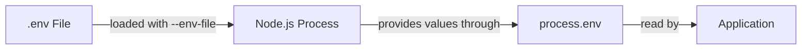

# Summary

This summary brings together the most important concepts from the **Environment** module. It provides a quick reference for reviewing the main components, relationships, and differences involved in creating and running Node.js programs.

## Table of Contents: Environment

- [Level 1](#level-1)
- [Level 2](#level-2)

## Level 1

Level 1 establishes the foundations of **Node.js development environments, development tools, interactive and script workflows, project organization, and source files**. The main goal is to understand the responsibilities of these components and how they work together.

The **Node.js runtime** is the program responsible for executing JavaScript code outside the web browser. A **Node.js development environment** brings the runtime together with the development tools, project folders, and source files used to create and run JavaScript programs. The runtime can receive code directly or from a saved source file.

The **PATH** is an operating system setting containing directories in which the system searches for executable programs. When Node.js is available through `PATH`, it can be started without specifying the complete path to its executable. The installed Node.js version can be checked with `node --version` or `node -v`.

!!! warning "Command Availability"

    If the `node` command is not recognized or cannot be found, Node.js may not be available through the current `PATH`, or it may not be installed. A failed command does not, by itself, establish which of these situations is responsible.

A **text editor** provides basic tools for editing plain text files, while a **code editor** adds features designed for source code. An **integrated development environment**, or **IDE**, combines a source code editor with additional development tools. Visual Studio Code and Neovim are examples of code editors, while WebStorm is an IDE. The Node.js runtime must be installed separately from these development tools so that JavaScript programs can be executed.

Node.js supports **interactive and script workflows**. An interactive session accepts code directly at the `>` prompt and is commonly called a **REPL**, meaning *Read, Eval, Print, Loop*. A script contains code saved in a source file so that it can be edited, preserved, and executed repeatedly. An interactive session can be exited with `.exit`, by pressing `Ctrl+C` twice, or by using the operating system's end of input keyboard shortcut.

```shell
> console.log("Hello, world")
Hello, world
```

!!! abstract "Interactive and Script Execution"

    **Interactive execution receives code directly**, while **script execution receives code from a saved source file**. Both workflows use the Node.js runtime.

A **project folder** is a directory that keeps the files belonging to a program together. A project can contain source files and **subfolders**, including nested subfolders when additional organization is useful. Folder naming conventions can vary between Node.js projects. In this course, folder names use lowercase letters, with **kebab-case** for names containing multiple words.

```text
weather-app/
├── app.js
├── weather-data/
│   ├── cities.js
│   └── archived-data/
│       └── oldCities.js
└── utility-tools/
    └── converter.js
```

Folder names should clearly indicate what they contain. Names containing spaces or inconsistent capitalization can make project paths less clear or less convenient to work with. Node.js does not require kebab-case folder names, but this course uses the convention consistently.

A **JavaScript source file** is normally a plain text file with the `.js` extension and normally uses **UTF-8** encoding. A source filename should indicate what the file contains. In this course, JavaScript source filenames use lowercase letters for single-word names and **camelCase** for names containing multiple words, such as `weatherData.js`, `numberConverter.js`, and `oldCities.js`. Node.js does not require this naming style.

Filenames such as `app.js`, `index.js`, and `main.js` are commonly used for an application's **starting file**, or entry point, but Node.js does not give these filenames special meaning merely because of their names. Another `.js` file can also serve as the starting file. Source filenames should use a single `.js` extension and avoid spaces or unintended duplicate extensions.

```js
console.log("Hello, world");
print()
console.log("JavaScript source files contain executable code");
```

!!! abstract "Development Environment Components"

    **The Node.js runtime executes JavaScript code, development tools provide a workspace for creating and editing it, project folders organize related files, and source files preserve JavaScript code.** These distinct responsibilities form the basic Node.js development environment.

After reviewing Level 1, you should be able to explain **what the Node.js runtime and a Node.js development environment are**, describe the purpose of **PATH**, distinguish **text editors, code editors, and IDEs**, explain **interactive and script workflows** and the role of the **REPL**, describe how **project folders, subfolders, and nested subfolders** organize a program, and identify **JavaScript source files, UTF-8 encoding, folder and source filename conventions, and the purpose of common entry point filenames such as `app.js`, `index.js`, and `main.js`**.

## Level 2

Level 2 extends the development environment into the environment of a running Node.js program. It focuses on the **Node.js process, process environment, environment variables, `process.env`, value conversion, and `.env` files**. The main goal is to understand how external configuration becomes available to a running application.

When Node.js starts a JavaScript program, the operating system creates a **process** in which the program runs. The source file contains the JavaScript instructions, the Node.js runtime executes those instructions, and the process represents the running instance of the program. Starting the same program again can create another process because each execution is a separate running instance.

Node.js provides the global `process` object for interacting with and obtaining information about the current process. It is available without an import. Useful members introduced in this level include `process.cwd()`, `process.platform`, `process.version`, and `process.env`.

```js
console.log(process.cwd());
console.log(process.platform);
console.log(process.version);
```

`process.cwd()` returns the **current working directory**, `process.platform` identifies the operating system platform, and `process.version` identifies the Node.js version used by the current process. The exact values depend on the environment in which the program is running.

The `process.env` property provides the **environment variables** available to the process. Environment variables can supply configuration that changes between environments or executions without requiring changes to the JavaScript source code. Variables such as `NODE_ENV`, `PORT`, and `BASE_URL` are examples of application configuration, but applications should define only the variables they actually need.

```env
NODE_ENV=development
PORT=3000
BASE_URL=https://example.com
```

Environment variables must be supplied before the Node.js process can read them. The syntax used to set them depends on the operating system and shell. A process receives its environment when it starts, so changing a shell variable afterward does not update a process that is already running.

!!! note "Process Environment"

    The process environment can contain many variables supplied by the operating system, command-line environment, system configuration, or application startup. Application code normally reads only the specific variables it needs.

Environment variables are read through `process.env`. Values are **strings when defined**, while a variable that was not supplied has the value `undefined`. When an application requires another JavaScript data type, the value should be converted and, when invalid input is possible, validated before use.

```js
const port = Number(process.env.PORT);

if (Number.isNaN(port)) {
    console.log("PORT must contain a valid number");
}
```

A fallback can be used when a configuration value has an appropriate default.

```js
const port = Number(process.env.PORT) || 3000;
```

A **`.env` file** groups environment-variable assignments in one plain text file. Node.js can load the file with the built-in `--env-file` command-line option, which makes the assignments available through the same `process.env` interface used for variables supplied outside the file.

```bash
node --env-file=.env app.js
```

This command starts `app.js` and tells Node.js to load the assignments from `.env` into the environment of the new process before the application code runs. The application can then access those values through `process.env`.



Environment files can contain local configuration or secrets and should normally be kept outside version control. A `.gitignore` file can exclude `.env` and environment-specific `.env.*` files, while `.env.example` can remain in the repository to document the variables the application expects without containing real configuration values.

```gitignore
# Ignore environment files that may contain configuration or secrets
.env
.env.*

# Keep the example environment file in the repository
!.env.example
```

These rules prevent the real environment files from being tracked while allowing `.env.example` to remain as documentation for the expected configuration. The example file can list the required variable names without containing the real values.

```env
NODE_ENV=
PORT=
BASE_URL=
```

This example records the expected variable names while leaving their real values to the environment in which the application runs.

!!! danger "Secrets"

    Do not commit real passwords, API keys, access tokens, or other secrets stored in environment files to a public or shared repository. Keep sensitive values outside version control and provide only safe examples when documenting required configuration.

!!! abstract "Environment Configuration Flow"

    **Configuration is supplied before the Node.js process starts, becomes part of the process environment, and is accessed by the application through `process.env`.** Values can be supplied directly through the command-line environment or loaded from a `.env` file.

After reviewing Level 2, you should be able to explain **what a Node.js process and process environment are**, use the global **`process` object** to inspect basic process information, explain the purpose of **environment variables**, describe when the process receives its environment, read values through **`process.env`**, explain why defined environment-variable values are strings, convert and validate values when another data type is required, use a fallback when appropriate, load a **`.env` file** with `--env-file`, and explain the roles of **`.gitignore`, `.env.example`, and basic secret protection**.
