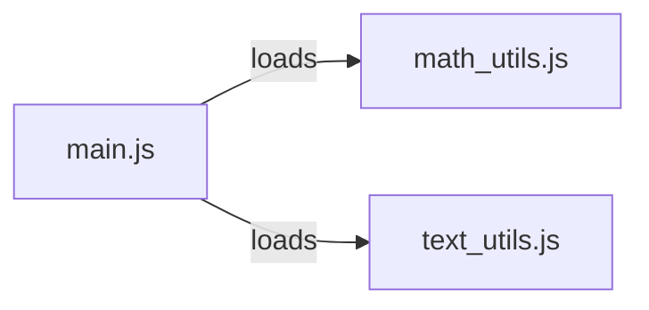

# Level 1

## Table of Contents: Modules

- [Understanding Modules](#understanding-modules)
- [Importing Built-in Modules](#importing-built-in-modules)
- [Creating Your Own Module](#creating-your-own-module)
- [Importing Your Own Module](#importing-your-own-module)

**Modules Level 1** introduces the basic ways Node.js programs are divided into modules. You will learn what a module is, how to use built-in modules provided by Node.js, how to create your own module, and how to load it into another file.

## Understanding Modules

A **module** is a file containing JavaScript code that can be used by other files. As a program grows, keeping all of its code in a single file becomes difficult to navigate and maintain. Modules address this by letting a program be divided into smaller pieces, where each file focuses on a specific part of the program.



Node.js treats each file as its own module. Code in one file is not automatically visible to other files. To share code, a file must explicitly add it to its **module exports**, and another file must explicitly **require** it. This level covers the CommonJS module format, which uses the `require` function and `module.exports`. The ES module format and module configuration are covered in **Modules Level 2**.

## Importing Built-in Modules

Node.js provides **built-in modules** that perform common tasks such as working with file paths, the operating system, and the file system. A built-in module is loaded by passing its name to the `require` function.

```js
const path = require("node:path");

console.log(path.sep);
```

This example loads the `node:path` module and reads its `sep` property, which represents the platform-specific path separator. The `node:` prefix identifies a built-in module. Other useful built-in modules include `node:os` for operating system information and `node:fs` for working with files.

!!! tip "Inspecting a Module"

    A quick way to see what a module provides is to display the whole module object.

    ```js
    const os = require("node:os");

    console.log(os);
    ```

    The module object contains everything the module exports.

## Creating Your Own Module

A file becomes a module when it adds values to its **`module.exports`** object. This object is provided by Node.js in every file and starts out empty.

```js
// math_utils.js
function add(a, b) {
    return a + b;
}

const PI = 3.14159;

module.exports = { add, PI };
```

This module exports a function named `add` and a constant named `PI`. Any number of values can be exported from a single module by placing them on the `module.exports` object.

## Importing Your Own Module

Another file can use the exported values by **requiring** the module. A module created as part of a project is required using a relative path that starts with `./`.

```js
// main.js
const { add, PI } = require("./math_utils.js");

console.log(add(2, 3));
console.log(PI);
```

This example requires `math_utils.js` and takes its `add` and `PI` exports, then uses them in `main.js`. The destructuring form `const { add, PI } = ...` picks specific values from the module. The two files might be organized in a project folder like this.

```text
calculator_app/
├── main.js
└── math_utils.js
```

When `node main.js` is run, Node.js loads `math_utils.js`, makes its exports available to `main.js`, and executes the program.

The distinction between requiring built-in modules and requiring your own modules is the source of the request: built-in modules are referenced by name, while your own modules are referenced by a relative path. Together, `module.exports` and `require` allow a program to be divided into focused, reusable files. **Modules Level 2** builds on these basics by examining the ES module format, default and named exports, module configuration through `package.json`, and how Node.js locates modules it loads.
