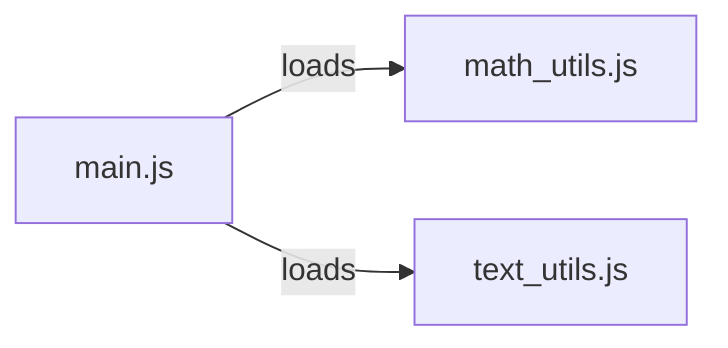

# Level 1

## Table of Contents: Modules

- [Understanding Modules](#understanding-modules)
- [Importing Built-in Modules](#importing-built-in-modules)
- [Creating Your Own Module](#creating-your-own-module)
- [Importing Your Own Module](#importing-your-own-module)

**Modules Level 1** introduces the basic ways Node.js programs are divided into modules. You will learn what a module is, how to use built-in modules provided by Node.js, how to create your own module, and how to load it into another file.

## Understanding Modules

A **module** is a file containing JavaScript code that can be used by other files. As a program grows, keeping all of its code in a single file becomes difficult to navigate and maintain. Modules address this by letting a program be divided into smaller pieces, where each file focuses on a specific part of the program.



Node.js treats each file as its own module. Code in one file is not automatically visible to other files. To share code, a file must explicitly add it to its **module exports**, and another file must explicitly **require** it. This level covers the CommonJS module format, which uses the `require` function and `module.exports`. The ES module format and module configuration are covered in **Modules Level 2**.

Modules can come from different sources. We will begin with modules that Node.js already provides and see how they can be loaded into a program.

## Importing Built-in Modules

Node.js provides **built-in modules** that perform common tasks such as working with file paths, the operating system, and the file system. A built-in module is loaded by passing its name to the `require` function.

```js
const path = require("node:path");

console.log(path.sep); // Displays \ on Windows or / on macOS and Linux
```

This example loads the `node:path` module and reads its `sep` property, which represents the platform-specific path separator. The `node:` prefix identifies a built-in module, but it is not required for most built-in modules. For example, `require("node:path")` and `require("path")` both load the built-in `path` module. The same applies to built-in modules such as `os` and `fs`. Using the `node:` prefix makes it explicit that the module is provided by Node.js.

```js
const path = require("path");
const os = require("os");
const fs = require("fs");
```

!!! tip "Inspecting a Module"

    A quick way to see what a module provides is to display the whole module object.

    ```js
    const os = require("os");

    console.log(os); // Displays the object containing the module's exported values
    ```

    The module object contains everything the module exports.

Built-in modules provide functionality that is already available in Node.js, but programs often need modules that contain project-specific code. The next section shows how to create such a module and choose which values it makes available to other files.

## Creating Your Own Module

A file can make values available to other files by adding them to its **`module.exports`** object. This object is provided by Node.js in every CommonJS module and starts out empty.

```js
// math_utils.js
function add(a, b) {
    return a + b;
}

const PI = 3.14159;

module.exports = { add, PI };
```

This module exports a function named `add` and a constant named `PI`. Multiple values can be exported from a single module by placing them on the `module.exports` object.

Exporting values makes them available to other modules, but another file must still load the module before it can use those values. The next section connects these two parts by requiring the module we just created.

## Importing Your Own Module

Another file can use the exported values by **requiring** the module. A module created as part of a project is required using a relative path that starts with `./`.

```js
// index.js
const { add, PI } = require("./math_utils.js");

console.log(add(2, 3)); // 5
console.log(PI); // 3.14159
```

This example requires `math_utils.js`, takes its `add` and `PI` exports, and uses them in `main.js`. The destructuring form `const { add, PI } = ...` picks specific values from the exported object.

The entire exported object can also be assigned to a variable instead of destructuring its values.

```js
// main.js
const math = require("./math_utils.js");

console.log(math.add(2, 3)); // 5
console.log(math.PI); // 3.14159
```

In this form, `require("./math_utils.js")` returns the object exported by `math_utils.js`. The `math` variable refers to that object, so its exported values can be accessed through `math.add` and `math.PI`. Both approaches load the same module. Destructuring creates variables for selected exports, while assigning the whole object keeps the module name visible when its values are used.

The two files might be organized in a project folder like this.

```text
calculator_app/
├── main.js
└── math_utils.js
```

When `node main.js` is run, Node.js loads `math_utils.js`, makes its exports available to `main.js`, and executes the program.

Built-in modules are referenced by name, while modules created in the project are referenced by a relative path. Together, `module.exports` and `require` allow a program to be divided into focused, reusable files. With these CommonJS basics established, **Modules Level 2** builds on them by examining the ES module format, default and named exports, module configuration through `package.json`, and how Node.js locates modules it loads.
