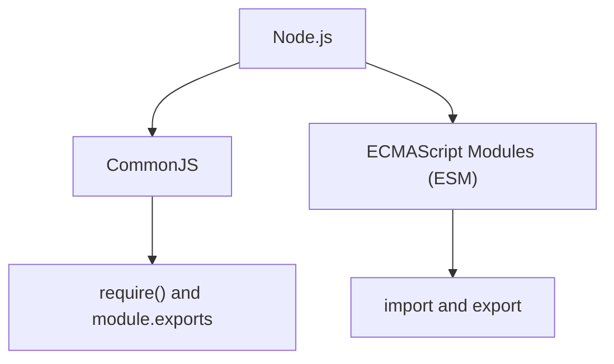
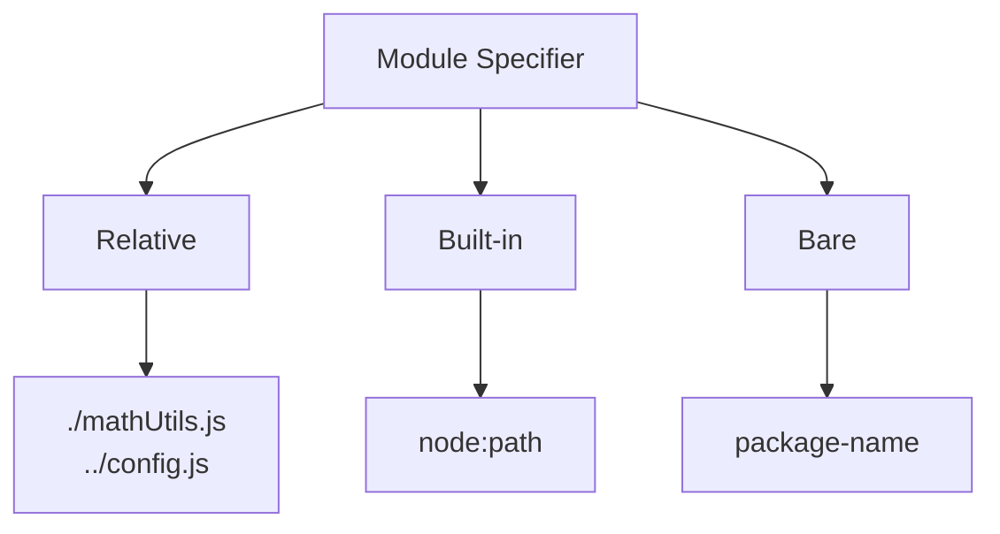

# Level 2

## Table of Contents: Modules

- [Understanding ES Modules in Node.js](#understanding-es-modules-in-nodejs)
- [Creating Default and Named Exports](#creating-default-and-named-exports)
- [Importing ES Modules with `import`](#importing-es-modules-with-import)
- [Re-exporting Modules and Creating Barrel Files](#re-exporting-modules-and-creating-barrel-files)
- [Importing Built-in Modules with `import`](#importing-built-in-modules-with-import)
- [How Node.js Resolves Module Specifiers](#how-nodejs-resolves-module-specifiers)

**Modules Level 2** introduces **ECMAScript modules**, usually called **ES modules** or **ESM**, as the standardized JavaScript module format supported by modern Node.js. You will learn how Node.js recognizes ES modules, how default and named exports work, how modules can be imported and re-exported, and how Node.js interprets different module specifiers.

## Understanding ES Modules in Node.js

Node.js supports two major module formats. **CommonJS**, introduced in **Modules Level 1**, is the older Node.js module system, while **ECMAScript modules** are defined by the JavaScript language standard. Modern Node.js supports both.



The important distinction at this **Modules Level 2** is the syntax each format uses. CommonJS works with `require()` and `module.exports`, while ESM uses the standardized `import` and `export` syntax.

For Node.js to interpret `.js` files as ES modules, the project can declare `"type": "module"` in `package.json`. Alternatively, the `.mjs` extension explicitly identifies an individual file as an ES module without requiring that package setting. The examples in this **Modules Level 2** use `.js` files and assume the project is configured with `"type": "module"`.

```text
project/
├── package.json
├── main.js
├── calculateTotal.js
└── mathUtils.js
```

Here, `package.json` configures the project's `.js` files to use ESM. With that configuration established, the next section introduces **default exports** and **named exports**.

## Creating Default and Named Exports

An ES module can expose values through **default exports** and **named exports**. A module can have one default export, which represents its primary exported value, and multiple named exports, which are exposed under specific names.

A default export can be declared first and exported afterward.

```js
// calculateTotal.js
function calculateTotal(price, quantity) {
    return price * quantity;
}

export default calculateTotal;
```

The declaration and export can also be combined.

```js
// calculateTotal.js
export default function calculateTotal(price, quantity) {
    return price * quantity;
}
```

Both forms create the same default export. The difference is whether the declaration and export are written separately or as one statement.

Named exports can likewise be exported with their declarations or collected in an export list.

```js
// mathUtils.js
export function add(a, b) {
    return a + b;
}

export function subtract(a, b) {
    return a - b;
}

export const PI = 3.14159;

export default function multiply(a, b) {
    return a * b;
}
```

The same named exports can instead be declared first and exported together.

```js
// mathUtils.js
function add(a, b) {
    return a + b;
}

function subtract(a, b) {
    return a - b;
}

const PI = 3.14159;

function multiply(a, b) {
    return a * b;
}

export { add, subtract, PI };
export default multiply;
```

Exporting with each declaration makes exported values visible where they are defined, while an export list groups the module's public interface in one place.

!!! note "Choosing an export style"

    A default export often fits a module whose main purpose is to provide one function or class. Named exports are useful when a module provides several related values or operations, such as a collection of utility functions.

Defining exports determines what a module makes available. The next step is to import those values into another module.

## Importing ES Modules with `import`

ES module imports reflect the way values were exported. A **default import** is written without braces, while **named imports** are written inside braces.

```js
// main.js
import calculateTotal from "./calculateTotal.js";
import { add, subtract, PI } from "./mathUtils.js";

console.log(calculateTotal(12, 3)); // 36
console.log(add(8, 2)); // 10
console.log(subtract(8, 2)); // 6
console.log(PI); // 3.14159
```

The importing module chooses the local name of a default import. Named imports normally use their exported names, but `as` can assign a different local name.

```js
import total from "./calculateTotal.js";
import { add as addNumbers } from "./mathUtils.js";

console.log(total(12, 3)); // 36
console.log(addNumbers(4, 5)); // 9
```

A module that provides both a default export and named exports can import them together in one statement.

```js
import multiply, { add, PI } from "./mathUtils.js";
```

Here, `multiply` is the default import, while `add` and `PI` are named imports from the same project module.

Instead of importing named exports individually, `import * as` collects the module's exports into a **module namespace object**.

```js
import * as math from "./mathUtils.js";

console.log(math.add(2, 3)); // 5
console.log(math.PI); // 3.14159
console.log(math.default(4, 5)); // 20
```

Named exports are accessed as properties such as `math.add`, while the module's default export is available as `math.default`.

!!! info "Import declarations are static"

    Static `import` declarations are written at the top level of an ES module rather than inside functions, loops, or conditionals. They are processed before the module's code runs, so they can be used before their position in the source file. When a module needs to be loaded conditionally or during execution, JavaScript provides the separate dynamic `import()` expression.

Relative ES module specifiers in Node.js use complete filenames, including extensions such as `.js`.

!!! warning "Include the extension in relative ES module imports"

    Use complete relative specifiers such as `./mathUtils.js`. Writing `./mathUtils` does not automatically resolve to `./mathUtils.js` in Node.js ESM.

These imports connect one module directly to another. When several related modules should be accessed through one shared entry point, ES modules can re-export their values.

## Re-exporting Modules and Creating Barrel Files

An ES module can **re-export** values from other modules through a shared entry point. A file used mainly for this purpose is commonly called a **barrel file**.

Consider a utility directory with separate modules for mathematical and text operations.

```text
utils/
├── index.js
├── math.js
└── text.js
```

The individual files define their own named exports.

```js
// utils/math.js
export function add(a, b) {
    return a + b;
}

// utils/text.js
export function capitalize(value) {
    return value.charAt(0).toUpperCase() + value.slice(1);
}
```

The `index.js` barrel can re-export selected values without first importing them into local variables.

```js
// utils/index.js
export { add } from "./math.js";
export { capitalize } from "./text.js";
```

Other modules can then import both values through the shared entry point.

```js
import { add, capitalize } from "./utils/index.js";

console.log(add(2, 3)); // 5
console.log(capitalize("node")); // Node
```

This can make imports easier to manage when a larger application contains many related modules or deeply nested paths. When a barrel exposes many named exports, `export * from` can forward them without listing each name individually.

```js
// utils/index.js
export * from "./math.js";
export * from "./text.js";
```

The `*` forwards named exports but does not forward a module's default export. A default export must be re-exported explicitly when it should become part of the barrel's interface.

For example, suppose `calculateTotal.js` is located in the project root while the barrel file is located at `utils/index.js`. Because the barrel must move up one directory to reach `calculateTotal.js`, the relative path begins with `../`.

```js
// utils/index.js
export { default as calculateTotal } from "../calculateTotal.js";
```

Here, the default export from `calculateTotal.js` becomes the named export `calculateTotal` of the barrel.

!!! info "Barrel files are optional"

    A barrel is an organizational convenience rather than a requirement of ES modules. For a small group of files, direct imports may remain simpler and make the source of each value more obvious.

Re-exports organize modules created inside a project. The same ES module syntax can also load modules supplied directly by Node.js.

## Importing Built-in Modules with `import`

Node.js built-in modules can be loaded with ES module syntax. The `node:` prefix explicitly identifies a module as being provided by Node.js.

```js
import path from "node:path";

console.log(path); // Displays the module object
```

The prefix can be omitted for most built-in modules, so `"node:path"` and `"path"` refer to the same built-in module.

```js
import pathWithPrefix from "node:path";
import pathWithoutPrefix from "path";

console.log(pathWithPrefix === pathWithoutPrefix); // true
```

Using `node:` makes the source of the module immediately clear. Built-in modules can also provide named exports using the same syntax already introduced for project modules.

```js
import path, { basename } from "node:path";
```

Here, `path` is the default import and `basename` is a named import.

Project files and built-in modules use different strings inside their import statements. These strings are **module specifiers**, and their form tells Node.js what kind of module it should locate.

## How Node.js Resolves Module Specifiers

A **module specifier** is the string that tells Node.js what an `import` statement should load. The examples in this level use three main forms.



Relative specifiers begin with `./` or `../` and identify files relative to the importing module. Built-in specifiers such as `"node:path"` identify modules provided by Node.js. The remaining form is the **bare specifier**, which does not begin with `./`, `../`, or `node:` and commonly identifies a package.

For example, after the `express` package has been installed into the project, it can be imported using its package name.

```js
import express from "express";
```

Here, `"express"` is interpreted as a package specifier rather than a project file. Node.js uses package resolution rules to locate the package and determine which module it exposes. Those rules can involve `node_modules` and metadata in `package.json`, but their detailed behavior belongs in later module material.

!!! warning "Project files need a relative path"

    `"mathUtils.js"` and `"./mathUtils.js"` are not equivalent. The `./` prefix tells Node.js to look for a file relative to the importing module, while `"mathUtils.js"` is interpreted as a bare specifier.

Relative, built-in, and bare specifiers give Node.js the information it needs to determine where an imported module comes from. With the main ES module syntax and specifier forms established, **Modules Level 3** can examine interoperability, module resolution, and caching in greater depth.
