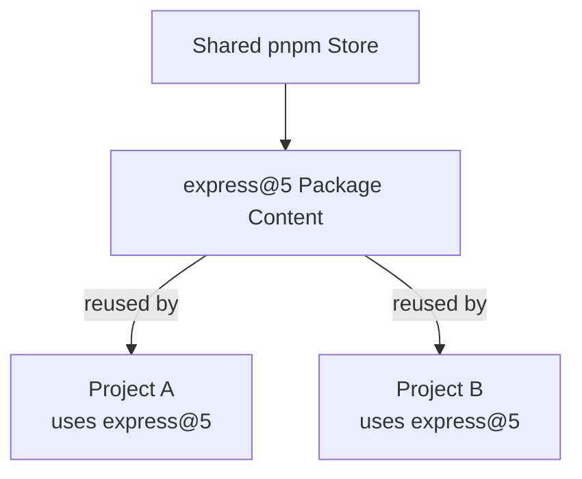
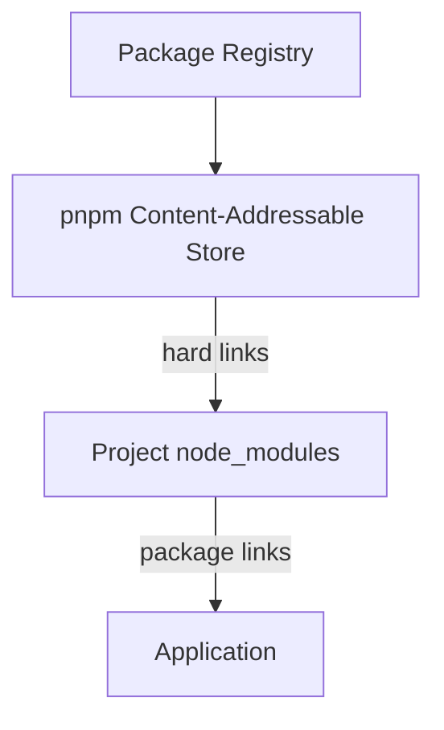

# Level 2

## Table of Contents: Package Management

- [Why Alternative Package Managers Exist](#why-alternative-package-managers-exist)
- [pnpm: Installation and Basic Commands](#pnpm-installation-and-basic-commands)
- [How pnpm Manages Dependencies](#how-pnpm-manages-dependencies)

**Package Management Level 2** builds on the npm fundamentals introduced in **Package Management Level 1** by introducing **pnpm**, an alternative package manager that uses the familiar `package.json` dependency model while taking a different approach to storing and linking installed package files.

## Why Alternative Package Managers Exist

A **package manager** installs and maintains a project's dependencies. npm performs these jobs and is included with Node.js, but alternative package managers can use different strategies for installation speed, disk usage, and dependency organization.

One alternative is **pnpm**, which keeps reusable package content in a shared content-addressable store instead of storing completely separate copies for every project.



When multiple projects use the same package version, pnpm can reuse content from this store. This can reduce disk usage and make repeated installations faster when the required content is already available locally. pnpm also uses a stricter dependency layout that helps prevent project code from accidentally relying on packages that were not declared as direct dependencies. These characteristics can be particularly useful when working with many projects or larger codebases.

Like npm, pnpm downloads packages from the **npm registry** introduced in **Package Management Level 1**. It also continues to use `package.json` for project dependencies, while `pnpm-lock.yaml` records the resolved dependency versions needed to reproduce an installation. Switching to pnpm therefore changes how dependencies are managed locally without changing the registry from which packages are normally obtained.

!!! info "Choosing pnpm"

    pnpm is an alternative rather than a requirement. npm remains a valid choice for Node.js projects, while pnpm can be useful when reducing duplicated package files, improving repeated installation efficiency, or enforcing clearer dependency boundaries is valuable.

!!! info "One package manager per project"

    A project should normally use the lockfile created by its chosen package manager. For a pnpm project, commit `pnpm-lock.yaml` and avoid maintaining npm's `package-lock.json` for the same dependency installation.

With the reasons for choosing pnpm established, the next section introduces the commands used to install pnpm, manage dependencies, and run project scripts.

## pnpm: Installation and Basic Commands

**pnpm** is available through the official [pnpm website](https://pnpm.io/), which provides installation instructions, documentation, and additional information about the package manager. If Node.js and npm are already installed, pnpm can be installed globally through npm. After the installation finishes, `pnpm --version` verifies that the command is available.

```bash
npm install -g pnpm
pnpm --version
```

Once pnpm is available, its basic dependency-management workflow is similar to npm. `pnpm install` installs the dependencies declared in `package.json` and creates or updates `pnpm-lock.yaml`. Packages can then be added, removed, or updated with the corresponding commands.

```bash
pnpm install # Install dependencies from package.json
pnpm add express # Add Express as a regular dependency
pnpm add -D eslint # Add ESLint as a development dependency
pnpm remove express # Remove Express from the project
pnpm update # Update installed dependencies
```

By default, `pnpm add` records a package in `dependencies`, while the `-D` option, which is short for `--save-dev`, records development-only tools such as ESLint in `devDependencies`. pnpm can also execute scripts defined in `package.json` with `pnpm run <script>`. For common script names such as `start`, the shorter `pnpm start` form can be used.

```bash
pnpm run start # Run the start script
pnpm start # Shorter form for the start script
```

These commands make the everyday pnpm workflow familiar, but the main difference from npm lies beneath those commands. The next section explains how pnpm stores package content and connects dependencies to a project.

## How pnpm Manages Dependencies

A traditional `node_modules` installation can contain repeated physical copies of the same package files across different projects. pnpm instead keeps package content in a **content-addressable store** and links that content into projects that need it.



When pnpm downloads package content that is not already available locally, it places that content in the store. Files from the store are hard-linked into pnpm's internal structure inside the project's `node_modules`, while symbolic links connect dependencies into the structure used by the project. Because identical package content can be reused, several projects can depend on the same package version without requiring a completely independent physical copy of its files for each project.

This layout also keeps dependency access more explicit. A package declared directly by the application is a **direct dependency**, while a package required by another dependency is a **transitive dependency**. Suppose an application installs `package-a`, which itself depends on `package-b`.

```text
application
└── package-a
    └── package-b
```

The application declares and uses `package-a` directly, while `package-b` exists because `package-a` requires it. pnpm's default dependency layout helps prevent application code from accidentally relying on undeclared packages simply because another dependency installed them.

!!! note "Do not edit node_modules manually"

    The links and internal directories inside `node_modules` are managed by pnpm. Application code should depend on packages declared in `package.json` rather than on the physical layout pnpm creates internally.

The storage strategy does not change the role of the project's package-management files. `package.json` declares the dependencies the project needs, while `pnpm-lock.yaml` records the resolved dependency graph used to reproduce the installation.

```text
project/
├── node_modules/
├── package.json
└── pnpm-lock.yaml
```

With the basic pnpm workflow and dependency-storage model established, **Package Management Level 3** turns toward distribution with reproducible installations using `npm ci`, auditing dependencies for vulnerabilities, and publishing a package to the npm registry.
