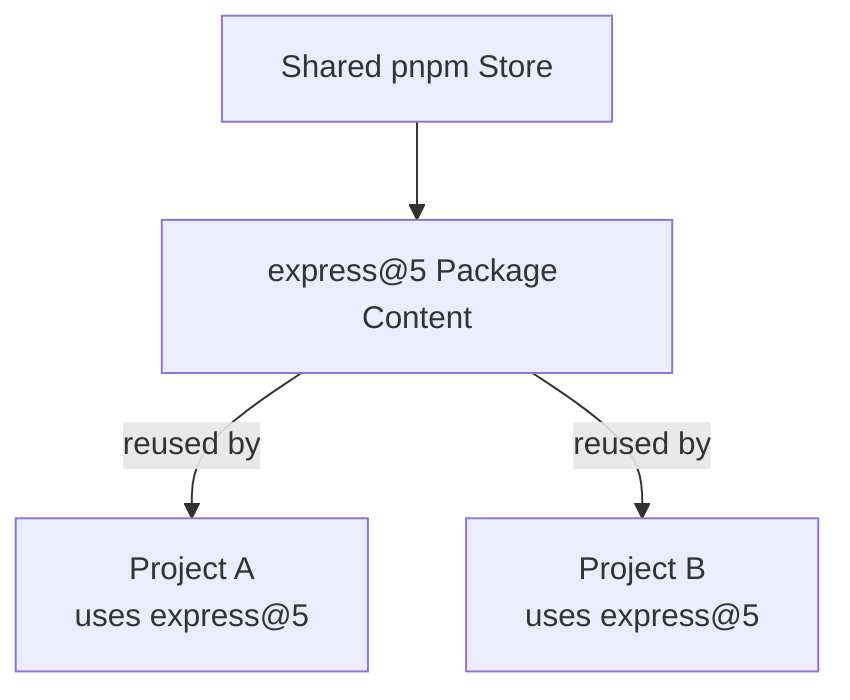

# Summary

This summary brings together the most important concepts from the **Package Management** module. It is designed as a quick reference for revision and preparation for questions where the main concepts, relationships, commands, and differences need to be explained clearly.

## Table of Contents: Package Management

- [Level 1](#level-1)
- [Level 2](#level-2)

## Level 1

Level 1 establishes the foundations of **packages, dependencies, npm, the npm registry, package versions, dependency categories, project package files, npm scripts, `npx`, and local and global installations**. The main goal is to understand how npm records, installs, maintains, and runs packages and package-related commands in a Node.js project.

A Node.js project that uses external packages normally records its package information in **`package.json`**. The file can contain project metadata, dependency declarations, and scripts. It can be created interactively with `npm init` or created with default values by using `npm init -y`.

```bash
npm init # Create package.json interactively
npm init -y # Create package.json with default values
```

A **package** is a collection of reusable code or tooling together with metadata that describes it. When a project requires another package to run or support development, that package becomes a **dependency**. A **package manager** manages these packages and their dependency relationships by installing, updating, removing, and tracking the packages required by a project.

**npm** is the package manager commonly distributed with Node.js. The npm command line tool performs package-management operations on the local computer, while the **npm registry** provides published packages that npm can retrieve. Packages in the public registry can also be searched and explored through the npm website at [npmjs.com](https://www.npmjs.com/), making it possible to examine a package before installing it.

A package is installed locally with `npm install` followed by the package name. npm records a regular installed package under `dependencies` in `package.json`.

```bash
npm install is-odd # Install one package
npm install is-odd is-even # Install multiple packages
npm install # Install dependencies declared by the project
```

Package releases commonly use **semantic versioning**, or **SemVer**, written as `MAJOR.MINOR.PATCH`. A major version represents incompatible changes, a minor version represents compatible new functionality, and a patch version represents compatible fixes. npm can also install a particular package version by placing `@` after the package name.

```bash
npm install is-odd@3.0.1
```

A dependency declaration can use a **version range**. For ordinary versions at or above `1.0.0`, a caret such as `^2.4.1` allows compatible updates below `3.0.0`, while a tilde such as `~2.4.1` allows patch updates below `2.5.0`. Writing `2.4.1` without a range prefix requests that exact version.

```json
{
  "dependencies": {
    "package-a": "^2.4.1",
    "package-b": "~2.4.1",
    "package-c": "2.4.1"
  }
}
```

npm commonly separates declared packages into **`dependencies`** and **`devDependencies`**. Packages required for the application's normal runtime behavior belong in `dependencies`, while tools needed only during development, testing, formatting, or similar work belong in `devDependencies`.

```bash
npm install is-odd # Record a runtime dependency
npm install --save-dev eslint # Record a development dependency
```

A local installation normally creates **`node_modules`**, which contains installed package files and packages required by those dependencies. npm also creates or updates **`package-lock.json`**, which records the concrete dependency resolution produced by npm. `package.json` describes the project's declared dependency requirements, while `package-lock.json` records the resolved installation. `node_modules` is normally generated rather than committed to version control, while `package.json` and `package-lock.json` are normally kept with the project.

```text
example-project/
├── node_modules/
├── package.json
├── package-lock.json
└── index.js
```

npm provides commands for inspecting and maintaining packages. `npm view` reads published package metadata from the registry, `npm list` displays installed dependencies, `npm outdated` checks for newer versions, `npm update` updates dependencies within allowed ranges, and `npm uninstall` removes a dependency.

```bash
npm view is-odd  # View published package metadata
npm list --depth=0 # View top level installed packages
npm outdated # Check for available updates
npm update # Update within allowed ranges
npm uninstall is-odd # Remove a package
```

The `scripts` property in `package.json` defines named project commands called **npm scripts**. These scripts provide consistent commands for tasks such as starting an application, running tests, or formatting code.

```json
{
  "scripts": {
    "start": "node index.js",
    "test": "node test.js",
    "format": "prettier --write ."
  }
}
```

Scripts can normally be executed with `npm run <script>`, while common script names such as `start` and `test` also have shorter forms.

```bash
npm run format
npm start
npm test
```

**`npx`** runs commands provided by npm packages without requiring those tools to be installed globally. When a package is already installed in the current project, `npx` can run the executable provided by that local dependency. For example, if ESLint is installed as a development dependency, its command can be executed through `npx`.

```bash
npm install --save-dev eslint  # Install ESLint in the project
npx eslint . # Run the locally installed ESLint command
```

`npx` can also execute a package command when the package is not already installed locally. npm can obtain the required package for the command without adding it to the project's dependencies. This makes `npx` useful for running package command-line tools without requiring a permanent global installation.

Packages can also be installed **globally**, which manages them outside a single project's local dependency set. Global installation is mainly useful for command line tools intentionally designed to be available across projects. Packages required by a project's code should normally remain local dependencies recorded in that project's `package.json`.

```bash
npm install --global package-name
npm list --global --depth=0
npm uninstall --global package-name
```

After reviewing Level 1, you should be able to explain **what packages, dependencies, and package managers are**, describe the roles of **npm and the npm registry**, create and interpret **`package.json`**, install and maintain packages, explain **semantic versioning and common version ranges**, distinguish **`dependencies` from `devDependencies`**, describe the roles of **`node_modules` and `package-lock.json`**, define and run **npm scripts**, explain how **`npx` runs package commands without requiring a global installation**, and distinguish **local from global package installation**.

## Level 2

Level 2 builds on the npm workflow by introducing **pnpm, alternative package managers, the content-addressable store, package linking, and direct and transitive dependencies**. The main goal is to understand why a project might choose pnpm and how its local dependency-storage model differs from a traditional npm installation.

**pnpm** is an alternative package manager that continues to use familiar project concepts such as `package.json` while managing installed package content differently. By default, pnpm can retrieve packages from the same **npm registry** used with npm, but it stores reusable package content in a shared **content-addressable store**.

When multiple projects use the same package version, pnpm can reuse package content from this shared store instead of requiring a completely independent physical copy for every project. This can reduce disk usage and can make repeated installations faster when the required package content is already available locally.



pnpm is an alternative rather than a requirement. npm remains a valid package manager for Node.js projects, while pnpm can be useful when reducing duplicated package files, improving repeated installation efficiency, or enforcing clearer dependency boundaries is valuable.

If Node.js and npm are already installed, pnpm can be installed globally through npm. The installed pnpm version can then be checked with `pnpm --version`.

```bash
npm install -g pnpm
pnpm --version
```

The everyday pnpm command workflow is similar to npm. `pnpm install` installs dependencies declared in `package.json`, `pnpm add` adds packages, `pnpm remove` removes a package, and `pnpm update` updates installed dependencies. pnpm records its resolved dependency information in **`pnpm-lock.yaml`**.

```bash
pnpm install # Install dependencies from package.json
pnpm add express # Add a regular dependency
pnpm add -D eslint # Add a development dependency
pnpm remove express # Remove a package
pnpm update # Update installed dependencies
```

By default, `pnpm add` records a package in `dependencies`, while `-D`, which is short for `--save-dev`, records a development-only package in `devDependencies`. pnpm can also run scripts defined in `package.json`.

```bash
pnpm run start
pnpm start
```

The main difference appears in how pnpm manages installed package content. Package content that is not already available locally is placed in the **content-addressable store**. Files from the store are hard-linked into pnpm's internal structure inside the project's `node_modules`, while symbolic links connect dependencies within the structure pnpm creates for the project. This allows identical package content to be reused instead of being stored independently for every project that needs it.

A dependency declared directly by the application is a **direct dependency**. A package required by another dependency is a **transitive dependency**. Conceptually, if an application declares `package-a` and `package-a` requires `package-b`, the dependency relationship looks like this.

```text
application
└── package-a
    └── package-b
```

Here, `package-a` is a direct dependency of the application, while `package-b` is a transitive dependency. pnpm's stricter dependency layout helps prevent application code from accidentally relying on undeclared packages simply because another dependency installed them.

The choice of package manager also determines the lockfile used for the project. An npm project normally keeps `package-lock.json`, while a pnpm project uses `pnpm-lock.yaml`. A project should normally use the lockfile produced by its chosen package manager rather than maintaining competing lockfiles for the same dependency installation.

```text
project/
├── node_modules/
├── package.json
└── pnpm-lock.yaml
```

After reviewing Level 2, you should be able to explain **why alternative package managers exist**, describe why a project might choose **pnpm**, recognize that pnpm can use the **npm registry** while managing package content differently, install pnpm and use its basic commands, explain the purpose of **`pnpm-lock.yaml`**, describe the **content-addressable store**, explain how package content is reused through pnpm's linking strategy, distinguish **direct from transitive dependencies**, and describe how pnpm's dependency layout helps enforce clearer dependency boundaries.
