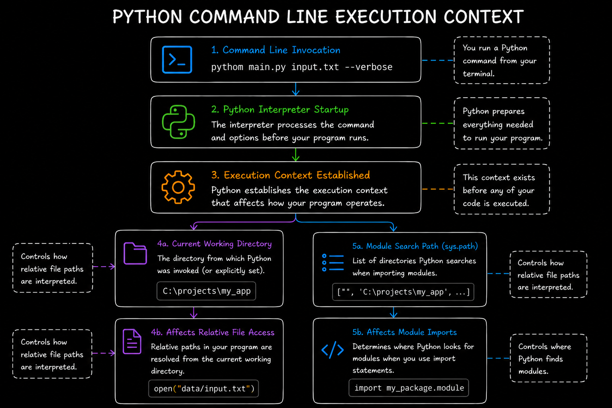

# Level 2

## Table of Contents: Command Line

- [How the Command Line Controls Execution](#how-the-command-line-controls-execution)
- [Working Directory and File Execution](#working-directory-and-file-execution)
- [Module Search and sys.path](#module-search-and-syspath)
- [Running Modules](#running-modules)
- [Working with Command Line Arguments](#working-with-command-line-arguments)
- [Exit Codes](#exit-codes)

**Command Line Level 2** builds on the operations introduced in **Command Line Level 1** by examining the execution context, working directory, module search path, and module execution. We will also extend our use of `sys.argv` to validate arguments and use exit codes to communicate whether a program completed successfully.

## How the Command Line Controls Execution

How Python is invoked affects more than which code is executed. Before user code begins running, the interpreter processes the command and establishes an **execution context** that affects how the program operates. This context includes the current working directory and the locations Python uses when searching for modules.



These details become important as programs grow beyond a single file. We will begin with the current working directory and its effect on file execution.

## Working Directory and File Execution

A Python program runs with a **current working directory**, which is normally the directory from which the Python command was executed. Suppose the terminal is currently inside a directory named `project`.

```bash
cd project
python main.py
```

In this case, `project` is the current working directory. Suppose `main.py` opens a relative path.

```py
with open("data/input.txt") as file:
    print(file.read()) # Display the file's contents
```

Python looks for `data/input.txt` relative to the current working directory, regardless of where `main.py` is located. This distinction becomes clearer when a script is executed from another directory. Suppose the project has the following structure.

```text
project/
├── scripts/
│   └── main.py
└── data/
    └── input.txt
```

If the command is executed from `project`, the current working directory remains `project` even though the script is inside `scripts`.

```bash
python scripts/main.py
```

The relative path therefore still refers to `project/data/input.txt`. The same principle applies when the script is identified with an **absolute path**.

```bash
# macOS and Linux
python /home/user/project/scripts/main.py
# Windows
python C:\Users\User\project\scripts\main.py
```

An absolute path identifies the script without changing the current working directory.

!!! warning "Script location and working directory"

    The script path determines which file Python executes, while the current working directory affects how relative paths used by the program are resolved. Do not assume that relative file paths are resolved from the script's directory.

The working directory also interacts with Python's module search process. The next section examines how Python finds modules and why imports can behave differently from relative file access.

## Module Search and sys.path

Before executing user code, Python constructs a list of locations that it can search when resolving imports. This list is available through `sys.path`.

```py
import sys
print(sys.path) # Display the module search locations
```

When a Python file is executed directly, the directory containing that script is normally placed at the beginning of the module search path. For example, running `python scripts/main.py` places the `scripts` directory first in the search path. **Relative file paths are interpreted from the current working directory, while the initial module search location for a directly executed script is based on the script's directory.**

A script may therefore successfully import a module located beside itself while a relative file path refers to a different directory. This difference becomes especially important when Python executes a module by name rather than running a script file directly.

## Running Modules

**Command Line Level 1** focused on executing Python files directly. Python can also execute a **module** by name with the `-m` option. Instead of receiving a direct filesystem path to a script, Python uses its import system to locate the specified module or package and execute it. This is particularly useful when code is organized into packages. Consider the following structure.

```text
project/
└── my_package/
    ├── __init__.py
    ├── __main__.py
    └── utils.py
```

From the `project` directory, the package can be executed by name.

```bash
python -m my_package
```

For a package executed this way, Python runs its `__main__.py` module. The `-m` option can also execute individual modules, including modules provided by Python's standard library.

```bash
# Start a simple HTTP server
python -m http.server
# Create a virtual environment
python -m venv .venv
```

Running a file directly and running a module use different ways to identify the code that should execute.

```bash
# Execute the file directly
python my_package/__main__.py

# Execute the package by name
python -m my_package
```

The first command identifies a file by its filesystem path, while the second identifies a package through Python's import system. This difference also affects the initial module search path. When a script file is executed directly, the script's directory is normally placed first in `sys.path`. When `-m` is used, the current working directory is used as the initial search location instead.

The invocation method can also affect `sys.argv[0]`. When a script is executed directly, it normally represents the script path supplied for execution. When `-m` is used, Python locates the module first and `sys.argv[0]` normally refers to the resulting module file rather than simply containing the module name from the command.

For package based projects, module execution is often preferable because Python locates and executes the code according to the package structure rather than treating one file as an independently executed script. The next section examines how a program receives and validates arguments supplied when it starts.

## Working with Command Line Arguments

**Command Line Level 1** introduced how arguments written after the script name are delivered to a program through `sys.argv`. At this level, we will access individual arguments, check that required values exist, and validate them before the program continues. Consider the following command.

```bash
python main.py input.txt --verbose # ['main.py', 'input.txt', '--verbose']
```

Here, `input.txt` provides a value to the program, while `--verbose` is a **flag** that can enable a particular behavior, such as displaying more detailed output. Both are passed to `main.py` for the program to interpret. Inside the program, `sys.argv` contains the values in the order in which they appeared. The first element identifies the script or executable target associated with the invocation, while the remaining elements contain the supplied arguments. The exact value of the first element can depend on how Python was started, as we saw with `-m`.

```py
import sys

program_name = sys.argv[0]
input_file = sys.argv[1]
option = sys.argv[2]

print(program_name) # main.py
print(input_file) # input.txt
print(option) # --verbose
```

Accessing an index that does not exist raises an `IndexError`. If `python main.py` is executed without an additional argument, `sys.argv[1]` does not exist. A program should therefore check that required arguments are available before accessing them. The expression `sys.argv[1:]` represents all arguments after the program reference. If there are no additional arguments, the resulting list is empty and the condition becomes true, allowing the program to exit before attempting to access a missing value.

```py
import sys

if not sys.argv[1:]:
    print("Provide an input file")
    sys.exit(1)

input_file = sys.argv[1]
print(input_file) # input.txt
```

An alternative is to handle the `IndexError` directly with `try` and `except`. This approach is useful when code needs to respond to an attempted access that fails.

```py
import sys
try:
    input_file = sys.argv[1]
except IndexError:
    print("Provide an input file") # Displayed when the argument is missing
    sys.exit(1)
print(input_file) # input.txt
```

Checking first is often clearer when the program already knows how many values it requires, while exception handling responds directly to an unsuccessful access. When a program expects a specific number of arguments, `len()` can also check the size of `sys.argv`. For example, a program requiring an input filename and an output filename expects three elements, including the program reference at index `0`.

```py
import sys
if len(sys.argv) != 3:
    print("Usage: python main.py input.txt output.txt") # Displayed when the argument count is incorrect
    sys.exit(1)

input_file = sys.argv[1]
output_file = sys.argv[2]

print(input_file) # input.txt
print(output_file) # output.txt
```

Arguments can also be checked for particular values or validated before the program acts on them. The following example combines a required file path, a check that the file exists, and an optional `--verbose` flag.

```py
import os
import sys
if not sys.argv[1:]:
    print("Provide a file path") # Displayed when no path is supplied
    sys.exit(1)

file_path = sys.argv[1]
if not os.path.exists(file_path):
    print("The specified file does not exist") # Displayed when the path does not exist
    sys.exit(1)

print("File found") # Displayed when the path exists

if "--verbose" in sys.argv[2:]:
    # The flag is expected after the file path.
    print("Verbose output enabled") # Displayed when --verbose is supplied
```

The first argument is reserved for the file path, so the optional flag is checked in `sys.argv[2:]`. This example assumes that the file path comes before any optional flags. The existence check does not guarantee that the path refers to a readable file. These checks are basic forms of **argument validation**. Larger command line programs often use dedicated argument parsing tools, which can be introduced in later material. When validation fails, the program may need to stop and report an unsuccessful result. The next section explains how exit codes communicate that result.

## Exit Codes

A command line program can communicate whether it completed successfully through an **exit code**. An exit code of `0` conventionally indicates successful execution, while a nonzero exit code indicates that the program did not complete successfully. Python programs can explicitly choose an exit code with `sys.exit()`.

```py
import sys

if not sys.argv[1:]:
    print("Provide an input file") # Displayed when the argument is missing
    sys.exit(1) # Report unsuccessful completion

print("Argument received") # Displayed when an argument is supplied
sys.exit(0) # Report successful completion
```

Exit codes are especially useful when Python programs are started by other tools, scripts, or automated processes because those programs can inspect the exit code instead of relying on printed output to determine whether the Python program succeeded. A program does not normally need to call `sys.exit(0)` explicitly when execution reaches the end successfully. Python exits with a successful status when the program finishes normally. An explicit `sys.exit()` is most useful when the program needs to stop at a particular point or communicate a particular status.

Together, command line arguments and exit codes allow information to travel in both directions. Arguments provide information to a program when it starts, while exit codes communicate the program's completion status back to the environment that started it.