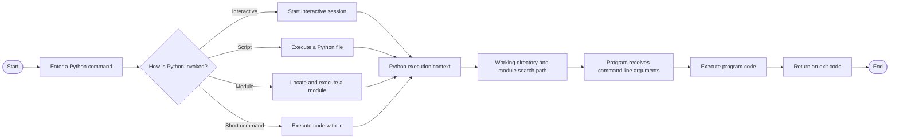

# Overview

The command line provides a way to start Python and control how programs are executed from a terminal or Command Prompt. It allows you to run scripts, execute short commands, pass information to programs, and inspect the Python interpreter. As programs grow beyond a single file, the way they are started also affects their working directory, module search path, and execution context.

Imagine a small project containing a Python script, a package, and a folder of data files. You might run the script directly, execute the package by name, or provide a filename for the program to process. Although these commands may appear similar, they can affect how Python locates code and how the program resolves relative paths. The following diagram illustrates how a command starts Python, establishes an execution context, and communicates information to and from a program.

The different invocation methods show how Python can execute code interactively, from a file, by module name, or through a short command. The **execution context** determines how the program interacts with its environment, while **command line arguments** provide information when the program starts. An **exit code** communicates the result of execution back to the environment that started it. Together, these concepts explain how the command line connects Python programs with the files, modules, and tools around them.

The **Command Line** module develops from foundational interpreter commands and script execution to a deeper understanding of execution context, module loading, argument validation, and program completion. Each level builds on the previous one while introducing tools for running and controlling increasingly complex Python programs.

**Level 1** introduces the foundations of the Python command line. It covers starting the **Python interpreter**, running **Python scripts**, executing short commands with **`-c`**, checking the interpreter version and displaying help, and passing simple **command line arguments** to a program through `sys.argv`.

**Level 2** develops a deeper understanding of how Python executes programs. It explains the **current working directory** and relative file paths, the **module search path** available through `sys.path`, and the difference between running a file directly and executing a module with **`-m`**. It also introduces more detailed **argument validation**, including checking required values and optional flags, and explains how **exit codes** communicate successful or unsuccessful completion.

Together, these concepts provide a foundation for running Python programs with greater confidence and understanding. They help you choose an appropriate execution method, recognize how the environment affects program behavior, validate information supplied to a program, and communicate execution results clearly.
