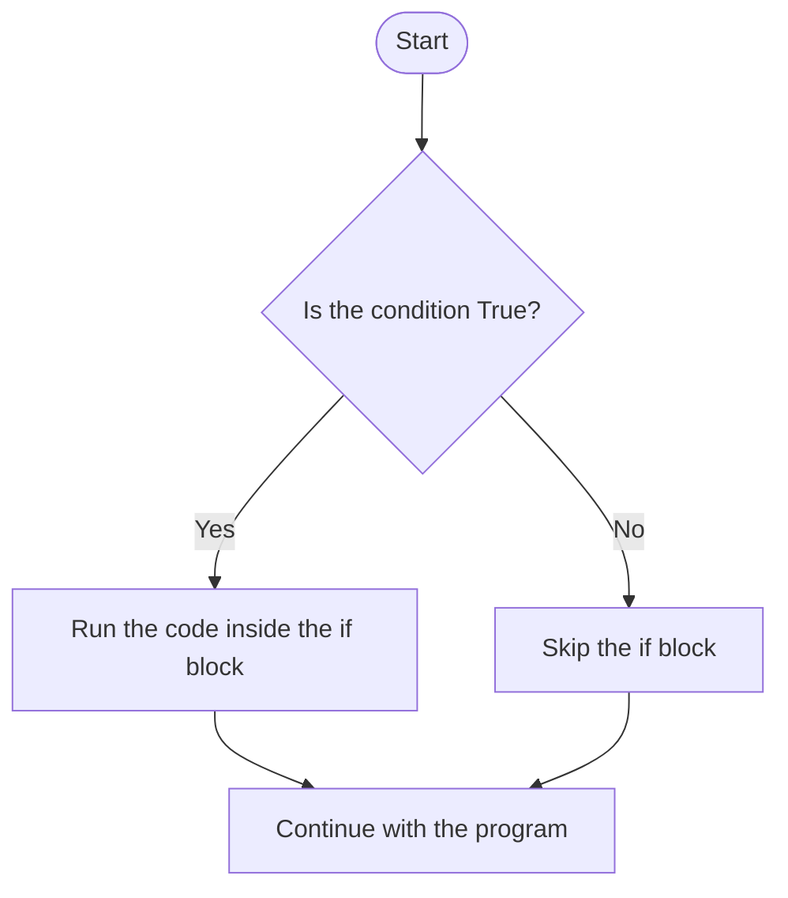
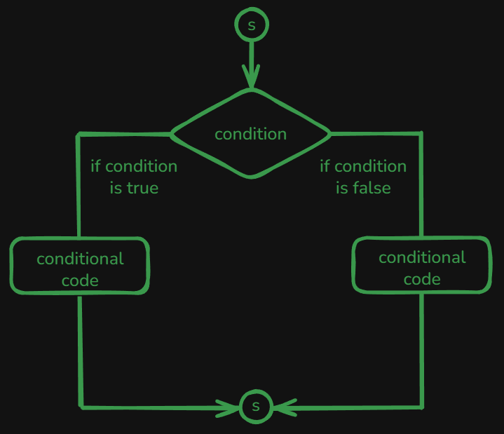
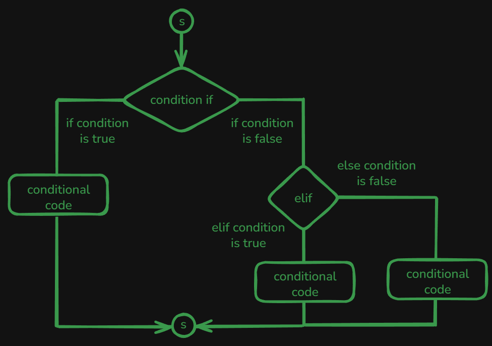
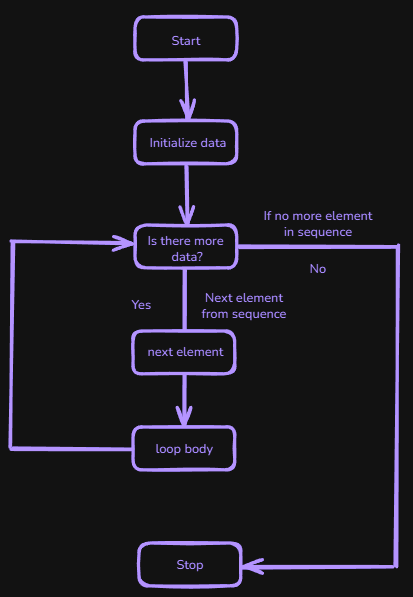
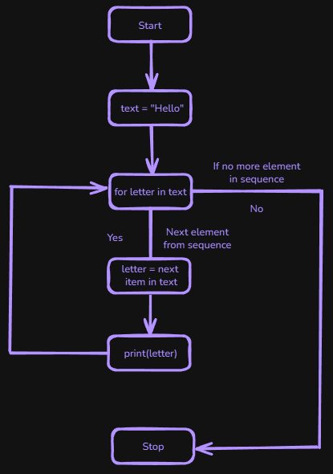
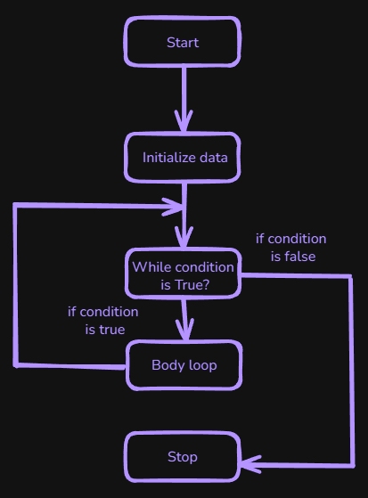
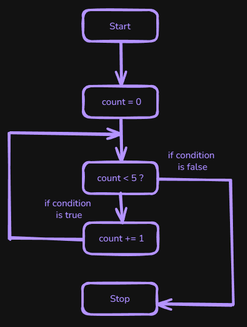

# Table of Contents: Python Control Flow Level 1

- [If Statement](#if-statement)
- [If-Else Statement](#if-else-statement)
- [If-Elif-Else Statement](#if-elif-else-statement)
- [Loops Overview](#loops-overview)
- [For Loop](#for-loop)
- [Enumerate Function](#enumerate-function)
- [Range Function](#range-function)
- [While Loop](#while-loop)

Python programs often need to make decisions and repeat actions. **Control flow** determines which statements run and how many times they run. It allows a program to respond to different conditions and repeat work without writing the same instructions again.

In this **Python Control Flow Level 1**, we begin with conditional statements using `if`, `elif`, and `else`, then move to the basic `for` and `while` loops. We will start with the simplest conditional structure, the `if` statement.

## If Statement

An `if` statement runs a block of code only when its condition evaluates to `True`. It begins with the `if` keyword, followed by a condition and the required colon. The indented statements below it form the code block controlled by that condition.



The basic syntax is shown below.

```py
if condition:
    # code block executed if the condition is True
```

For example, a program can check a temperature before displaying a message.

```py
temperature = 25

if temperature > 20:
    print("It's warm outside") # It's warm outside
```

Because `temperature > 20` is `True`, the indented `print()` call runs. If the condition were `False`, Python would skip that block and continue with the next statement after it. This approach is useful when an action should happen only under one condition, such as displaying a warning, processing a valid record, or enabling a feature for an eligible user.

Python also allows a simple `if` statement to be written on one line, although the normal indented form is usually easier to read and is preferred throughout this course.

```py
if condition: print("Condition is True") # Condition is True
```

Conditions can also combine multiple boolean expressions with logical operators such as `and` and `or`. In the following example, both comparisons must evaluate to `True` because they are joined with `and`.

```py
temperature = 25
humidity = 45

if (temperature > 20) and (humidity < 50):
    print("It's warm and not too humid") # It's warm and not too humid
```

An `if` statement is enough when a program only needs to act when a condition is true. Many decisions, however, require an alternative action when the condition is false. For that situation, Python combines `if` with `else`.

## If-Else Statement

An `if` statement can be combined with `else` when a program needs one action for a true condition and another action for a false condition. This creates two possible branches, but only one of them runs.



The syntax is shown below.

```py
if condition:
    # code block executed if the condition is True
else:
    # code block executed if the condition is False
```

For example, a temperature check can display one message when the condition is true and another when it is false.

```py
temperature = 15

if temperature > 20:
    print("It's warm outside") # It's warm outside
else:
    print("It's not warm outside") # It's not warm outside
```

Because `temperature > 20` is `False`, Python skips the `if` block and runs the `else` block. Use `if-else` when exactly one of two actions should happen, such as accepting or rejecting input, showing an available or unavailable state, or choosing between two processing paths. When a program needs to distinguish between several possible situations, additional conditions can be introduced with `elif`.

## If-Elif-Else Statement

When a program needs to choose between more than two possibilities, one or more `elif` branches can be placed between `if` and `else`. The keyword `elif` means **else if**. Python checks each condition in order until it finds the first one that evaluates to `True`.



The general structure is shown below.

```py
if condition1:
    # code executed if condition1 is True
elif condition2:
    # code executed if condition1 is False
    # and condition2 is True
else:
    # code executed if all previous conditions are False
```

The following example classifies a temperature into one of several ranges.

```py
temperature = 15

if temperature > 30:
    print("It's very hot outside") # Not printed for temperature = 15
elif temperature > 20:
    print("It's warm outside") # Not printed for temperature = 15
elif temperature > 10:
    print("It's cool outside") # It's cool outside
else:
    print("It's cold outside") # Not printed for temperature = 15
```

Python evaluates the conditions from top to bottom. With `temperature` set to `15`, the first two conditions are `False`, while `temperature > 10` is `True`, so Python prints `"It's cool outside"` and skips the final `else` block. The order of conditions matters because once Python finds a true branch, the remaining branches are not evaluated. Use `if-elif-else` when one result must be selected from several ordered possibilities, such as assigning a category, choosing a status, or applying different rules to different value ranges.

Conditional statements allow a program to choose what should happen. The next part of control flow addresses a different problem. Instead of choosing between branches, programs often need to perform the same kind of work repeatedly. Python handles this with loops.

## Loops Overview

A **loop** is a control structure that repeatedly executes a block of code. Instead of writing the same instructions multiple times, a loop allows a program to repeat the same logic as needed.

Python commonly uses two types of loops: a `for` loop repeats work for a sequence of values, while a `while` loop repeats work as long as a condition remains `True`. The appropriate loop depends on what controls the repetition. We will begin with the `for` loop.

## For Loop

A `for` loop takes one value at a time from an iterable and runs the loop body for each value. The loop continues automatically until every available value has been processed.



The basic syntax is shown below.

```py
for item in collection:
    # code block to execute for each item
```

A string is iterable because its characters can be processed one at a time. The following diagram shows this process.



The diagram shows the loop taking one character from the string at a time. In the code below, `letter` receives the current character during each iteration, and Python continues until the string has no characters left to process.

```py
text = "Hello"

for letter in text:
    print("letter:", letter) # Letter: H, then e, l, l, o

print("Done") # Done
```

Use a `for` loop when the same operation should be applied to each value in an iterable, such as validating records, processing files, calculating values, or displaying stored results. The same pattern works with lists because each iteration can receive one list element.

```py
emails = ["user@example.com", "admin", "contact@site.com"]

for email in emails:
    if "@" in email:
        print(f"Valid email: {email}") # Valid email: user@example.com, then contact@site.com
    else:
        print(f"Invalid email: {email}") # Invalid email: admin
```

In this introductory example, `"admin"` is treated as invalid because it does not contain `"@"`. Each email is checked independently using the same conditional logic.

> **Note:** Checking only for `"@"` is a simplified teaching example. Real email validation requires more careful rules.

Tuples are also iterable, so a loop can process their values in order without manually accessing individual positions.

```py
location = (40.7128, -74.0060)

for coordinate in location:
    print(coordinate) # 40.7128, then -74.006
```

Collections can also contain other collections. When a list contains inner lists, each iteration can work with one complete inner list. In the following example, each `day` contains several measurements, and the loop calculates one average for every inner list.

```py
temperatures = [
    [18, 21, 23],
    [17, 20, 22],
    [19, 22, 24]
]

for day in temperatures:
    average = sum(day) / len(day)
    print(f"Average temperature: {average}") # 20.666..., then 19.666..., then 21.666...
```

A list can contain dictionaries when each element represents a record with named information. Each iteration then assigns one complete dictionary to the loop variable.

```py
users = [
    {"name": "Example1", "age": 25},
    {"name": "Example2", "age": 30}
]

for user in users:
    print(f"{user['name']} is {user['age']} years old") # Example1 is 25 years old, then Example2 is 30 years old
```

Lists can contain sets as well. Because a set is iterable, the program can process each stored set and use membership checks on it.

```py
permissions = [
    {"read", "write"},
    {"read", "admin"}
]

for permission_set in permissions:
    if "admin" in permission_set:
        print("Admin access detected") # Admin access detected
```

Lists may also contain tuples. When each tuple has the same number of values, those values can be assigned to separate loop variables during each iteration.

```py
coordinates = [
    (1, 2),
    (3, 4)
]

for x, y in coordinates:
    print(f"x = {x}, y = {y}") # x = 1, y = 2, then x = 3, y = 4
```

Here, the two values from the current tuple are assigned to `x` and `y`. Dictionaries use the same general looping idea, but they provide several ways to choose which part of each entry should be processed.

When a dictionary is used directly in a `for` loop, Python iterates over its keys.

```py
students = {"Example1": 9, "Example2": 8}

for name in students:
    print(f"Checking results for {name}") # Checking results for Example1, then Example2
```

The same behavior can be written explicitly with the `keys()` method.

```py
for name in students.keys():
    print(f"Student: {name}") # Student: Example1, then Student: Example2
```

When only the stored values are needed, `values()` can provide them directly.

```py
for grade in students.values():
    if grade < 9:
        print("Grade below passing level") # Grade below passing level
```

When both a key and its associated value are needed, `items()` provides them together.

```py
for name, grade in students.items():
    print(f"{name} scored {grade}") # Example1 scored 9, then Example2 scored 8
```

A loop can also appear inside a conditional block. In this pattern, the condition decides whether a particular kind of repeated work should happen.

```py
if condition:
    for item in collection:
        # repeated work for this condition
```

The following example processes orders according to the current program mode. The data and the conditional logic are kept in one runnable snippet so that the relationship between them is clear.

```py
orders = [
    {"id": "ORD-1001", "status": "pending"},
    {"id": "ORD-1002", "status": "shipped"},
    {"id": "ORD-1003", "status": "pending"}
]

mode = "pending"

if mode == "pending":
    for order in orders:
        if order["status"] == "pending":
            print("Processing pending order:", order["id"]) # ORD-1001, then ORD-1003
elif mode == "shipped":
    for order in orders:
        if order["status"] == "shipped":
            print("Processing shipped order:", order["id"]) # Not printed when mode = "pending"
else:
    print("Unknown mode") # Not printed when mode = "pending"
```

The `if`, `elif`, and `else` structure chooses which rule applies, while the selected branch uses a `for` loop to apply that rule to the orders. So far, the loop variable has usually represented the current value itself. Sometimes the program also needs to know the position of that value. Python provides `enumerate()` for this purpose.

## Enumerate Function

The `enumerate()` function lets a `for` loop receive both a counter and the current value from an iterable. This is clearer than manually generating indexes when the goal is to number items or track their positions while processing them.

```py
stops = ["Station A", "Station B", "Station C"]

for i, stop in enumerate(stops, 1):
    print(f"Stop {i}: {stop}") # Stop 1: Station A, then Stop 2, then Stop 3
```

The second argument, `1`, tells `enumerate()` to start the counter at `1`. On each iteration, `i` receives the current number and `stop` receives the current list element. This approach is useful when both the item and its position are needed, such as numbering menu choices, labeling search results, or showing steps in an ordered sequence. The resulting output is shown below.

```text
Stop 1: Station A
Stop 2: Station B
Stop 3: Station C
```

If only the value is needed, a normal `for` loop is simpler. When a program needs a predictable sequence of numbers instead of positions from an existing collection, Python provides `range()`.

## Range Function

The `range()` function produces a sequence of integers. It is commonly used when a loop should repeat a specific number of times or when the numeric values themselves are part of the loop logic.

```py
print(range(5)) # range(0, 5)
```

Printing this value displays `range(0, 5)`, which represents numbers beginning at `0` and stopping before `5`. A common use of `range()` is repeating an action a fixed number of times.

```py
for i in range(5):
    print(i) # 0, then 1, then 2, then 3, then 4
```

The loop runs five times, and during those iterations `i` receives `0`, `1`, `2`, `3`, and `4`. When the numeric value is not needed, `_` is commonly used as a placeholder variable to show that the value is intentionally ignored.

```py
for _ in range(3):
    print("Saving data...") # Saving data... printed three times
```

The numbers produced by `range()` can also participate directly in calculations.

```py
total = 0

for i in range(5):
    total += i

print(total) # 10
```

Here, the loop adds the values `0`, `1`, `2`, `3`, and `4` to `total`. A range can also begin at a value other than `0` by providing both a starting value and an ending value.

```py
for number in range(1, 4):
    print(number) # 1, then 2, then 3
```

This loop produces `1`, `2`, and `3` because the ending value is not included. Use `range()` when the numbers themselves matter or when a loop needs a fixed number of repetitions, such as retrying an operation a limited number of times, generating numbered values, or repeating a test with a known count. When looping through an existing collection and both the position and value are needed, prefer `enumerate()`.

Both `enumerate()` and `range()` are commonly used with `for` loops, where iteration is based on values supplied to the loop. Some repetition works differently because the program should continue only while a changing condition remains true. That kind of repetition is handled by the `while` loop.

## While Loop

A `while` loop repeatedly executes a block of code as long as its condition evaluates to `True`. Unlike a `for` loop, which commonly processes values from an iterable, a `while` loop is useful when repetition depends on a condition changing over time.



The basic syntax is shown below.

```py
while condition:
    # code executed while the condition is True
```

Python checks the condition before each iteration. If it is `False`, the loop body does not run. The following diagram shows how this repeated condition check controls the loop.



The following example demonstrates a `while` loop that counts from `1` to `5`.

```py
count = 0

while count < 5:
    count += 1
    print(count) # 1, then 2, then 3, then 4, then 5
```

The loop begins with `count` equal to `0`. Before each iteration, Python checks `count < 5`. Inside the loop, `count` increases by `1`, so the condition eventually becomes `False` and the loop ends. This illustrates an important property of `while` loops: something usually needs to change inside the loop so that its condition can eventually become false.

If the condition never becomes `False`, the loop can continue indefinitely.

```py
while True:
    print("Infinite loop") # Infinite loop, repeated continuously
```

> **Note:** Press **Ctrl + C** in the terminal to stop the running program.

The condition `True` never changes, so this loop does not stop on its own. When user input determines when repetition should finish, the stopping rule can instead be expressed directly in the `while` condition.

```py
choice = ""

while choice != "q":
    choice = input("Enter 'q' to quit: ")

print("Exiting program") # Exiting program
```

The loop continues while `choice` is not equal to `"q"`. Each iteration asks the user for a new value, and entering `"q"` makes the condition `False`, so the loop finishes normally. Use a `while` loop when repetition depends on a changing condition rather than on processing a known collection, such as waiting for valid input, repeating an attempt while a requirement is unmet, or continuing a process until a state changes. This pattern keeps the stopping rule visible in the `while` statement and avoids introducing loop control keywords that belong to later material.

With `while`, the ****Python Control Flow Level 1**** control flow foundation is complete. The learner can now choose between branches with `if`, `elif`, and `else`, process iterable values with `for`, keep track of positions with `enumerate()`, generate numeric sequences with `range()`, and repeat work according to a changing condition with `while`. These foundations prepare the learner for the next control flow level, where loop behavior can be controlled more directly and more complex execution patterns can be introduced.
