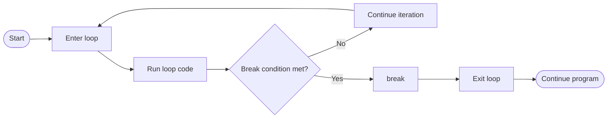
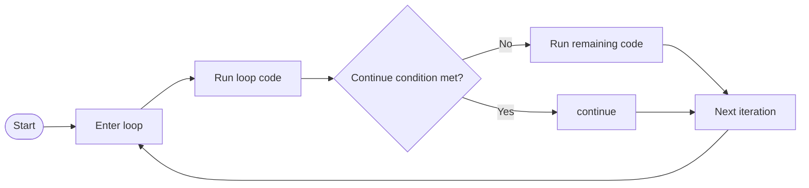

# Control Flow Level 2

- [The `break` Statement](#the-break-statement)
- [The `continue` Statement](#the-continue-statement)
- [The `pass` Statement](#the-pass-statement)

Python loops normally continue until all values have been processed or until a `while` condition becomes `False`. Sometimes, however, a program needs more direct control over what happens during an iteration. In this level, we will learn three statements used for this purpose: `break`, `continue`, and `pass`. Each affects execution differently, so understanding where control moves after each statement is important.

We will begin with `break`, which immediately exits the current loop and continues execution with the first statement after that loop.

## The `break` Statement

The `break` statement is used when a loop should stop before reaching its normal end. It is most useful when the loop has already achieved its goal, such as finding a target value, receiving a command that should stop a process, or reaching a condition that makes further iterations unnecessary.



The diagram shows how `break` exits the current loop immediately and transfers execution to the first statement after the loop. The basic structure is shown below.

```py
for item in collection:
    if condition:
        break
```

When the condition becomes `True`, `break` stops the loop. The following `for` example shows this behavior when `i` reaches `5`.

```py
for i in range(10):
    print(f"Iteration {i}") # Iteration 0 through Iteration 5

    if i == 5:
        break
```

Although `range(10)` can produce the values from `0` through `9`, the loop does not process all of them. Once `i == 5` becomes `True`, `break` exits the loop immediately, so the values from `6` through `9` are never processed.

The `break` statement is also common in `while` loops, especially when the number of iterations is not known in advance. In the following example, the loop continues accepting commands until the user enters `"exit"`.

```py
while True:
    command = input("Type 'exit' to stop: ")

    if command == "exit":
        print("Program stopped") # Program stopped
        break

    print("Command received:", command) # Prints the entered command
```

Here, `while True` creates a loop whose condition does not become `False` on its own. When the user enters an `"exit"` command, `break` stops the loop immediately. For any other command, the final `print()` runs and the loop begins another iteration.

> **Note:** The `break` statement can only be used inside a `for` or `while` loop. Using `break` outside a loop causes a `SyntaxError`.

Another common use of `break` is stopping a search once the required value has been found.

```py
orders = ["ORD-1001", "ORD-1002", "ORD-1003", "ORD-1004"]
target_order = "ORD-1003"

for order in orders:
    if order == target_order:
        print(f"Order found: {order}") # Order found: ORD-1003
        break
```

Once `"ORD-1003"` is found, there is no reason to continue checking the remaining orders. The `break` statement therefore prevents unnecessary iterations.

Python also allows an `else` clause to be attached to a loop. The loop's `else` block runs only when the loop finishes normally without reaching `break`. This is particularly useful for searches because it provides a direct place to handle the case where no match was found.

```py
orders = ["ORD-1001", "ORD-1002", "ORD-1003"]
target_order = "ORD-1004"

for order in orders:
    if order == target_order:
        print(f"Order found: {order}") # Not printed
        break
else:
    print("Order not found") # Order not found
```

In this example, the target does not appear in the list, so the `for` loop finishes normally and the `else` block runs. If the target were found, `break` would exit the loop and the `else` block would be skipped. A `while` loop follows the same rule: its `else` block runs when the loop condition becomes `False`, but it is skipped when `break` exits the loop early.

```py
attempts = 0
while attempts < 3:
    attempts += 1
    print(f"Attempt {attempts}") # Attempt 1, then Attempt 2, then Attempt 3
else:
    print("All attempts completed") # All attempts completed
```

Here, `attempts < 3` eventually becomes `False`, so the loop completes normally and the `else` block runs. This pattern is useful when code should run only after normal loop completion rather than after an early exit.

When search logic belongs inside a function, `return` can serve a different purpose by ending the entire function as soon as a result is known. This pattern connects loop control with the function behavior introduced in **Functions Level 1**.

```py
def find_order(orders, target):
    for order in orders:
        if order == target:
            return True

    return False


orders = ["ORD-1001", "ORD-1002", "ORD-1003"]
target_order = "ORD-1003"

if find_order(orders, target_order):
    print("Search successful") # Search successful
else:
    print("Order not found") # Not printed
```

The function checks each order one at a time. When the target is found, `return True` immediately exits the entire function. If every order is checked without a match, the function reaches `return False`. The returned Boolean value is then used by the `if-else` statement to decide which message to display.

The important distinction is where execution stops. `break` exits only the current loop, so surrounding code can continue running, while `return` exits the entire function. When a loop should continue but only the current iteration should be skipped, Python provides a different statement. `continue` skips the remaining code in the current iteration and moves directly to the next one.

## The `continue` Statement

The `continue` statement skips the remaining code in the current iteration and moves directly to the next iteration of the loop. It is useful when certain values should be ignored while the loop continues processing the rest of the data, such as filtering records, skipping invalid values, or excluding items that do not meet a requirement.



The diagram shows how `continue` skips the remaining work in the current iteration without exiting the loop. The basic structure is shown below.

```py
for item in collection:
    if condition:
        continue
```

When the condition becomes `True`, `continue` moves directly to the next iteration. The following `while` example uses this behavior to skip even numbers.

```py
i = 0

while i < 10:
    i += 1

    if i % 2 == 0:
        continue # Skip the rest of the loop for even numbers

    print(f"Odd number: {i}") # Skip the rest of the loop for even numbers
```

When `i` is even, `continue` skips the `print()` call for that iteration. The loop itself does not stop, so execution continues until `i < 10` becomes `False`. Only the odd numbers reach the `print()` statement.

> **Note:** Like `break`, the `continue` statement can only be used inside a `for` or `while` loop. Using `continue` outside a loop causes a `SyntaxError`.

This behavior is useful when processing records because invalid or incomplete entries can be skipped without stopping the entire operation.

```py
records = [
    {"name": "Example1", "email": "example1@example.com"},
    {"name": "Example2", "email": ""},
    {"name": "Example3", "email": "example3@example.com"}
]

def process_valid_emails(records):
    for record in records:
        if record["email"] == "":
            continue

        print("Sending email to:", record["email"]) # Prints each non-empty email

process_valid_emails(records)
```

The function checks every record. When the email field is empty, `continue` skips the remaining code for that record and moves to the next one. Records with an email address reach the `print()` call and are processed.

Both `break` and `continue` actively change how a loop proceeds. Sometimes, however, Python requires a statement even though no action should happen yet. For that situation, Python provides `pass`.

## The `pass` Statement

The `pass` statement is a placeholder that performs no action. It is useful when Python requires a statement inside a block but the code for that block has not been implemented yet, or when a branch is intentionally left empty.

For example, `pass` can keep an unfinished conditional block syntactically valid.

```py
if condition:
    pass # Implement this later
```

The same idea can be used while building a function whose implementation will be added later.

```py
def my_function():
    pass # Implement this later
```

A class body also requires at least one statement, so `pass` can be used when defining an empty class as a temporary structure.

```py
class MyClass:
    pass # Add class behavior later
```

The `pass` statement can also appear inside a loop when the loop body or one of its branches is intentionally unfinished. Unlike `continue`, `pass` does not skip the rest of the iteration.

```py
for number in range(3):
    if number == 1:
        pass # Placeholder, execution continues normally

    print(number) # 0, then 1, then 2
```

When `number` equals `1`, Python executes `pass` and then continues with the next statement in the same iteration, so `print(number)` still runs. This is different from `continue`, which would skip that `print()` call and move directly to the next iteration.

Similarly, `pass` can keep a conditional branch valid when no action is currently required.

```py
some_condition = True

if some_condition:
    pass # No action is needed in this case
else:
    print("Condition not met") # Not printed
```

At this level, the key distinction is the effect each statement has on execution. `break` leaves the current loop, `continue` skips the rest of the current iteration, and `pass` performs no action at all. These control-flow tools make it possible to handle early exits, skipped values, and intentionally empty blocks while keeping the program's behavior clear.
