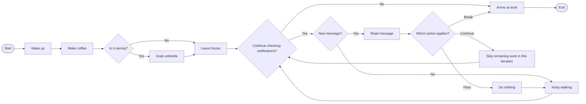

# Overview

Control flow determines the order in which Python executes instructions. It allows programs to make decisions, repeat actions, and respond to changing conditions rather than simply running every statement in sequence. Imagine your morning routine as a flow of events. You wake up, make coffee, and check the weather before leaving the house. If it is raining, you take an umbrella. You might also check your phone repeatedly until an important message arrives. These familiar actions illustrate how programs can execute instructions in order, choose between different paths, and repeat work.

The following diagram represents this routine as a flow of decisions and repetition, including different ways to control what happens inside a loop.

The first actions demonstrate **sequential execution**, while the weather decision illustrates **conditional statements**. The repeated notification check represents a **loop**, and the different control actions show how a program can skip work, exit a loop early, or intentionally perform no action. Together, these ideas show how control flow determines which instructions run, when repetition continues, and when it ends.

The **Control Flow** module develops from foundational conditional statements and loops, through direct control over loop execution, to more expressive ways of organizing decisions and repetition. Each level builds on the previous one while introducing tools for handling increasingly complex program behavior.

**Level 1** introduces the foundations of Python control flow. It covers **`if`, `elif`, and `else`** for selecting between branches, **`for` and `while` loops** for repeating work, **`enumerate()`** for tracking positions during iteration, and **`range()`** for generating numeric sequences.

**Level 2** develops more direct control over loop execution through **`break`**, **`continue`**, and **`pass`**. It also introduces **loop `else` clauses** and explains how **`return`** differs from `break` when search logic is placed inside a function.

**Level 3** introduces more expressive control-flow structures. It covers **`match-case`** for decisions based on known values, **nested `if` statements** for dependent conditions, and **conditional expressions** for concise two-value choices. It also develops **nested loops** for processing multi-level data and **comprehensions** for building new collections.

Together, these concepts provide a foundation for writing Python programs that are **flexible, readable, and easier to maintain**. They help you choose appropriate execution paths, process data, and organize more complex logic while keeping the flow of execution clear.
