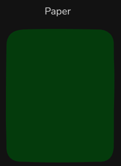
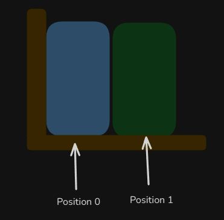

# Level 1

## Table of Contents: Data Types

- [Mutable vs Immutable](#mutable-vs-immutable)
- [Ordered vs Unordered](#ordered-vs-unordered)
- [Core built-in data types](#core-built-in-data-types)
- [Type casting](#type-casting)

**Data Types Level 1** introduces the basic kinds of values used in Python and several important ways to describe them. You will learn the difference between **mutable** and **immutable** objects, understand what **ordered** and **unordered** mean, explore the core built-in data types used for numbers, text, Boolean values, and the absence of a value, and perform basic **type casting**.

## Mutable vs Immutable

Python objects can be categorized by whether their contents can be changed after the object has been created. **Mutable types** can be modified in place. They are similar to a **whiteboard**, where the existing content can be erased or changed without replacing the whiteboard itself. Python collection types such as `list`, `dict`, and `set` are mutable. These collection types are covered in more detail in **Data Types Level 2**.


**Immutable types** cannot be changed after they are created. They are similar to a **printed page**. The page itself cannot be edited after printing, so producing different content requires a new page. In Python, an operation that appears to change an immutable value creates or assigns a different object instead of modifying the original object in place.

Common immutable types include `int`, `float`, `complex`, `bool`, `str`, `tuple`, `NoneType`, and `frozenset`. The collection types `tuple` and `frozenset` are covered in more detail in **Data Types Level 2**.



Immutability matters because immutable objects can be used safely in situations where a value must remain stable. Some immutable objects are also **hashable**, which allows them to be used as dictionary keys or set elements. For example, a tuple containing only hashable values can be a dictionary key, while a list cannot.

!!! note "Mutable and Immutable describes"

    Mutable and immutable describe whether an object can be changed in place. Reassigning a variable is different because the variable can be made to refer to another object regardless of whether the original object is mutable or immutable.

Another important characteristic of Python data types is how their elements are organized, which leads to the distinction between **ordered** and **unordered** types.

## Ordered vs Unordered

Python collection and sequence types can also be described by whether they preserve a defined order and how their elements are accessed. **Ordered types** such as `list`, `tuple`, and `str` preserve the position of their elements. They are similar to a **bookshelf**, where each book has a specific place. These types support position-based access through an `index`. The collection types `list` and `tuple` are covered in more detail in **Data Types Level 2**.



**Unordered types** such as `set` do not preserve a defined element order and do not provide position-based access through indexes. A set is more like a **box of toys**, where you work with the items themselves rather than asking for an item at a particular position. Sets are covered in more detail in **Python Data Types Level 2**.


Dictionaries are also not accessed by numeric position. Instead, a `dict` stores values associated with **keys**, and those keys are used to retrieve the corresponding values. Python dictionaries preserve insertion order, but they are still key-based mappings rather than index-based sequences. Dictionaries are covered in more detail in **Python Data Types Level 2**.

These distinctions provide a foundation for recognizing the different kinds of values Python offers, beginning with its core built-in data types.

## Core Built-in Data Types

Documentation and Code Style Level 1 introduced literals for numbers, text, Booleans, and `None`. This section examines the properties of those built-in types, including whether they are mutable or immutable, whether they preserve order, and how they can be converted from one type to another.

Python provides the numeric types `int`, `float`, and `complex`. All three are **immutable**. An `int` stores whole numbers, a `float` stores decimal numbers, and `complex` stores numbers with real and imaginary parts. In Python, the imaginary part is written using `j`. For example, `2 + 3j` contains the real part `2` and the imaginary part `3j`.

```py
# Integer literals
integer_literal = 30
negative_integer = -7

# Floating point literals
floating_literal = 19.99
negative_float = -0.001

# Underscores can improve readability in numeric literals
large_integer = 1_000_000
large_float = 1_234.56

# Complex number literal
complex_number = 2 + 3j

print(complex_number) # (2+3j)
```

`int` and `float` are the numeric types you will use most often. The `complex` type is more specialized and is useful in mathematical, scientific, and engineering calculations, such as representing electrical signals or solving equations involving imaginary numbers. Most introductory programs do not need complex numbers because ordinary quantities such as counts, prices, and measurements can usually be represented with `int` or `float`. At this level, it is enough to recognize the basic form of a complex number. Numeric values also support arithmetic operations, which are explored in more detail in the Python operations material.

Programs also frequently need to store and process **text**. The `str` type represents text as an ordered, immutable sequence of characters. Strings can be created with single, double, or triple quotes. Triple quotes were introduced in Documentation and Code Style Level 1 for multiline text and docstrings.

```py
double_quotes = "Hello"
single_quotes = 'Hello'
triple_quotes = """Hello"""
```

Strings support operations such as **concatenation**, which joins strings together, and **slicing**, which extracts part of a string. More detailed string operations are introduced later in the course. While text and numbers represent data values, programs also need to represent logical truth values.

The `bool` type is immutable and has the values `True` and `False`.

```py
example_boolean_true = True
example_boolean_false = False
```

Python can also interpret non-Boolean values as true or false. This property is known as **truthiness**. Values such as `False`, `None`, numeric zero, and empty strings or collections are **falsy**. Most nonzero numbers and nonempty strings or collections are **truthy**.


The `bool()` constructor can be used to see the Boolean interpretation of a value.

```py
print(bool(0)) # False
print(bool("")) # False
print(bool(None)) # False
print(bool(10)) # True
print(bool("Python")) # True
```

Logical operators and more detailed uses of truthiness are covered later in **Operations Level 2**. Programs also need to represent situations where no value is currently present. Python provides `None` for this purpose, and it is immutable. Unlike `False`, `0`, and `""`, which represent actual Boolean, numeric, or text values, `None` represents the absence of a value.

```py
example_none = None

print(None == False) # False
print(None == 0) # False
print(None == "") # False
```

Sometimes a value needs to be represented using a different type. This introduces **type casting**, which allows programs to convert values when a different representation is needed.

## Type casting

Python provides built-in constructors such as `float()`, `int()`, `str()`, and `bool()` that can perform **type conversion**, also called **type casting**. The `float()` constructor can convert an integer or a suitable numeric string to a floating-point number, while `int()` can convert an integer-like string or a floating-point number to an integer. The `str()` constructor produces a string representation of a value, while `bool()` produces its Boolean interpretation.

```py
# Original values
integer_value = 5
floating_value = 3.14
another_integer = 42
text_value = "hello"
empty_string = ""

# Type casting
converted_float = float(integer_value)
converted_integer = int(floating_value)
converted_string = str(another_integer)
boolean_nonempty = bool(text_value)
boolean_empty = bool(empty_string)

# Results
print(converted_float) # 5.0
print(converted_integer) # 3
print(converted_string) # 42
print(boolean_nonempty) # True
print(boolean_empty) # False
```

When `int()` converts a floating-point number, it **truncates toward zero** rather than rounding to the nearest whole number. For example, both positive and negative values lose their fractional part.

```py
print(int(3.99)) # 3
print(int(-3.99)) # -3
```

Type casting only works when the source value can be converted to the requested type. For example, a string containing digits can be converted to an integer.

```py
number_text = "42"
number = int(number_text)

print(number) # 42
```

A string such as `"hello"` does not represent an integer, so attempting to convert it with `int()` raises a `ValueError`.

```py
number = int("hello") # ValueError
```

!!! warning "Failed Conversion"

    A failed conversion stops normal execution unless the error is handled. Error handling is introduced later in the course. At this **Data Types Level 1**, the important idea is that not every value can be converted to every type.

The next **Data Types Level 2** builds on these foundations by introducing Python collection types in more detail. You will learn how lists, tuples, dictionaries, and sets organize multiple values and how their different characteristics affect the way they are used.
