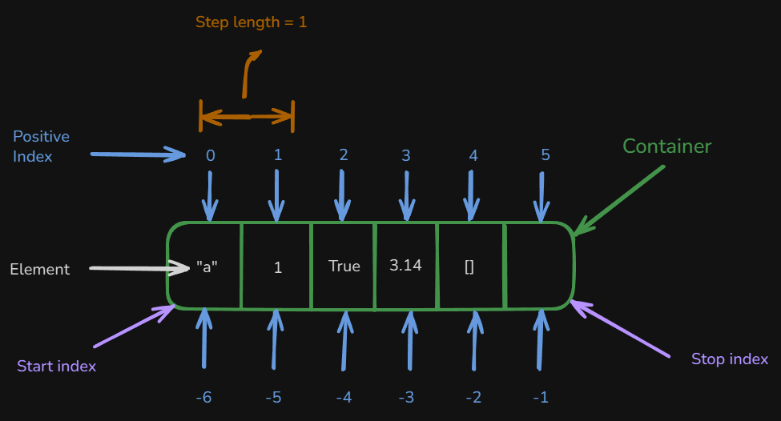

# Level 3

## Table of Contents: Data Types

- [Indexed sequence types](#indexed-sequence-types)
- [Non-indexed and Non-subscriptable Types](#non-indexed-and-non-subscriptable-types)
- [How mutable and immutable data types work](#how-mutable-and-immutable-data-types-work)
- [List Data Type](#list-data-type)
- [Dictionary Data Type](#dictionary-data-type)
- [Set Data Type](#set-data-type)
- [Strings Data type](#strings-data-type)
- [Tuple Data Type](#tuple-data-type)
- [Copy](#copy)

In **Data Types Level 3**, we explore how Python's collection types behave when their contents are accessed, modified, and copied. We begin with indexing, slicing, dictionary keys, and nested structures, then examine how mutability affects object identity and shared references. The main sections develop practical skills for working with lists, dictionaries, sets, strings, and tuples, including their methods, common operations, and important limitations. Finally, we examine shallow and deep copying to understand how separate collections can still share nested objects.

## Indexed sequence types

Python provides square bracket notation `[]` for accessing values in sequences and dictionaries. Lists, strings, and tuples use integer indices to identify positions, while dictionaries use keys rather than positional indices. For sequences, **positive indexing** counts from the beginning and **negative indexing** counts from the end. Square brackets are also used for **slicing**, which selects a range of values from an ordered sequence.



The main forms are indexing with `[n]`, slicing with `[start:stop]`, and extended slicing with `[start:stop:step]`. We will begin with positive and negative indexing for sequences and then compare this positional access with dictionary key access.

```py
items = [10, 20, 30, 40, 50] # List example
phrase = "Python" # String example
tup = (100, 200, 300, 400) # Tuple example
person = {"name": "Test", "age": 30} # Dictionary example

# Positive indexing (index 0)
print("List first element:", items[0]) # List first element: 10
print("String first character:", phrase[0]) # String first character: P
print("Tuple first element:", tup[0]) # Tuple first element: 100

# Negative indexing (last element)
print("List last element:", items[-1]) # List last element: 50
print("String last character:", phrase[-1]) # String last character: n
print("Tuple last element:", tup[-1]) # Tuple last element: 400

# Dictionary access by key
print("Name value:", person["name"]) # Name value: Test
print("Age value:", person["age"]) # Age value: 30
```

Slicing extends indexing by selecting part of a sequence. Writing `[:]` or `[::]` selects the full sequence, while start and stop values limit the selected range. The start is included and the stop is excluded. Extended slicing adds a step that controls the interval between selected elements.

```py
text = "Python" # String example
numbers = [10, 20, 30, 40, 50] # List example
tupl = (100, 200, 300, 400, 500) # Tuple example

# Entire sequence
print(text[:], numbers[:], tupl[:]) # Python [10, 20, 30, 40, 50] (100, 200, 300, 400, 500)
# Positive slicing (from index 1 to 3)
print(text[1:4], numbers[1:4], tupl[1:4]) # yth [20, 30, 40] (200, 300, 400)
# Negative slicing (using negative indices)
print(text[-4:-1], numbers[-4:-1], tupl[-4:-1]) # tho [20, 30, 40] (200, 300, 400)
# Extended slicing with step (every 2nd element)
print(text[::2], numbers[::2], tupl[::2]) # Pto [10, 30, 50] (100, 300, 500)
```

!!! info "Slicing with negative indices"

    Negative indices can also be used as slice boundaries. They count from the end of the sequence, while the step determines the direction and interval of selection. A positive step moves from left to right even when the boundaries are negative. For example, `text[-5:-2:2]` selects `"yh"` from `"Python"`.

Slice boundaries may extend beyond the available indices without raising `IndexError`. If the requested range does not select any elements, Python returns an empty sequence. With a positive step, slicing moves from left to right, so a start position that comes after the stop position produces an empty result.

```py
text = "Python"
numbers = [10, 20, 30, 40, 50]

print(text[-5:3]) # 'yt'
print(text[-3:3]) # ''
print(numbers[-5:3]) # [10, 20, 30]
print(numbers[-3:3]) # []

result = numbers[3:1]

print(result) # []
```

This behavior differs from direct indexing. An expression such as `numbers[10]` raises `IndexError` when the requested position does not exist. A slice is more tolerant of out-of-range boundaries, although an extended slice with a step of `0` is invalid and raises `ValueError`.

```py
numbers[10] # IndexError
numbers[::0] # ValueError
```

Working with sequences also introduces an important distinction between **reassignment** and **in-place modification**. Using `+` with a list creates a new list, and assignment then makes the variable refer to that new object.

```py
items = [1, 2, 3]
items = items + [4, 5]
print(items) # [1, 2, 3, 4, 5]
```

Strings and tuples also support concatenation, but because they are immutable, concatenation creates new objects that can then be assigned to variables.

!!! note "Concatenation and reassignment"

    The similar-looking expression `items += [4, 5]` normally modifies a list in place, so the two forms can behave differently when other variables refer to the same list. The `+=` operator is explored in more detail in the Python operations material.

```py
text = "Hello"
text = text + " World"
tup = (1, 2, 3)
tup = tup + (4, 5)

print(text) # Hello World
print(tup) # (1, 2, 3, 4, 5)
```

Sets and dictionaries do not support concatenation with `+`. Attempting to use it with either type raises `TypeError`.

```py
my_set = {1, 2, 3}
my_set = my_set + {4} # TypeError

my_dict = {"a": 1}
my_dict = my_dict + {"b": 2} # TypeError
```

Sets and dictionaries therefore require different ways to work with their contents. Before exploring those operations in their dedicated sections, it is important to distinguish between types that support square bracket access and types that do not.

## Non-indexed and Non-subscriptable Types

**Sets** are non-indexed and do not support subscripting, so their elements cannot be accessed by position. Types such as `int`, `float`, `bool`, and `NoneType` also do not support subscripting. Dictionaries behave differently because a **dictionary is subscriptable**, but the value inside the square brackets is interpreted as a key rather than as a numeric position. An integer can therefore appear inside the brackets when that integer actually exists as a dictionary key.

```py
item_dict = {0: "zero", "a": 1, "b": 2}
item_set = {1, 2, 3, 4, 5}

print(item_dict[0]) # zero
print(item_dict["a"]) # 1
print(item_set[0]) # TypeError: 'set' object is not subscriptable
```

!!! warning "Unsupported access and missing keys"

    A set cannot be subscripted at all, while a dictionary can be subscripted only with an existing key. For example, `item_dict["missing"]` raises `KeyError` because the dictionary does not contain that key. These are different errors, so a missing dictionary key should not be confused with an object that does not support subscripting.

Programs often contain **nested structures**, where one collection stores another collection. Lists can contain lists, dictionaries, sets, or tuples, while dictionaries can contain lists or other dictionaries. The next section shows how to access and modify values within these structures.

## Nested access and assignment using square brackets

Square brackets can be chained so that each pair moves one level deeper into the data. The object reached at each level determines whether indexing or key access is supported and whether assignment can modify the selected value.

A list can contain another list. Because lists are mutable, square bracket notation can be used both to access a nested value and to update it with assignment.

```py
numbers = [1, 2, [10, 20, 30]]

print(numbers[2]) # [10, 20, 30]
print(numbers[2][1]) # 20

numbers[2][1] = 99

print(numbers) # [1, 2, [10, 99, 30]]
```

The first index selects the nested list, and the second selects the value `20`. Assignment replaces that value with `99` in the existing nested list. The same approach works when a dictionary contains a list, except that the first pair of square brackets uses a key.

```py
profile = {
    "username": "admin",
    "roles": ["editor", "moderator"]
}

print(profile["roles"][0]) # editor

profile["roles"][0] = "admin"

print(profile) # {'username': 'admin', 'roles': ['admin', 'moderator']}
```

The assignment changes the selected role without replacing the entire list. A dictionary can also contain another dictionary, where chained keys move through each level and assignment can update an existing value or add a new key-value pair.

```py
config = {
    "database": {
        "host": "localhost",
        "port": 5432
    }
}

print(config["database"]["port"]) # 5432

config["database"]["port"] = 3306
config["database"]["user"] = "root"

print(config) # {'database': {'host': 'localhost', 'port': 3306, 'user': 'root'}}
```

The assignment to `"port"` changes an existing value, while the assignment to `"user"` adds a new key-value pair. Not every nested collection supports the same operations, however. A list can contain a set, but the set itself remains non-indexed. Square brackets can access the set through its position in the outer list, but they cannot select an individual element inside that set. Because the outer list is mutable, assignment can instead replace the entire set stored at that position.

```py
data = [
    {1, 2, 3},
    {4, 5, 6}
]

print(data[0]) # {1, 2, 3}

data[0][1] # TypeError
data[0] = {10, 20, 30}

print(data) # [{10, 20, 30}, {4, 5, 6}]
```

!!! note "Set display order"

    Sets do not guarantee display order, so the elements in the printed sets may appear in a different order.

A list containing a tuple behaves differently. Tuples are indexed, so their values can be accessed with square brackets, but tuples are immutable and their individual values cannot be replaced through assignment. The mutable outer list can still replace the entire tuple.

```py
data = [
    (10, 20, 30),
    (40, 50, 60)
]

print(data[0]) # (10, 20, 30)
print(data[0][1]) # 20

data[0][1] = 99 # TypeError
data[0] = (100, 200, 300)

print(data) # [(100, 200, 300), (40, 50, 60)]
```

The examples show that replacing an entire nested object is different from modifying it internally. This distinction leads to a closer examination of **mutable** and **immutable** objects.

## How mutable and immutable data types work

In **Python Data Types Level 1**, we introduced the difference between mutable and immutable data types. **Mutable data types** can be changed in place, while **immutable data types** cannot. When an operation produces a different immutable value, Python may create a new object, and assignment can make the variable refer to that object. This section uses `id()` to observe the difference between modifying an existing object and reassigning a variable.

The built-in `id()` function returns an integer that identifies an object during its lifetime. The actual number is not important and may differ between program runs. What matters in the following examples is whether the identifier stays the same or changes after an operation.

```py
my_list = [1, 2, 3]

print("Original list:", my_list) # Original list: [1, 2, 3]
print("Original id:", id(my_list)) # The ID will vary

my_list.append(4)

print("Modified list:", my_list) # Modified list: [1, 2, 3, 4]
print("Modified id:", id(my_list)) # Same ID as before
```

Because a list is **mutable**, `append()` changes the existing list in place. Both calls to `id(my_list)` return the same number during that run. This shows that `my_list` still refers to the same list object.

Strings behave differently because they are **immutable**. Concatenating strings produces a new string rather than changing the original one.

```py
text = "Hello"

print("Before:", text, id(text)) # Before: Hello <original ID>

text = text + " world"

print("After:", text, id(text)) # After: Hello world <different ID>
```

The two `id()` values are different because `"Hello world"` is a new string object. The original `"Hello"` string was not modified, and `text` now refers to the new string. Variables can be reassigned regardless of the mutability of their objects. What distinguishes mutable and immutable objects is whether the existing object itself can be modified.

!!! info "Object identity and equality"

    An object's identifier describes its identity, not its contents. Two variables referring to the same object have the same identifier, while two separate objects can contain equal values. An identifier is guaranteed to be unique only among objects that exist at the same time, so it should not be treated as a permanent identifier or used to determine whether values are equal.

This distinction becomes especially important when multiple variables refer to the same mutable object. Assigning one variable to another does not copy the object, as the following example demonstrates.

```py
original = [1, 2, 3]
alias = original
original.append(4)
print(alias) # [1, 2, 3, 4]
```

Both variables refer to the same list, so the change made through `original` is also visible through `alias`. The **Copy** section at the end of this level explores how to create separate objects and how copying affects nested collections. With this foundation established, we can now examine the individual collection types in more detail, beginning with lists.

## List Data Type

In Python, a **list** is a **mutable**, ordered sequence of elements. Because lists are mutable, their contents can be changed in place by adding, removing, replacing, or reordering elements. Lists can store simple values such as numbers and strings, but they are also commonly used to store structured records such as dictionaries, nested lists, and other collections.

To add a single element to the **end** of a list, use `append(element)`. This is useful when a program receives or produces items one at a time, such as accepted form submissions, successful API results, processed files, or completed tasks.

```py
valid_users = []

user = {
    "name": "example1",
    "email": "example@example.com",
    "active": True
}

if user["email"] != "":
    valid_users.append(user)

print(valid_users) # [{'name': 'example1', 'email': 'example@example.com', 'active': True}]
```

In this example, the condition checks that the user's email is not empty. Because the condition is true, `append()` adds the user dictionary as one element at the end of `valid_users`. The resulting list contains one validated user.

If one element must be added at a **specific position**, use `insert(index, element)` instead of `append()`. Existing elements at that position and after it are shifted to the right.

```py
subjects = ["Math", "History", "Science"]

subjects.insert(1, "English")

print(subjects) # ['Math', 'English', 'History', 'Science']
```

The index `1` places `"English"` between `"Math"` and `"History"`, shifting the existing elements to the right. The resulting list contains four subjects, with `"English"` in the second position.

When several elements need to be added to an existing list, use `extend(iterable)`. Unlike `append()`, which adds its argument as one element, `extend()` takes the elements from another iterable and adds them individually to the end of the list.

```py
monday_logs = [
    {"event": "login"},
    {"event": "upload"}
]

tuesday_logs = [
    {"event": "download"},
    {"event": "logout"}
]

monday_logs.extend(tuesday_logs)

print(monday_logs) # [{'event': 'login'}, {'event': 'upload'}, {'event': 'download'}, {'event': 'logout'}]
```

Both records from `tuesday_logs` are added individually to `monday_logs`. This makes `extend()` useful when combining records loaded from several files, results from different data sources, or logs collected on different days.

Once elements have been added, they may also need to be removed. Use `remove()` when the value is known, `pop()` when the position is known and the removed value is needed, and `clear()` when every element should be removed. The `remove(value)` method deletes the **first element equal to the specified value**.

```py
active_features = [
    "search",
    "notifications",
    "dark_mode"
]

active_features.remove("notifications")

print(active_features) # ['search', 'dark_mode']
```

In this example, the program knows the value `"notifications"` but does not need to know its index. `remove()` finds the first matching value and deletes it from the list.

!!! warning "Removing a value that does not exist"

    If the specified value does not exist in the list, `remove()` raises `ValueError`.

Use `pop(index)` when the program knows the **position** of an element and also needs the value that was removed. Unlike `remove()`, `pop()` returns the removed element, allowing it to be stored in a variable and used afterward.

```py
tasks = [
    {"task": "download file"},
    {"task": "parse data"},
    {"task": "save results"}
]

current_task = tasks.pop(0)

print("Current task:", current_task["task"]) # Current task: download file
print("Remaining tasks:", tasks) # [{'task': 'parse data'}, {'task': 'save results'}]
```

Here, `pop(0)` removes the first task and returns that dictionary. The returned dictionary is stored in `current_task`, so the program can continue working with it after it has been removed from the list.

!!! tip "Use deque for large queues"

    Using `pop(0)` works for small lists, but it becomes inefficient for large queues because all remaining elements must shift to new positions. For programs that require efficient queue operations, Python provides `collections.deque`.

If no index is supplied, `pop()` removes and returns the **last element**. This is useful when the program needs the most recently added element.

```py
history = [
    "open file",
    "edit title",
    "save file"
]

last_action = history.pop()

print("Last action:", last_action) # Last action: save file
print("Remaining history:", history) # ['open file', 'edit title']
```

Here, `"save file"` is removed from `history` and stored in `last_action`. This behavior is useful for last-in, first-out operations, where the most recently added item is handled first.

To remove **all elements** while keeping the same list object, use `clear()`. Use this method when the contents are no longer needed but the list itself will continue to be used.

```py
pending_logs = [
    {"event": "login"},
    {"event": "profile_update"}
]

print("Sending:", pending_logs) # Sending: [{'event': 'login'}, {'event': 'profile_update'}]

pending_logs.clear()

print("Pending logs:", pending_logs) # []
```

The collected logs have already been handled, so `clear()` empties the list before it is used to collect another batch. The list object remains available for reuse.

After adding and removing elements, another common operation is changing their order. The `sort()` method rearranges the existing list in place. By default, comparable values are arranged in **ascending order**. Numbers are ordered numerically, while strings are compared character by character according to their Unicode values. This means uppercase and lowercase letters can appear in different parts of the result, and strings containing digits are ordered as text rather than as numbers.

```py
scores = [85, 40, 92, 70, 60]
names = ["example", "Example", "banana", "Apple"]
numbers_as_text = ["1", "2", "10", "11", "3"]

scores.sort()
names.sort()
numbers_as_text.sort()

print(scores) # [40, 60, 70, 85, 92]
print(names) # ['Apple', 'Example', 'banana', 'example']
print(numbers_as_text) # ['1', '10', '11', '2', '3']
```

The numeric list is arranged from lowest to highest. With strings, uppercase `"Apple"` and `"Example"` appear before the lowercase values because uppercase and lowercase characters have different Unicode values. In `numbers_as_text`, `"10"` and `"11"` appear before `"2"` because the values are compared as text, character by character. If the same values were integers, `10` and `11` would be placed after `2`.

Use `sort()` when the list itself should be reordered and the original sequence is no longer needed. The optional `reverse` and `key` parameters provide additional control over how the list is ordered.

!!! warning "sort() returns None"

    The `sort()` method modifies the existing list in place and returns `None` rather than returning a new sorted list. For example, `new_scores = scores.sort()` assigns `None` to `new_scores`.

Use `reverse=True` when the values should be arranged in **descending order** instead of the default ascending order. For example, an application may display available report years from the most recent to the oldest.

```py
report_years = [2022, 2025, 2021, 2024, 2023]

report_years.sort(reverse=True)

print(report_years) # [2025, 2024, 2023, 2022, 2021]
```

Here, `reverse=True` changes the direction of the sort, so the years are arranged from the highest value to the lowest.

The `key` parameter is useful when each list element contains several values and one particular value should determine the order. For example, these dictionaries can be ordered by their `"score"` values, then reordered in the opposite direction by combining the same key with `reverse=True`.

```py
results = [
    {"user": "Example1", "score": 78},
    {"user": "Example2", "score": 92},
    {"user": "Example3", "score": 85}
]

def score_value(record):
    return record["score"]

results.sort(key=score_value)

for result in results:
    print(result["user"], result["score"]) # Prints Example1 78, Example3 85, then Example2 92

results.sort(key=score_value, reverse=True)

for result in results:
    print(result["user"], result["score"]) # Prints Example2 92, Example3 85, then Example1 78
```

The `score_value()` function returns the `"score"` from each dictionary, so `sort()` uses that value for comparison. The first sort arranges the records from the lowest score to the highest, while `reverse=True` changes the direction so that the highest score appears first. Passing functions as arguments is explored more deeply in **Functions Level 3**, including when working with the built-in `sorted()` function.

Sorting arranges elements according to their values or a selected comparison value. Reversing is different because it simply flips the order that already exists. The `reverse()` method changes the existing list in place, while `[::-1]` creates a new reversed list.

```py
processing_queue = ["job_1", "job_2", "job_3", "job_4"]
original_queue = ["job_1", "job_2", "job_3", "job_4"]

processing_queue.reverse()
reversed_queue = original_queue[::-1]

print(processing_queue) # ['job_4', 'job_3', 'job_2', 'job_1']
print(original_queue) # ['job_1', 'job_2', 'job_3', 'job_4']
print(reversed_queue) # ['job_4', 'job_3', 'job_2', 'job_1']
```

`reverse()` changes `processing_queue` itself, while `[::-1]` leaves `original_queue` unchanged and stores the reversed copy in `reversed_queue`.

Lists are useful when elements are organized and accessed by **position**, but structured data often needs values to be identified by names or labels instead of numeric indices. Dictionaries provide this key-based organization, which builds on the collection concepts introduced with lists.

## Dictionary Data Type

A Python **dictionary** is a **mutable mapping type** that stores data as **key-value pairs** and uses keys rather than numeric indexes to identify values. Dictionaries can contain lists, other dictionaries, and mixed data types, which makes them useful for representing structured information.

Dictionary values can be accessed directly with square brackets when a key is expected to exist. When a key may be missing, `get()` provides an alternative because it can return `None` or a supplied default value instead of raising a `KeyError`. The following application configuration demonstrates how `get()` can be used to retrieve values from nested dictionaries.

```py
config = {
    "database": {
        "host": "localhost",
        "port": 5432,
        "credentials": {
            "user": "admin",
            "password": "secret"
        }
    },
    "features": {
        "logging": True,
        "debug": False
    }
}
```

The `"database"` value can be retrieved with the basic form of `get()`.

```py
db_config = config.get("database")

print(db_config) # {'host': 'localhost', 'port': 5432, 'credentials': {'user': 'admin', 'password': 'secret'}}
```

Here, `get("database")` returns the dictionary stored under the `"database"` key. When the required value is deeper inside nested dictionaries, `get()` can be chained.

```py
db_port = config.get("database", {}).get("port")

print(db_port) # 5432
```

The first `get()` retrieves `"database"`. If that key is missing, the default `{}` supplies an empty dictionary, allowing the second `get("port")` call to continue without raising a `KeyError`. The same approach can handle an optional nested key that may not exist.

```py
timeout = config.get("database", {}).get("timeout")
timeout = config.get("database", {}).get("timeout", 30)

print(timeout) # None
print(timeout) # 30
```

Because `"timeout"` is missing, the first expression returns `None`, while the second returns the supplied default value `30`. Use a default when the program has a suitable fallback for an optional value.

Sometimes the program needs to know whether a key exists rather than retrieve a fallback value. In that situation, use the `in` operator.

```py
if "database" in config:
    print(config["database"]) # {'host': 'localhost', 'port': 5432, 'credentials': {'user': 'admin', 'password': 'secret'}}
```

Use `in` when the existence of the key affects the next action. Once the check succeeds, direct square bracket access can be used safely for that key. Use `get()` instead when the program mainly needs a value and can continue with `None` or another default if the key is absent.

Dictionaries often contain lists of records, so access may continue from a dictionary key into a list element and then into another dictionary.

```py
users = {
    "admins": [
        {"name": "Example1", "active": True},
        {"name": "Example2", "active": False}
    ],
    "editors": [
        {"name": "Example3", "active": True}
    ]
}

first_admin = users.get("admins", [])[0]
admin_name = users.get("admins", [])[0].get("name")

print(first_admin) # {'name': 'Example1', 'active': True}
print(admin_name) # Example1
```

In both expressions, `get("admins", [])` retrieves the list and `[0]` selects its first dictionary. The second expression continues into that dictionary with `get("name")` to retrieve the name.

!!! warning "An empty default list can still cause IndexError"

    The default empty list prevents a `KeyError` when `"admins"` is missing, but `[0]` still raises an `IndexError` if the resulting list is empty. When the list may be empty, check it before accessing the first element.

Direct square bracket access behaves differently when a dictionary key does not exist because it raises a `KeyError` instead of returning a fallback value.

```py
print(users["moderators"][0]["name"]) # KeyError
```

When the key or its list may be missing, retrieve the list with `get()` and check that it contains an element before accessing `[0]`.

```py
moderators = users.get("moderators", [])

if moderators:
    print(moderators[0].get("name"))
else:
    print("No moderators found") # No moderators found
```

This handles both a missing `"moderators"` key and an empty moderators list without attempting to access an unavailable element.

Because dictionaries are mutable, key-value pairs can be added or changed after the dictionary is created. When one specific entry needs to be added or changed, direct key assignment is the simplest approach.

```py
config["database"]["timeout"] = 30
print(config["database"]) # {'host': 'localhost', 'port': 5432, 'credentials': {'user': 'admin', 'password': 'secret'}, 'timeout': 30}
```

Because `"timeout"` does not already exist, the assignment adds it to the nested `"database"` dictionary. If the key already existed, the same syntax would replace its current value. Use direct assignment for one specific entry. When several entries need to be applied together, use `update()`.

The `update()` method applies one or more key-value pairs to an existing dictionary. Existing keys receive new values, while missing keys are added, making the method useful when several related values need to be applied together.

```py
config = {
    "database": {
        "host": "localhost",
        "port": 5432
    },
    "features": {
        "logging": True
    }
}

# Change an existing key
config["database"].update({"port": 3306})

print(config) # {'database': {'host': 'localhost', 'port': 3306}, 'features': {'logging': True}}

# Add a missing key
config["database"].update({"timeout": 30})

print(config) # {'database': {'host': 'localhost', 'port': 3306, 'timeout': 30}, 'features': {'logging': True}}

# Change several related values
config["database"].update({
    "host": "db.internal",
    "port": 5432
})

print(config) # {'database': {'host': 'db.internal', 'port': 5432, 'timeout': 30}, 'features': {'logging': True}}
```

The first operation changes the existing `"port"` value, the second adds the missing `"timeout"` key, and the final operation changes `"host"` and `"port"` together. This shows why `update()` is convenient when several entries should be applied at once.

`update()` can also modify a dictionary stored inside another collection.

```py
users = [
    {"id": 1, "name": "Example1", "active": True},
    {"id": 2, "name": "Example2", "active": False}
]

users[1].update({"active": True})

print(users) # [{'id': 1, 'name': 'Example1', 'active': True}, {'id': 2, 'name': 'Example2', 'active': True}]
```

Here, `users[1]` selects the second user dictionary before `update()` changes only its `"active"` value. The other fields remain unchanged.

The same method can apply all entries from another dictionary to an existing record.

```py
user_profile = {
    "id": 3,
    "name": "Example"
}
extra_data = {
    "email": "Example@example.com",
    "role": "editor"
}
user_profile.update(extra_data)

print(user_profile) # {'id': 3, 'name': 'Example', 'email': 'Example@example.com', 'role': 'editor'}
```

The keys from `extra_data` are added to `user_profile`. If both dictionaries contained the same key, the value from `extra_data` would replace the existing value. This replacement behavior can also be used deliberately when one dictionary should override selected values from another.

```py
settings = {
    "theme": "light",
    "language": "en"
}

override = {
    "theme": "dark"
}

settings.update(override)

print(settings) # {'theme': 'dark', 'language': 'en'}
```

Both dictionaries contain `"theme"`, so `"dark"` replaces `"light"`. The `"language"` value remains unchanged because `override` does not contain that key.

Another useful dictionary method is `setdefault(key, default)`. It returns the existing value when the key is already present. If the key is missing, it creates the key with the supplied default value and returns that value. This makes `setdefault()` useful for building grouped or nested data without replacing values that were already stored.

Imagine processing events and grouping their actions by user.

```py
events = [
    {"user": "Example1", "action": "login"},
    {"user": "Example2", "action": "login"},
    {"user": "Example1", "action": "upload"},
    {"user": "Example2", "action": "logout"},
]

activity_log = {}

for event in events:
    user = event["user"]
    action = event["action"]
    activity_log.setdefault(user, []).append(action)

print(activity_log) # {'Example1': ['login', 'upload'], 'Example2': ['login', 'logout']}
```

If the `user` key does not exist, `setdefault()` creates it with an empty list. If the key already exists, it returns the existing list. In both cases, `append()` adds the action to that list. Using `update()` here would behave differently because it can replace an existing value.

```py
activity_log.update({"Example1": []})
```

If `"Example1"` already contains actions, this call replaces that list with a new empty list. `setdefault()` avoids that replacement by preserving an existing value.

The same behavior is useful when a nested section should be created only if it is missing.

```py
config = {
    "features": {
        "auth": True
    }
}

logging_config = config.setdefault("logging", {})
logging_config.setdefault("level", "INFO")
logging_config.setdefault("format", "json")

print(config) # {'features': {'auth': True}, 'logging': {'level': 'INFO', 'format': 'json'}}
```

If `"logging"` is missing, the first `setdefault()` creates an empty dictionary for it. The following calls add `"level"` and `"format"` only when those keys are missing, so existing configuration values are preserved.

`setdefault()` can also collect several values under each category.

```py
results = [
    {"category": "math", "score": 80},
    {"category": "science", "score": 90},
    {"category": "math", "score": 85}
]

scores_by_category = {}

for result in results:
    scores_by_category.setdefault(result["category"], []).append(result["score"])

print(scores_by_category) # {'math': [80, 85], 'science': [90]}
```

For the first `"math"` result, `setdefault()` creates an empty list and `80` is appended. When `"math"` appears again, the existing list is returned and `85` is appended, collecting several values under the same category without overwriting earlier values.

Dictionaries also provide `keys()`, `values()`, and `items()` for working with their stored data.

```py
user_profile = {
    "id": 3,
    "name": "Example",
    "role": "editor"
}

print(user_profile.keys()) # dict_keys(['id', 'name', 'role'])
print(user_profile.values()) # dict_values([3, 'Example', 'editor'])
print(user_profile.items()) # dict_items([('id', 3), ('name', 'Example'), ('role', 'editor')])

for key, value in user_profile.items():
    print(key, value) # id 3, then name Example, then role editor
```

Use `keys()` when only the keys are needed, `values()` when only the stored values are needed, and `items()` when both are needed. The `items()` method is especially useful during iteration.

!!! note "Dictionary views reflect later changes"

    `keys()`, `values()`, and `items()` return dictionary view objects rather than lists. These views reflect later changes made to the dictionary.

After adding and updating entries, dictionaries also provide several ways to remove them. Use `del` when a known key should simply be removed, `pop()` when the removed value is also needed, `popitem()` when the most recently added pair should be removed, and `clear()` when every entry should be removed. The `del` keyword is a Python statement rather than a dictionary method.

```py
user_profile = {
    "id": 101,
    "name": "Example1",
    "email": "Example1@example.com",
    "session": {
        "token": "abc123",
        "expires": "2026-01-01"
    }
}

del user_profile["session"] # Remove session data after logout

print(user_profile) # {'id': 101, 'name': 'Example1', 'email': 'Example1@example.com'}
```

Here, the user record remains while only the `"session"` entry is removed. This is useful when temporary data such as session information is no longer needed.

!!! warning "Deleting a missing key raises KeyError"

    If the key does not exist, `del` raises a `KeyError`.

Unlike `del`, the `pop()` method removes a key and returns its value. Use `pop()` when the value should still be available after the entry is removed.

```py
cache = {
    "page:/home": "<html>...</html>",
    "page:/about": "<html>...</html>"
}

expired_page = cache.pop("page:/home")

print("Expired cache entry:", expired_page) # Expired cache entry: <html>...</html>
print("Remaining cache:", cache) # {'page:/about': '<html>...</html>'}
```

When the key may not exist, a default value can be supplied to `pop()`.

```py
settings = {
    "theme": "dark",
    "language": "en"
}

timezone = settings.pop("timezone", "UTC")

print("Timezone:", timezone) # Timezone: UTC
print(settings) # {'theme': 'dark', 'language': 'en'}
```

Because `"timezone"` is missing, no entry is removed and `"UTC"` is returned. This avoids an extra membership check when a fallback value is sufficient.

`popitem()` removes and returns the **most recently added** key-value pair. Unlike `pop()`, it does not require a specific key.

```py
request_context = {
    "request_id": "req-001",
    "user": "Example1",
    "debug": True
}
last_entry = request_context.popitem()

print("Removed:", last_entry) # Removed: ('debug', True)
print(request_context) # {'request_id': 'req-001', 'user': 'Example1'}
```

Here, the most recently added `"debug"` entry is removed and returned as a tuple. This can be useful when the latest inserted pair needs to be processed or discarded.

!!! warning "popitem() requires a non-empty dictionary"

    Calling `popitem()` on an empty dictionary raises a `KeyError`.

The `clear()` method removes every key-value pair while keeping the dictionary object itself, making it useful when all current contents are no longer needed but the same dictionary will continue to be used.

```py
session_data = {
    "user_id": 42,
    "cart": ["item1", "item2"],
    "auth_token": "xyz789"
}
session_data.clear() # Reset session after logout

print(session_data) # {}
```

After `clear()`, `session_data` becomes `{}` while the dictionary object itself remains available for reuse.

Dictionaries organize values through keys, allowing structured data to be read and changed by meaningful identifiers rather than numeric positions. Sets organize collections differently by focusing on unique values instead of key-value relationships, which is the next data type we will examine

## Set Data Type

A set is a **mutable, non-indexed collection of unique elements**. It does not allow duplicates or provide positional access, making it useful for membership checks and collecting distinct values. For example, a set can collect unique users from a dataset of actions in which the same user may appear several times.

```py
events = [
    {"user": "example1", "action": "login"},
    {"user": "example2", "action": "login"},
    {"user": "example1", "action": "upload"},
    {"user": "example3", "action": "login"},
    {"user": "example2", "action": "logout"}
]

active_users = set()

for event in events:
    active_users.add(event["user"])

print(active_users) # {'example1', 'example2', 'example3'}
```

The repeated users are stored only once, so `active_users` contains three unique names without requiring a separate duplicate check. This is useful when processing logs, events, or audit data.

!!! note "Set display order"

    Sets do not guarantee display order. The same elements may appear in a different order when a set is printed.

Sets can also be stored inside other collections. A dictionary of roles, for example, can use sets to keep each role’s permissions unique.

```py
permissions = {
    "admin": {"read", "write", "delete"},
    "editor": {"read", "write"},
    "viewer": {"read"}
}

permissions["editor"].add("publish")
permissions["editor"].add("write") # Duplicate value, ignored

print(permissions["editor"]) # {'read', 'write', 'publish'}
```

Adding `"publish"` creates a new permission for the editor role, while adding `"write"` again leaves the set unchanged. This allows access control systems to maintain unique permissions for each role.

Sets can also replace repeated values inside lists of records without changing the surrounding structure.

```py
users = [
    {"name": "example1", "actions": ["login", "upload", "login"]},
    {"name": "example2", "actions": ["login", "logout", "login"]}
]

for user in users:
    user["actions"] = set(user["actions"])

print(users) # [{'name': 'example1', 'actions': {'login', 'upload'}}, {'name': 'example2', 'actions': {'login', 'logout'}}]
```

Each user record remains a dictionary, while its `"actions"` list becomes a set containing each action once. This is useful when activity tracking or analytics needs distinct actions rather than every occurrence.

Use `add()` to add **one element** at a time and `update()` to add all elements from an iterable, such as a list, tuple, or set. Both modify the existing set in place. The following examples compare collecting individual IDs with adding a batch.

```py
processed_ids = set()

incoming_batches = [
    [101, 102, 103],
    [102, 104],
    [105, 101]
]

for batch in incoming_batches:
    for record_id in batch:
        processed_ids.add(record_id)

print(processed_ids) # {101, 102, 103, 104, 105}
```

Even though the same IDs appear in multiple batches, each ID occurs only once in `processed_ids`. When the values are already available as a batch, `update()` avoids adding them individually.

```py
processed_ids = {101, 102}
new_batch = [102, 103, 104]

processed_ids.update(new_batch)

print(processed_ids) # {101, 102, 103, 104}
```

Here, `102` already exists, while `103` and `104` are added. The existing set is modified, which makes this approach useful for batch data, API responses, and file imports.

The same method can collect values from nested structures, such as a dictionary containing batches of event IDs.

```py
event_batches = {
    "sensor_1": [201, 202, 203],
    "sensor_2": [202, 204],
    "sensor_3": [205, 201]
}

all_event_ids = set()

for batch in event_batches.values():
    all_event_ids.update(batch)

print(all_event_ids) # {201, 202, 203, 204, 205}
```

The loop adds each sensor’s batch to `all_event_ids`, producing five unique IDs from the seven values in the source data.

When sets are stored inside a dictionary, `update()` can add values to a specific group without changing the other groups.

```py
active_sessions = {
    "us-east": {"sess_1", "sess_2"},
    "eu-west": {"sess_3"}
}

new_sessions = ["sess_2", "sess_4", "sess_5"]

active_sessions["us-east"].update(new_sessions)

print(active_sessions["us-east"]) # {'sess_1', 'sess_2', 'sess_4', 'sess_5'}
```

The `"us-east"` set gains `"sess_4"` and `"sess_5"`, while `"sess_2"` remains a single element and the `"eu-west"` set is unchanged. This is useful for maintaining grouped data such as regional or sharded system state.

When combining two sets, use `update()` to modify the existing set or `union()` to create a separate result without changing either original set.

```py
validated_ids = {1, 2, 3}
processed_ids = {3, 4, 5}

validated_ids.update(processed_ids)

print(validated_ids) # {1, 2, 3, 4, 5}

validated_ids = {1, 2, 3}
processed_ids = {3, 4, 5}

combined_ids = validated_ids.union(processed_ids)

print(combined_ids) # {1, 2, 3, 4, 5}
print(validated_ids) # {1, 2, 3}
```

The first operation adds `4` and `5` to `validated_ids` in place. After the original values are restored, `union()` creates `combined_ids` with all five unique IDs while leaving `validated_ids` unchanged.

A generator expression can also supply values to `update()` by selecting a field from each dictionary in a collection of records.

```py
records = [
    {"id": 301, "status": "ok"},
    {"id": 302, "status": "ok"},
    {"id": 301, "status": "retry"}
]

unique_ids = set()

unique_ids.update(record["id"] for record in records)

print(unique_ids) # {301, 302}
```

The generator supplies only the `"id"` values, so `unique_ids` contains `301` and `302` while the repeated `301` is stored once. This is useful when data cleanup or reporting requires distinct record IDs.

Use `in` to check whether a particular value exists in a set, such as when verifying an active session.

```py
active_sessions = {"sess_101", "sess_102", "sess_103"}

if "sess_102" in active_sessions:
    print("Session is active") # Session is active
```

The condition is true because `"sess_102"` exists in the set, so the program prints `"Session is active"`.

Sets provide several ways to remove elements. Use `remove()` when a specific element is expected to exist, `discard()` when it may already be absent, `pop()` when any one element can be removed and returned, and `clear()` when every element should be removed. Unlike `discard()`, `remove()` raises a `KeyError` when the requested element is missing, so it is appropriate when absence should be treated as an error.

```py
active_sessions = {"sess_101", "sess_102", "sess_103"}

active_sessions.remove("sess_102") # A user logs out
print(active_sessions) # {'sess_101', 'sess_103'}

active_sessions.remove("sess_999") # KeyError
```

The first call removes the expected session, leaving the other two sessions in the set. The second call demonstrates that attempting to remove a missing element raises a `KeyError`.

The same method can remove a required permission from a set stored inside a dictionary.

```py
user_permissions = {
    "admin": {"read", "write", "delete"},
    "editor": {"read", "write"},
    "viewer": {"read"}
}

user_permissions["editor"].remove("write")
print(user_permissions["editor"]) # {'read'}
```

The `"write"` permission is removed from the editor role, leaving `"read"`. If a required permission were missing, the resulting `KeyError` could help reveal an unexpected state in an authorization system.

When a missing element should not be treated as an error, use `discard(element)`, which removes an existing element and does nothing if it is already absent.

```py
pending_jobs = {"job_1", "job_2", "job_3"}

pending_jobs.discard("job_2") # A job completes

print(pending_jobs) # {'job_1', 'job_3'}
```

The existing `"job_2"` is removed, leaving `"job_1"` and `"job_3"`. Calling `discard()` again with the same value would leave the set unchanged without raising an error.

The `pop()` method removes and returns an **arbitrary element** from a set. Use it when any pending item can be processed next, including when the set is stored inside another collection, because the program cannot depend on which element will be selected.

```py
pending_jobs = {"job_101", "job_102", "job_103"}

server_connections = {
    "server_a": {"conn_1", "conn_2"},
    "server_b": {"conn_3"}
}

current_job = pending_jobs.pop()

print("Processing:", current_job) # One arbitrary job ID
print("Remaining jobs:", pending_jobs) # The other two job IDs

closed_conn = server_connections["server_a"].pop()

print("Closed connection:", closed_conn) # Either conn_1 or conn_2
print(server_connections) # server_a now contains one of its original connections
```

The first call removes one pending job and returns its ID. The second removes one connection from the `"server_a"` set, leaving one of its original connections. The exact values depend on which elements are selected.

!!! warning "pop() requires a non-empty set"

    Calling `pop()` on an empty set raises a `KeyError`. When a set may be empty, check it before calling the method.

```py
empty_set = set()
empty_set.pop() # KeyError
```

The following check avoids calling `pop()` when no pending jobs remain.

```py
if pending_jobs:
    job = pending_jobs.pop()
```

The `clear()` method removes all elements while keeping the set object itself, making it useful when the current contents should be discarded but the same set will continue to be used.

```py
active_users = {"user_1", "user_2", "user_3"}

active_users.clear() # System shutdown or reset

print(active_users) # set()
```

After `clear()`, `active_users` is `set()` and can be reused to collect new values.

Sets also support non-mutating operations for comparing their contents. The `difference()` method returns a new set containing values that exist in one set but not another, making it useful for identifying missing or unmatched data.

```py
expected_files = {"a.txt", "b.txt", "c.txt"}
uploaded_files = {"a.txt", "c.txt"}

missing_files = expected_files.difference(uploaded_files)
print(missing_files) # {'b.txt'}
```

`missing_files` contains `"b.txt"` because it is expected but was not uploaded. Neither original set is modified.

Strings serve a different purpose by representing ordered textual data, so we now move from unique collections to working with text.

## Strings Data Type

A **string** is an **immutable sequence of Unicode characters**. Strings are used everywhere: user input, messages, file names, configuration values, and API responses. Their ordered characters can be accessed through indexing and slicing, but cannot be changed in place. String methods therefore focus on normalizing, splitting, searching, validating, and transforming text, often returning new strings rather than modifying the original object.

Use `lower()` and `upper()` to convert text to lowercase or uppercase. A consistent capitalization is useful when comparing or storing user input that may arrive in different forms.

```py
user_input = "Admin"

if user_input == "admin" or user_input == "Admin":
    pass

if user_input.lower() == "admin":
    print("Admin access granted") # Admin access granted
```

Instead of checking several capitalization variations, the second condition converts the input to lowercase before comparing it. This appears in role checks and form validation.

The same approach can normalize several values before they are stored or processed. Lowercase is often useful for program logic, while uppercase can be useful for display output such as logs and alerts.

```py
raw_usernames = ["Example", "example", "EXAMPLE", "ExamplE"]
normalized = []

for name in raw_usernames:
    normalized.append(name.lower())

print(normalized) # ['example', 'example', 'example', 'example']

status = "error"

print(status.upper()) # ERROR

text = "Hello"
text.upper()

print(text) # Hello

text = text.upper()

print(text) # HELLO
```

The loop produces four lowercase usernames, preventing capitalization from creating inconsistent records when a consistent form is required. The status is converted to uppercase for display. Calling `text.upper()` without assigning its result leaves `text` unchanged, while the final assignment makes the variable refer to the new uppercase string.

Strings often appear inside lists and dictionaries, where their values can be normalized before being used.

```py
users = [
    {"name": "Example1", "role": "Admin"},
    {"name": "example2", "role": "editor"},
    {"name": "EXAMPLE3", "role": "VIEWER"}
]

for user in users:
    role = user["role"].lower()
    if role == "admin":
        print("Admin user:", user["name"]) # Admin user: Example1
```

Here, each role is converted to lowercase before comparison, so the check does not depend on how the role was originally capitalized.

Indexing and slicing can select particular characters or sections of a string, including a reversed copy when the step is `-1`.

```py
filename = "report_2026.pdf"
country_code = "+370-612-34567"
text = "Python"

extension = filename[-3:]
reversed_text = text[::-1]

print(extension) # pdf
print(country_code[:4]) # +370
print(reversed_text) # nohtyP
```

The first slice retrieves the final three characters of the filename, the second retrieves the first four characters of the phone number, and the third reads `"Python"` from the end toward the beginning. Each slice creates a new string without modifying the original.

Use `split()` to separate a string into a list of smaller strings. Without an argument, it splits on whitespace such as spaces, tabs, and newlines. A specified separator, such as a comma or equals sign, can instead be used for structured input.

```py
command = "deploy production --force"
parts = command.split()

print(parts) # ['deploy', 'production', '--force']

action = parts[0]
environment = parts[1]

print(action, environment) # deploy production

row = "101,example,admin,active"
fields = row.split(",")

print(row) # 101,example,admin,active
print(fields) # ['101', 'example', 'admin', 'active']

user = {
    "id": int(fields[0]),
    "name": fields[1],
    "role": fields[2],
    "status": fields[3]
}

print(user) # {'id': 101, 'name': 'example', 'role': 'admin', 'status': 'active'}

setting = "timeout=30"
key, value = setting.split("=")

print(key, value) # timeout 30
```

The command becomes three parts, allowing its action and environment to be processed independently. The comma-separated row becomes a list that is used to build a structured user record, while the configuration setting is separated into its key and value. These patterns are useful in command-line tools, CSV-style input, exported reports, and configuration processing.

Use `join()` for the opposite operation, combining an iterable of strings into one string with a chosen separator.

```py
fields = ["101", "example", "admin", "active"]
row = ",".join(fields)

print(row) # 101,example,admin,active
```

The comma is placed between the four fields, producing `"101,example,admin,active"`. All elements supplied to `join()` must be strings.

Use `splitlines()` to separate multiline text into lines. It recognizes different line endings, making it useful for processing text files and logs.

```py
log_data = """INFO Server started
WARNING Low memory
ERROR Disk full"""

lines = log_data.splitlines()

for line in lines:
    print("Log entry:", line) # Prints each log line with the "Log entry:" prefix
```

The loop prints each log entry separately with the `"Log entry:"` prefix.

Use `startswith()` and `endswith()` to check a string's prefix or suffix without comparing the entire value. These methods are useful for file validation, URL handling, log parsing, and input filtering. `startswith()` can also accept a starting position when only part of a string should be checked.

```py
filename = "report_2026.pdf"

if filename.endswith(".pdf"):
    print("Valid PDF file") # Valid PDF file
else:
    print("Invalid file type")

log_line = "ERROR Disk full"
if log_line.startswith("ERROR"):
    print("Critical issue detected") # Critical issue detected

path = "/api/v1/users"
if path.startswith("v1", 5):
    print("Version 1 API request") # Version 1 API request

email = "user@example.com"
if email.endswith("@example.com"):
    print("Internal company email") # Internal company email
```

The first check accepts the PDF filename, while the second identifies the error log by its prefix. Starting the path check at index `5` allows `"v1"` to be matched without creating a separate slice, and the final check recognizes the email suffix.

Use `replace(old, new[, count])` to replace a substring with new text. The optional `count` argument limits the maximum number of replacements, and matching is case-sensitive.

```py
message = "User password is secret123"
text = "ERROR: Disk error detected"

safe_message = message.replace("secret123", "***")
fixed = text.replace("error", "issue", 1)

print(safe_message) # User password is ***
print(fixed) # ERROR: Disk issue detected
```

The first replacement produces a message in which the specified secret is replaced with asterisks. The second replaces only the first lowercase `"error"`, leaving uppercase `"ERROR"` unchanged. Replacement returns a new string and does not modify the original.

Use `strip()` to remove surrounding whitespace, including spaces, tabs, and newline characters, from user input or external data. Use `lstrip()` or `rstrip()` when whitespace should be removed only from the left or right side.

```py
raw_input = "   admin   "

if raw_input == "admin":
    print("Access granted") # Not printed because the spaces remain

cleaned = raw_input.strip()

if cleaned == "admin":
    print("Access granted") # Access granted
```

The first comparison fails because `raw_input` contains extra spaces. After `strip()` removes the surrounding whitespace, the second comparison succeeds. This is useful in form handling, command-line tools, and API input validation.

Use `count()` to count occurrences of a substring and `find()` or `index()` to locate its first occurrence. `find()` returns `-1` when no match exists, while `index()` raises a `ValueError`, so choose `index()` when a missing substring should be treated as an error. The following authentication-log example demonstrates these operations.

```py
log = "User login failed. User login failed again"

attempts = log.count("failed")
print(attempts) # 2

first_failure = log.find("failed")
print(first_failure) # 11

snippet = log[first_failure:first_failure + 20]
print(snippet) # failed. User login

missing = log.find("timeout")
print(missing) # -1

separator = log.index(".")
print(separator) # 17
```

`count()` finds two occurrences of `"failed"`, and `find()` locates the first at index `11`, which is then used to extract surrounding context. Searching for the absent `"timeout"` returns `-1`, while `index(".")` locates the first period at index `17`. These operations are useful for log viewers, debugging tools, and error summaries.

Use `isdigit()` for simple validation when input is expected to contain only digits before conversion to an integer. It returns `True` when the string is not empty and all of its characters are digits.

```py
user_input = "42"
if user_input.isdigit():
    value = int(user_input)
    print("Valid number:", value) # Valid number: 42
else:
    print("Invalid input")
```

The input `"42"` passes the check and is converted to the integer `42`. The alternative branch handles input that does not satisfy the digit check.

!!! warning "isdigit() does not validate every numeric format"

    `isdigit()` is not a universal test for every numeric format. For example, `"-5".isdigit()` and `"3.14".isdigit()` both return `False` because the minus sign and decimal point are not digits. Some Unicode digit characters also pass `isdigit()` even though `int()` cannot convert them, so use exception handling when conversion must be reliable.

Strings provide ordered access to textual data while remaining immutable. Tuples share those two characteristics but are designed to group multiple values rather than represent text, which makes them the next sequence type to examine.

## Tuple Data Type

A **tuple** is an **ordered and immutable collection**. Its values can be accessed by index, but its elements cannot be added, removed, or reassigned after creation. Tuples are useful for fixed records whose positions have consistent meanings, such as data received from external systems, APIs, databases, or configuration sources.

The following dataset contains transaction records. Each tuple stores a transaction ID, type, amount, and approval status at indices `0` through `3`, respectively. Functions can use this consistent structure to process records without modifying them.

```py
transactions = [
    (1001, "deposit", 250.00, True),
    (1002, "withdraw", 100.00, False),
    (1003, "deposit", 500.00, True),
]

def print_rejected_transactions(transactions):
    for transaction in transactions:
        if not transaction[3]:
            print("Rejected transaction:", transaction[0]) # Rejected transaction: 1002

print_rejected_transactions(transactions)

def sum_approved_amount(transactions):
    total = 0
    for transaction in transactions:
        if transaction[3]:
            total += transaction[2]
    return total

total_approved = sum_approved_amount(transactions)
print(total_approved) # 750.0
```

The first function prints the ID of the rejected transaction, while the second adds the amounts of the two approved transactions to produce `750.0`. Both read the records without changing them.

Attempting to assign a new value to a tuple position raises a `TypeError`. When different or filtered data is needed, a program can create another structure instead of modifying the original tuple.

```py
transaction = (1001, "deposit", 250.00, True)
transaction[2] = 999.00 # TypeError
```

The assignment fails because the existing tuple cannot be changed in place. A separate list can instead collect the approved records from the original dataset.

```py
def filter_approved(transactions):
    approved = []
    for transaction in transactions:
        if transaction[3]:
            approved.append(transaction)
    return approved

approved_transactions = filter_approved(transactions)

print(approved_transactions) # [(1001, 'deposit', 250.0, True), (1003, 'deposit', 500.0, True)]
```

The function returns a new list containing the two approved transaction tuples, while the original dataset remains unchanged.

Although tuple values can be accessed individually by index, **tuple unpacking** provides a clearer way to assign the values of a fixed record to separate variables. Functions can also return several related values as a tuple, which the caller can unpack immediately.

```py
transaction = (1001, "deposit", 250.00, True)

tid, ttype, amount, approved = transaction

print(tid) # 1001
print(ttype) # deposit
print(amount) # 250.0
print(approved) # True

def get_summary(transaction):
    return transaction[0], transaction[2]

tid, amount = get_summary(transaction)

print(tid, amount) # 1001 250.0
```

The first unpacking assigns each transaction field to a corresponding variable. The function then returns the ID and amount together, and the caller unpacks those two values without needing separate function calls.

!!! warning "Tuple unpacking requires matching values"

    The number of variables must match the number of values being unpacked unless extended unpacking with `*` is used. A mismatch raises a `ValueError`.

Tuples can also represent user records or state snapshots. The following example uses fixed positions to identify active administrators.

```py
users = [
    ("u100", "admin", True),
    ("u101", "editor", False),
    ("u102", "viewer", True),
]

def print_active_admins(users):
    for user in users:
        if user[2] and user[1] == "admin":
            print("Active admin:", user[0]) # Active admin: u100

print_active_admins(users)
```

The function checks the active-status field and role at indices `2` and `1`, then prints the matching user's ID. The records cannot be modified through item assignment, so their positional structure remains fixed.

Tuples can also serve as dictionary keys when all of their elements are hashable. This is useful when several fixed values together identify an entry, such as a pair of geographic coordinates.

```py
locations = {
    (40.7128, -74.0060): "New York",
    (51.5074, -0.1278): "London"
}

print(locations[(40.7128, -74.0060)]) # New York
```

The coordinate pair retrieves `"New York"` because it matches the tuple used as a dictionary key. A list cannot be used as a dictionary key because lists are unhashable.

!!! note "Tuple hashability depends on its elements"

    A tuple is not automatically hashable just because it is immutable. Every element inside the tuple must also be hashable for the tuple to be used as a dictionary key or set element.

Tuples are most useful when positions form a stable structure and the collection itself should remain unchanged. When elements need to be added, removed, or reassigned, a list or dictionary is usually more appropriate. This distinction becomes especially important when data is copied, so the next section examines how shallow and deep copies affect nested objects and shared references.

## Copy

Mutable collections such as lists, dictionaries, and sets can be copied so that changes to the copied container do not affect the original. A **shallow copy** creates a new outer container but can share nested objects, while a **deep copy** recursively copies nested objects when needed. The distinction matters when a collection contains other mutable objects.

A shallow copy can be created with the built-in constructors `list()`, `dict()`, and `set()`, introduced in **Data Types Level 2**, or with the corresponding `.copy()` methods. Both approaches create a separate outer container containing the same elements. The following examples print the copied values and compare object identities to verify that each copy is a different object.

```py
original_list = [1, 2, 3]
new_list = list(original_list)
copied_list = original_list.copy()

print(new_list) # [1, 2, 3]
print(copied_list) # [1, 2, 3]
print(id(original_list) == id(new_list)) # False
print(id(original_list) == id(copied_list)) # False

original_dict = {"a": 1, "b": 2}
new_dict = dict(original_dict)
copied_dict = original_dict.copy()

print(new_dict) # {'a': 1, 'b': 2}
print(copied_dict) # {'a': 1, 'b': 2}
print(id(original_dict) == id(new_dict)) # False
print(id(original_dict) == id(copied_dict)) # False

original_set = {4, 5, 6}
new_set = set(original_set)
copied_set = original_set.copy()

print(new_set) # {4, 5, 6}
print(copied_set) # {4, 5, 6}
print(id(original_set) == id(new_set)) # False
print(id(original_set) == id(copied_set)) # False
```

The `False` comparisons confirm that the constructors and `.copy()` methods create separate containers. As discussed earlier in **Data Types Level 3**, the numeric values returned by `id()` can vary between runs. What matters is whether the IDs are equal or different.

For a flat collection containing immutable values, changing the copied container does not change the original. A list can also be shallow-copied with `[:]`, which selects the entire list and creates a new outer object. The following example demonstrates both the separate identity and the effect of modifying the copy.

```py
original_list = [1, 2, 3]
copied_list = original_list[:]

print(id(original_list) == id(copied_list)) # False

copied_list.append(4)

print(original_list) # [1, 2, 3]
print(copied_list) # [1, 2, 3, 4]
```

The identity comparison confirms that the full slice creates a separate list, so appending `4` changes only `copied_list`. Like the constructors and `.copy()`, slicing does not recursively copy nested objects.

The limitation becomes important when the outer container contains mutable objects. A shallow copy creates a new outer list, but both lists can still refer to the same inner lists. Comparing identities at both levels makes the difference visible.

```py
original = [[1, 2], [3, 4]]
shallow_copy = list(original)

print(id(original) == id(shallow_copy)) # False

print(id(original[0]) == id(shallow_copy[0])) # True

shallow_copy[0].append(99)

print(original) # [[1, 2, 99], [3, 4]]
print(shallow_copy) # [[1, 2, 99], [3, 4]]
```

The outer comparison returns `False`, while the inner comparison returns `True`. Appending `99` therefore modifies the shared inner list, and the change appears in both the original and the shallow copy.

Python provides the `copy` module for both kinds of copying. `copy.copy()` creates a shallow copy, while `copy.deepcopy()` recursively copies nested objects when needed. The built-in collection constructors do not perform deep copying. The following example compares both approaches using the same nested list.

```py
import copy

original_list = [[1, 2], [3, 4]]

shallow_copy = copy.copy(original_list)
deep_copy = copy.deepcopy(original_list)

print(id(original_list) == id(shallow_copy)) # False
print(id(original_list) == id(deep_copy)) # False
print(id(original_list[0]) == id(shallow_copy[0])) # True
print(id(original_list[0]) == id(deep_copy[0])) # False

original_list[0][0] = 99

print("Original:", original_list) # Original: [[99, 2], [3, 4]]
print("Shallow copy:", shallow_copy) # Shallow copy: [[99, 2], [3, 4]]
print("Deep copy:", deep_copy) # Deep copy: [[1, 2], [3, 4]]
```

The outer comparisons return `False` for both copies. At the nested level, the shallow copy returns `True` because it shares the original inner list, while the deep copy returns `False` because its inner list is independent. Consequently, changing `original_list[0][0]` also changes the shallow copy, but the deep copy retains its original values.

The same behavior applies to nested dictionaries. In the following example, `deepcopy()` creates separate copies of the outer dictionary, nested list, and user dictionary.

```py
import copy

original = {
    "users": [
        {"name": "A"}
    ]
}

deep_copy = copy.deepcopy(original)

print(id(original) == id(deep_copy)) # False
print(id(original["users"]) == id(deep_copy["users"])) # False
print(id(original["users"][0]) == id(deep_copy["users"][0])) # False

deep_copy["users"][0]["name"] = "B"

print(original) # {'users': [{'name': 'A'}]}
print(deep_copy) # {'users': [{'name': 'B'}]}
```

The three `False` comparisons confirm that the outer dictionary, nested list, and user dictionary are independent. Changing the copied user record to `"B"` therefore leaves the original record as `"A"`.

Use a shallow copy when a separate outer container is sufficient and sharing nested objects is acceptable. Use `copy.deepcopy()` when nested mutable objects must also be independent. Deep copying does not necessarily duplicate every object because immutable objects may be reused and some objects require special copying behavior, but it provides the appropriate mechanism for recursively copying ordinary nested collections.
