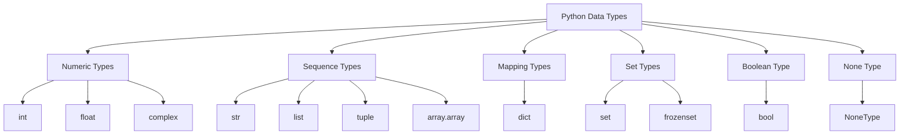

# Overview

Python data types determine what kind of values a program can store and how those values can be used. Choosing an appropriate type makes it possible to represent information accurately, organize related values, and perform the operations a program requires. Understanding data types also helps prevent unexpected behavior when values are modified, shared between variables, or copied.

Imagine a small application that manages user accounts and transactions. It might store a user's name as a string, an account balance as a number, and an approval status as a Boolean. A list can hold several transaction records, a dictionary can organize a user's details by meaningful keys, and a set can collect unique permissions. A tuple can represent a fixed transaction record, while `None` can indicate that an optional value is absent. As the application grows, choosing the right types becomes important for keeping its data organized and ensuring that changes behave as intended.

The following diagram shows the main data type families covered in this module.

The **Data Types** module progresses from recognizing and inspecting values to creating collections and working with their contents. Each level builds on the previous one, developing the skills needed to represent, access, modify, and copy data predictably.

**Level 1** introduces the foundations of Python data types, including **numeric types**, **strings**, **Booleans**, and **None**, along with the basic characteristics of **lists**, **tuples**, **dictionaries**, and **sets**. It explains **mutability and ordering**, introduces `type()` and `len()` for inspecting values, and covers basic **type casting** with `int()`, `float()`, `str()`, and `bool()`.

**Level 2** develops the creation and conversion of collection types. It covers **sequence types**, **mapping types**, and **set types**, including the syntax used to create lists, tuples, dictionaries, and sets. It also introduces **collection type casting** through constructors such as `list()`, `tuple()`, `dict()`, and `set()`, helping learners choose suitable structures and convert data between compatible forms.

**Level 3** develops practical skills for accessing, modifying, and copying data. It covers **indexing and slicing**, **dictionary key access**, **nested access and assignment**, and the behavior of **mutable and immutable objects**. The main sections examine the methods and common operations of **lists**, **dictionaries**, **sets**, **strings**, and **tuples**, including their important limitations. The level concludes with **shallow and deep copying**, showing how separate outer collections can still share nested objects and when independent copies are needed.

Together, these concepts help learners select appropriate types, work with structured information, and understand the consequences of changing or copying objects as programs become more complex.
