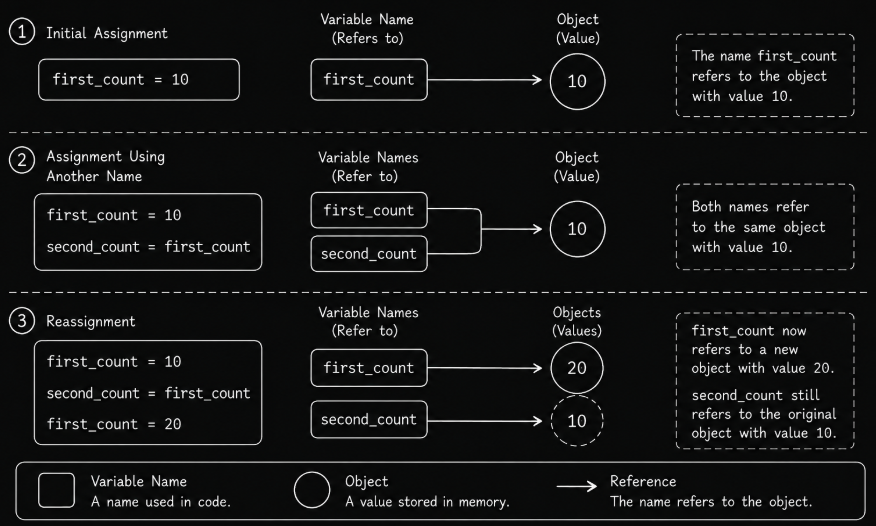

# Level 1

## Table of Contents: Documentation and Code Style

- [Variables, Literals, and Objects](#variables-literals-and-objects)
- [Built-in Functions](#built-in-functions)
- [Naming and Formatting](#naming-and-formatting)
- [Comments and Docstrings](#comments-and-docstrings)

**Documentation and Code Style Level 1** introduces the foundations needed to write small Python programs that are understandable as well as correct. We begin with literals, variables, and objects, then use built-in functions to display and inspect them. The focus then shifts to readable code through naming, formatting, comments, and docstrings.

## Variables, Literals, and Objects

A **literal** is a value written directly in Python code. Common literals include strings for text, integers for whole numbers, floating-point numbers for numbers with a fractional part, Boolean values `True` and `False`, and `None`, which represents the absence of a value. A **variable** is a name that refers to an object so that it can be used again later. The `=` operator assigns a name to an object.

```py
user_name = "Vardenis"
item_count = 5
price = 19.99
is_active = True
selected_item = None
```

The values on the right are literals, while the names on the left allow us to refer to their objects later. Python strings can use either single or double quotation marks, and triple quotes can create strings that span multiple lines.

```py
city = 'Vilnius'
description = """Line one
Line two
Line three"""
```

The value assigned to `description` is a string, not a comment. Triple-quoted strings also have a documentation use that we will explore in **Comments and Docstrings**.

To understand assignment more precisely, it helps to think of variables as **names that refer to objects** rather than boxes that contain values. Strings, integers, floating-point numbers, Boolean values, and `None` are all objects in Python. The following diagram shows how names refer to objects and how those references change when a name is reassigned.



The first stage shows `first_count` referring to the integer object `10`. In the second stage, `second_count = first_count` makes both names refer to the same object. In the third stage, assigning `20` to `first_count` changes only that name's reference; `second_count` continues to refer to `10`.

```py
first_count = 10
second_count = first_count
first_count = 20

print(first_count) # 20
print(second_count) # 10
```

Assignment does not create a permanent connection between names. Reassigning one name does not automatically reassign another. A name can also be reassigned to an object of a different type, and Python allows several names to be assigned in one statement or several names to receive the same value.

```py
user_name = "Vardenis"
user_name = 100

x, y, z = 1, 2, 3
x = y = z = 10
```

The first two statements demonstrate reassignment to a different type. The last two demonstrate **multiple assignment** and **chained assignment**. In multiple assignment, the number of values must match the number of names. If a value is intentionally not needed, the conventional name `_` can be used to receive it.

```py
x, _, z = 1, 2, 3

print(x) # 1
print(z) # 3
```

Here, `_` receives `2`, but communicates that we do not intend to use it. It is a normal Python name, not an empty position. For example, `x, y, z = 1, 3` raises a `ValueError` because there are too few values, while `x, , z = 1, 2, 3` is invalid syntax. These assignment forms are useful to recognize, although separate assignments are often clearer when values have different purposes.

!!! info "Errors are useful feedback"

    Using a name that has not been defined can produce a `NameError`, invalid Python syntax can produce a `SyntaxError`, and assigning the wrong number of values to multiple names can produce a `ValueError`. These errors are normal feedback while learning. We will explore errors and debugging in more detail in **Testing and Debugging Level 1**.

We can now use Python's built-in functions to display and inspect objects.

## Built-in Functions

A **function** is a reusable piece of code that performs a particular task. Python provides **built-in functions** that are available without importing anything first. A function is called by writing its name followed by parentheses, and values supplied inside the parentheses are called **arguments**.

```py
print("Hello, world") # Hello, world

user_name = "Vardenis"

print(user_name) # Vardenis
```

Here, `print` is the function name and `"Hello, world!"` is an argument. The first call displays a literal directly, while the second displays the object referenced by `user_name`.

The `type()` function tells us the type of an object, while `len()` returns the length of an object that has a defined length. For a string, `len()` returns the number of characters. How each type behaves, whether it can be changed in place, whether it preserves order, and how types can be converted, is explored in **Data Types Level 1**.

```py
item_count = 5

print(type(item_count)) # <class 'int'>

user_name = "Vardenis"

print(len(user_name)) # 8
```

The first result shows that `item_count` refers to an object of type `int`, Python's integer type. The word `class` is part of Python's representation of the type. Classes will be explored in **Object Level 1**.

The `dir()` function returns a list of names associated with an object. These include **attributes**, which provide information associated with an object, and **methods**, which are functions associated with an object. The `help()` function displays available documentation, with the amount of information depending on what documentation is available for the object.

```py
print(dir(user_name)) # Display the names associated with the string object
help(print) # Display the available documentation for print
```

You do not need to understand every name returned by `dir()` at this level. It is enough to recognize that objects provide information and behavior that can be inspected, while `help()` provides a way to read their documentation.

Built-in functions are also objects. In an interactive Python session, entering a function's name without parentheses displays its representation rather than calling it. The `>>>` prompt shows what you enter, and the following line shows Python's response.

```py
print # <built-in function print>
```

At this **Documentation and Code Style Level 1**, we only need to understand what a function is, how to call built-in functions, and how to use them with the objects introduced so far. With these basic tools in place, we can shift from whether code merely works to whether it is easy for people to read and understand.

## Naming and Formatting

Correct behavior is essential, but working code can still be unnecessarily difficult to read. Code is often read many times after it is written, either by the original author or by other developers who need to understand and modify it. **Code style** refers to conventions that help code remain clear and consistent. At this **Documentation and Code Style Level 1**, we focus on meaningful names, spacing, indentation, blank lines, and line length.

Names communicate the purpose of values in a program. Compare the following assignments.

```py
n = "Vardenis"
a = 25
```

The names are valid, but their meaning is unclear without additional context. Descriptive names make the same information easier to understand. Python convention uses lowercase **snake_case** names for variables, with words separated by underscores. Uppercase names are conventionally used for values intended to remain constant.

```py
user_name = "Vardenis"
item_count = 5
total_price = 19.99

MAX_ATTEMPTS = 3
DEBUG = True
```

!!! note "Constants are a naming convention"

    Uppercase naming communicates that a value is intended to remain constant. Python does not prevent an uppercase variable from being reassigned.

A good name should communicate purpose without becoming unnecessarily long. Short names such as `x` can be appropriate in limited contexts, but descriptive names are usually more useful when the purpose of a value matters.

Formatting provides the visual structure that makes names and expressions easier to scan. The following code works, but its missing spacing makes it harder to read.

```py
price=100
tax=20
total=price+tax
print(total) # 120
```

The same statements are clearer with spaces around operators. Commas are also normally followed by a space.

```py
price = 100
tax = 20
total = price + tax

print(total) # 120

x, y, z = 1, 2, 3
```

Python also uses indentation to represent the structure of code blocks. The standard convention is **four spaces for each indentation level**. You will encounter indented blocks when later material introduces statements that contain other statements. For now, you only need to recognize that indentation can affect program structure and must therefore be consistent.

Blank lines can separate distinct parts of a program and make related statements easier to scan. They should be used deliberately rather than placed between every line.

```py
user_name = "Vardenis"
user_age = 25

print(user_name) # Vardenis
print(user_age) # 25
```

Very long lines are harder to read, especially when code is viewed beside other files or on smaller screens. **PEP 8 recommends limiting most lines to 79 characters.** At this level, treat 79 characters as a useful target.

These conventions are collected in Python's official style guide, **PEP 8**, which includes recommendations for indentation, whitespace, naming, line length, imports, and other aspects of Python code style. You do not need to memorize the entire guide. The goal is to recognize the basic conventions and apply them intentionally, while later **Documentation and Code Style Level 2** will introduce formatting and linting tools that automate many style checks.

Good naming and formatting allow code to communicate more clearly on its own. When code still needs additional explanation or documentation, comments and docstrings provide that next layer.

## Comments and Docstrings

A **comment** is text in source code intended for people reading the program. Python ignores comment text when executing the program, and a single-line comment begins with `#`. Comments are most useful when they explain **why** something is done, clarify a non-obvious decision, or provide context that the code itself cannot communicate clearly.

```py
# Store the maximum number of attempts
MAX_ATTEMPTS = 3
```

A comment that merely repeats the code adds little useful information. For example, the comment below describes an operation that is already visible.

```py
retry_count = 0
retry_count = retry_count + 1 # Increase retry_count by 1
```

A more useful comment explains the reason behind the statement.

```py
retry_count = 0
# Count attempts so the retry process can be stopped at a limit.
retry_count = retry_count + 1
```

The second comment provides context that the assignment alone does not communicate. The increment itself does not stop the retry process; the logic that checks the limit will be introduced with control flow.

Meaningful names can often communicate information more clearly than comments that explain unclear names. For example, `user_age = 25` is preferable to using `a = 25` with a comment saying that `a` represents the user's age. Comments must also remain accurate, so related comments should be updated when code changes.

Earlier in this **Documentation and Code Style Level 1**, we saw that triple quotes create strings rather than comments. A string literal can also serve as a **docstring** when it appears in a special position. A docstring provides structured documentation that Python can retain and documentation tools can use.

At this **Documentation and Code Style Level 1**, we focus on module docstrings. A **module** is a Python file containing Python code. When a string literal appears as the first statement in a Python file, it serves as that module's docstring and describes the purpose of the file. Triple double quotes are the recommended convention for writing docstrings.

```py
"""Demonstrate basic variables and built-in functions"""

user_name = "Vardenis"
print(user_name) # Vardenis
```

Unlike a `#` comment, a docstring can be accessed by Python as documentation. The special `__doc__` attribute gives direct access to a stored docstring, while `help()` presents available documentation in a more readable form. We can demonstrate both using the built-in `len` function.

```py
print(len.__doc__)
help(len)
```

Both statements access documentation associated with the same object. The first displays its stored docstring, while the second opens Python's documentation display.

!!! info "Special names and module details"

    For now, you only need to recognize that docstrings are stored by Python and can be accessed as documentation. Special names and module-related details will be explored in **Modules and Imports Level 1**.

Later, after user-defined functions and classes have been introduced, we can extend docstrings to those objects and explore how they document parameters, return values, and more complex behavior. Use `#` comments to explain relevant context within source code, and use docstrings to provide structured documentation that Python can retain and documentation tools can access.
