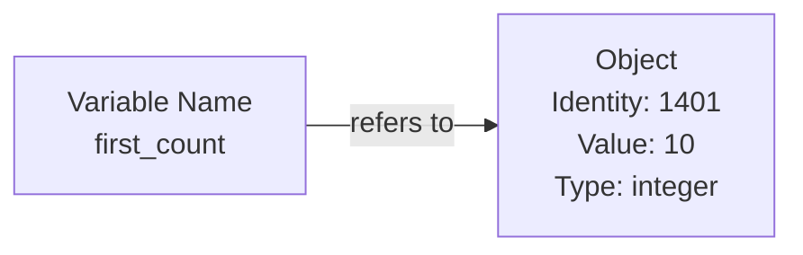
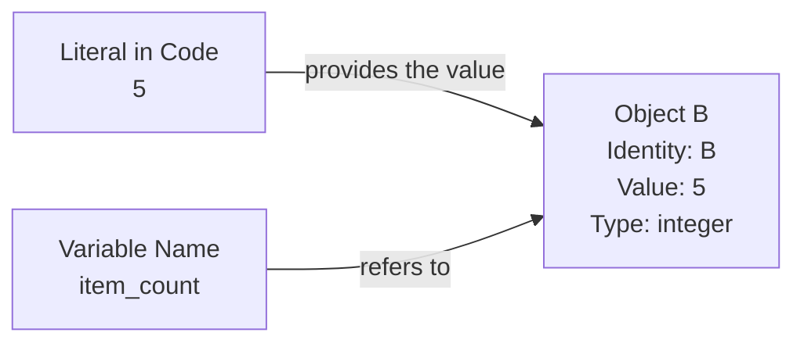
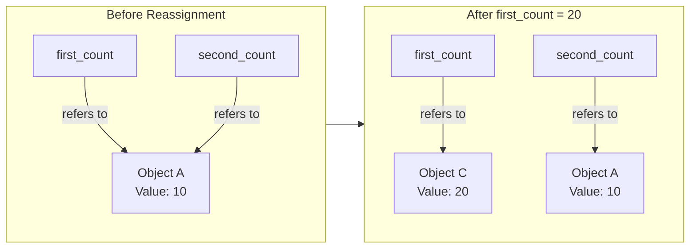

# Level 1

## Table of Contents: Documentation and Code Style

- [Comments](#comments)
- [Variables, Literals, and Objects](#variables-literals-and-objects)
- [Built-in Functions](#built-in-functions)
- [Naming and Formatting](#naming-and-formatting)

**Documentation and Code Style Level 1** introduces the foundations needed to write small Python programs that are understandable as well as correct. We begin with comments so they can be used throughout the examples, then explore literals, variables, and objects and introduce `print()` to display values. The focus then shifts to readable code through meaningful naming and basic spacing.

## Comments

A **comment** is text in source code intended for people reading the program. Python ignores comment text when executing the program, and a single-line comment begins with `#`. Comments can provide explanations, clarify decisions, and make source code easier to understand.

```py
# Display a greeting
print("Hello, world") # Hello, world
```

The first comment appears on its own line, while the second appears after a statement. In both cases, Python ignores the comment text. Comments placed after `print()` statements can also be used to show the expected output. Comments are most useful when they explain **why** something is done, clarify a non-obvious decision, or provide context that the code itself cannot communicate clearly. A comment that merely repeats the code adds little useful information. Comments should remain accurate when code changes, and meaningful names should be preferred over comments that merely explain unclear names.

!!! tip "Write comments for future readers"

    Comments are especially useful when the reason for a decision is not obvious from the code itself. Describe the relevant context rather than repeating the code, and update or remove comments when the situation changes.

With comments established, we can now use them to explain Python examples as we explore literals, variables, and objects.

## Variables, Literals, and Objects

Python programs work with data such as text, numbers, and Boolean values. While a program is running, Python represents these values using **objects**. Every object has an identity, a type, and represents a specific value. Its identity distinguishes that particular object from other objects. Python manages objects in the computer's working memory, called **random-access memory (RAM)**, while the program is running.



For example, when a program works with the integer `10`, Python has an integer object representing that value in memory. The diagram uses `1401` as an example identity to show that the object has an identity that distinguishes it from other objects. The number is only illustrative and is not an actual identity produced by the program. A **variable** gives the program a name through which that particular object can be referred to and used again. This is different from saving data permanently to a file, which can remain stored after the program finishes.

A useful analogy is a labeled item on a worktable. The **object** is the item, **memory** is the worktable where the item is available while the work is taking place, and the **variable** is a label used to refer to that item. The label is not the item itself, and it can later be moved to another item.

A variable is therefore best understood as a **name that refers to an object** rather than as a box that contains a value. Python keeps track of which object a name refers to. Types belong to objects rather than to variable names, which is why the same name can later refer to an object of a different type.

!!! info "Objects and Memory"

    At this **Documentation and Code Style Level 1**, it is enough to understand that Python manages objects in working memory, each object has an identity that distinguishes it while it exists, and names can refer to those objects. Exactly how Python identifies objects, allocates memory, represents objects internally, and manages their lifetimes is examined separately in **Python Under the Hood Level 2**.

A **literal** is a value written directly in Python source code.

```py
"Vardenis"
5
19.99
True
None
```

These examples include string literals for text, integer literals for whole numbers, a floating-point literal for a number with a fractional part, Boolean literals `True` and `False`, and `None`, which represents the absence of a value. When Python evaluates a literal, it works with that value as an object.

A variable gives us a name that can refer to an object so that the object can be used again later. The `=` operator performs **assignment** and is called the **assignment operator**. It assigns the name on the left to refer to the object produced by the expression on the right.

```py
user_name = "Vardenis"
item_count = 5
price = 19.99
is_active = True
selected_item = None
```

For example, in `item_count = 5`, `5` is a literal representing a value, Python works with that value as an integer object, and `item_count` becomes a name that refers to the object.



The diagram uses `Object B` to distinguish the particular object being illustrated. The literal `5` provides the value represented by the object, while `item_count` refers to that object. This shows the difference between a literal written in source code, an object used while the program runs, and a variable name that refers to the object.

Assignment can also make more than one name refer to the same object, and a name can later be **reassigned** to a different object.



Initially, both `first_count` and `second_count` refer to `Object A`, which represents the value `10`. After `first_count = 20`, `first_count` refers to a different object, shown as `Object C`, while `second_count` continues to refer to `Object A`.

```py
first_count = 10
second_count = first_count
first_count = 20

print(first_count) # 20
print(second_count) # 10
```

Reassigning a name therefore changes what that name refers to without automatically changing other names that refer to the previous object.

String literals can be written with single or double quotation marks, while triple quotation marks can be used when a string spans multiple lines.

```py
greeting = "Hello"
message = 'Welcome'

description = """Line one
Line two
Line three"""
```

All three objects contain string values. Triple quotation marks do not create a comment. In this example, they create a string that spans multiple lines. A name can also be reassigned to an object of a different type.

```py
user_name = "Vardenis"
user_name = 100
```

After the second assignment, `user_name` refers to the integer object `100` instead of the string object `"Vardenis"`. Python also allows several names to be assigned in one statement or several names to receive the same value.

```py
x, y, z = 1, 2, 3
x = y = z = 10
```

These statements demonstrate **multiple assignment** and **chained assignment**. In multiple assignment, the number of values must match the number of names. If a value is intentionally not needed, the conventional name `_` can be used to receive it.

```py
x, _, z = 1, 2, 3

print(x) # 1
print(z) # 3
```

Here, `_` receives `2`, but communicates that we do not intend to use it. It is a normal Python name, not an empty position. For example, `x, y, z = 1, 3` raises a `ValueError` because there are too few values, while `x, , z = 1, 2, 3` is invalid syntax.

!!! info "Errors are useful feedback"

    Using a name that has not been defined can produce a `NameError`, invalid Python syntax can produce a `SyntaxError`, and assigning the wrong number of values to multiple names can produce a `ValueError`. These errors are normal feedback while learning. We will explore errors and debugging in more detail in **Testing and Debugging Level 1**.

We have already used `print()` to display values in several examples. We can now look more closely at what `print()` is and how calling a built-in function works.

## Built-in Functions

A **function** is a reusable piece of code that performs a particular task. Python provides **built-in functions** that are available without importing anything first. A function is called by writing its name followed by parentheses, and values supplied inside the parentheses are called **arguments**. The `print()` function displays values, allowing us to see the results of a program.

```py
print("Hello, world") # Hello, world

user_name = "Vardenis"
print(user_name) # Vardenis
```

Here, `print` is the function name and `"Hello, world"` is an argument. The first call displays a literal directly, while the second displays the object referenced by `user_name`. The parentheses call the function, and the argument determines what is displayed. For now, we only need to recognize and call built-in functions. Defining your own functions is introduced in **Functions Level 1**.

Now that we understand the basic elements used throughout our examples, we can focus on how naming and formatting make code easier to read and understand.

## Naming and Formatting

Correct behavior is essential, but working code can still be unnecessarily difficult to read. **Code style** refers to conventions that help code remain clear and consistent. At this **Documentation and Code Style Level 1**, the focus is on meaningful names and basic spacing.

Names communicate the purpose of values in a program. Compare the following assignments.

```py
n = "Vardenis"
a = 25
```

These names are valid, but their meaning is unclear without additional context. Descriptive names make the same information easier to understand. Python convention uses lowercase **snake_case** names for variables, with words separated by underscores. Uppercase names are conventionally used for values intended to remain constant.

```py
user_name = "Vardenis"
item_count = 5
total_price = 19.99

MAX_ATTEMPTS = 3
DEBUG = True
```

!!! warning "Variable naming rules"

    Variable names can use letters, numbers, and underscores. They cannot contain spaces or hyphens, and they cannot begin with a number. For example, `user_name`, `item2`, and `total_price` are valid names, while `user name`, `user-name`, and `2items` are not.

!!! note "Constants are a naming convention"

    Uppercase naming communicates that a value is intended to remain constant. Python does not prevent an uppercase variable from being reassigned.

Names should communicate purpose without becoming unnecessarily long. Short names such as `x` are appropriate when their meaning is clear from context.

Formatting provides visual structure that makes expressions easier to scan. Compare the following examples.

```py
price=100
tax=20
total=price+tax
print(total) # 120
```

Spaces around operators and after commas make the same statements easier to scan.

```py
price = 100
tax = 20
total = price + tax

print(total) # 120

x, y, z = 1, 2, 3
```

Spaces around operators and after commas make statements easier to read. Together with meaningful names and comments, basic formatting helps keep code clear and consistent.

Later **Documentation and Code Style Level 2** introduces structured documentation such as docstrings, along with additional formatting conventions and automated style checking.
