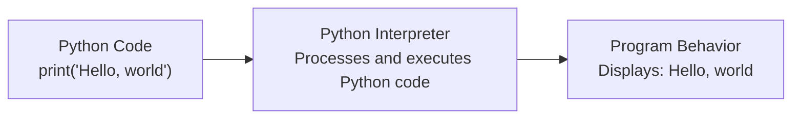
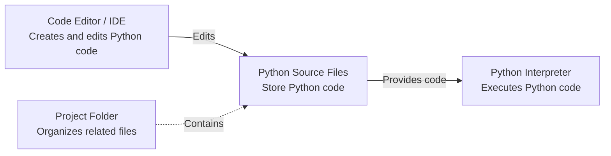
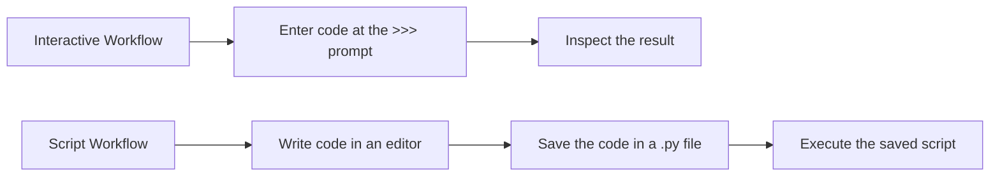

# Level 1

## Table of Contents: Environment

- [Installing Python](#installing-python)
- [Understanding the Python Development Environment](#understanding-the-python-development-environment)
- [Text Editors, Code Editors, and IDEs](#text-editors-code-editors-and-ides)
- [Interactive and Script Workflows](#interactive-and-script-workflows)
- [Basic Project Organization](#basic-project-organization)
- [Python Source Files](#python-source-files)

**Environment Level 1** introduces the components that form a basic Python development environment and explains how they work together when creating and running Python programs. It begins with installing the **Python interpreter** and understanding its role within the development environment, then examines text editors, code editors, and IDEs together with interactive and script workflows. The level concludes with basic project organization and Python source files, establishing how projects are structured and how Python code is stored within them.

## Installing Python

The **Python interpreter** is the program responsible for executing Python code and must be installed before Python programs can be executed. It processes the code and carries out operations such as displaying text, performing calculations, or working with files. A useful analogy is a cook following a recipe. The recipe contains instructions, while the cook follows them to prepare a dish. Similarly, Python source code contains instructions, while the interpreter processes them to produce the program's behavior.



!!! info "Interpreter Role"

    This explanation focuses on **what the Python interpreter does** rather than exactly how it works internally. The internal execution process is examined separately in **Python Under the Hood Level 2**.

Python is available for Windows, macOS, Linux, and other operating systems. For general Python development, install a current stable release of **Python 3** that is supported by the operating system. Official Python downloads are available from [python.org](https://www.python.org/downloads/). Windows and macOS installers are available directly from the Python website, while Linux distributions commonly provide Python through their package management systems.

During installation, Python may be configured so that its executable can be found through the system `PATH`. The **PATH** is an operating system setting that contains directories in which the system searches for executable programs. When the Python executable is available through `PATH`, Python can be started from a command line without specifying the executable's complete file path.

The command used to access Python can differ between systems and installations. Common commands include `python`, `python3`, and `py`. The installed version can be checked from the system command line.

```bash
python --version
python3 --version
py --version
```

A working command displays the installed Python version. If a command is not recognized or cannot be found, it may not be available through the current `PATH`, or Python may not be installed under that command.

!!! tip "Checking the Executable Location"

    If Python is installed but its command is not working as expected, the executable location can help identify which installation is being found.

    ```bash
    # Windows Command Prompt
    where python
    where py

    # macOS and Linux
    which python3
    which python
    ```

    These commands show matching executables found through the current `PATH`. The exact location depends on the operating system and installation method, so a fixed installation path should not be assumed.

Detailed command-line usage, including running scripts and working with Python commands, is covered in **Command Line Level 1**. Once Python is installed and accessible on the system, the interpreter becomes the central component of the Python development environment.

## Understanding the Python Development Environment

A **Python development environment** is the collection of tools and files used to create and run Python programs on a computer. The interpreter executes Python code, development tools provide a workspace for creating and editing it, source files preserve it, and project folders keep related files together. Unlike an editor or IDE, which provides tools for working with code, the interpreter is responsible for executing it. It can receive code directly or from a saved source file, and these approaches are examined in **Interactive and Script Workflows**.



The interpreter also provides the foundation from which different execution environments can be created. The distinction between shared and isolated Python environments is covered in **Python Environment Level 2**. Development tools provide the workspace in which the code executed by the interpreter is created and managed.

## Text Editors, Code Editors, and IDEs

A **text editor** provides basic tools for creating and editing plain text files. A **code editor** is designed specifically for source code and commonly provides features such as syntax highlighting, automatic indentation, file navigation, and code search.

**Visual Studio Code** is a graphical code editor available for Windows, macOS, and Linux. It provides project navigation, extensions, and an integrated terminal. Python support is added by installing the **Python extension**, which provides features such as interpreter selection, code completion, and debugging integration. The Python interpreter must also be installed separately so that Python programs can be executed. Visual Studio Code can be downloaded from the [official Visual Studio Code website](https://code.visualstudio.com/), and the extension is available from the [official Python extension page](https://marketplace.visualstudio.com/items?itemName=ms-python.python).

**Neovim** is a terminal-based code editor available for Windows, macOS, and Linux. It provides a keyboard-driven editing interface and can be configured with plugins and language-support tools. Neovim can be downloaded from the [official Neovim website](https://neovim.io/).

An **integrated development environment**, or **IDE**, combines a source code editor with additional development tools in one application. **PyCharm** is an IDE designed for Python development and provides integrated debugging, project management, and interpreter configuration. It is available from the [official PyCharm website](https://www.jetbrains.com/pycharm/). **IDLE** provides a source code editor together with an interactive Python shell. It is included with many Python installations and is documented in the [official Python documentation](https://docs.python.org/3/library/idle.html).

The choice of editor or IDE depends on the features and workflow appropriate for a particular project.

!!! warning "Word Processors"

    Word processors such as Microsoft Word are designed for formatted documents rather than plain source code and are not appropriate for writing Python programs.

These development tools support both direct experimentation with Python and work with code saved for repeated execution.

## Interactive and Script Workflows

Python supports two basic workflows for providing code to the interpreter. Code can be entered directly during an interactive session or saved in a source file as a script for later execution.



An **interactive session** displays the `>>>` prompt and waits for Python code to be entered. The following example shows code entered directly and the output produced by the interpreter.

```py
>>> print("Hello, world")
Hello, world
```

This interactive process is commonly called a **REPL**, which stands for **Read, Eval, Print, Loop**. Python reads the entered code, evaluates or executes it, displays a result when appropriate, and then waits for more input. Interactive execution is convenient for experimenting with expressions and small pieces of code because results can be inspected immediately.

!!! tip "Exiting an Interactive Session"

    An interactive session continues until it is exited. Enter `exit()` or `quit()` at the `>>>` prompt to leave the session. A keyboard shortcut can also signal the end of input. On macOS and Linux, press `Ctrl+D`. On Windows, press `Ctrl+Z` followed by `Enter`.

A **script** is Python code stored in a source file. Saving code allows it to be edited, preserved, and executed repeatedly. The following statement can be saved in a `.py` file.

```py
print("Hello, world")
```

The distinction is that interactive execution receives code directly, while script execution receives code from a saved file. Both use the Python interpreter to execute Python code. The commands used to start interactive sessions and run scripts are covered in **Command Line Level 1**. Scripts depend on saved source files, which makes the format and organization of Python source code an important part of the development environment.

## Basic Project Organization

A **project folder** is a directory that provides a single location for the files belonging to a program. A small project may contain only a few files, while a larger project can use **subfolders** to keep related files organized.

```text
weather_app/
├── main.py
├── weather_data/
│   ├── cities.py
│   └── archived_data/
│       └── old_cities.py
└── utility_tools/
    └── converter.py
```

Here, `weather_app` is the project folder, while `weather_data` and `utility_tools` are subfolders. A subfolder can also contain another subfolder. In this example, `archived_data` is a subfolder inside `weather_data`. Folders can therefore be nested when additional organization is useful.

!!! tip "Folder Names to Avoid"

    Avoid vague folder names, names containing spaces, and inconsistent capitalization, such as `stuff`, `my project`, `Sample Data`, and `New Folder`. These forms may be accepted by the operating system, but they can make project paths less clear or less convenient to work with.

A project folder establishes where the program and its related files are organized. The Python source files stored within this structure have their own format and purpose.

## Python Source Files

Python source code is normally stored in plain text files with the `.py` filename extension. This extension identifies a file as **Python source code** and helps development tools recognize the language. To create a source file, write Python code in a text editor, code editor, or IDE and save the file with a `.py` extension.

```text
hello.py
calculator.py
main.py
```

A source filename should indicate what the file contains. For example, `calculator.py` suggests code related to a calculator, while `database.py` suggests code related to working with a database. In a program containing multiple source files, one file may serve as the **starting file**, or entry point, from which the application is launched. The filename `main.py` is commonly used for this purpose, while other source files normally have names that describe the code they contain. Python does not give `main.py` any special meaning, so another filename can also serve as the starting file.

!!! warning "Source File Names"

    Save a Python source file with one `.py` extension and avoid filenames that are difficult to work with as file paths. For example, `number_converter.py` is more convenient than `number converter.py`, and `number_converter.py.py` contains an unintended second extension. More detailed naming and formatting conventions are introduced in **Documentation and Code Style Level 1**.

A source file can contain one statement or multiple statements that form a program. For example, the following file contains three statements that display text and a blank line.

```py
print("Hello, world")
print()
print("Python source files contain executable code")
```

Python source files normally use **UTF-8** as their **text encoding**. A text encoding is a system that represents characters as data that a computer can store and process. **UTF-8** is a widely used text encoding that supports characters from many writing systems, including letters, numbers, symbols, and other characters used in source code. The same `.py` file can be opened and edited with different text editors, code editors, and IDEs.

A Python program can consist of a single `.py` file or multiple source files organized within a project folder. With the interpreter installed, a development tool available, a project folder organized, and Python source files understood, the basic development environment is in place. **Command Line Level 1** builds on this foundation by explaining the commands used to start Python and execute saved programs.
