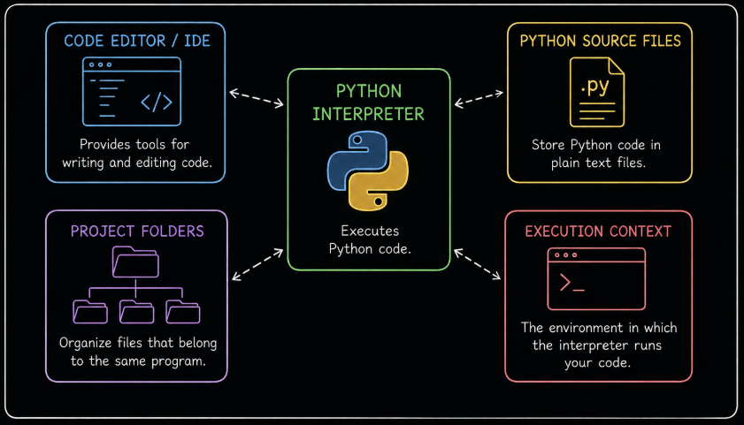

# Level 1

## Table of Contents: Environment

- [Installing Python](#installing-python)
- [Understanding the Python Development Environment](#understanding-the-python-development-environment)
- [Interactive and Script Workflows](#interactive-and-script-workflows)
- [Python Source Files](#python-source-files)
- [Text Editors, Code Editors, and IDEs](#text-editors-code-editors-and-ides)
- [Basic Project Organization](#basic-project-organization)

**Environment Level 1** introduces the components that form a basic Python development environment and explains how they work together when creating and running Python programs. It begins with installing the Python interpreter, then covers the development environment, interactive and script workflows, Python source files, development tools, and basic project organization.

## Installing Python

The **Python interpreter** must be installed before Python programs can be executed. Python is available for Windows, macOS, Linux, and other operating systems. For general Python development, install a current stable release of **Python 3** that is supported by the operating system.

The official Python downloads are available from [python.org](https://www.python.org/downloads/). Windows and macOS installers are available directly from the Python website, while Linux distributions commonly provide Python through their package management systems.

During installation, Python may be configured so that its executable can be found through the system `PATH`. The **PATH** is an operating system setting that contains directories in which the system searches for executable programs. When the Python executable is available through `PATH`, Python can be started from a command line without specifying the executable's complete file path.

The command used to access Python can differ between systems and installations. Common commands include `python`, `python3`, and `py`. The available command can be checked from the system command line.

```bash
python --version
python3 --version
py --version
```

A command that is configured correctly displays the installed Python version. If a command is not recognized or cannot be found, either Python is not installed through that command or the command is not available through the current `PATH`.

The location of the Python executable can also be inspected from the system command line.

```bash
# Windows
where python
where py

# macOS and Linux
which python3
which python
```

These commands show where a matching executable is found through the current `PATH`. The exact location depends on the operating system and how Python was installed, so a fixed installation path should not be assumed.

Detailed command-line usage, including running scripts and working with Python commands, is covered in **Python Command Line Level 1**. Once Python is installed and accessible on the system, the interpreter becomes the central component of the Python development environment.

## Understanding the Python Development Environment

A **Python development environment** is the collection of tools and files used to create and run Python programs on a computer. The **Python interpreter** is the program responsible for reading and executing Python code. The code itself can be entered directly into the interpreter or stored in Python source files and worked with through a text editor, code editor, or IDE.



These components work together as parts of the same development environment. Development tools provide a workspace for creating and editing code, source files preserve that code, project folders provide a location for related files, and the Python interpreter executes the program. The Python interpreter also provides the foundation from which different execution environments can be created. The distinction between shared and isolated Python environments is covered in **Python Environment Level 2**. Within the basic development environment, the next distinction is how code is provided to the interpreter for execution.

## Interactive and Script Workflows

Python code can be executed interactively or stored in a source file and executed as a **script**. These approaches use the same Python interpreter but differ in how the code is provided to it.

An **interactive session** provides direct access to the Python interpreter. The interpreter displays the `>>>` prompt and waits for Python code to be entered.

```py
>>> print("Hello, world")
Hello, world

>>> 2 + 2
4
```

This interactive process is commonly called a **REPL**, which stands for *Read, Eval, Print, Loop*. Python reads the entered code, evaluates or executes it, displays a result when appropriate, and then waits for more input. Interactive execution is convenient for experimenting with expressions and small pieces of code because each result can be inspected immediately without first storing the code in a source file.

An interactive session is started by running the `python` command (or `python3` or `py` on some systems) from the system command line. The session can be ended by calling `quit()` or `exit()`, by pressing `Ctrl+D` on Unix and macOS, or by pressing `Ctrl+Z` followed by `Enter` on Windows.

A **script** is Python code stored in a source file. For example, the following statement can be stored in a `.py` file instead of being entered interactively.

```py
print("Hello, world")
```

The Python interpreter can execute the statements stored in the file. Because the code is saved, it can be edited, executed repeatedly, and kept as part of a program. Executing scripts is therefore useful when code needs to be preserved and developed over time. The specific commands for running a script from the command line are covered in **Command Line Level 1**.

The difference between the two workflows is where the interpreter receives the code. An interactive session receives code directly as input, while a script provides code that has already been stored in a `.py` file. Both workflows use the Python interpreter to read and execute Python code. Script workflows therefore depend on source files that preserve Python code for later execution.

## Python Source Files

Python source code is normally stored in plain text files with the `.py` filename extension. The `.py` extension identifies a file as **Python source code** and helps editors and development tools recognize the language and provide features for working with Python.

``` text
hello.py
calculator.py
main.py
```

A Python source file contains text that is interpreted as Python code. For example, a source file can contain variable assignments, expressions, function calls, and other Python statements.

``` py
user_name = "Vardenis"

print(user_name)
```

Python source files normally use **UTF-8** as their text encoding. UTF-8 defines how characters in the source code are represented when the file is stored and allows the file to contain characters from many writing systems. Because Python source files contain plain text, the same `.py` file can be opened and edited with different text editors, code editors, and IDEs.

A Python program can consist of a single `.py` file or multiple source files. Creating and modifying these files requires a tool that can work with plain text source code, which leads to the different types of development tools available for Python.

## Text Editors, Code Editors, and IDEs

A **text editor** provides basic tools for creating and editing plain text files. A **code editor** is designed specifically for source code and commonly provides features such as syntax highlighting, automatic indentation, file navigation, and code search. Visual Studio Code and Neovim are examples of code editors that can be used for Python development.

An **integrated development environment**, or **IDE**, combines a source code editor with additional development tools in one application. PyCharm is an example of an IDE commonly used for Python development. **IDLE** is another Python development tool and provides a source code editor together with an interactive Python shell.

Although these tools provide different interfaces and features, they all provide a workspace for creating and working with Python code. The development tool does not define the Python program itself, so the choice of editor or IDE can be based on the tools and workflow that are useful for a particular project.

!!! warning "Word Processors"

    Word processors such as Microsoft Word are designed for formatted documents rather than plain source code and are not appropriate for writing Python programs.

Regardless of the development tool used, the files that belong to a program need a clear location and structure on the computer. Organizing them within a project folder provides that structure.

## Basic Project Organization

A **project folder** is a folder used to keep the files that belong to a program together. It gives the program a clear location on the computer and makes related files easier to organize.

A small project might contain only one source file.

``` text
greeting_app/
└── main.py
```

Here, `greeting_app` is the project folder and `main.py` is its source file. The name `main.py` is commonly used for a file that acts as the starting file of an application, although Python does not require this filename. A program can instead use a descriptive filename that reflects its purpose.

``` text
calculator/
└── calculator.py
```

When program grows, additional files can be added to the same project folder. Keeping related files together makes the program easier to locate and manage. With the Python interpreter installed, source files created through appropriate development tools, and related files organized within a project folder, the basic components of a Python development environment are in place.
