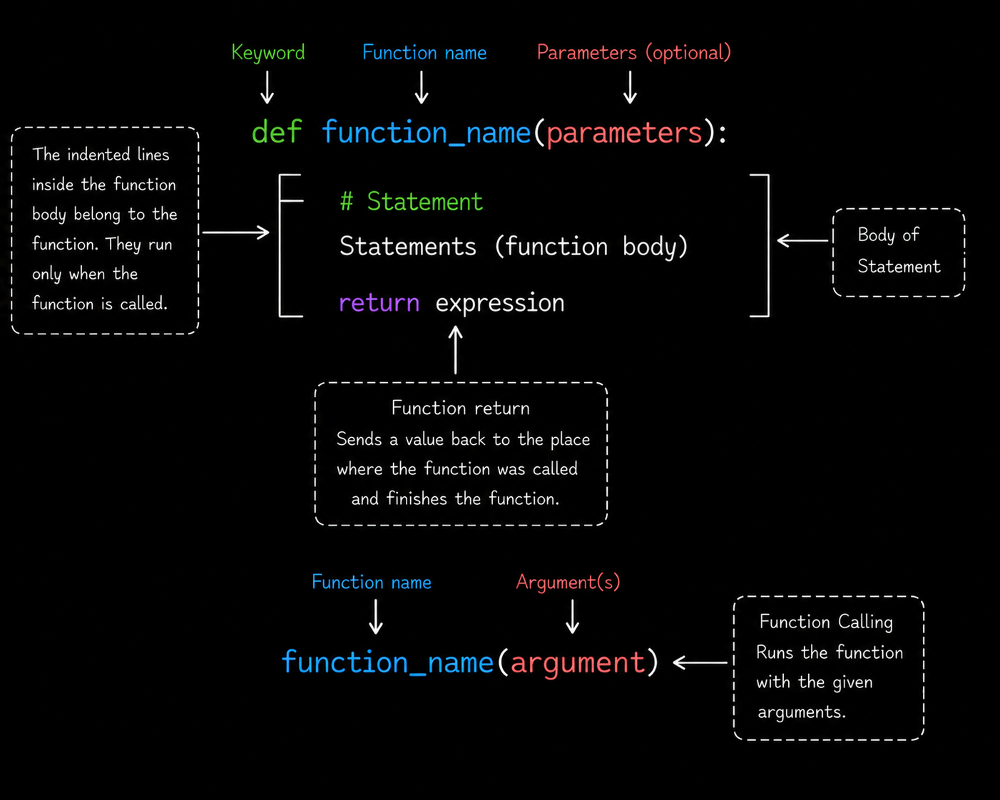

# Level 1

## Table of Contents: Functions

- [Defining and calling functions](#defining-and-calling-functions)
- [Return vs print](#return-vs-print)
- [Function composition](#function-composition)
- [Control flow inside functions](#control-flow-inside-functions)
- [Functions with collections](#functions-with-collections)

**Python Functions Level 1** introduces how functions are defined, called, and supplied with values through arguments. We will examine the relationship between parameters and arguments, compare `return` with `print()`, and see how a returned value can be passed directly into another function call. We will then combine functions with control flow and collections so that the same reusable logic can work with different kinds of input.

## Defining and calling functions

A **function** is a reusable block of code that performs a specific task. Python uses the `def` keyword to define a function, while a **function call** executes the function. A function definition can include **parameters**, which receive values supplied as **arguments** when the function is called.



The diagram shows the main parts of a function definition and the corresponding call syntax. The `def` keyword begins the definition, the **function name** identifies the function, parameters represent values that the function can receive, and the indented statements form the **function body** that runs when the function is called. As introduced in **Python Documentation and Code Style Level 1**, function names that contain multiple words should normally use `snake_case`. The relationship between parameters and arguments becomes clearer in an actual function.

```py
def greet(name):
    print("Hello", name)

greet("Jonas") # Hello Jonas
greet("Ieva") # Hello Ieva
```

Here, `name` is a parameter because it appears in the function definition, while `"Jonas"` and `"Ieva"` are arguments because they are supplied when the function is called. Each call executes the same function body with a different value and uses `print()` to display the result.

> **Note:** As introduced with module level docstrings in **Python Documentation and Code Style Level 1**, docstrings can also document individual functions. A function docstring is written as the first statement in the function body and briefly describes what the function does.

```py
def greet(name):
    """Display a greeting for the supplied name"""
    print("Hello", name)
```

At **Python Functions Level 1**, the important idea is to recognize where a function docstring is placed and what it describes. Function docstrings are explored in more detail in **Python Documentation and Code Style Level 2**.

A function can define several parameters when it needs several input values. It can also use `return` to send a result back to the code that called it.

```py
def add_numbers(a, b):
    return a + b

result = add_numbers(10, 20)

print(result) # 30
```

The parameters `a` and `b` receive the arguments `10` and `20`. The function adds those values and returns `30`, which is stored in `result`. This allows the returned value to be used outside the function instead of only being displayed while the function runs.

> **Note:** Variables created inside a function (including parameters) exist only inside that function. They are not accessible from outside. This is called **local scope**, and it is explored in detail in **Python Under the Hood Level 1**.

The first example uses `print()`, while the second uses `return`. The next section examines the difference between these two approaches.

## Return vs print

The `print()` function and the `return` statement can both appear to produce a result, but they serve different purposes. `print()` displays a value as output, while `return` sends a value back to the code that called the function so that it can be stored or reused. The difference becomes clearer by comparing two versions of the same function. Consider `add_numbers()` written with `print()` instead of `return`.

```py
def add_numbers(a, b):
    print(a + b)

add_numbers(10, 20) # 30
```

This version displays `30`, but the function does not make that value available for another calculation. When the result needs to be used elsewhere in the program, the function can return it instead.

```py
def add_numbers(a, b):
    return a + b

result = add_numbers(10, 20)
doubled_result = result * 2

print(result) # 30
print(doubled_result) # 60
```

The call `add_numbers(10, 20)` returns `30`, which is stored in `result` and then reused to calculate `doubled_result`. A returned value can therefore be assigned to a variable, used in an expression, or passed to another function, while `print()` only displays the value.

A function that reaches the end of its body without executing `return` automatically returns `None`. This can be observed by storing the result of a function that only prints.

```py
def show_total(a, b):
    print(a + b)

result = show_total(10, 20) # 30

print(result) # None
```

The call to `show_total()` displays `30`, but `result` receives `None` because the function does not return the displayed value.

> **Note:** Use `print()` when displaying information is part of the program's purpose. Use `return` when another part of the program needs to receive and reuse a result.

Executing `return` also ends the current function call, so statements that follow an executed `return` in the same execution path are not reached.

```py
def get_message():
    return "Hello"
    print("This line is not executed")

print(get_message()) # Hello
```

Returning values makes it possible for one function to produce input for another function. The next section builds on this idea with **function composition**.

## Function composition

**Function composition** means using the returned value of one function as the input to another function. This builds directly on `return` because one function can produce a value that another function continues working with. The process can first be written in separate steps so that the intermediate value is easy to see.

```py
def add_tax(price):
    return price + (price * 0.21)

def add_shipping(price):
    return price + 5

price = 20
taxed_price = add_tax(price)
result = add_shipping(taxed_price)

print(result) # 29.2
```

The call `add_tax(price)` returns `24.2`, which is stored in `taxed_price` and then supplied as the argument to `add_shipping()`. The second function uses that value and returns `29.2`, so the returned value of the first function becomes the input to the second function.

When the intermediate value does not need to be stored or reused elsewhere, the same calls can be combined directly.

```py
def add_tax(price):
    return price + (price * 0.21)

def add_shipping(price):
    return price + 5

price = 20
result = add_shipping(add_tax(price))

print(result) # 29.2
```

Python evaluates the inner call `add_tax(price)` first and receives `24.2`. That returned value becomes the argument to `add_shipping()`, which returns `29.2`. Both examples perform the same operations. The first makes the intermediate value visible with a variable, while the second passes the value directly from one function call to another.

At this level, the important idea is that function composition works with the **value returned by a function call**. Passing a function itself without calling it is a different concept introduced later with first class and higher order functions.

Functions can also use control flow to decide which value should be returned for different inputs. The next section applies this idea with conditional statements inside functions.

## Control flow inside functions

Functions can use control flow to decide what should happen for different input values. Conditional statements such as `if` work inside a function just as they do elsewhere in a program, while `return` can send the appropriate result back to the caller. A common practical use is validating input before the program continues, such as checking whether a password meets a minimum length requirement.

```py
def check_password_length(password):
    if len(password) < 8:
        return "Password too short"

    return "Password length is OK"

print(check_password_length("1234")) # Password too short
print(check_password_length("securepass123")) # Password length is OK
```

The function receives a password and returns a different message depending on its length. Keeping the decision inside the function means the same validation rule can be applied whenever another password needs to be checked. The function can also be called repeatedly when several values need the same decision making logic.

```py
passwords = ["1234", "mypassword", "securepass123"]

for password in passwords:
    result = check_password_length(password)
    print(result)
```

The loop handles each password one at a time, while `check_password_length()` remains responsible for deciding which result to return. This separates repetition from validation and avoids rewriting the password condition for every value.

So far, these function calls have received individual strings or numbers. In practical programs, related values are often grouped in collections, and an entire collection can also be supplied as a function argument.

## Functions with collections

Lists, dictionaries, and other collections can be supplied as function arguments just like strings, numbers, and other values. This allows a function to receive a group of related data and perform a focused operation with it. For example, an application can keep a list of users who are allowed to access a particular area.

```py
def is_allowed_user(username, allowed_users):
    return username in allowed_users

allowed_users = ["Jonas", "Ieva", "Mantas"]

print(is_allowed_user("Jonas", allowed_users)) # True
print(is_allowed_user("Tomas", allowed_users)) # False
```

The `username` parameter receives the value being checked, while `allowed_users` receives the list. The expression `username in allowed_users` performs a membership test and produces either `True` or `False`, which the function returns directly.

A list can also be passed to a function when a calculation requires several values. For example, a function can calculate the average of several test scores.

```py
def calculate_average(scores):
    return sum(scores) / len(scores)

test_scores = [8, 9, 10, 7]

average = calculate_average(test_scores)

print(average) # 8.5
```

The `scores` parameter receives the entire list. The function uses `sum()` to calculate the total and `len()` to determine how many scores are present, then returns the average. This keeps the calculation inside the function while the caller only needs to provide the collection.

Dictionaries are useful when several related values describe one item or person. A function can receive the entire dictionary and use only the values needed for its task.

```py
def get_user_status(user):
    if user["active"]:
        return f"{user['name']} is active"

    return f"{user['name']} is inactive"

user = {
    "name": "Austėja",
    "active": True
}

print(get_user_status(user)) # Austėja is active
```

Here, the `user` parameter receives the dictionary. The function reads `"active"` to make a decision and `"name"` to build the returned message, combining collection access with the control flow introduced in the previous section.

At this **Python Functions Level 1**, the important idea is that functions can receive both individual values and collections. They can then inspect, calculate, or make decisions using the supplied data while keeping the related logic in one reusable place.
