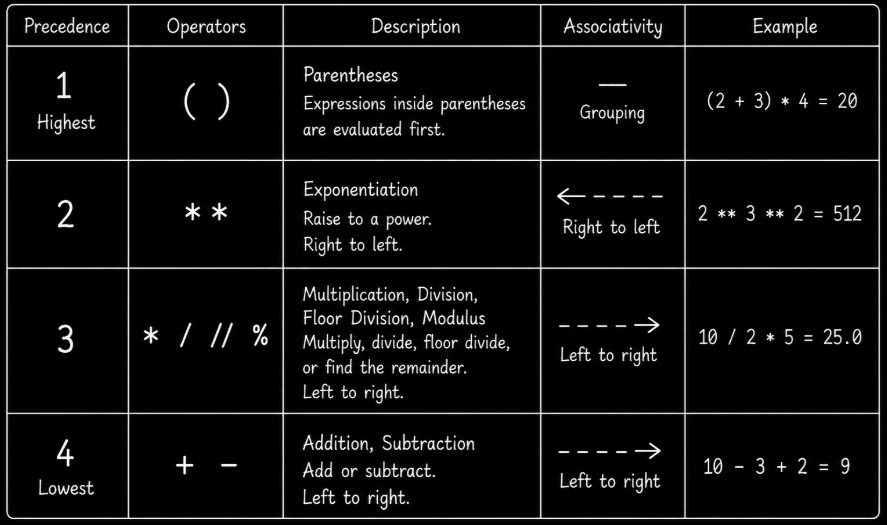

# Level 1

## Table of Contents: Operations

- [Operators and operands](#operators-and-operands)
- [Assignment and augmented assignment operators](#assignment-and-augmented-assignment-operators)
- [Order of Operations](#order-of-operations)

**Operations Level 1** introduces the basic operators used to perform arithmetic and assignment operations in Python. You will learn how operators work with operands, how arithmetic expressions produce values, how assignment and augmented assignment update variables, how Python handles common combinations of numeric and string values, and how precedence determines the order in which arithmetic operations are evaluated.

## Operators and operands

An **operator** is a symbol that tells Python to perform an operation. The values, variables, or expressions that an operator acts on are called **operands**. A **unary operator** acts on one operand. For example, the unary minus operator `-` produces the negated value of its operand.

```py
number = 20
negative_number = -number

print(negative_number) # -20
```

A **binary operator** acts on two operands. Python provides several arithmetic operators for working with numbers.

```py
number1 = 10
number2 = 3

addition = number1 + number2
subtraction = number1 - number2
multiplication = number1 * number2
division = number1 / number2
floor_division = number1 // number2
remainder = number1 % number2
power = number1 ** number2
```

The `/` operator performs **division** and produces a floating point result. The `//` operator performs **floor division** and rounds the result down to the nearest whole value. The `%` operator produces the **remainder** after division, while `**` performs **exponentiation**.

```py
division = 10 / 3
floor_division = 10 // 3
remainder = 10 % 3
power = 2 ** 3

print(division) # 3.3333333333333335
print(floor_division) # 3
print(remainder) # 1
print(power) # 8
```

!!! info "Floor division with negative numbers"

    Floor division rounds toward negative infinity, not toward zero. For example, `-10 // 3` produces `-4` because the mathematical quotient is approximately `-3.33`, and the next lower whole number is `-4`.

Arithmetic operators can behave differently depending on the types of their operands. Python can combine compatible numeric types. For example, adding an integer and a floating point number produces a floating point result.

```py
result = 10 + 2.5

print(result) # 12.5
```

Not every combination of types is compatible with every operator. For example, Python cannot add an integer and a string directly. Attempting to do so raises a `TypeError`.

```py
number = 10
text = "hello"

result = number + text # TypeError
```

Some operators also have useful meanings for strings. Multiplying a string by an integer with `*` repeats the string.

```py
text = "Hi " * 3

print(text) # Hi Hi Hi
```

The meaning of an operator therefore depends on the operands used with it. Once an expression produces a value, that value can be stored in a variable. The next section explains how assignment works and how augmented assignment provides a shorter way to update existing values.

## Assignment and augmented assignment operators

The **assignment operator** `=` assigns a value to a variable. An **augmented assignment operator** combines an operation with assignment. Instead of writing `score = score + 5`, you can write `score += 5`. Both forms update `score` by adding `5` to its current value.

```py
score = 10
score += 5 # score = score + 5

print(score) # 15
```

The basic arithmetic operators introduced above have corresponding augmented assignment forms. The following examples use separate variables so that each operation can be understood independently.

```py
value = 10
value += 5 # value = value + 5

total = 20
total -= 4 # total = total - 4

quantity = 3
quantity *= 3 # quantity = quantity * 3

amount = 40
amount /= 4 # amount = amount / 4

items = 17
items //= 5 # items = items // 5

remainder = 17
remainder %= 5 # remainder = remainder % 5

base = 2
base **= 3 # base = base ** 3
```

!!! info "Division changes the numeric type"

    The `/` operator produces a floating-point result for ordinary integer division. In the example above, `amount` starts as the integer `40`, but `amount /= 4` assigns the floating-point value `10.0` to it.

!!! info "Augmented assignment and mutable objects"

    For numbers, these examples demonstrate the same resulting values as the corresponding expanded assignments. With some mutable objects, however, augmented assignment can modify an existing object in place rather than create a new one. This distinction is explored later when working with collections and object identity.

!!! warning "Division by zero"

    Division by zero is not allowed with `/`, `//`, or `%`. Python raises a `ZeroDivisionError` when it attempts to evaluate such an operation.

    ```py
    result = 10 / 0 # ZeroDivisionError
    ```

    The exception is raised while Python evaluates the division expression, so the assignment to `result` is not completed.

Arithmetic and assignment expressions can also contain several operators at once. To understand how Python evaluates these expressions, we next need to examine the rules that determine their grouping and order of evaluation.

## Order of Operations

An arithmetic expression can contain several operators. Python uses **operator precedence** to determine how operations are grouped when an expression contains multiple operations. The diagram below summarizes the arithmetic precedence rules introduced in this level.



!!! note "Grouping with parentheses"

    Parentheses are shown first because they explicitly group parts of an expression. They are not an arithmetic operator, but they allow you to control how an expression is evaluated.

Expressions inside **parentheses** `()` are evaluated before operations outside them. Without parentheses, multiplication has higher precedence than addition.

```py
grouped_result = (2 + 3) * 4
normal_result = 2 + 3 * 4

print(grouped_result) # 20
print(normal_result) # 14
```

**Exponentiation** with `**` has higher precedence than multiplication, division, floor division, modulus, addition, and subtraction. Consecutive exponentiation operations are grouped from right to left.

```py
result = 2 ** 3 ** 2

print(result) # 512
```

This expression is evaluated as `2 ** (3 ** 2)`. Unary minus has an important relationship with exponentiation because exponentiation is evaluated before a unary minus written to its left. Parentheses can be used when the negative value itself should be the base.

```py
negative_result = -2 ** 2
grouped_result = (-2) ** 2

print(negative_result) # -4
print(grouped_result) # 4
```

Python interprets the first expression as `-(2 ** 2)`, while the second squares the negative value itself.

After exponentiation, Python evaluates **multiplication**, **division**, **floor division**, and **modulus** with `*`, `/`, `//`, and `%`. These four operators share the same precedence level and are grouped from left to right. **Addition** and **subtraction** with `+` and `-` have lower precedence and are also grouped from left to right.

```py
multiplication_result = 10 / 2 * 5
addition_result = 10 - 3 + 2

print(multiplication_result) # 25.0
print(addition_result) # 9
```

The first expression is grouped as `(10 / 2) * 5`, while the second is grouped as `(10 - 3) + 2`.

!!! tip "Make mathematical grouping explicit"

    Even when Python's default precedence would produce a valid expression, parentheses are useful when the intended mathematical grouping needs to be clear.

    ```py
    speed = 60
    time = 2
    delay = 1

    distance = speed * (time + delay)

    print(distance) # 180
    ```

    The parentheses indicate that `time + delay` must be evaluated as one quantity before multiplication by `speed`. Without them, Python would group the expression as `(speed * time) + delay`, which represents a different formula.

Understanding precedence makes arithmetic expressions easier to read and predict. **Python Operations Level 2** builds on this foundation by introducing comparison, logical, membership, and identity operators, then extending precedence rules to expressions that combine them.
