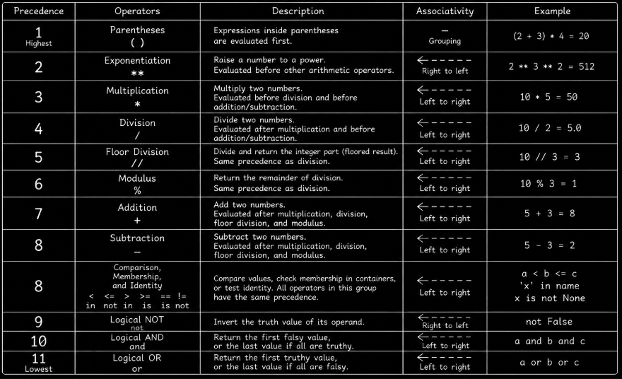

# Level 2

## Table of Contents: Operations

- [Comparison operators](#comparison-operators)
- [Logical operators and truthiness](#logical-operators-and-truthiness)
- [Membership operators](#membership-operators)
- [Identity operators](#identity-operators)
- [Operator precedence and associativity](#operator-precedence-and-associativity)

**Python Operations Level 2** introduces comparison, logical, membership, and identity operators. You will learn how to compare values, combine conditions, understand truthiness and short-circuit evaluation, check whether values are present in containers, and distinguish object identity from value equality. The level also extends operator precedence and associativity to expressions that combine these different kinds of operators.

## Comparison operators

**Comparison operators** compare values and produce a Boolean result of `True` or `False`. Python provides operators for equality, inequality, and ordering comparisons.

```py
first_score = 10
second_score = 5

equal_to = first_score == second_score # True if first_score equals second_score
not_equal_to = first_score != second_score # True if first_score does not equal second_score
greater_than = first_score > second_score # True if first_score is greater than second_score
less_than = first_score < second_score # True if first_score is less than second_score
greater_or_equal = first_score >= second_score # True if first_score is greater than or equal to second_score
less_or_equal = first_score <= second_score # True if first_score is less than or equal to second_score
```

Python also supports **comparison chaining**, which allows several related comparisons to be written as one expression.

```py
age = 20

result = 18 <= age < 65

print(result) # True
```

The expression checks whether `age` is greater than or equal to `18` and less than `65`. It expresses the same condition as `age >= 18 and age < 65` in a more direct form.

Floating-point comparisons require additional care because decimal calculations do not always produce exact results.

```py
calculated_total = 0.1 + 0.2
expected_total = 0.3

print(calculated_total == expected_total) # False
```

Python normally represents floating-point numbers using IEEE 754 binary floating-point arithmetic. Some decimal values, such as `0.1` and `0.2`, cannot be represented exactly in binary and are stored as close approximations. As a result, calculations that appear equal may produce slightly different values.

This is not a bug in Python but a consequence of binary floating-point representation. More reliable comparison techniques will be introduced in **Python Operations Level 3**.

!!! warning "Unsupported ordering comparisons"

    Ordering comparisons can fail when operand types do not support a meaningful ordering. For example, Python does not allow an integer and a string to be compared using `<` or `>`.

    ```py

    result = 10 < "20" # TypeError

    ```

Comparison operators produce Boolean results that can be combined to express more complex conditions. The next section introduces logical operators and explains how Python interprets other values as true or false.

## Logical operators and truthiness

Python provides the logical operators `and`, `or`, and `not`. These operators work with the **truthiness** of values, which means that values other than the Boolean values `True` and `False` can be treated as true or false when Python evaluates a condition. Common **falsy** values include `False`, `None`, numeric zero values such as `0` and `0.0`, and empty containers such as `""`, `[]`, `()`, `{}`, and `set()`. Most other values are **truthy**, including nonzero numbers and nonempty containers. The `bool()` constructor can be used to explicitly obtain the Boolean interpretation of a value.

```py
print(bool("")) # False
print(bool(0)) # False
print(bool([])) # False
print(bool("Python")) # True
print(bool(10)) # True
```

The `and` operator evaluates its operands from left to right and returns the first falsy operand it encounters. If every operand is truthy, it returns the last operand.

```py
first_value = ""
second_value = "Python"

result = first_value and second_value

print(result) # ""

first_number = 10
second_number = 20

result = first_number and second_number

print(result) # 20
```

Logical operators are often used with comparison results to form conditions, as shown in the following example.

```py
age = 20
has_id = True

result = age >= 18 and has_id

print(result) # True
```

The `or` operator also evaluates its operands from left to right. It returns the first truthy operand it encounters, or the last operand if every operand is falsy.

```py
first_value = ""
second_value = "Python"

result = first_value or second_value

print(result) # Python

first_number = 0
second_number = 0

result = first_number or second_number

print(result) # 0
```

Like `and`, the `or` operator can also combine Boolean conditions.

```py
is_admin = False
is_owner = True

result = is_admin or is_owner

print(result) # True
```

The `not` operator evaluates the truthiness of one operand and produces the opposite Boolean value.

```py
is_logged_in = False

result = not is_logged_in

print(result) # True

text = ""

result = not text

print(result) # True
```

The `and` and `or` operators use **short-circuit evaluation**. Python stops evaluating an `and` expression as soon as it encounters a falsy operand because the remaining operands cannot change that outcome. Similarly, Python stops evaluating an `or` expression as soon as it encounters a truthy operand.

```py
number = 0

result = number != 0 and 10 / number > 1

print(result) # False
```

Because `number != 0` is `False`, Python does not evaluate `10 / number > 1`. This avoids division by zero and demonstrates why short-circuit evaluation can matter in practical conditions.

Logical expressions can also depend on whether a value is present in a collection. Python provides **membership operators** to express these checks directly.

## Membership operators

The **membership operators** `in` and `not in` check whether a value is present in a container. Their basic syntax is shown below.

```py
element in container # True if element is present in container
element not in container # True if element is not present in container
```

Here are examples of membership checks using a list.

```py
allowed_users = ["admin", "editor", "viewer"]

current_user = "editor"
blocked_user = "guest"

print(current_user in allowed_users) # True
print(blocked_user not in allowed_users) # True
```

For lists and similar containers, membership checks whether a matching element is present. String membership works slightly differently because it checks whether a sequence of characters occurs as a **substring**.

```py
language = "Python"

print("Py" in language) # True
print("python" in language) # False
```

String membership is case sensitive, so `"Py"` and `"py"` are treated as different character sequences. When membership operators are used with a **dictionary**, they check its keys rather than its values.

```py
user = {
    "username": "testas",
    "email": "testas@example.com"
}

print("email" in user) # True
print("password" not in user) # True
```

Membership answers whether something occurs in a container. **Identity operators** answer a different question by checking whether two references identify the same object.

## Identity operators

The **identity operators** `is` and `is not` check whether two references identify the same **object in memory** rather than whether their values are equal. Their basic syntax is shown below.

```py
first_object is second_object # True if both refer to the same object
first_object is not second_object # True if both refer to different objects
```

The difference between value equality and object identity becomes clearer when two variables contain the same data but do not necessarily reference the same object.

```py
config = {"theme": "dark", "language": "en"}
active_config = config # Both variables refer to the same object
default_config = {"theme": "dark", "language": "en"}

print(config == default_config) # True
print(config is active_config) # True
print(config is default_config) # False
print(config is not default_config) # True
```

In this example, `config` and `active_config` refer to the same object, so `config is active_config` returns `True`. The `default_config` dictionary contains the same values as `config`, so `config == default_config` returns `True`. However, it is a different object, which means `config is default_config` returns `False`.

Even strings that look identical may be different objects, so `is` should not be used to compare string values. Use `==` when comparing the contents of strings. A common and appropriate use of identity operators is checking for `None`.

```py
value = None

print(value is None) # True
print(value is not None) # False
```

`None` represents the **absence of a value**, and there is only one `None` object in Python. For this reason, `is` and `is not` are the appropriate operators for checking it. An empty string `""`, however, is a value and should not be treated as the same thing as `None`.

```py
text = ""

print(text == "") # True
print(text is None) # False
```

Use `==` to compare values and `is` to check object identity, especially when checking for `None`.

Now that we have covered **comparison, logical, membership, and identity operators** individually, we can examine how Python evaluates expressions that combine these different types of operators.

## Operator precedence and associativity

When an expression contains several kinds of operators, Python uses **operator precedence** to determine how operations are grouped. **Associativity** describes how operators at the same precedence level are grouped when their rules allow repeated operations. In **Python Operations Level 1**, we introduced arithmetic precedence. The comparison, membership, identity, and logical operators introduced in this level extend that hierarchy.

The precedence and grouping rules covered across **Python Operations Levels 1 and 2** are shown below, from higher precedence to lower precedence.



!!! note "Grouping with parentheses"

    Parentheses are shown first because they explicitly group parts of an expression. They are not an operator, but they allow you to control how an expression is evaluated. The diagram also includes the arithmetic operators introduced in **Python Operations Level 1** so their relationship with the new operators can be seen in one place.

Arithmetic operations have higher precedence than comparison, membership, and identity operations. These three kinds of operators share a precedence level, and their results can be combined using logical operators.

```py
total_score = 40
bonus_points = 15

result = total_score + bonus_points >= 50

print(result) # True
```

Python groups `total_score + bonus_points` before comparing the result with `50`. Membership and identity operators share the comparison precedence level, so these operations are also grouped before logical operators such as `and`.

```py
allowed_users = ["admin", "editor", "viewer"]
current_user = "editor"

result = current_user in allowed_users and current_user != "guest"

print(result) # True
```

In this expression, the membership and inequality comparisons are grouped before `and`. Among the logical operators, `not` has higher precedence than `and`, while `and` has higher precedence than `or`.

```py
result = not False and True
result = True or False and False

print(result) # True
print(result) # True
```

The first expression groups as `(not False) and True`. The second groups as `True or (False and False)`, because `and` has higher precedence than `or`. Parentheses can override the default grouping when a different result is intended.

```py
result = (True or False) and False

print(result) # False
```

Without the parentheses, the expression would produce `True`. Associativity also matters when operators share a precedence level. As covered in **Python Operations Level 1**, arithmetic operators such as subtraction group from left to right, while consecutive exponentiation operations group from right to left. Comparison operators have a different rule because they can be chained, as in `18 <= age < 65`.

Understanding precedence makes expressions easier to predict, while parentheses provide a clear way to communicate the intended grouping when several kinds of operators are combined. **Python Operations Level 3** extends this foundation with additional numeric utilities, bitwise operators, and assignment expressions.
