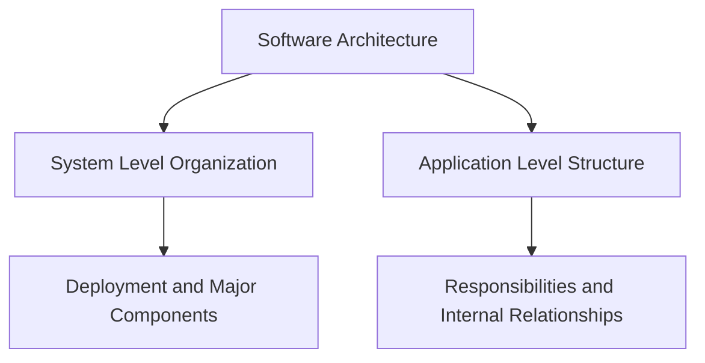
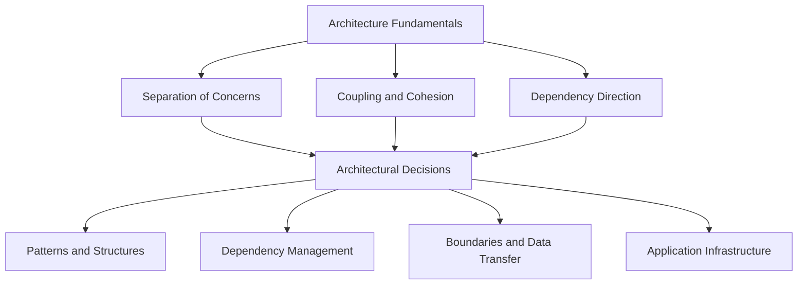
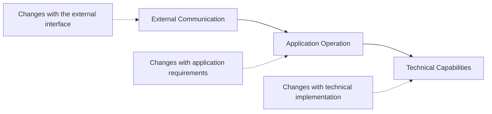
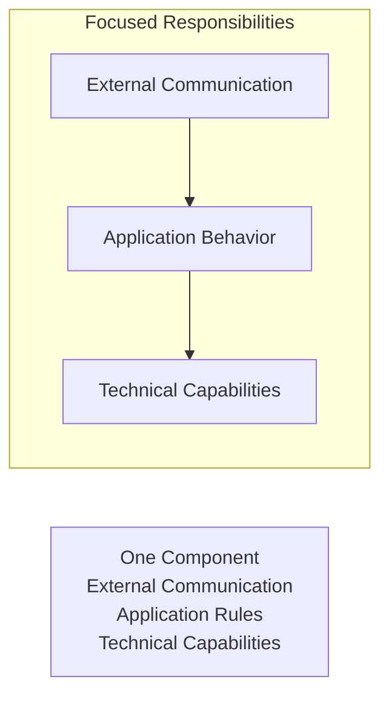

# Level 1

## Table of Contents: Architecture Fundamentals

- [What Is Software Architecture](#what-is-software-architecture)
- [From Fundamentals to Architecture](#from-fundamentals-to-architecture)
- [Separation of Concerns](#separation-of-concerns)
- [Coupling and Cohesion](#coupling-and-cohesion)
- [Dependency Direction](#dependency-direction)

**Architecture Fundamentals Level 1** introduces the core ideas used to reason about the structure of software applications. These fundamentals provide a foundation for the architectural patterns, boundaries, dependencies, and infrastructure concepts introduced throughout the later sections of the course.

## What Is Software Architecture

**Software architecture** describes how a system is organized and how its parts work together. Some architectural decisions affect the whole system, including deployment and communication between major components. Other decisions shape the internal structure of a single application by determining how responsibilities are divided and how different parts are allowed to interact.

Architecture matters because structural decisions influence the changes that follow. When responsibilities and relationships are chosen deliberately, new behavior can be added without allowing unrelated concerns to become increasingly mixed throughout the application.

!!! note "Architecture Happens Anyway"

    Every application develops an architecture even when no one designs it deliberately. Without clear architectural decisions, the structure emerges from individual implementation choices and can become difficult to understand and change.

This chapter focuses on architecture at the application level because the concepts introduced here explain how responsibilities and dependencies can be organized inside an application. Before examining those concepts individually, it is useful to understand how these fundamentals support architectural decisions throughout the rest of the course.

## From Fundamentals to Architecture

Architecture fundamentals provide principles for reasoning about how an application should be organized. They do not prescribe one particular structure. Instead, they help explain why architectural decisions are made and provide a foundation for evaluating the structures and techniques introduced later.

The same fundamentals can influence many parts of an application's architecture. They can help determine how responsibilities are separated, how components depend on one another, where boundaries are established, and how technical capabilities are connected to application behavior. Later sections of the course examine these subjects individually and show how the fundamentals are applied in different contexts.

The first fundamental concerns how different kinds of responsibility are kept separate inside an application.

## Separation of Concerns

**Separation of Concerns** is the principle that different kinds of work should be assigned to components with distinct responsibilities. A component should focus on related work rather than accumulating unrelated responsibilities simply because they are needed by the same operation.

Consider an operation that creates a user. The operation can involve communication with an external client, rules that determine whether the user can be created, and access to stored data. These responsibilities participate in one operation, but they represent different concerns because each exists for a different reason and can change independently. In a web application, these concerns could include handling an HTTP request, applying an application rule, and performing a database query.

When these concerns are mixed inside one component, a change to the external interface, application behavior, or technical implementation can require modifications to the same place. Separating them gives each responsibility a clearer boundary and allows changes to remain closer to the concern that caused them.

!!! note "Separation of Concerns Is Not About File Count"

    Separating concerns does not mean creating as many files as possible. It means keeping different kinds of responsibility identifiable and preventing unrelated work from becoming unnecessarily mixed inside the same component.

Separation of Concerns explains why responsibilities should be divided, but it does not by itself describe the quality of the resulting relationships. That becomes clearer through coupling and cohesion.

## Coupling and Cohesion

**Coupling** describes how strongly one component depends on another. When components are tightly coupled, a change in one is more likely to require changes elsewhere. **Cohesion** describes how closely the responsibilities within a component belong together. A cohesive component contains work that contributes to a clear and related purpose.

A well organized application generally aims for **low coupling** between components and **high cohesion** within them. These properties reinforce each other because a component focused on one kind of responsibility has fewer reasons to depend on unrelated parts of the application.

The single mixed component has lower cohesion because unrelated responsibilities are grouped together. After separation, each component has a clearer purpose and the relationships between components become visible. Separation of Concerns therefore guides how responsibilities are divided, while coupling and cohesion help describe the quality of the resulting structure.

Once responsibilities are separated and their relationships are visible, the next question is which direction those relationships should follow. This leads to Dependency Direction.

## Dependency Direction

A **dependency** exists when one component relies on another component or on knowledge owned by another part of the application. Dependencies can arise through calls, imports, shared types, configuration, object construction, or other forms of knowledge between components.

**Dependency Direction** describes how these relationships are arranged across the application. The important idea is that dependencies should follow intentional architectural boundaries so that a component does not gain unnecessary knowledge of unrelated implementation details.

In practice this means components that handle external details depend on components that express application behavior, which in turn depend on technical capabilities, and not the other way around. When dependency direction is clear, each component knows only what it needs in order to perform its responsibility. Problems appear when application behavior begins to contain technical implementation details or when a component reaches across boundaries and becomes dependent on parts of the system it does not need to understand.

!!! warning "Dependencies Are More Than Function Calls"

    A dependency exists whenever one component needs knowledge from another. Calling a function is one form of dependency, but importing a type, reading shared configuration, or constructing another component can also create a dependency.

The fundamentals introduced in this chapter work together. **Separation of Concerns** divides different kinds of responsibility, **Coupling and Cohesion** describe the quality of the resulting components and relationships, and **Dependency Direction** describes how those relationships are arranged. Together, these concepts establish the foundation for reasoning about the internal structure of an application.

These fundamentals describe how responsibilities are divided and how dependencies are arranged. **Architecture Fundamentals Level 2** builds on them with the concepts that define how components are formed and connected, including **Components and Boundaries**, **Information Hiding**, **Interfaces and Contracts**, and **Composition and Wiring**.
