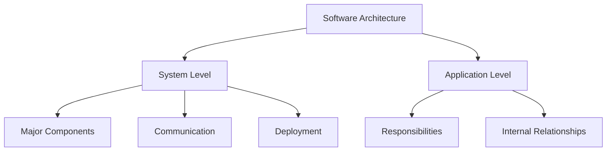
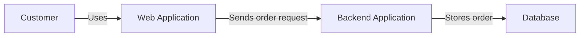
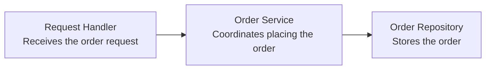
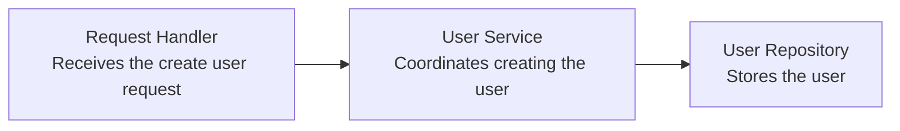
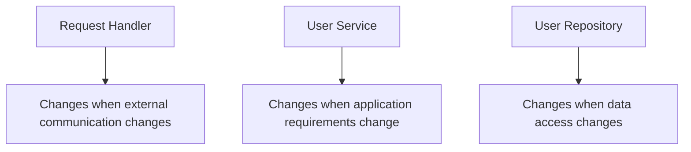
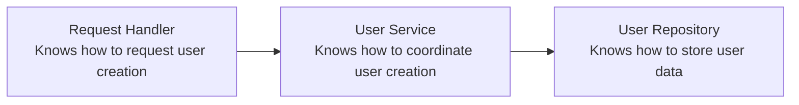
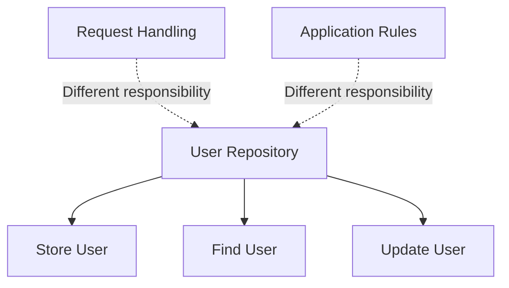
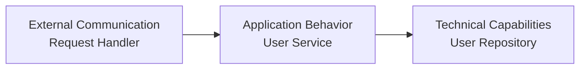
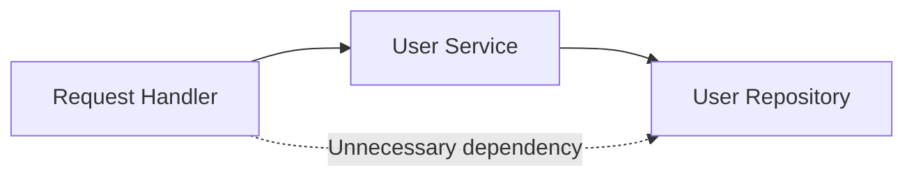

# Level 1

## Table of Contents: Architecture Fundamentals

- [What Is Software Architecture](#what-is-software-architecture)
- [Separation of Concerns](#separation-of-concerns)
- [Coupling and Cohesion](#coupling-and-cohesion)
- [Dependency Direction](#dependency-direction)

**Architecture Fundamentals Level 1** introduces the core ideas used to reason about the structure of software applications. These fundamentals provide a foundation for the architectural patterns, boundaries, dependencies, and infrastructure concepts introduced throughout the later sections of the course.

## What Is Software Architecture

**Software architecture** describes how a system is organized and how its parts work together. A useful way to understand its scope is to begin with the overall system and then look inside one application within that system.

The diagram shows two levels of architectural decisions. The **system level** concerns the overall software system and its major parts, while the **application level** concerns the internal organization of one application. To see the difference in practice, consider an online store where a customer uses a web application to place an order. The web application sends the order request to a backend application, which processes the request and stores the order in a database.

The **major components** are the large parts that make up the system. In this example, they are the web application, backend application, and database. **Communication** describes how those components exchange information. The web application sends an order request to the backend application, and the backend application sends data to the database when the order needs to be stored. **Deployment** describes where those components run. The web application can run in the customer's browser, the backend application on an application server, and the database on a database server.

The backend application is therefore one major component at the system level. We can now look inside that component to understand the application level.

At the application level, **responsibilities** describe the different kinds of work performed inside the application. In this example, the request handler receives the order request, the order service coordinates the operation, and the order repository stores the order. Their **internal relationships** describe how these components work together. The request handler calls the order service, and the order service calls the order repository when the order needs to be stored.

The same backend application can therefore be viewed at two different scopes. At the system level, it is one major component that communicates with the web application and database. At the application level, we look inside it to see what its components are responsible for and how those components work together.

!!! note "Architecture Happens Anyway"

    Every application develops an architecture even when no one designs it deliberately. Without clear architectural decisions, the structure emerges from individual implementation choices and can become difficult to understand and change.

The rest of this material focuses on the structure inside an application. The first step is to understand how different responsibilities can be kept separate so that each part of the application has a clear purpose.

## Separation of Concerns

**Separation of Concerns** means keeping different kinds of responsibility separate so that each component has a clear purpose. Consider the user creation operation from the perspective of a backend application. A client sends a request to create a user, so the application needs to receive that request, decide what must happen to create the user, and store the new user.

Each component has a different responsibility. The **request handler** deals with external communication and passes client input into the application. The **user service** coordinates the application operation, such as checking whether the user can be created and requesting that the user be stored. The **user repository** handles the technical work required to store and retrieve user data. These are separate concerns because they can change for different reasons. Client communication can change without changing storage, user creation requirements can change without changing the database technology, and data access can change without changing how the request is received.

If all of this work were placed in one component, that component would need to change when request handling changes, when the user creation requirements change, or when data access changes. Separating these responsibilities allows each component to focus on one kind of work and keeps changes closer to the component responsible for that work.

!!! note "Separation of Concerns Is Not About File Count"

    Separating concerns does not mean creating as many files as possible. It means giving different kinds of responsibility clear places in the application instead of placing many different responsibilities inside the same component.

Separating responsibilities gives components clearer purposes, but those components still need to work together. The next question is how strongly they depend on one another and how well the responsibilities inside each component belong together.

## Coupling and Cohesion

After responsibilities have been separated, we can examine how well the resulting components are organized. **Coupling** looks at the connections between components, while **cohesion** looks at the responsibilities inside a component. We can examine both using the same user creation operation.

**Coupling** describes how much one component needs to know about or rely on another component. In this example, the request handler needs the user service to perform the user creation operation, and the user service needs the user repository to store the user. The important question is how much each component needs to know about the others. If the request handler only needs to ask the user service to create a user, it does not also need to know how the service performs that operation or how the repository stores the data. Keeping that knowledge limited reduces the effect that changes in one component can have on another. This is the idea behind **low coupling**.

**Cohesion** describes how closely the responsibilities inside one component belong together. The user repository has high cohesion when its responsibilities are focused on data access, such as storing a user and finding a user. If it also started handling HTTP requests or deciding whether a user is allowed to register, it would contain several different kinds of responsibility and its purpose would become less clear.

A well organized component therefore has responsibilities that belong together, while its connections to other components require only the knowledge necessary for them to work together. This is what is meant by aiming for **high cohesion** within components and **low coupling** between components. Separation of Concerns helps decide **where different responsibilities should belong**, while Coupling and Cohesion help examine **how focused each component is and how dependent components are on one another**. Once those relationships are clear, the next question is how the dependencies are arranged across the application.

## Dependency Direction

After identifying the relationships between components, we can examine which component depends on which. A **dependency** exists when one component needs another component in order to perform its responsibility. We can see this using the same user creation operation.

The arrows show the **dependency direction**. The request handler depends on the user service because it asks the service to create the user, while the user service depends on the user repository because it asks the repository to store the user. The dependencies therefore follow the same direction as the operation.

The same direction can also be viewed in terms of the responsibilities introduced earlier.

Keeping this direction clear limits what each component needs to know. The request handler needs to know how to ask the user service to create a user, but it does not need to know how the repository stores that user. The repository stores and retrieves data, but it does not need to know how an HTTP request was received or which external client initiated the operation.

Problems appear when components begin reaching past the responsibilities they should depend on. For example, if the request handler performs database operations directly, it now depends on technical details that belong to data access as well as on the application operation it is supposed to invoke. The component gains knowledge it does not need for its own responsibility.

!!! warning "Dependencies Are More Than Function Calls"

    Calling another component is one way to create a dependency, but dependencies can also be created through imports, shared types, configuration, or constructing another component. In each case, one component requires knowledge provided by another.

The three ideas introduced in this material describe different aspects of the same application structure. **Separation of Concerns** helps determine where different responsibilities belong, **Coupling and Cohesion** help examine how focused components are and how much they rely on one another, and **Dependency Direction** shows which components rely on which others. Together, these ideas provide the basis for examining application structure in more detail. **Architecture Fundamentals Level 2** continues from this point by examining **Components and Boundaries**, **Information Hiding**, **Interfaces and Contracts**, and **Composition and Wiring**.
