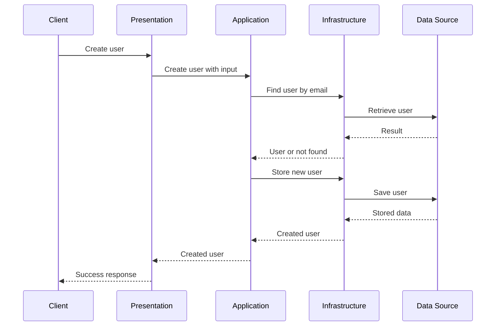

# Layered Architecture

## Table of Contents

- [Understanding Layered Architecture](#understanding-layered-architecture)
- [Presentation Layer](#presentation-layer)
- [Application Layer](#application-layer)
- [Infrastructure Layer](#infrastructure-layer)
- [Example Project Structure](#example-project-structure)

**Layered Architecture** organizes an application into layers with distinct responsibilities. Each layer focuses on a particular type of work, which helps separate different concerns and makes the application easier to understand and maintain. In this chapter, Layered Architecture is presented using three main layers. The **Presentation layer** handles interaction with external clients, the **Application layer** coordinates application operations, and the **Infrastructure layer** handles technical implementation details such as data access. These layers represent architectural responsibilities rather than specific classes, frameworks, programming languages, or directory structures.

## Understanding Layered Architecture

The central idea of Layered Architecture is that different kinds of work belong to different parts of the application. Instead of mixing external communication, application operations, and technical implementation details, the pattern assigns each responsibility to a layer with a clear purpose. At a high level, information moves through the layers according to the responsibility each one performs.


The flow begins at the application's external boundary. The Presentation layer receives the input and passes the requested operation to the Application layer. When the operation requires technical capabilities such as retrieving or storing data, the Application layer uses the Infrastructure layer, which communicates with the appropriate data source. Each step moves the work to the layer responsible for handling it.

| Layer              | Responsibility                                                                      |
|--------------------|-------------------------------------------------------------------------------------|
| **Presentation**   | Handles interaction with external clients and the application's external interface. |
| **Application**    | Coordinates application operations and the rules required to perform them.          |
| **Infrastructure** | Handles technical implementation details such as retrieving and storing data.       |

!!! note "Layers Represent Responsibilities"

    Layered Architecture is defined by the separation of responsibilities, not by specific folder names, classes, frameworks, or programming languages. The same responsibilities can therefore be organized differently while still following the pattern.

A complete operation shows how these responsibilities cooperate in practice. Consider an operation that creates a user. An external client provides the input, the Application layer coordinates the required steps, and the Infrastructure layer accesses stored data when necessary.



The sequence diagram expands the high-level flow by showing both the calls between layers and the result returning through them. Presentation delegates the operation to Application, which coordinates the required rules and steps and uses Infrastructure when data must be retrieved or stored. The result then returns through the same boundaries until Presentation translates it into the response expected by the external client. The same boundaries apply when an operation fails. If Application determines that an email is already in use, for example, the failure returns to Presentation, which determines how it should be communicated externally.

This interaction applies concepts introduced in **Architecture Fundamentals Level 1**, particularly **Separation of Concerns**, **Coupling and Cohesion**, and **Dependency Direction**. Layered Architecture puts these concepts into practice by separating responsibilities across layers, with each layer benefiting from containing one kind of responsibility, and by establishing a clear direction for communication between them. The External Communication, Application Behavior, and Technical Capabilities described in **Dependency Direction** correspond to the Presentation, Application, and Infrastructure layers.

!!! warning "Keep Layer Responsibilities Separate"

    A layer should not take over responsibilities that belong to another layer. Placing database queries directly in Presentation components mixes Presentation and Infrastructure responsibilities, while handling client-specific request or response details inside the Application layer mixes Presentation concerns with Application behavior.

With the structure and interaction between the layers established, each layer can now be examined individually, beginning with the Presentation layer where information enters and leaves the application.

## Presentation Layer

The **Presentation layer** is responsible for communication between the application and external clients. It receives input, translates that input into a form the application can work with, invokes the required application operation, and returns the result through the appropriate external interface. In a web application, routes or request handlers commonly perform this responsibility, although the exact mechanism depends on the framework and language being used.

=== "JavaScript"

    ```js
    router.post("/users", async (req, res) => {
        const user = await userService.createUser(req.body);

        res.status(201).json(user);
    });
    ```

=== "Python"

    ```python
    @router.post("/users")
    async def create_user(user_data: UserCreate):
        return await user_service.create_user(user_data)
    ```

The JavaScript route handler and Python route handler both remain at the application's external boundary. They receive client input, delegate the requested operation, and return the result without knowing how the user is stored or which database operations are required. Responsibility for coordinating the operation belongs to the Application layer.

## Application Layer

The **Application layer** is responsible for coordinating the operations the application needs to perform. It applies the rules required by an operation and coordinates other components when additional work is needed, while remaining independent of how requests are received or how data is physically stored.

=== "JavaScript"

    ```js
    export async function createUser(userData) {
        const existingUser = await userRepository.findByEmail(userData.email);

        if (existingUser) {
            throw new Error("A user with this email already exists");
        }

        return userRepository.create(userData);
    }
    ```

=== "Python"

    ```python
    async def create_user(user_data):
        existing_user = await user_repository.find_by_email(user_data["email"])

        if existing_user:
            raise ValueError("A user with this email already exists")

        return await user_repository.create(user_data)
    ```

Here, the Application layer checks whether the email is already in use and coordinates the steps required to create the user. It does not handle the external request, construct the client response, or contain the database queries used to retrieve and store data. Those technical implementation details belong to the Infrastructure layer.

## Infrastructure Layer

The **Infrastructure layer** is responsible for technical implementation details required by the application, such as communicating with databases and other storage systems. Repositories commonly appear in this layer because they keep persistence details separate from the application operations that use the data.

=== "JavaScript"

    ```js
    export async function findByEmail(email) {
        const result = await pool.query(
            `
                SELECT id, email, created_at
                FROM users
                WHERE email = $1
            `,
            [email],
        );

        return result.rows[0];
    }

    export async function create(userData) {
        const result = await pool.query(
            `
                INSERT INTO users (email)
                VALUES ($1)
                RETURNING id, email, created_at
            `,
            [userData.email],
        );

        return result.rows[0];
    }
    ```

=== "Python"

    ```python
    async def find_by_email(email):
        result = await pool.fetchrow(
            """
            SELECT id, email, created_at
            FROM users
            WHERE email = $1
            """,
            email,
        )

        return result


    async def create(user_data):
        result = await pool.fetchrow(
            """
            INSERT INTO users (email)
            VALUES ($1)
            RETURNING id, email, created_at
            """,
            user_data["email"],
        )

        return result
    ```

Direct SQL is used here to make the persistence responsibility visible, but Layered Architecture does not require it. A repository can use an **ORM** or another data-access mechanism while keeping those technical details inside Infrastructure, allowing Application to work with repository operations without depending on the underlying storage technology.

The Application layer uses repository operations without needing to know how those operations are implemented by Infrastructure. These operations form a boundary between the two layers, while the examples also show components using other components to perform their responsibilities. How **Interfaces and Contracts** define and protect boundaries and how **Composition and Wiring** assembles and supplies dependencies are examined in more detail in **Architecture Fundamentals Level 2**. With each layer examined individually, the final step is to see how these responsibilities can be reflected in a project structure.

## Example Project Structure

Layered Architecture defines responsibilities and boundaries rather than one required directory structure. A project can make the layers explicit in its directories or organize files around the components that perform those responsibilities. Other concerns can appear in the same project and should be organized according to the responsibilities they support rather than automatically being treated as additional layers. The layers form the application's major boundaries. How components form architectural boundaries and how those boundaries organize responsibilities is examined in more detail through **Components and Boundaries** in **Architecture Fundamentals Level 2**.

One possible structure makes the three architectural layers explicit.

```text
project/
├── app/
│   ├── presentation/
│   │   ├── controllers/
│   │   └── routes/
│   ├── application/
│   │   └── services/
│   ├── infrastructure/
│   │   └── database/
│   │       └── repositories/
│   └── app.extension
├── tests/
```

In this structure, the top-level directories inside `app/` directly represent the architectural layers. `presentation/` contains components responsible for the external interface, `application/` contains components that coordinate application operations, and `infrastructure/` contains technical implementation details. More specific responsibilities can be organized within those layers, as shown by database repositories being placed under Infrastructure because they implement data-access operations.

!!! note "Application Entry File"

    `app.extension` represents the application's entry file. The actual filename and extension depend on the programming language and framework being used.

The same architectural responsibilities can also be represented with a flatter structure.

```text
project/
├── app/
│   ├── routes/
│   ├── controllers/
│   ├── services/
│   ├── database/
│   │   └── repositories/
│   └── app.extension
└── tests/
```

In the flatter structure, the layer names are no longer represented directly by directories, but the responsibilities remain distinguishable. `routes/` and `controllers/` perform Presentation responsibilities, `services/` perform Application responsibilities, and `database/repositories/` perform Infrastructure responsibilities. The organization changes while the architectural boundaries remain the same.

!!! note "Directory Structure Does Not Define the Pattern"

    Folder names are an implementation choice. A project can use different names or group files differently and still follow Layered Architecture as long as the responsibilities of the layers remain separated and their boundaries are respected.

The project structure can therefore change according to the size, language, framework, and needs of the application while preserving the same architectural responsibilities across Presentation, Application, and Infrastructure.
