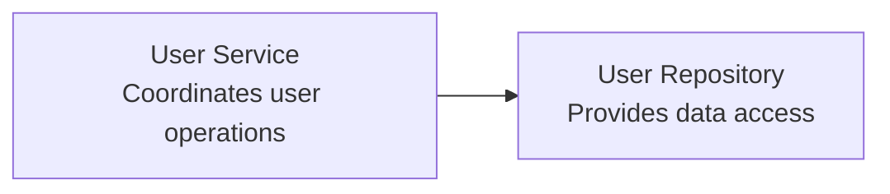
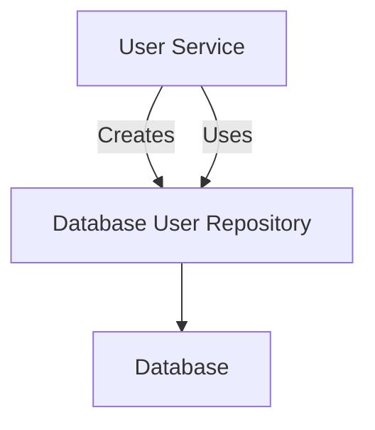
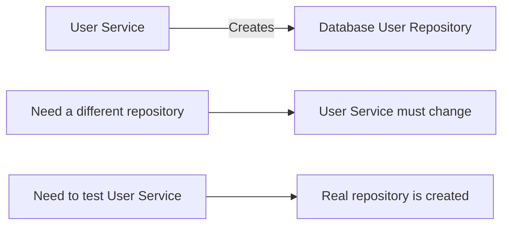
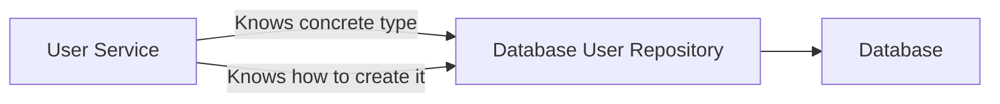
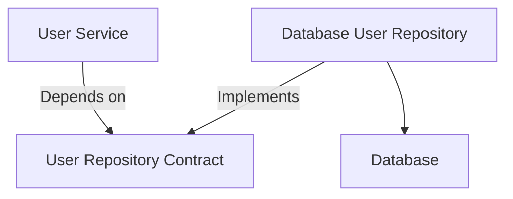
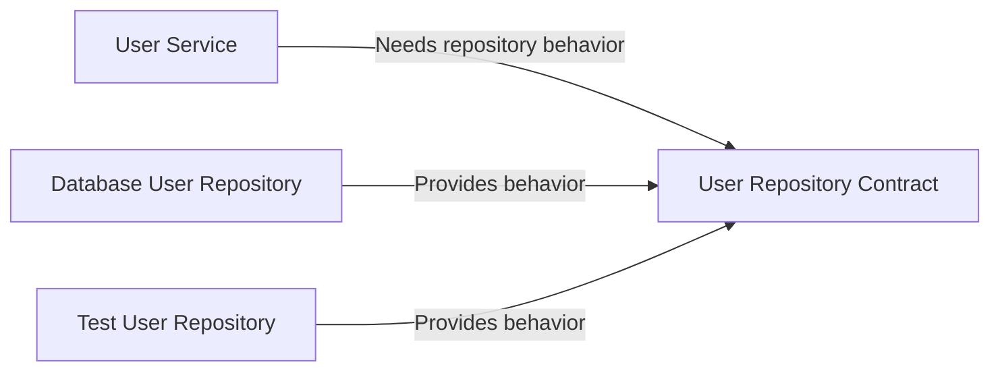
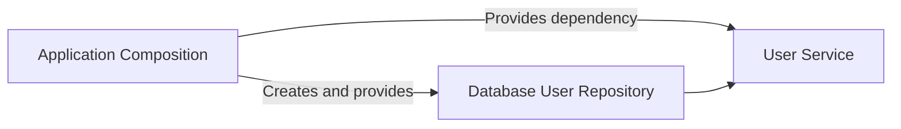
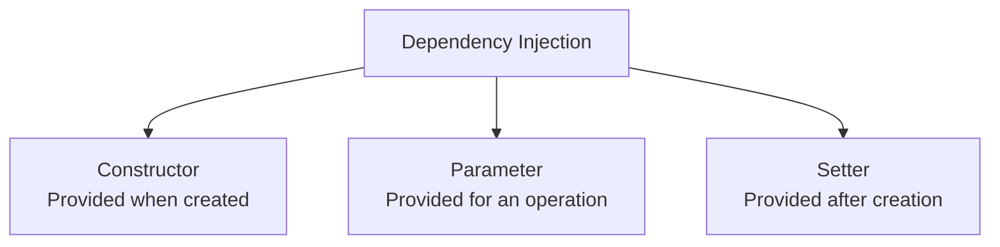

# Level 1

## Table of Contents: Dependencies and Dependency Injection

- [Understanding Dependencies](#understanding-dependencies)
- [Constructing Dependencies Directly](#constructing-dependencies-directly)
- [Coupling](#coupling)
- [Dependency Inversion](#dependency-inversion)
- [Dependency Injection](#dependency-injection)

**Dependencies and Dependency Injection Level 1** explains how components rely on other components, why creating dependencies in the wrong place can make software harder to change and test, and how Dependency Inversion and Dependency Injection provide a more flexible way to connect components.

## Understanding Dependencies

A **dependency** exists when one component needs another component or knowledge provided by another part of the application in order to perform its responsibility. This idea was introduced in **Architecture Fundamentals Level 1** through Dependency Direction. Here, the focus moves from identifying dependencies to deciding how those dependencies should be connected.

Dependencies can appear in several forms. A component can call another component, import it, construct it, use a type that it defines, or rely on shared configuration that it provides. In each case, one part of the application needs something supplied by another part.

Consider a user service that needs a repository to find and store users.



The user repository is a dependency of the user service because the service needs repository operations to perform its work. The important architectural question is not whether dependencies exist. Components need to cooperate. The question is how those dependencies are created and connected.

To see why the way a dependency is connected matters, the next section begins with the simplest approach, where a component creates the dependency it needs itself.

## Constructing Dependencies Directly

One approach is for a component to create the concrete dependency it needs. In this design, the user service constructs the repository itself and then uses it.



The service can perform its work, but it now has two responsibilities related to the repository. It uses the repository to coordinate user operations and also decides which repository implementation must be created. This means the service contains knowledge about a technical component that is outside its main responsibility.

A simplified example looks like this.

=== "JavaScript"

    ```js
    class UserService {
        constructor() {
            this.userRepository = new DatabaseUserRepository();
        }

        async createUser(userData) {
            return this.userRepository.create(userData);
        }
    }
    ```

=== "Python"

    ```python
    class UserService:
        def __init__(self):
            self.user_repository = DatabaseUserRepository()

        async def create_user(self, user_data):
            return await self.user_repository.create(user_data)
    ```

The problem becomes visible when the repository needs to change. Replacing the database repository with another implementation requires changing the user service because the concrete implementation is selected and constructed inside it. Testing the service in isolation is also harder because the service creates the real repository instead of allowing a substitute to be provided.



The problem is not that the user service needs a repository. The problem is that it also chooses and constructs the concrete repository itself. This creates two specific difficulties. Changing the repository implementation can require changing the service, and testing the service with a substitute is harder because the service controls which repository is created.

These problems are consequences of how strongly the user service is connected to the concrete repository. The next section examines that relationship through coupling.

## Coupling

As introduced in **Coupling and Cohesion**, coupling describes how much one component needs to know about or rely on another component. Constructing a dependency directly increases coupling because the component must know not only what operations it needs, but also which concrete implementation provides them and how that implementation is created.



This additional knowledge makes changes more likely to spread. If repository construction changes, the user service may also need to change even when the user creation operation itself has not changed. The same coupling makes substitution harder during testing because the service controls the dependency instead of receiving one chosen for the test.

The goal is not to remove the dependency between the user service and repository. The service still needs repository behavior. The problem to solve is the service's knowledge of the concrete repository type and how that repository is created. If that knowledge can be moved out of the service, the service can keep performing the same user operation while the repository implementation changes independently.

Reducing that knowledge requires changing what the user service depends on. Instead of depending on one concrete repository implementation, it can depend on the behavior it needs. This leads to Dependency Inversion.

## Dependency Inversion

**Dependency Inversion** changes what a higher-level component depends on. Instead of depending directly on a concrete technical implementation, the component depends on an abstraction that describes the operations it needs. A concrete implementation then follows that abstraction.



The user service still needs operations such as finding and storing users, but it no longer needs to select a particular database repository. The contract represents what the service needs, while the concrete repository represents one way to provide those operations. The source-code dependency toward the concrete implementation is therefore replaced by a dependency on the abstraction.

Dependency Inversion solves the first part of the problem by separating the behavior the user service needs from the concrete component that provides it.



The user service can now remain dependent on the same repository contract when the implementation changes. The same service can work with a database repository in the application and a simpler substitute during a test as long as both provide the required operations. Dependency Inversion therefore solves the design problem of depending directly on one concrete implementation.

However, an implementation still has to be selected, created, and given to the user service when the application runs. Solving that construction problem leads to Dependency Injection.

!!! note "Dependency Inversion and Dependency Injection Are Different"

    **Dependency Inversion** is the design principle that changes what a component depends on. **Dependency Injection** is the mechanism that provides the chosen dependency to that component from outside.

Dependency Inversion establishes what the user service should depend on, but the application still needs to choose a concrete repository and give it to the service. The next section explains how Dependency Injection performs that connection.

## Dependency Injection

**Dependency Injection** means that a component receives its dependencies from outside instead of constructing them itself. The user service can therefore focus on using repository operations while another part of the application decides which repository implementation should be supplied.



A common approach is **constructor injection**, where dependencies are supplied when the component is created.

=== "JavaScript"

    ```js
    class UserService {
        constructor(userRepository) {
            this.userRepository = userRepository;
        }

        async createUser(userData) {
            return this.userRepository.create(userData);
        }
    }
    ```

=== "Python"

    ```python
    class UserService:
        def __init__(self, user_repository):
            self.user_repository = user_repository

        async def create_user(self, user_data):
            return await self.user_repository.create(user_data)
    ```

Dependencies can also be supplied through a method or function parameter, or assigned after construction when the design requires it. The exact mechanism varies by language and application, but the principle remains the same. The component receives the dependency rather than deciding how to construct the concrete implementation itself.



Constructor injection is often easy to understand because the required dependencies are visible when the component is created. Parameter injection is useful when a dependency is needed only for a particular operation, while setter injection can be used when a dependency needs to be supplied or replaced after construction. These are mechanisms for supplying dependencies rather than different architectural principles.

!!! note "Not Every Dependency Needs Injection"

    Dependency Injection should not be applied mechanically to every object a component uses. Trivial and stable utilities or simple value objects may not benefit from being injected. Injection is most useful when a dependency can vary, is likely to change, represents an external or technical capability, or needs to be substituted during testing.

Dependency Inversion and Dependency Injection therefore solve related but different problems. **Dependency Inversion** establishes the direction by making a component depend on the behavior it needs rather than on a concrete implementation. **Dependency Injection** supplies the selected implementation from outside the component. Injection is one way to put Dependency Inversion into practice while keeping component construction separate from component behavior.
