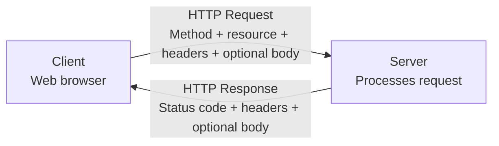

# Level 1

## Table of Contents: HTTP

- [What Is HTTP](#what-is-http)
- [HTTP Requests and Responses](#http-requests-and-responses)
- [HTTP Methods](#http-methods)
- [HTTP Status Codes](#http-status-codes)
- [HTTP Headers and Body](#http-headers-and-body)
- [Stateless Communication](#stateless-communication)

**HTTP Level 1** introduces the protocol used by clients and servers to exchange requests and responses on the web. The focus is on the structure of HTTP communication, common methods, status codes, headers, message bodies, and the stateless nature of HTTP.

## What Is HTTP

**HTTP (Hypertext Transfer Protocol)** defines rules for communication between clients and servers on the web. In the previous modules, clients and servers were introduced as the communicating roles, while URLs were used to identify destinations and resources. HTTP defines how a client requests those resources and how a server communicates the result. It follows the request response model, in which the client sends an **HTTP request**, the server processes it, and the server returns an **HTTP response**. For additional background on the protocol and its main concepts, see the [MDN Overview of HTTP](https://developer.mozilla.org/en-US/docs/Web/HTTP/Guides/Overview).

Understanding HTTP therefore begins with the two messages exchanged during this interaction. The next section examines what requests and responses communicate.

## HTTP Requests and Responses

An **HTTP request** communicates what the client wants the server to do with a resource. It includes a method and can also contain headers and a body when needed. An **HTTP response** communicates the result of processing that request. It includes a status code and can also contain headers and a body. For example, when a browser requests a web page, it sends a request for a resource identified by the URL. The server processes the request and returns a response containing information about the outcome and, when appropriate, the requested content.

The basic exchange can be represented as follows.

Requests and responses contain several parts with different responsibilities. The HTTP method is one of the most important parts of a request because it communicates the intended action. The [MDN HTTP messages guide](https://developer.mozilla.org/en-US/docs/Web/HTTP/Guides/Messages) provides a more detailed reference for HTTP message structure, while the next section focuses specifically on request methods.

## HTTP Methods

An **HTTP method** indicates the action the client wants to perform. Common methods include `GET` for retrieving a resource, `POST` for submitting data or creating a resource, `PUT` for replacing a resource, `PATCH` for applying a partial update, and `DELETE` for removing a resource. The exact behavior depends on how the server application is designed, but the method communicates the general intention of the request. For example, an application might use `GET /users/42` to retrieve information about a user and `DELETE /users/42` to request removal of that user. The [MDN HTTP request methods reference](https://developer.mozilla.org/en-US/docs/Web/HTTP/Reference/Methods) can be used when a complete reference to HTTP methods and their defined behavior is needed.

The method tells the server what action is intended, but the client also needs to know what happened after the server processed the request. HTTP status codes provide this result information and are introduced in the next section.

## HTTP Status Codes

An **HTTP status code** is a three digit number included in an HTTP response that describes the result of a request. Status codes are organized into five categories according to their first digit.

| Range | Category          | Meaning                                                                                         |
| ----- | ----------------- | ----------------------------------------------------------------------------------------------- |
| `1xx` | **Informational** | The request is still being processed or related information is being communicated.              |
| `2xx` | **Successful**    | The request was successfully received and handled.                                              |
| `3xx` | **Redirection**   | Additional action or another location may be needed to complete the request.                    |
| `4xx` | **Client Error**  | The request cannot be completed because of an issue associated with the request.                |
| `5xx` | **Server Error**  | The server failed to complete an otherwise valid request.                                       |

At **HTTP Level 1**, understanding the status code categories is more important than memorizing individual codes. As you work with HTTP, you will encounter specific codes such as `200 OK`, `404 Not Found`, and `500 Internal Server Error`. Each code has a more precise meaning within its category, and those meanings can be looked up when needed rather than memorized all at once. The [MDN HTTP response status codes reference](https://developer.mozilla.org/en-US/docs/Web/HTTP/Reference/Status) provides explanations of individual codes across all five categories.

!!! note "Status Codes Describe the Result"

    A status code does not contain the requested data itself. It tells the client about the outcome of the request. Any returned representation or other content is carried separately in the response body.

For now, recognizing the five status code categories provides enough context to understand the outcome of a basic HTTP exchange. Status codes describe that outcome, while headers and message bodies carry additional information and content. The next section examines those parts of an HTTP message.

## HTTP Headers and Body

**HTTP headers** provide metadata about a request or response. They can describe the type of content being exchanged, formats a client can accept, caching behavior, authentication information, and other details needed to process the message. For example, a `Content-Type` header can tell the recipient what kind of data is contained in the message body. The **body** carries the content of an HTTP message when content is needed. A request body can contain data submitted to the server, while a response body can contain HTML, JSON, an image, or another representation of a resource. Not every request or response requires a body. When more detailed information about individual headers is needed, the [MDN HTTP reference](https://developer.mozilla.org/en-US/docs/Web/HTTP/Reference) provides the broader HTTP reference material.

Methods, status codes, headers, and bodies provide the main pieces needed to understand an individual HTTP exchange. HTTP also has an important characteristic that affects how separate exchanges relate to one another. The next section introduces this characteristic through stateless communication.

## Stateless Communication

HTTP is **stateless**, which means each request is treated independently and HTTP does not automatically preserve application state from earlier requests. A server therefore cannot rely on HTTP alone to remember that separate requests belong to the same user or interaction. Web applications can still maintain state by using mechanisms built around HTTP, such as cookies and sessions, but those mechanisms are separate concepts and are explored at a later level. Additional background about HTTP statelessness and the use of cookies to create stateful sessions is available in the [MDN Overview of HTTP](https://developer.mozilla.org/en-US/docs/Web/HTTP/Guides/Overview).

With the basic HTTP message model established, the client can communicate an intended action and the server can communicate the result. The next module examines **Web Security**, including how HTTPS protects HTTP communication while data travels between the client and server.
