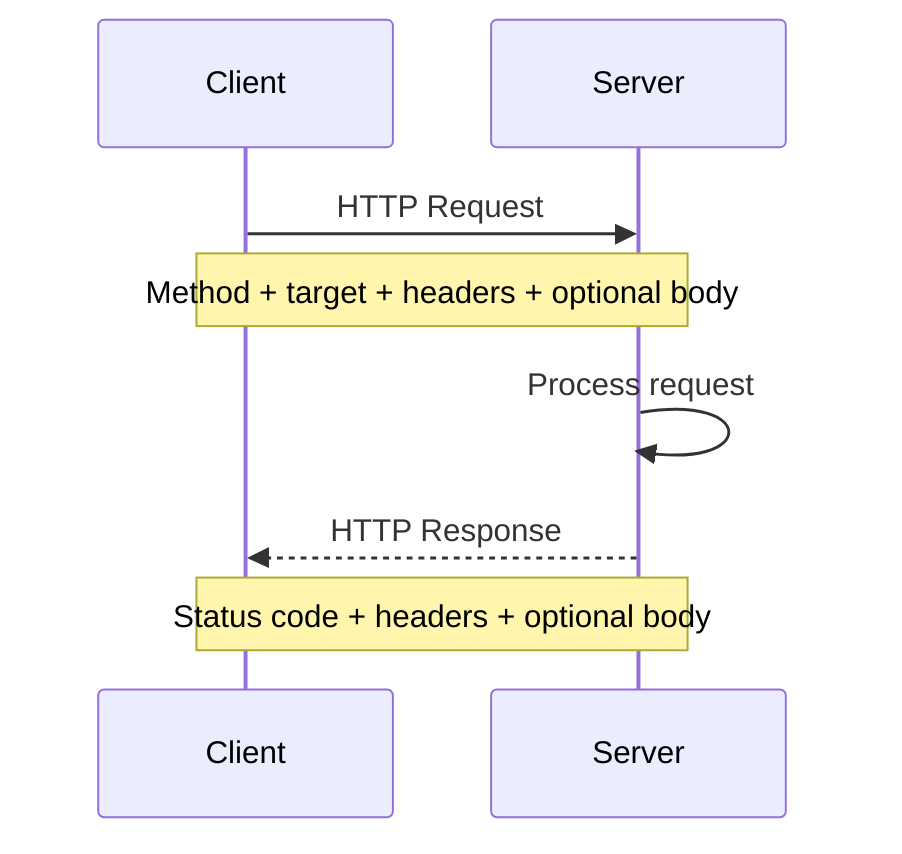

# Level 1

## Table of Contents: HTTP

- [What Is HTTP](#what-is-http)
- [HTTP Methods](#http-methods)
- [HTTP Status Codes](#http-status-codes)
- [HTTP Headers and Body](#http-headers-and-body)

**HTTP Level 1** introduces the protocol used by clients and servers to exchange requests and responses on the web. The focus is on the basic HTTP message model, common methods, status codes, headers, message bodies, and the stateless nature of HTTP. More detailed decisions about where application data is carried within HTTP communication are reserved for **HTTP Level 2**.

## What Is HTTP

**HTTP (Hypertext Transfer Protocol)** defines rules for communication between clients and servers on the web. In the previous modules, clients and servers were introduced as the communicating roles, while URLs were used to identify destinations and resources. HTTP defines how a client requests those resources and how a server communicates the result.

HTTP follows the **request response model**. The client sends an **HTTP request**, which communicates what the client wants the server to do with a resource. A request identifies a method and request target and can also contain headers and a body when needed. The server processes the request and returns an **HTTP response**, which communicates the result through a status code and can also contain headers and a body.

For example, when a browser requests a web page, the request identifies the resource to be retrieved. The server processes that request and returns a response describing the outcome and, when appropriate, containing the requested content.

```mermaid
sequenceDiagram
    participant C as Client
    participant S as Server

    C->>S: HTTP Request
    Note over C,S: Method + target + headers + optional body
    S->>S: Process request
    S-->>C: HTTP Response
    Note over C,S: Status code + headers + optional body
```

HTTP is also **stateless**. HTTP does not automatically preserve application state from one request to the next, so each request must contain enough information for the server to process it without relying on HTTP itself to remember an earlier request. Web applications can create continuity across requests through mechanisms such as cookies and sessions, but those mechanisms are built around HTTP rather than changing its stateless nature. Cookies and the ways values can be carried across requests are explored in later material.

At this level, the goal is to understand the request response model, recognize the main parts of an HTTP exchange, and understand that separate exchanges are stateless. For additional background, see the [MDN Overview of HTTP](https://developer.mozilla.org/en-US/docs/Web/HTTP/Guides/Overview) and the [MDN HTTP messages guide](https://developer.mozilla.org/en-US/docs/Web/HTTP/Guides/Messages).

The request response model provides the foundation for the rest of HTTP. The next section examines the **HTTP method**, which communicates the action the client intends to perform.

## HTTP Methods

An **HTTP method** indicates the action the client wants to perform. Common methods include `GET` for retrieving a resource, `POST` for submitting data, `PUT` for replacing a resource, `PATCH` for applying a partial modification, and `DELETE` for removing a resource. The exact application behavior depends on how the server is designed, but each HTTP method has defined semantics that communicate the general purpose of the request.

For example, an application might use `GET /users/42` to retrieve information about a user and `DELETE /users/42` to request removal of that user. The [MDN HTTP request methods reference](https://developer.mozilla.org/en-US/docs/Web/HTTP/Reference/Methods) provides the complete set of methods and their defined behavior.

The method communicates what the client intends to do. After the server processes the request, the response needs to communicate the outcome. HTTP status codes provide that result information.

## HTTP Status Codes

An **HTTP status code** is a three digit number included in an HTTP response that describes the result of a request. Status codes are organized into five categories according to their first digit.

| Range | Category          | Meaning                                                                                         |
| ----- | ----------------- | ----------------------------------------------------------------------------------------------- |
| `1xx` | **Informational** | The request is still being processed or related information is being communicated.              |
| `2xx` | **Successful**    | The request was successfully received and handled.                                              |
| `3xx` | **Redirection**   | Additional action or another location may be needed to complete the request.                    |
| `4xx` | **Client Error**  | The request cannot be completed because of an issue associated with the request.                |
| `5xx` | **Server Error**  | The server failed to complete an otherwise valid request.                                       |

At **HTTP Level 1**, understanding the status code categories is more important than memorizing individual codes. As you work with HTTP, you will encounter specific codes such as `200 OK`, `404 Not Found`, and `500 Internal Server Error`. Each code has a more precise meaning within its category and can be looked up when needed. The [MDN HTTP response status codes reference](https://developer.mozilla.org/en-US/docs/Web/HTTP/Reference/Status) provides explanations of individual codes across all five categories.

!!! note "Status Codes Describe the Result"

    A status code does not contain the requested data itself. It tells the client about the outcome of the request. Any returned representation or other content is carried separately in the response body.

Recognizing the five categories provides enough context to understand the outcome of a basic HTTP exchange. Status codes describe that outcome, while headers and message bodies carry additional information and content.

## HTTP Headers and Body

**HTTP headers** carry additional information associated with a request or response. They can describe content, authentication information, caching behavior, client or server preferences, and other information used when processing an HTTP message. The **body** carries message content when content is needed. A request body can contain data submitted to the server, while a response body can contain HTML, JSON, an image, or another representation of a resource. Not every request or response contains a body.

For example, `Content-Type` is a header that can describe the representation contained in a message body. At this level, it is enough to understand the distinction between headers as additional message information and the body as message content. **HTTP Level 2** examines this distinction more closely by showing how application data is carried through URLs, headers, and bodies. Individual headers and their defined purposes are documented in the [MDN HTTP headers reference](https://developer.mozilla.org/en-US/docs/Web/HTTP/Reference/Headers).

Methods, request targets, status codes, headers, and bodies provide the main pieces needed to understand an individual HTTP exchange. HTTP also has an important characteristic that affects how separate exchanges relate to one another.
